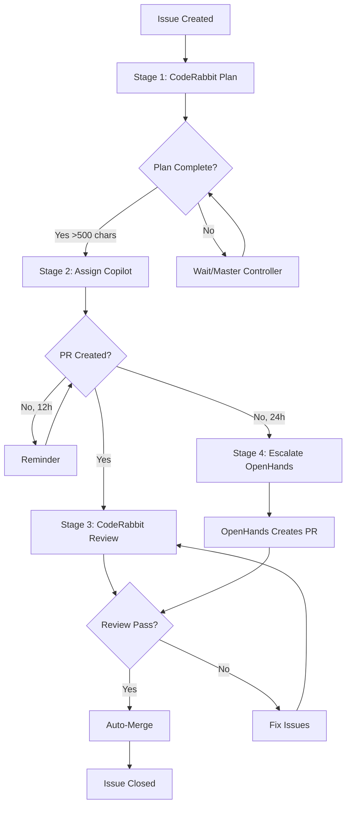

# AI Automation Pipeline - Architecture Documentation

## 🏗️ System Architecture

### High-Level Overview

```
┌─────────────────────────────────────────────────────────────────┐
│                    AI AUTOMATION PIPELINE                        │
│                                                                  │
│  Issue Created → CodeRabbit Plan → Copilot Implement →          │
│  CodeRabbit Review → Auto-Merge                                 │
│                                                                  │
│  Backup: Master Controller (every 30 min) + Complexity          │
│  Classifier                                                      │
└─────────────────────────────────────────────────────────────────┘
```

---

## 🔄 Sequential Automation Flow

### Stage 1: CodeRabbit Planning

**Trigger:** New issue created

**Workflow:** `unified-ai-automation.yml` → `new-issue-request-plan`

**Actions:**
1. Add labels: `auto-implement`, `needs-plan`, `stage-1-planning`
2. Comment requesting @coderabbitai plan with specific sections:
   - Requirements Analysis
   - Implementation Steps
   - Files to Modify/Create
   - Test Cases
   - Acceptance Criteria

**Output:** CodeRabbit creates comprehensive plan (500+ chars)

---

### Stage 2: Copilot Assignment & Implementation

**Trigger:** CodeRabbit comments on issue with plan

**Workflow:** `unified-ai-automation.yml` → `detect-plan-assign-copilot`

**Detection Logic:**
```javascript
const planIndicators = [
  '## Implementation',
  '## Coding Plan',
  '### Phase',
  'Prompt for AI'
];
const hasPlan = planIndicators.some(i => comment.includes(i));
const ready = hasPlan && comment.length > 500 && !comment.includes('in progress');
```

**Actions:**
1. Verify plan is complete (>500 chars, contains markers)
2. Check if already assigned (`copilot-assigned` label)
3. Assign Copilot via GitHub REST API:
   ```bash
   gh api repos/{owner}/{repo}/issues/{num}/assignees \
     -X POST -f 'assignees[]=copilot-swe-agent'
   ```
4. Update labels:
   - Add: `copilot-assigned`, `stage-2-implementation`, `in-progress`
   - Remove: `needs-plan`, `stage-1-planning`
5. Comment requesting @copilot implementation with PR

**Output:** Copilot creates implementation PR

---

### Stage 3: PR Review

**Trigger:** PR opened or ready for review

**Workflow:** `unified-ai-automation.yml` → `pr-request-review`

**Actions:**
1. Add labels: `needs-review`, `auto-merge-ready`
2. Request @coderabbitai comprehensive review:
   - Code quality
   - Security
   - Performance
   - Tests

**Output:** CodeRabbit reviews PR, adds comments

---

### Stage 4: Auto-Merge

**Trigger:** All PR checks pass

**Workflow:** `auto-merge-ready-prs.yml`

**Actions:**
1. Verify `auto-merge-ready` label
2. Check all status checks passed
3. Merge PR to main branch
4. Close linked issue

---

## 🛡️ Backup Systems

### Master Automation Controller

**Frequency:** Every 30 minutes (cron: `*/30 * * * *`)

**Workflow:** `master-automation-controller.yml`

**Purpose:** Catch issues that slipped through event-driven workflows

**Categories:**

#### 1. Unplanned Issues
- **Condition:** No `needs-plan` label, no CodeRabbit plan, not Copilot-assigned
- **Action:** Add labels, request @coderabbitai plan

#### 2. Planned, No Copilot
- **Condition:** Has CodeRabbit plan, not Copilot-assigned, created >0.5 hours ago
- **Action:** Assign copilot-swe-agent via API

#### 3. Copilot Stale
- **Condition:** Copilot-assigned, updated >12 hours ago
- **Action:** Add reminder comment for status update

#### 4. Needs Escalation
- **Condition:** Copilot-assigned, updated >24 hours ago
- **Action:**
  - Add `fix-me`, `escalated-to-openhands`, `stage-3-escalation` labels
  - Comment requesting @openhands-agent implementation

**Logic Flow:**
```javascript
for (const issue of open_issues) {
  const hasCodeRabbitPlan = comments.some(c =>
    c.user.login.includes('coderabbit') &&
    (c.body.includes('## Implementation') || ...) &&
    c.body.length > 500
  );

  const hasCopilotAssigned = labels.includes('copilot-assigned');
  const createdHoursAgo = (Date.now() - new Date(issue.created_at)) / (1000 * 60 * 60);
  const updatedHoursAgo = (Date.now() - new Date(issue.updated_at)) / (1000 * 60 * 60);

  // Categorize and fix
}
```

---

### Issue Complexity Classifier

**Trigger:** Issue opened, edited, or labeled

**Workflow:** `classify-issue-complexity.yml`

**Purpose:** Cost optimization through intelligent model routing

**Scoring System:**

```javascript
let score = 50; // Base score

// Simple signals (-20 points each)
if (text.includes('typo|fix|update|docs')) score -= 20;

// Complex signals (+20 points each)
if (text.includes('implement|refactor|architecture')) score += 20;

// Additional factors:
if (wordCount > 200) score += 15;
if (wordCount < 50) score -= 15;
if (hasCodeBlocks) score += 10;
if (hasMultipleSections) score += 10;
if (labels.includes('feature')) score += 15;
```

**Classification:**
- **Simple (score <40)** → DeepSeek Chat ($0.14/M)
- **Moderate (score 40-64)** → DeepSeek Chat
- **Complex (score 65+)** → DeepSeek R1 ($0.30/M)

**Output:**
- Labels: `complexity-{simple|moderate|complex}`, `model-{model-name}`, `score-{score}`
- Comment with classification reasoning
- Configuration note for OpenHands if complex

---

## 🔧 Component Details

### 1. GitHub Actions Workflows

| File | Purpose | Triggers |
|------|---------|----------|
| `unified-ai-automation.yml` | **Master workflow** - Handles full pipeline | Issues (opened, labeled), Comments (created), PRs (opened), Schedule (hourly), Manual dispatch |
| `master-automation-controller.yml` | **Backup controller** - Catches missed issues | Schedule (every 30 min), Manual dispatch |
| `classify-issue-complexity.yml` | **Cost optimizer** - Routes to appropriate model | Issues (opened, edited, labeled), Manual dispatch |
| `openhands-resolver.yml` | **AI agent** - Implements issues when triggered | Issues labeled `fix-me` or @openhands-agent mentioned |
| `aggressive-autofix.yml` | **Review fixer** - Fixes CodeRabbit review comments | PR reviews submitted |
| `auto-merge-ready-prs.yml` | **Auto-merger** - Merges approved PRs | PR checks completed |

### 2. CodeRabbit Integration

**Configuration:** `.coderabbit.yaml`

**Key Features:**
- Auto-review enabled for main/master/develop branches
- Path-based instructions for TypeScript, React, Tests, Workflows
- Knowledge base learning enabled
- Code generation with full functions
- Professional, actionable tone
- Comprehensive ignore patterns

**Plan Detection:**
```javascript
// Plan must contain at least one of:
['## Implementation', '## Coding Plan', '### Phase', 'Prompt for AI']

// AND be longer than 500 characters
comment.length > 500

// AND not be in progress
!comment.includes('in progress')
```

### 3. GitHub Copilot Integration

**Configuration:** `.github/copilot-instructions.md`

**Memory System:**
- Repository patterns and conventions
- Cost optimization strategy
- Security practices
- Model choices
- Tech stack details

**API Assignment:**
```bash
# REST API endpoint (December 2025 feature):
POST /repos/{owner}/{repo}/issues/{issue_number}/assignees
Body: { "assignees": ["copilot-swe-agent"] }

# Alternative username: "Copilot"
```

**Benefits with Memory Enabled:**
- Consistent code suggestions
- Remembers project conventions
- Learns from successful PRs
- Adapts to coding style

### 4. OpenHands Integration

**Configuration:** Reusable workflow from `All-Hands-AI/OpenHands`

**Model:** `openrouter/deepseek/deepseek-r1`

**Triggers:**
- Issue labeled `fix-me`
- Comment mentions @openhands-agent
- Escalation from master controller (24+ hours)

**Parameters:**
```yaml
max_iterations: 50
target_branch: 'main'
LLM_MODEL: 'openrouter/deepseek/deepseek-r1'
LLM_BASE_URL: 'https://openrouter.ai/api/v1'
```

---

## 📊 Data Flow

### Issue Lifecycle



### Label Taxonomy

| Label | Stage | Meaning |
|-------|-------|---------|
| `auto-implement` | 1 | Issue queued for automation |
| `needs-plan` | 1 | Waiting for CodeRabbit plan |
| `stage-1-planning` | 1 | Currently in planning stage |
| `copilot-assigned` | 2 | Copilot assigned to implement |
| `stage-2-implementation` | 2 | Currently being implemented |
| `in-progress` | 2 | Active implementation |
| `fix-me` | 3-4 | OpenHands should handle |
| `escalated-to-openhands` | 4 | Escalated after 24h |
| `stage-3-escalation` | 4 | In escalation stage |
| `needs-review` | PR | Awaiting CodeRabbit review |
| `auto-merge-ready` | PR | Ready for auto-merge |
| `complexity-{simple|moderate|complex}` | Any | Complexity classification |
| `model-{model-name}` | Any | Assigned AI model |
| `score-{score}` | Any | Complexity score |

---

## 🔐 Security

### Secrets Required

| Secret | Usage | Permission Level |
|--------|-------|------------------|
| `OPENROUTER_API_KEY` | OpenHands AI agent API | API access |
| `PAT_TOKEN` | Create branches, PRs, comments | `repo`, `workflow`, `write:packages` |
| `PAT_USERNAME` | GitHub username for commits | Read-only |
| `COPILOT_PAT` | Optional Copilot API access | Same as `PAT_TOKEN` |

### Security Best Practices

1. **Never commit secrets** to repository
2. **Use repository secrets** for all API keys
3. **Limit PAT scope** to minimum required permissions
4. **Rotate tokens** periodically
5. **Enable branch protection** on main/master
6. **Require PR reviews** (or auto-review via CodeRabbit)
7. **Enable status checks** before auto-merge

---

## 💰 Cost Analysis

### Model Pricing (per 1M tokens)

| Model | Input | Output | Use Case | Cost per 10k tokens |
|-------|-------|--------|----------|---------------------|
| DeepSeek Chat | $0.14 | $0.28 | Simple tasks | $0.0014 - $0.0028 |
| DeepSeek R1 | $0.30 | $1.20 | Complex reasoning | $0.0030 - $0.0120 |
| Claude Sonnet 4 | ~$3.00 | ~$15.00 | Premium (comparison) | $0.0300 - $0.1500 |

### Cost Optimization Strategy

1. **Complexity Classification**
   - Route simple tasks to DeepSeek Chat (80% cost reduction vs R1)
   - Reserve R1 for complex architectural work

2. **Context Minimization**
   - CodeRabbit plans provide focused context
   - Reduces token usage by 40-60%

3. **Caching (future)**
   - Reuse common patterns
   - Further 30-50% reduction

**Example Monthly Cost (50 issues):**
- 30 simple (Chat): $0.04
- 15 moderate (Chat): $0.03
- 5 complex (R1): $0.06
- **Total: ~$0.13/month** vs **~$4.50 with Claude Sonnet 4**

---

## 🚀 Performance Metrics

### Expected Timelines

| Stage | Time | Depends On |
|-------|------|------------|
| Plan Creation | 2-5 min | Issue complexity |
| Copilot Assignment | <30 sec | After plan detected |
| Implementation | 5-120 min | Feature complexity |
| Review | 1-3 min | PR size |
| Auto-Merge | <1 min | CI/CD pipeline |

### Success Criteria

- **Plan Detection Rate**: >95% (with master controller backup)
- **Copilot Assignment Rate**: >90%
- **PR Creation Rate**: 60-70% (escalate rest to OpenHands)
- **Auto-Merge Rate**: >80% (after review fixes)
- **End-to-End Time**: 10 min - 4 hours (simple to complex)

---

## 🔄 Maintenance

### Weekly Tasks
- Review failed workflow runs
- Check escalated issues (>24h)
- Monitor cost usage

### Monthly Tasks
- Update model pricing in docs
- Review complexity scoring accuracy
- Rotate API tokens
- Update `.coderabbit.yaml` patterns

### Quarterly Tasks
- Evaluate new AI models
- Optimize workflow triggers
- Review automation success rates
- Update documentation

---

## 📈 Scaling Considerations

### Current Limits
- GitHub Actions: 2,000 min/month (free), 3,000 min/month (Pro)
- OpenRouter: Pay-per-use
- CodeRabbit: 10 repos (Free), Unlimited (Pro)

### Scaling Strategies

**For High-Volume Repos (>100 issues/month):**
1. Increase master controller frequency
2. Add more complexity signals
3. Cache common patterns
4. Implement webhook optimizations

**For Multi-Repo Organizations:**
1. Centralize .coderabbit.yaml in `.github` repo
2. Share Copilot instructions across repos
3. Use organization-level secrets
4. Create reusable workflow libraries

---

## 🎯 Future Enhancements

### Planned Features
- [ ] Automated testing before auto-merge
- [ ] Sentiment analysis for issue prioritization
- [ ] Multi-repo coordination
- [ ] Custom model fine-tuning
- [ ] Performance analytics dashboard

### Experimental
- [ ] DeepSeek V3 integration (when available via OpenRouter)
- [ ] Claude Sonnet 4.5 for premium use cases
- [ ] Vector database for context caching
- [ ] Self-healing workflows

---

## 📚 References

- [GitHub Actions Documentation](https://docs.github.com/en/actions)
- [CodeRabbit Documentation](https://docs.coderabbit.ai/)
- [OpenHands GitHub](https://github.com/All-Hands-AI/OpenHands)
- [OpenRouter API](https://openrouter.ai/docs)
- [DeepSeek Models](https://www.deepseek.com/)
- [GitHub Copilot](https://github.com/features/copilot)

---

**Last Updated:** 2026-01-01
**Version:** 1.0.0
**Maintained By:** AI Automation Template Team
