# Backend Architecture

The Auto-Claude backend is a Python-based autonomous coding system built on the Claude Agent SDK. This document provides a comprehensive overview of its modular architecture, key components, and data flows.

## Architecture Overview

The backend is organized into focused modules with clear responsibilities:

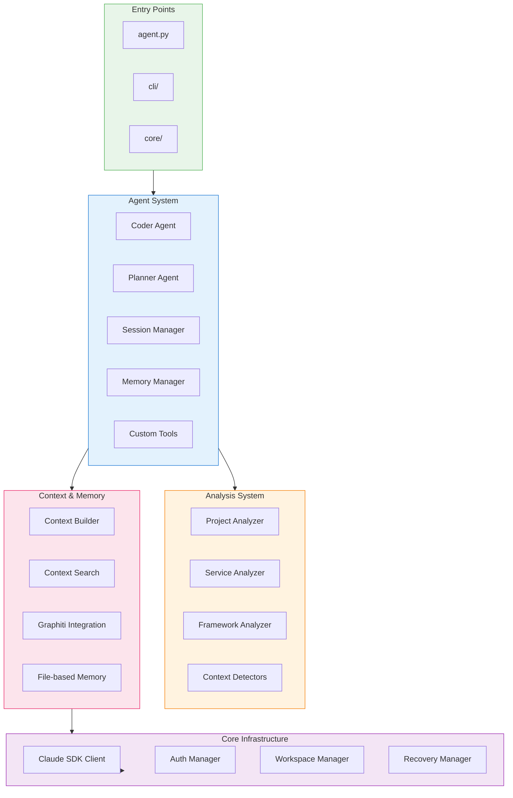

## Agent System

The agent system is the heart of Auto-Claude, executing autonomous coding tasks through the Claude Agent SDK.

### Module Structure

```
apps/backend/agents/
├── __init__.py          # Public API exports (lazy loading)
├── base.py              # Shared constants and configuration
├── coder.py             # Main autonomous agent loop
├── planner.py           # Follow-up planner logic
├── session.py           # Session execution and tracking
├── memory_manager.py    # Dual-layer memory system
├── utils.py             # Git operations and plan management
└── tools_pkg/           # Custom MCP tools
    ├── models.py        # Tool definitions
    ├── permissions.py   # Tool access control
    ├── registry.py      # MCP server creation
    └── tools/           # Tool implementations
        ├── memory.py    # Memory tools
        ├── progress.py  # Build progress tools
        ├── qa.py        # QA tools
        └── subtask.py   # Subtask management
```

### Agent Class Relationships

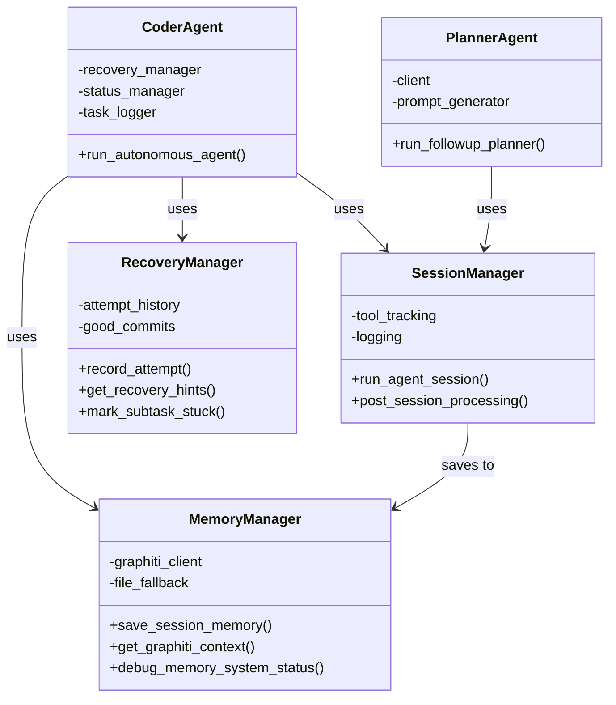

### Coder Agent Flow

The main autonomous agent loop handles the complete build lifecycle:

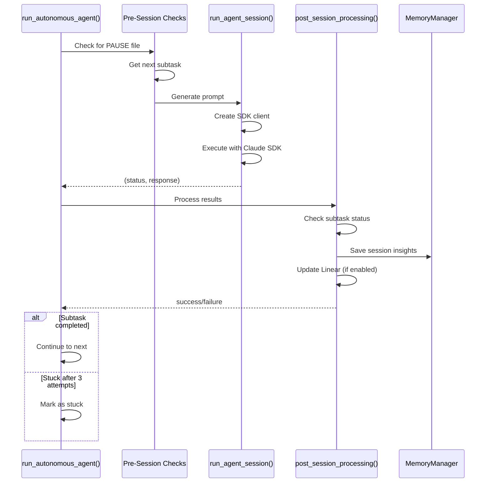

### Memory System

The backend uses a dual-layer memory system for session persistence:

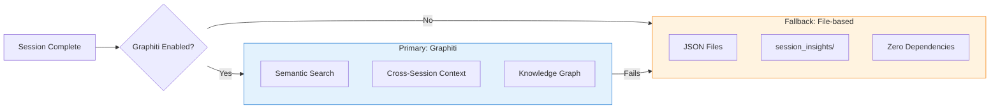

| Memory Type | Use Case | Features |
|-------------|----------|----------|
| **Graphiti** | Production | Semantic search, entity extraction, cross-session learning |
| **File-based** | Development | JSON files, no external dependencies, always available |

## Analysis System

The analysis system automatically detects project structure, frameworks, and services.

### Module Structure

```
apps/backend/analysis/
├── analyzer.py              # CLI facade
├── project_analyzer.py      # Full project analysis
├── analyzers/
│   ├── base.py              # BaseAnalyzer class
│   ├── service_analyzer.py  # Single service analysis
│   ├── project_analyzer_module.py  # Monorepo detection
│   ├── framework_analyzer.py       # Framework detection
│   ├── route_detector.py           # API route detection
│   ├── database_detector.py        # Database model detection
│   ├── context_analyzer.py         # Context extraction
│   └── context/                    # Specialized detectors
│       ├── api_docs_detector.py
│       ├── auth_detector.py
│       ├── env_detector.py
│       ├── jobs_detector.py
│       ├── migrations_detector.py
│       ├── monitoring_detector.py
│       └── services_detector.py
├── risk_classifier.py       # Change risk assessment
├── security_scanner.py      # Security vulnerability detection
└── insight_extractor.py     # Session insight extraction
```

### Analyzer Class Hierarchy

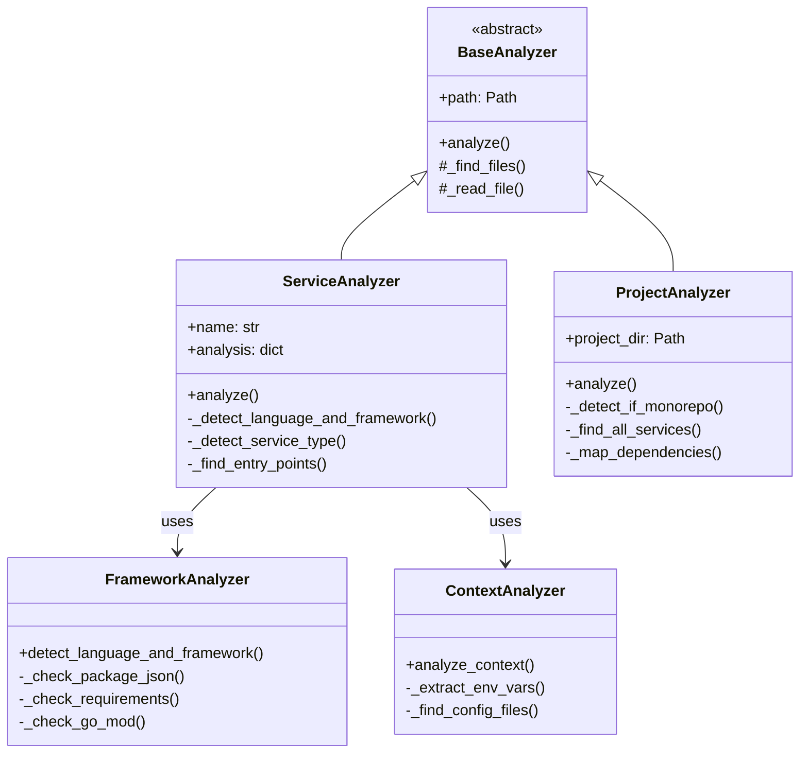

### Analysis Pipeline

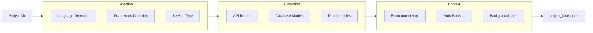

## Context System

The context system builds and searches contextual information for agent prompts.

### Module Structure

```
apps/backend/context/
├── builder.py               # Context builder
├── search.py                # Context search
├── categorizer.py           # File categorization
├── keyword_extractor.py     # Keyword extraction
├── pattern_discovery.py     # Pattern detection
├── service_matcher.py       # Service matching
├── graphiti_integration.py  # Memory integration
├── models.py                # Data models
├── serialization.py         # JSON serialization
└── constants.py             # Configuration
```

### Context Building Flow

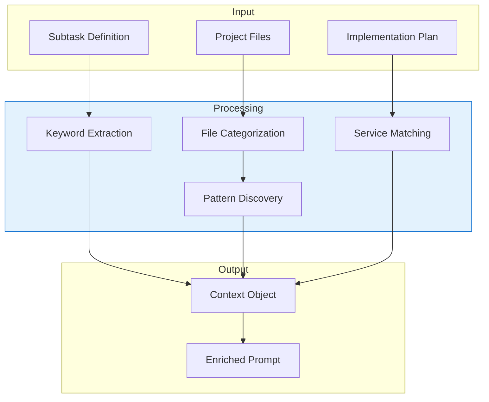

| Component | Purpose |
|-----------|---------|
| **ContextBuilder** | Orchestrates context creation from multiple sources |
| **ContextSearch** | Searches relevant files and patterns |
| **PatternDiscovery** | Identifies code patterns and conventions |
| **GraphitiIntegration** | Queries memory for historical context |

## Core Infrastructure

The core module provides fundamental services used across the backend.

### Module Structure

```
apps/backend/core/
├── agent.py                 # Agent execution utilities
├── client.py                # Claude SDK client factory
├── auth.py                  # Authentication management
├── workspace.py             # Workspace management
├── workspace/
│   ├── setup.py             # Workspace initialization
│   ├── finalization.py      # Cleanup and commit
│   ├── git_utils.py         # Git operations
│   ├── display.py           # Progress display
│   └── models.py            # Data structures
├── worktree.py              # Git worktree management
├── progress.py              # Build progress tracking
├── phase_event.py           # Execution phase events
└── debug.py                 # Debug utilities
```

### Client Creation Flow

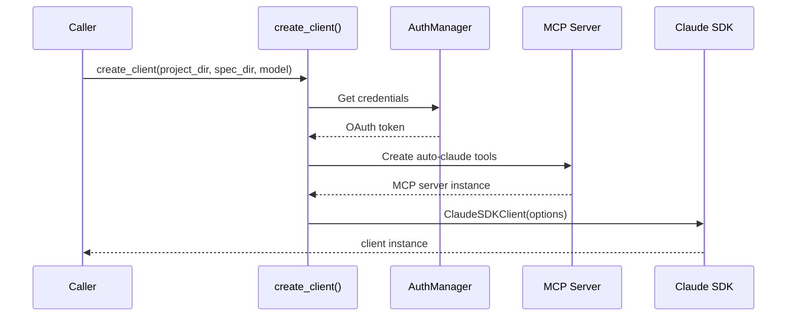

### Workspace Lifecycle

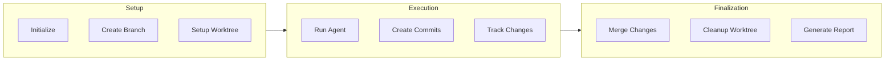

## CLI System

The CLI provides command-line access to all backend functionality.

### Module Structure

```
apps/backend/cli/
├── main.py              # CLI entry point
├── build_commands.py    # Build-related commands
├── spec_commands.py     # Spec management
├── qa_commands.py       # QA operations
├── batch_commands.py    # Batch processing
├── followup_commands.py # Follow-up planning
├── workspace_commands.py # Workspace management
├── input_handlers.py    # Input validation
└── utils.py             # CLI utilities
```

### Command Categories

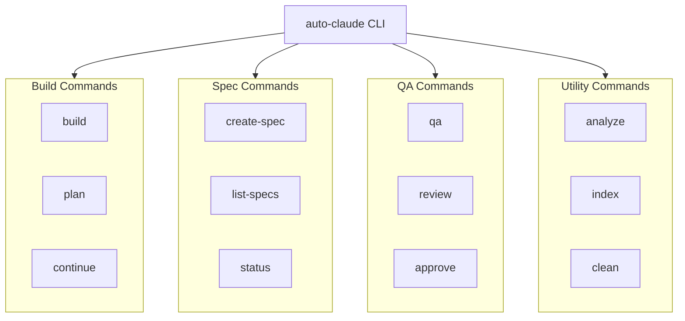

## Integration Patterns

### External Integrations

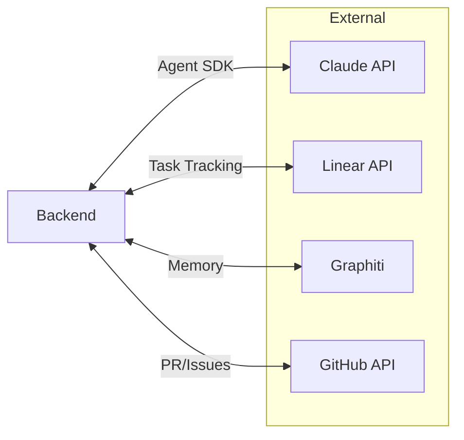

| Integration | Purpose | Module |
|-------------|---------|--------|
| **Claude API** | AI agent execution | `core/client.py` |
| **Linear** | Task progress tracking | `integrations/linear/` |
| **Graphiti** | Memory and context | `integrations/graphiti/` |
| **GitHub** | Repository operations | `core/workspace/` |

### Custom MCP Tools

The backend provides custom MCP tools for reliable agent operations:

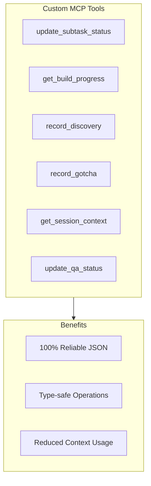

## Data Structures

### Implementation Plan

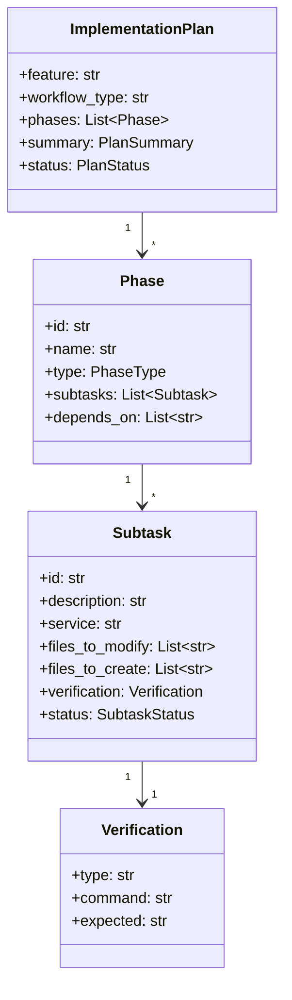

### Session Insights

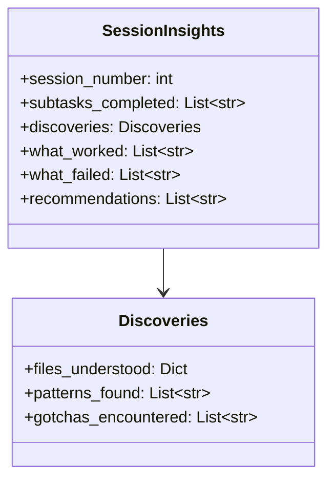

## Error Handling and Recovery

### Recovery Strategy

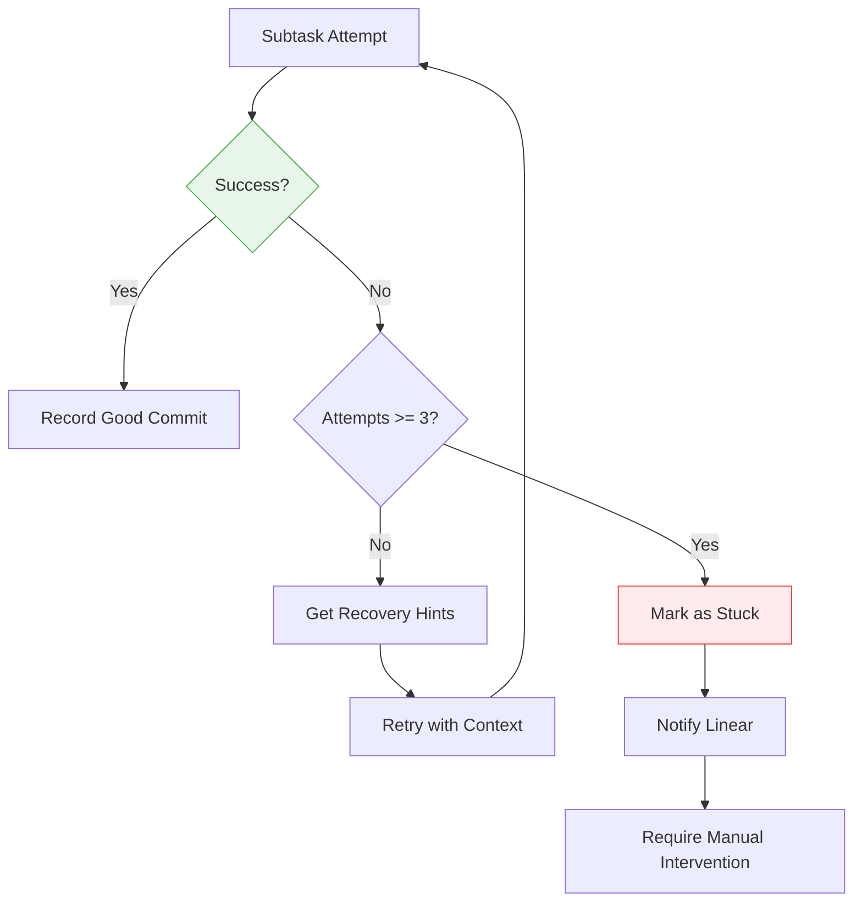

| Recovery Feature | Description |
|------------------|-------------|
| **Attempt Tracking** | Records each attempt with approach and errors |
| **Good Commits** | Stores successful commits for rollback safety |
| **Recovery Hints** | Provides context from failed attempts |
| **Stuck Detection** | Marks subtasks as stuck after max retries |

## Performance Considerations

| Aspect | Implementation |
|--------|----------------|
| **Lazy Imports** | `__getattr__` pattern avoids circular dependencies |
| **Streaming Output** | NDJSON for real-time progress updates |
| **Concurrent Analysis** | Service analyzers can run in parallel |
| **Memory Caching** | Graphiti caches for repeated queries |

## Next Steps

- [Analysis Module](../components/backend/analysis.md) - Detailed analyzer documentation
- [Agents Module](../components/backend/agents.md) - Agent implementation details
- [CLI Module](../components/backend/cli.md) - Command-line interface reference
- [Core Module](../components/backend/core.md) - Core services documentation
