# Frontend Architecture

The Auto-Claude frontend is an Electron-based desktop application built with React and TypeScript. This document provides a comprehensive overview of the main/renderer process architecture, component organization, and state management patterns.

## Architecture Overview

The frontend follows Electron's multi-process architecture with strict separation between the main process (Node.js) and renderer process (Chromium):

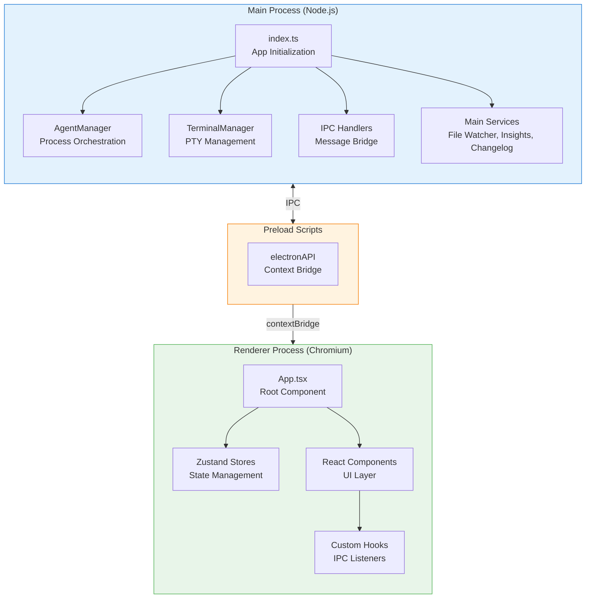

## Core Design Principles

| Principle | Implementation |
|-----------|----------------|
| **Process Isolation** | Main process handles system operations; renderer handles UI only |
| **Context Isolation** | Renderer cannot access Node.js APIs directly; uses contextBridge |
| **Type Safety** | Shared TypeScript types between processes |
| **Reactive State** | Zustand stores with IPC event listeners for real-time updates |
| **Modular IPC** | Domain-specific handler modules for maintainability |

## Main Process

The main process handles all Node.js operations including file system access, process spawning, and system integration.

### Entry Point Structure

```
apps/frontend/src/main/
├── index.ts                 # App initialization and window creation
├── ipc-setup.ts             # IPC handler registration facade
├── ipc-handlers/            # Domain-specific IPC handlers
│   ├── project-handlers.ts  # Project CRUD
│   ├── task-handlers.ts     # Task execution
│   ├── terminal-handlers.ts # Terminal operations
│   ├── settings-handlers.ts # App settings
│   ├── github/              # GitHub integration
│   └── context/             # Project context
├── agent/                   # Agent process management
│   ├── agent-manager.ts     # Main orchestrator
│   ├── agent-process.ts     # Process spawning
│   ├── agent-queue.ts       # Task queuing
│   ├── agent-state.ts       # State tracking
│   └── parsers/             # Output parsing
├── terminal/                # Terminal management
│   ├── terminal-manager.ts  # Main orchestrator
│   ├── pty-manager.ts       # PTY process handling
│   └── session-handler.ts   # Session persistence
└── services/                # Background services
    ├── file-watcher.ts      # File change detection
    ├── insights-service.ts  # AI insights
    └── changelog-service.ts # Changelog generation
```

### AgentManager

The AgentManager orchestrates Python agent processes for task execution, roadmap generation, and ideation:

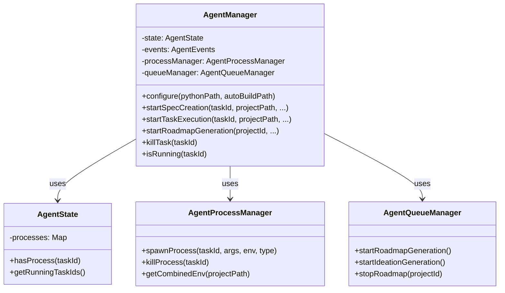

### TerminalManager

The TerminalManager provides PTY-based terminal emulation for interactive Claude Code sessions:

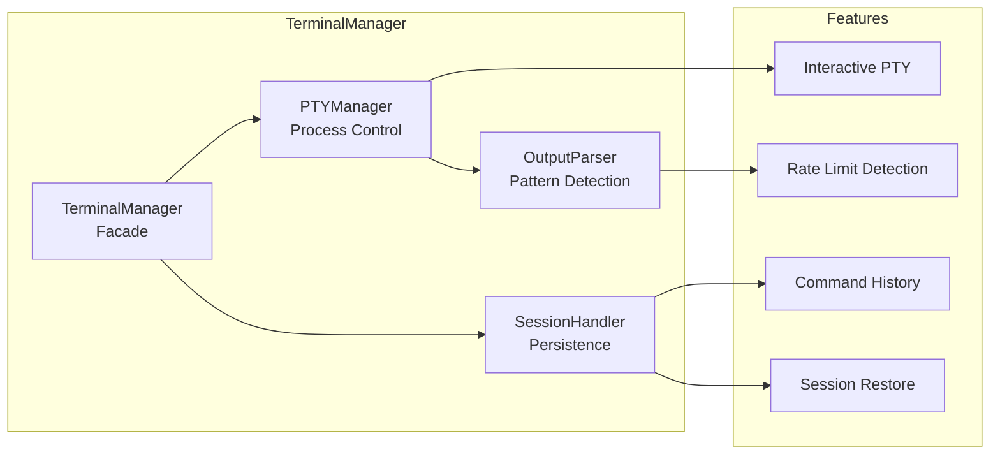

| Component | Purpose |
|-----------|---------|
| **PTYManager** | Spawns and manages pseudo-terminal processes |
| **SessionHandler** | Persists terminal sessions across app restarts |
| **OutputParser** | Detects rate limits and special patterns in output |

### IPC Handler Organization

IPC handlers are organized by domain for maintainability:

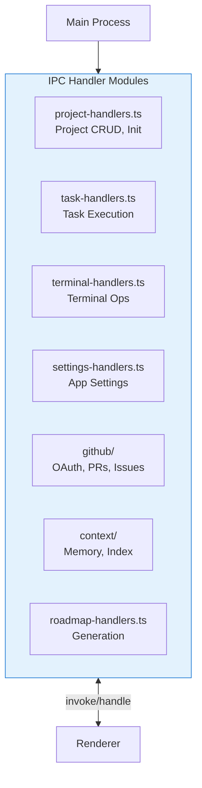

## Preload Bridge

The preload script creates a secure bridge between main and renderer processes using Electron's contextBridge:

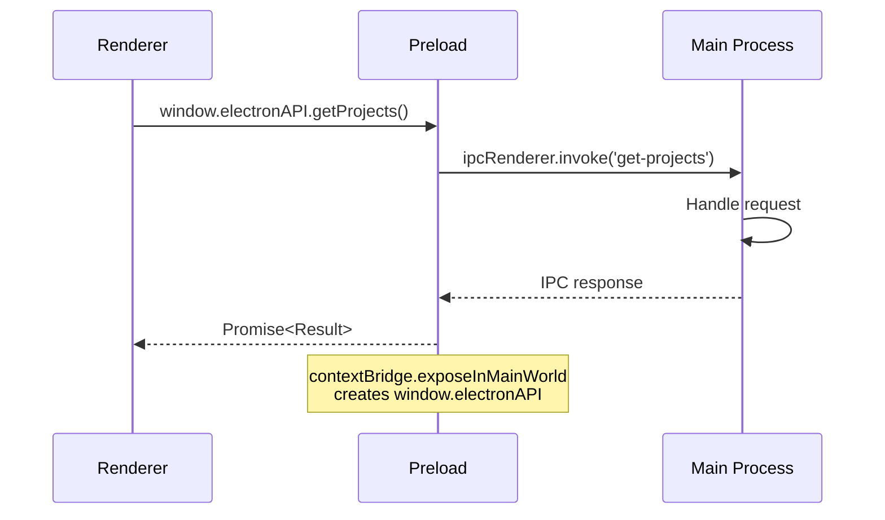

### API Surface

The preload exposes a unified `electronAPI` object:

```typescript
// Available in renderer as window.electronAPI
interface ElectronAPI {
  // Projects
  getProjects(): Promise<Result<Project[]>>
  addProject(path: string): Promise<Result<Project>>
  removeProject(id: string): Promise<Result<void>>

  // Tasks
  startTask(taskId: string, options: TaskOptions): Promise<Result<void>>
  stopTask(taskId: string): Promise<Result<void>>

  // Terminals
  createTerminal(options: TerminalOptions): Promise<Result<string>>
  writeTerminal(id: string, data: string): Promise<void>

  // Events (returns cleanup function)
  onTaskProgress(callback: (taskId, plan) => void): () => void
  onTerminalData(callback: (id, data) => void): () => void
}
```

## Renderer Process

The renderer process runs in a Chromium browser context, handling all UI rendering with React.

### Application Structure

```
apps/frontend/src/renderer/
├── App.tsx                  # Root component with routing
├── main.tsx                 # React entry point
├── stores/                  # Zustand state stores
│   ├── project-store.ts     # Project state
│   ├── task-store.ts        # Task state
│   ├── terminal-store.ts    # Terminal state
│   ├── settings-store.ts    # App settings
│   ├── roadmap-store.ts     # Roadmap state
│   └── ideation-store.ts    # Ideation state
├── hooks/                   # Custom React hooks
│   ├── useIpc.ts            # IPC event listeners
│   └── useTerminal.ts       # Terminal utilities
├── components/              # UI components
│   ├── ui/                  # Base UI primitives (Radix)
│   ├── settings/            # Settings dialogs
│   ├── task-detail/         # Task detail views
│   ├── github-issues/       # GitHub integration
│   └── changelog/           # Changelog components
└── i18n/                    # Internationalization
```

### Component Hierarchy

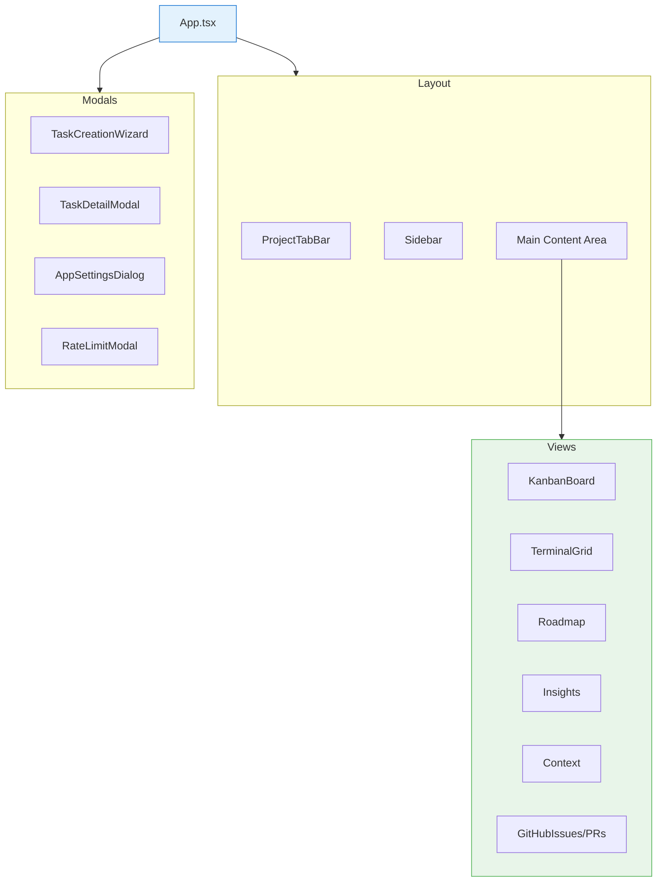

### Key Components

| Component | Purpose |
|-----------|---------|
| **App.tsx** | Root component, view routing, global state initialization |
| **Sidebar** | Navigation between views (Kanban, Roadmap, Insights, etc.) |
| **ProjectTabBar** | Browser-like tabs for multiple open projects |
| **KanbanBoard** | Task management with drag-and-drop columns |
| **TerminalGrid** | Grid of interactive terminal sessions |
| **TaskDetailModal** | Detailed task view with logs and progress |

## State Management

### Zustand Store Architecture

State is managed through domain-specific Zustand stores with IPC synchronization:

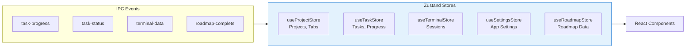

### Store Pattern Example

```typescript
// Zustand store with actions and selectors
interface ProjectState {
  projects: Project[];
  activeProjectId: string | null;
  openProjectIds: string[];

  // Actions
  setProjects: (projects: Project[]) => void;
  openProjectTab: (projectId: string) => void;
  closeProjectTab: (projectId: string) => void;

  // Selectors
  getActiveProject: () => Project | undefined;
  getProjectTabs: () => Project[];
}

export const useProjectStore = create<ProjectState>((set, get) => ({
  projects: [],
  activeProjectId: null,
  openProjectIds: [],

  openProjectTab: (projectId) => {
    const state = get();
    if (!state.openProjectIds.includes(projectId)) {
      set({
        openProjectIds: [...state.openProjectIds, projectId],
        activeProjectId: projectId
      });
      // Persist to main process
      window.electronAPI.saveTabState({...});
    }
  },
  // ...
}));
```

### IPC Event Listeners

The `useIpcListeners` hook sets up event subscriptions for real-time updates:

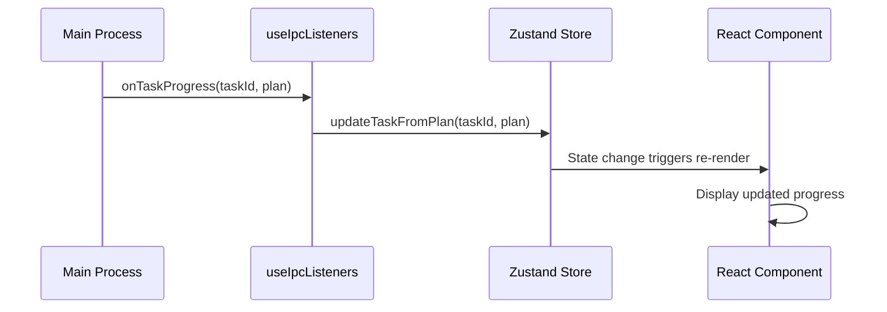

## Terminal Integration

### Terminal Architecture

The terminal system uses xterm.js in the renderer with node-pty in the main process:

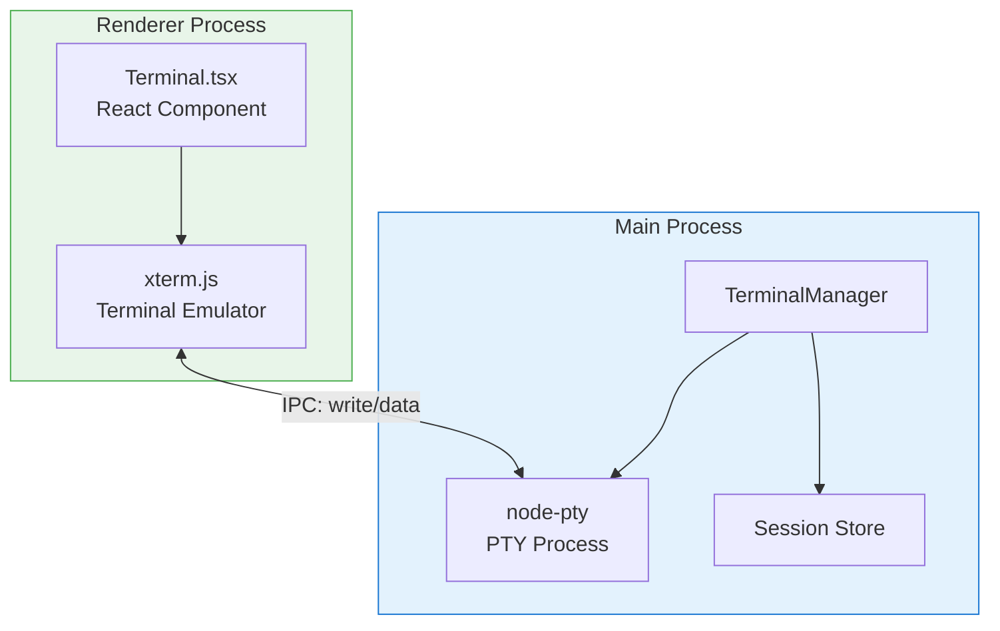

### Terminal Session Flow

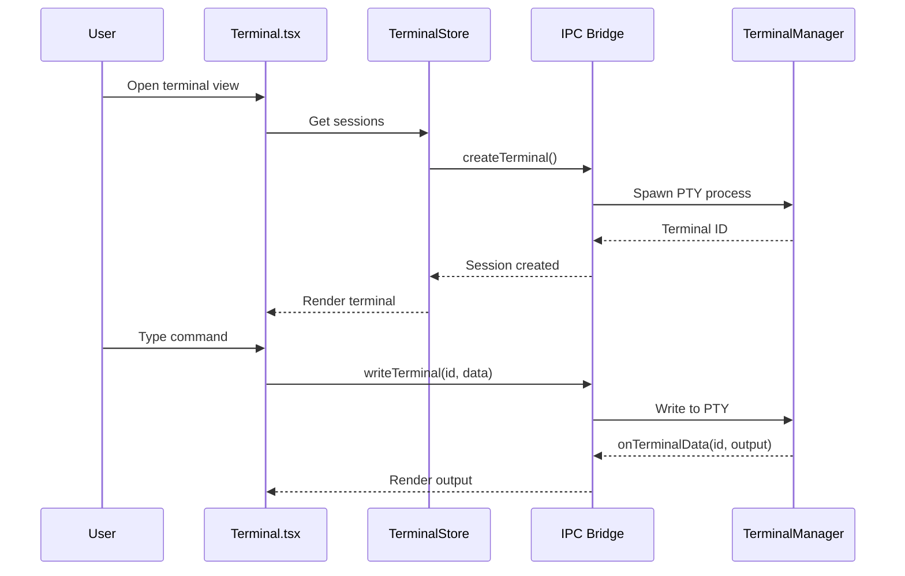

## Window Management

### Browser Window Configuration

The main window is configured for optimal desktop app experience:

```typescript
mainWindow = new BrowserWindow({
  width: 1400,
  height: 900,
  minWidth: 1000,
  minHeight: 700,
  titleBarStyle: 'hiddenInset',  // macOS native look
  trafficLightPosition: { x: 15, y: 10 },
  webPreferences: {
    preload: join(__dirname, '../preload/index.mjs'),
    sandbox: false,
    contextIsolation: true,      // Security: isolate contexts
    nodeIntegration: false,      // Security: no Node in renderer
    backgroundThrottling: false  // Keep terminals responsive
  }
});
```

### Dev vs Production Loading

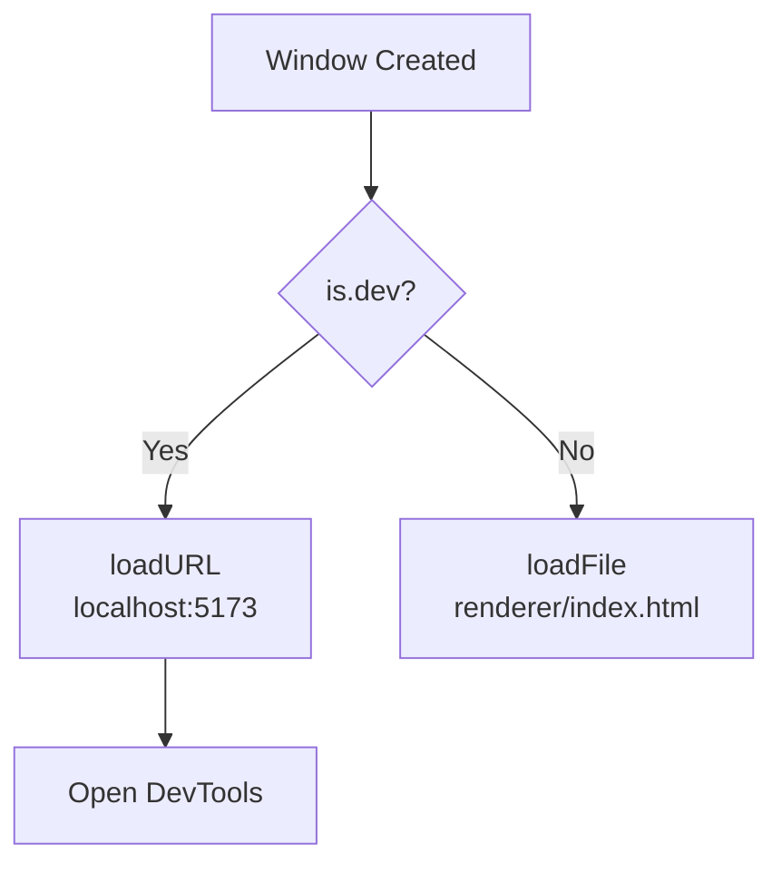

## Event System

### Main Process Events

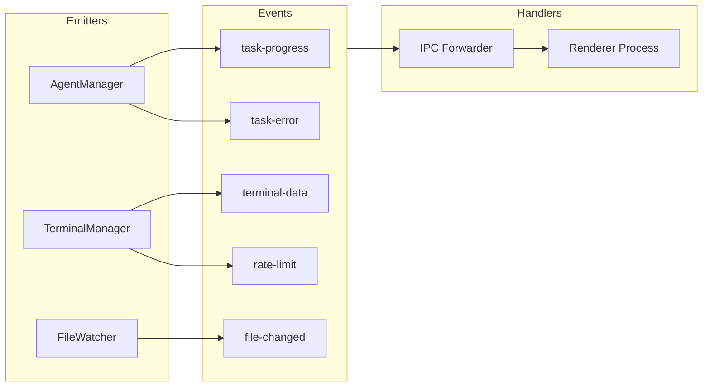

### Rate Limit Handling

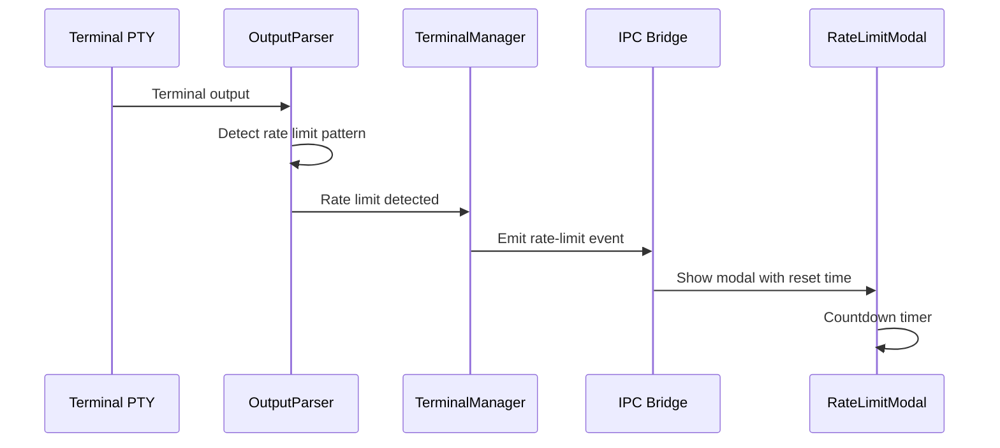

## Technology Stack

| Technology | Version | Purpose |
|------------|---------|---------|
| Electron | 39.x | Desktop application framework |
| React | 19.x | UI component library |
| TypeScript | 5.x | Type-safe JavaScript |
| Zustand | 5.x | Lightweight state management |
| Tailwind CSS | 4.x | Utility-first CSS framework |
| Radix UI | - | Accessible UI primitives |
| xterm.js | - | Terminal emulator |
| node-pty | - | PTY process management |
| Vite | 6.x | Build tool and dev server |

## Security Model

### Context Isolation

The renderer process is fully isolated from Node.js:

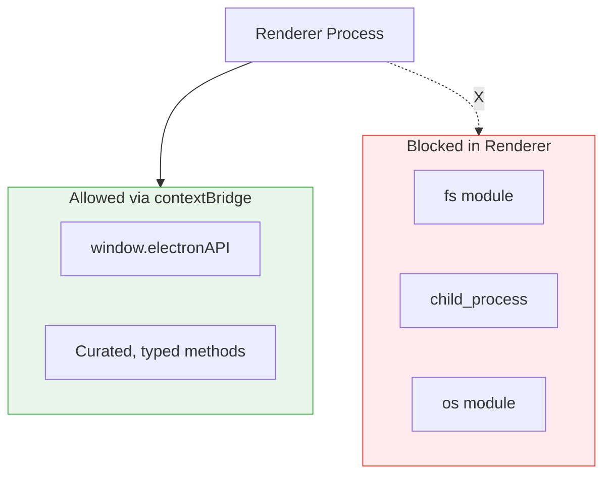

### Security Layers

| Layer | Implementation |
|-------|----------------|
| **contextIsolation** | Renderer cannot access preload scope |
| **nodeIntegration: false** | No Node.js APIs in renderer |
| **sandbox: false** | Required for node-pty (controlled risk) |
| **Typed IPC** | All IPC methods are typed and validated |

## Performance Optimizations

| Optimization | Implementation |
|--------------|----------------|
| **backgroundThrottling: false** | Terminals stay responsive when unfocused |
| **Debounced Tab State** | Tab state saves are debounced to reduce IPC |
| **Lazy Store Loading** | Stores load data on demand |
| **Virtualized Lists** | Long lists use windowing for performance |
| **Memoized Selectors** | Zustand selectors prevent unnecessary re-renders |

## Build Configuration

### Development

```bash
# Start renderer dev server (Vite)
pnpm dev:frontend

# Watches for changes and hot-reloads
# Main process: Uses electron-vite for HMR
# Renderer: Uses Vite's fast refresh
```

### Production

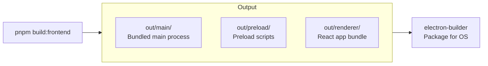

## Next Steps

- [Overview Architecture](./overview.md) - High-level system overview
- [Backend Architecture](./backend.md) - Python agent system details
- [Integration Guide](./integration.md) - Frontend-backend communication
