# Frontend-Backend Integration

This document provides detailed documentation on how the Electron frontend and Python backend communicate through IPC (Inter-Process Communication) and process spawning mechanisms.

## Communication Architecture

Auto-Claude uses a layered communication architecture that separates concerns between the UI, orchestration, and AI execution layers.


## IPC Channel Architecture

The system uses a comprehensive set of IPC channels organized by domain. Each channel follows a consistent naming convention: `domain:action`.

### Channel Categories

| Category | Prefix | Purpose |
|----------|--------|---------|
| **Tasks** | `task:` | Task CRUD, execution control, worktree management |
| **Projects** | `project:` | Project lifecycle, settings |
| **Terminal** | `terminal:` | PTY sessions, Claude Code integration |
| **Claude Profiles** | `claude:` | Multi-account management, rate limiting |
| **Roadmap** | `roadmap:` | Feature generation, AI planning |
| **GitHub** | `github:` | Issue integration, PR review, auto-fix |
| **Insights** | `insights:` | AI-powered codebase chat |

### Channel Flow Types

```mermaid
flowchart LR
    subgraph Request["Request Channels"]
        direction TB
        R1[ipcMain.handle]
        R2["Promise-based"]
        R3["Bidirectional"]
    end

    subgraph Fire["Fire-and-Forget"]
        direction TB
        F1[ipcMain.on]
        F2["No response"]
        F3["Start/Stop actions"]
    end

    subgraph Events["Event Channels"]
        direction TB
        E1[webContents.send]
        E2["Main → Renderer"]
        E3["Streaming updates"]
    end

    Renderer -->|"invoke()"| Request
    Renderer -->|"send()"| Fire
    Events -->|"on()"| Renderer

    style Request fill:#e8f5e9,stroke:#4caf50
    style Fire fill:#fff3e0,stroke:#f57c00
    style Events fill:#e3f2fd,stroke:#1976d2
```



## Task Execution Flow

The complete flow from user action to code generation involves multiple communication layers.

### Task Start Sequence


### Process Spawning Details

The AgentProcessManager handles all Python process lifecycle management:


### Environment Configuration

Process environment is built from multiple sources:


| Variable | Source | Purpose |
|----------|--------|---------|
| `PYTHONUNBUFFERED` | Hardcoded | Real-time output streaming |
| `PYTHONIOENCODING` | Hardcoded | UTF-8 output encoding |
| `PYTHONUTF8` | Hardcoded | Force UTF-8 mode |
| `CLAUDE_*` | Profile Manager | API credentials, model config |
| `GRAPHITI_MCP_URL` | Project Settings | Memory integration |
| Custom vars | Auto-Claude .env | Provider keys, custom config |

## Agent Event System

The agent system uses EventEmitter patterns to propagate state changes through the application.

### Event Flow Architecture


### Supported Events

| Event | Source | Data | Purpose |
|-------|--------|------|---------|
| `log` | stdout/stderr | String | Raw process output |
| `execution-progress` | Phase parser | Phase, progress, subtask | UI progress tracking |
| `exit` | Process | Code, process type | Task completion/failure |
| `error` | Process/Runtime | Error message | Error display |
| `sdk-rate-limit` | Output parser | Rate limit info | Profile switching |
| `auth-failure` | Output parser | Auth details | Re-authentication prompt |
| `auto-swap-restart-task` | Rate limit handler | Task ID, new profile | Automatic retry |

### Phase Protocol

The Python backend emits structured phase events for UI synchronization:


Phase events are emitted as structured markers:

```
__EXEC_PHASE__:planning:Creating implementation plan...
__EXEC_PHASE__:coding:subtask-1-1:Implementing feature X
__EXEC_PHASE__:qa_review:Running QA review...
__EXEC_PHASE__:complete:Build completed successfully
```

## IPC Handler Architecture

IPC handlers are organized into domain-specific modules for maintainability.

### Handler Registration Flow


### Handler Module Structure

Each handler module follows a consistent pattern:

```typescript
export function registerDomainHandlers(
  agentManager: AgentManager,
  getMainWindow: () => BrowserWindow | null
): void {
  // Request handlers (Promise-based)
  ipcMain.handle(IPC_CHANNELS.DOMAIN_ACTION, async (_, ...args) => {
    return { success: true, data: result };
  });

  // Fire-and-forget handlers
  ipcMain.on(IPC_CHANNELS.DOMAIN_START, (_, ...args) => {
    agentManager.startProcess(...args);
  });

  // Event forwarding
  agentManager.on('event', (data) => {
    const mainWindow = getMainWindow();
    mainWindow?.webContents.send(IPC_CHANNELS.DOMAIN_EVENT, data);
  });
}
```

## Preload API Layer

The preload scripts create a secure bridge between renderer and main processes.

### API Structure


### API Pattern

```typescript
// preload/api/task-api.ts
export function createTaskAPI() {
  return {
    // Request methods (invoke)
    list: (projectId: string) =>
      ipcRenderer.invoke(IPC_CHANNELS.TASK_LIST, projectId),

    // Fire-and-forget methods (send)
    start: (taskId: string, options?: TaskStartOptions) =>
      ipcRenderer.send(IPC_CHANNELS.TASK_START, taskId, options),

    // Event subscriptions (on)
    onProgress: (callback: (taskId: string, plan: Plan) => void) => {
      const handler = (_: unknown, taskId: string, plan: Plan) =>
        callback(taskId, plan);
      ipcRenderer.on(IPC_CHANNELS.TASK_PROGRESS, handler);
      return () => ipcRenderer.removeListener(IPC_CHANNELS.TASK_PROGRESS, handler);
    },
  };
}
```

## Process Communication Protocol

Communication between Electron main process and Python backend uses NDJSON (Newline-Delimited JSON) streaming over stdout/stderr.

### Stream Processing


### Phase Event Parsing


## Rate Limit Handling

The system includes sophisticated rate limit detection and automatic profile switching.

### Rate Limit Flow


### Profile Switching State


## Terminal Integration

The terminal system provides PTY-based interactive sessions with Claude Code integration.

### Terminal Session Flow


### Terminal Event Handling


## File Watcher Integration

The file watcher monitors spec directories for implementation plan changes.

### Watcher Flow


## Error Handling Patterns

### Error Propagation


### Error Response Patterns

| Error Type | Detection | Response |
|------------|-----------|----------|
| **Rate Limit** | Output pattern matching | Auto-swap or modal |
| **Auth Failure** | Output pattern matching | Auth modal |
| **Process Crash** | Exit code != 0 | Error notification |
| **IPC Timeout** | Promise rejection | Error toast |
| **Parse Error** | JSON.parse failure | Fallback handling |

## Security Considerations

### Context Isolation


### Security Layers

| Layer | Protection |
|-------|------------|
| **Context Isolation** | Renderer cannot access Node.js APIs |
| **Preload Bridge** | Only exposed APIs available to renderer |
| **Input Validation** | All IPC inputs validated before processing |
| **Path Sanitization** | Python paths validated before spawning |
| **Credential Isolation** | OAuth tokens stored securely by profile |

## Performance Optimizations

### Streaming Efficiency

- **Buffered Output**: Lines buffered until complete before processing
- **Sequence Numbers**: Events ordered by sequence for consistent UI updates
- **Debounced Updates**: File watcher debounces rapid changes
- **Lazy Parsing**: Phase events parsed only when markers detected

### Resource Management

- **Process Tracking**: All spawned processes tracked for cleanup
- **Event Cleanup**: IPC listeners removed on component unmount
- **Watcher Cleanup**: File watchers stopped when tasks complete
- **Memory Limits**: Output buffers limited to prevent memory leaks

## Next Steps

- [Architecture Overview](./overview.md) - High-level system architecture
- [Backend Architecture](./backend.md) - Python agent system details
- [Frontend Architecture](./frontend.md) - Electron application structure
