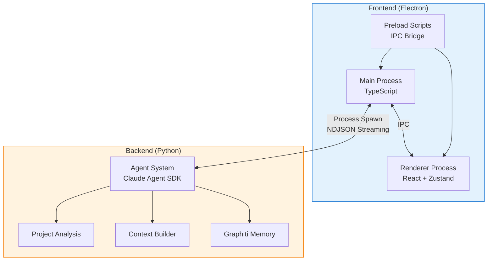
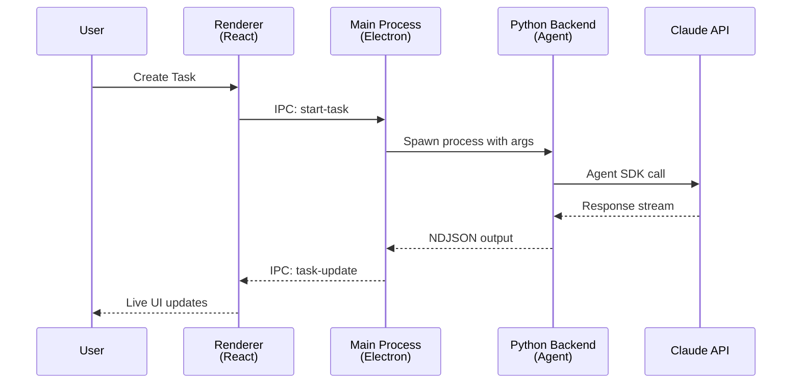
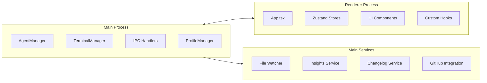
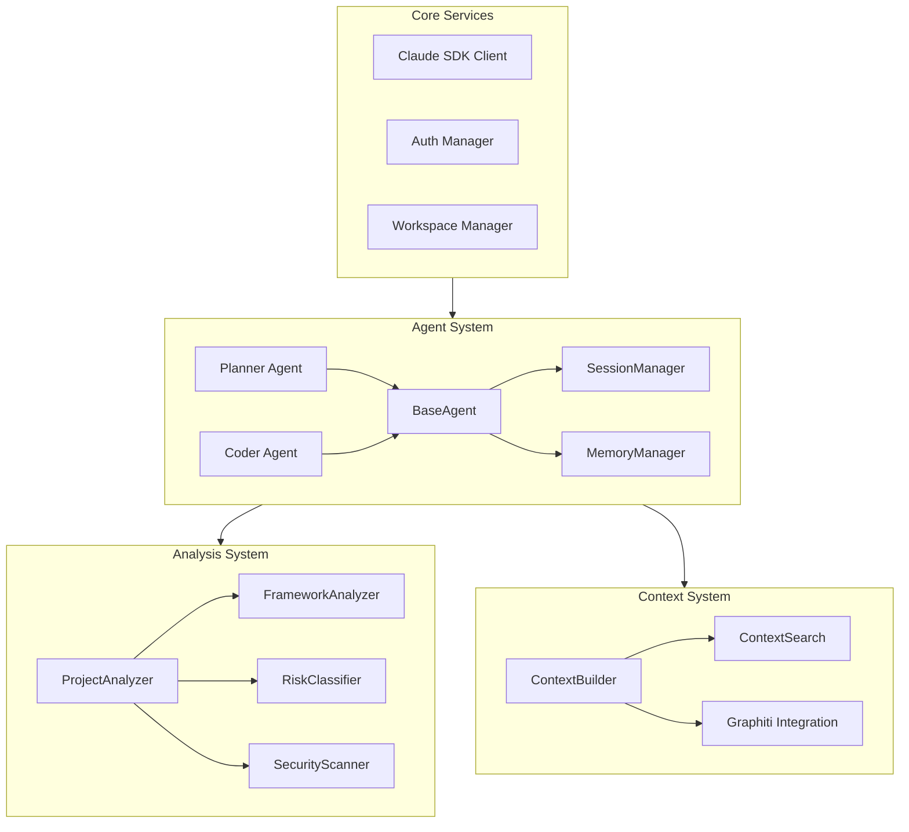
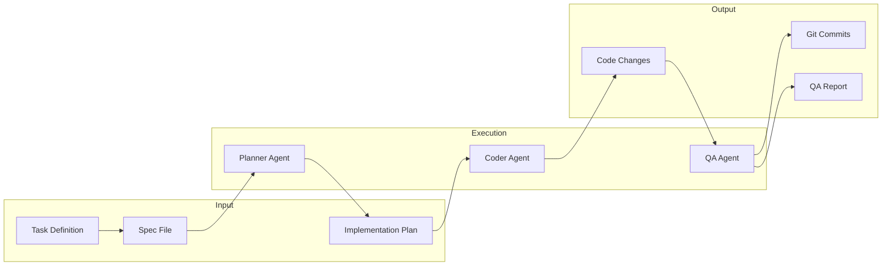
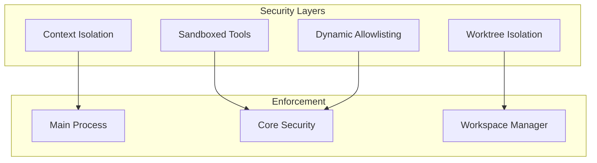

# Architecture Overview

This document provides a high-level view of Auto-Claude's architecture, explaining how the Electron frontend and Python backend work together to deliver an autonomous coding experience.

## System Architecture

Auto-Claude follows a **desktop-first, multi-process architecture** combining Electron for the user interface with Python for AI agent execution.

## Core Design Principles

| Principle | Implementation |
|-----------|----------------|
| **Process Isolation** | Electron main/renderer separation; Python runs as child process |
| **Security First** | Context isolation, sandboxed tools, dynamic command allowlisting |
| **Real-time Streaming** | NDJSON protocol for live agent output |
| **Memory Persistence** | Graphiti integration for cross-session learning |
| **Modular Architecture** | Clear boundaries between UI, orchestration, and AI logic |

## Process Communication Flow

The system uses a layered communication approach:

## Component Overview

### Frontend Components

The Electron frontend is organized into three main areas:

| Component | Purpose |
|-----------|---------|
| **AgentManager** | Spawns and manages Python agent processes |
| **TerminalManager** | PTY management for interactive terminals |
| **IPC Handlers** | Bridge between renderer and main process |
| **Zustand Stores** | Application state management |
| **UI Components** | React components (dialogs, panels, cards) |

### Backend Components

The Python backend handles AI agent execution and project analysis:

| Module | Purpose |
|--------|---------|
| **agents/** | Agent implementations (planner, coder, QA) |
| **analysis/** | Project analysis and risk classification |
| **context/** | Context building, search, and memory |
| **core/** | Claude SDK client, auth, workspace setup |
| **cli/** | Command-line interface modules |

## Data Flow

### Task Execution Pipeline

### Agent Lifecycle

1. **Initialization**: Main process spawns Python with spec arguments
2. **Planning**: Planner agent analyzes spec and creates implementation plan
3. **Execution**: Coder agent implements subtasks with Claude SDK
4. **Validation**: QA agent reviews and validates changes
5. **Finalization**: Commits created, workspace cleaned up

## Technology Stack

### Frontend

| Technology | Version | Purpose |
|------------|---------|---------|
| Electron | 39.x | Desktop application framework |
| React | 19.x | UI component library |
| TypeScript | 5.x | Type-safe JavaScript |
| Zustand | 5.x | State management |
| Tailwind CSS | 4.x | Utility-first styling |
| Radix UI | - | Accessible UI primitives |

### Backend

| Technology | Version | Purpose |
|------------|---------|---------|
| Python | 3.12+ | Runtime environment |
| Claude Agent SDK | - | AI agent execution |
| Graphiti | - | Memory and context persistence |
| python-dotenv | - | Environment configuration |

## Security Model

Auto-Claude implements multiple security layers:

| Layer | Description |
|-------|-------------|
| **Context Isolation** | Electron renderer cannot access Node.js APIs directly |
| **Sandboxed Tools** | Agent tools have restricted filesystem and command access |
| **Dynamic Allowlisting** | Commands allowed based on detected project stack |
| **Worktree Isolation** | Git worktrees isolate feature development |

## Next Steps

- [Backend Architecture](./backend.md) - Deep dive into Python agent system
- [Frontend Architecture](./frontend.md) - Electron main/renderer organization
- [Integration Guide](./integration.md) - Frontend-backend communication details
