# Agents Module

The agents module is the core of Auto-Claude's autonomous coding system. It provides a modular architecture for running AI-powered coding agents that implement tasks defined in implementation plans.

## Module Overview

The agents module is organized into focused submodules with clear responsibilities:

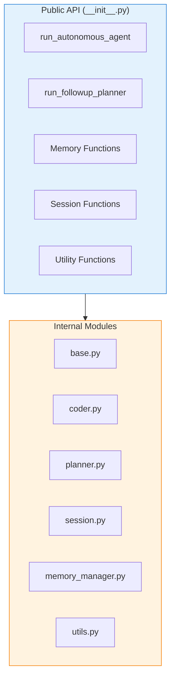

## Module Structure

```
apps/backend/agents/
├── __init__.py          # Public API with lazy imports
├── base.py              # Shared constants and configuration
├── coder.py             # Main autonomous agent loop
├── planner.py           # Follow-up planner for completed specs
├── session.py           # Session execution and post-processing
├── memory_manager.py    # Dual-layer memory system
└── utils.py             # Git and plan management utilities
```

## Class Diagram

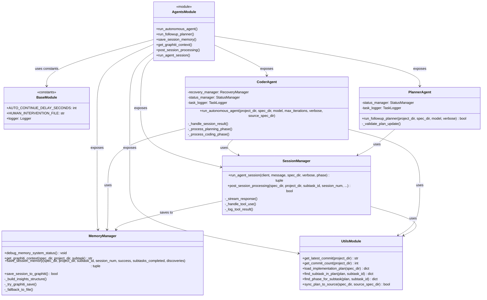

## Base Module

The `base.py` module provides shared constants and configuration used across all agent modules.

### Constants

| Constant | Value | Description |
|----------|-------|-------------|
| `AUTO_CONTINUE_DELAY_SECONDS` | `3` | Delay between automatic session continuations |
| `HUMAN_INTERVENTION_FILE` | `"PAUSE"` | Filename that triggers agent pause |

### Usage Pattern

```python
from .base import AUTO_CONTINUE_DELAY_SECONDS, HUMAN_INTERVENTION_FILE

# Check for human intervention
pause_file = spec_dir / HUMAN_INTERVENTION_FILE
if pause_file.exists():
    # Handle pause request
    pass

# Auto-continue delay
await asyncio.sleep(AUTO_CONTINUE_DELAY_SECONDS)
```

## Coder Agent

The coder agent (`coder.py`) implements the main autonomous coding loop that processes implementation plans and executes subtasks.

### Architecture

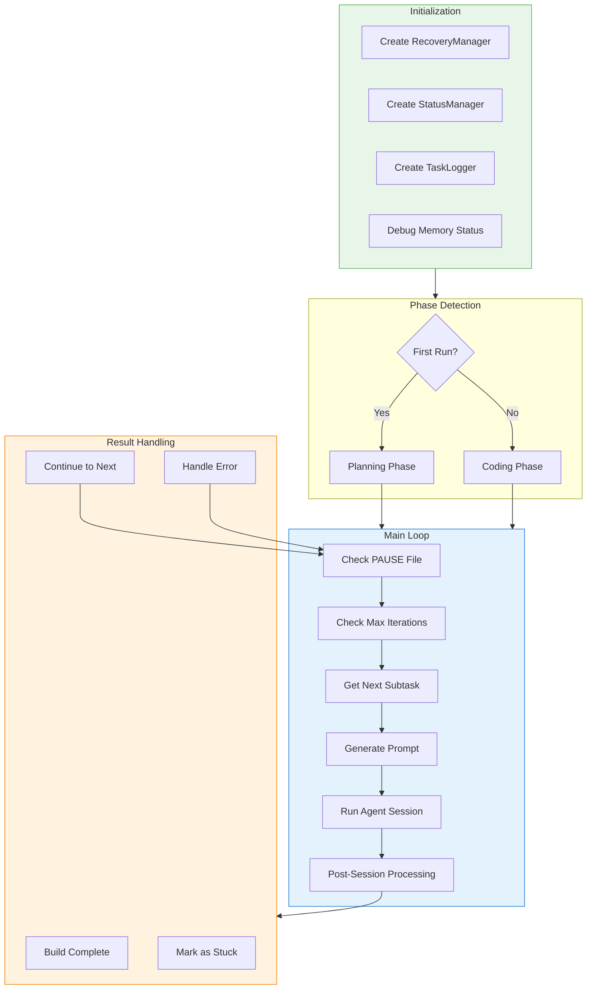

### Function Signature

```python
async def run_autonomous_agent(
    project_dir: Path,
    spec_dir: Path,
    model: str,
    max_iterations: int | None = None,
    verbose: bool = False,
    source_spec_dir: Path | None = None,
) -> None
```

### Parameters

| Parameter | Type | Description |
|-----------|------|-------------|
| `project_dir` | `Path` | Root directory for the project |
| `spec_dir` | `Path` | Directory containing the spec (`.auto-claude/specs/001-name/`) |
| `model` | `str` | Claude model to use (e.g., `"claude-sonnet-4-20250514"`) |
| `max_iterations` | `int \| None` | Maximum session iterations (None for unlimited) |
| `verbose` | `bool` | Whether to show detailed tool output |
| `source_spec_dir` | `Path \| None` | Original spec directory for worktree sync |

### Key Features

1. **Planning Phase Detection**: Automatically detects first run and initiates planning
2. **Recovery Management**: Tracks attempts and provides recovery hints
3. **Status Updates**: Maintains real-time status for UI display
4. **Linear Integration**: Updates Linear tasks when enabled
5. **Graphiti Context**: Retrieves relevant memory context for each subtask

### Session Flow Sequence

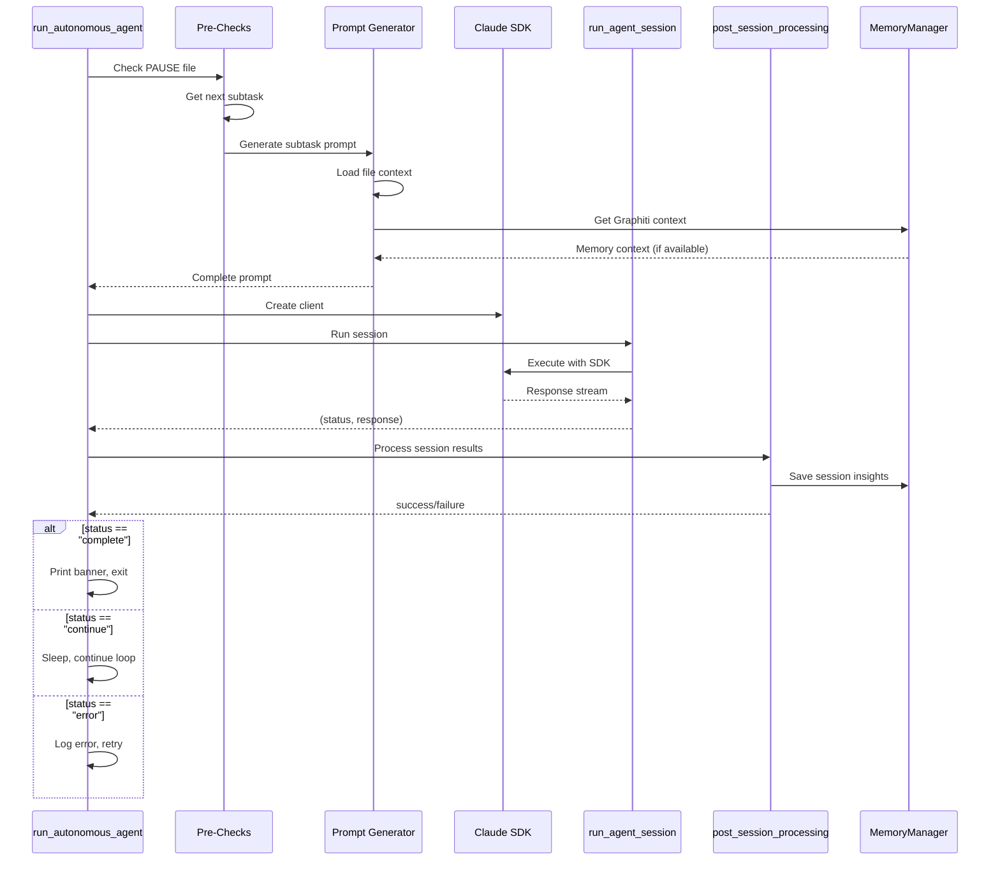

## Planner Agent

The planner agent (`planner.py`) handles follow-up planning sessions for adding new subtasks to completed specs.

### Architecture

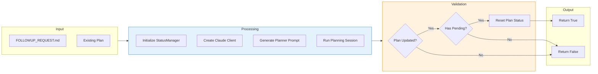

### Function Signature

```python
async def run_followup_planner(
    project_dir: Path,
    spec_dir: Path,
    model: str,
    verbose: bool = False,
) -> bool
```

### Parameters

| Parameter | Type | Description |
|-----------|------|-------------|
| `project_dir` | `Path` | Root directory for the project |
| `spec_dir` | `Path` | Directory containing the completed spec |
| `model` | `str` | Claude model to use |
| `verbose` | `bool` | Whether to show detailed output |

### Key Behaviors

1. **Single Session**: Runs one planning session (doesn't enter coding loop)
2. **Plan Validation**: Verifies new subtasks were added
3. **Status Reset**: Automatically resets plan status to `in_progress`
4. **Error Handling**: Provides clear feedback on planning failures

## Session Manager

The session module (`session.py`) handles running agent sessions and post-session processing.

### Class Diagram

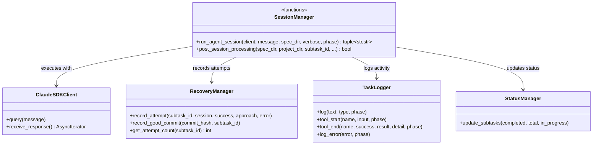

### run_agent_session

Runs a single agent session using the Claude Agent SDK.

```python
async def run_agent_session(
    client: ClaudeSDKClient,
    message: str,
    spec_dir: Path,
    verbose: bool = False,
    phase: LogPhase = LogPhase.CODING,
) -> tuple[str, str]
```

#### Response Stream Handling

```mermaid
flowchart TB
    subgraph Input
        Query[Send Query]
    end

    subgraph Stream["Response Stream"]
        Receive[Receive Message]
        CheckType{Message Type?}
    end

    subgraph AssistantMsg["AssistantMessage"]
        TextBlock[TextBlock - Print text]
        ToolBlock[ToolUseBlock - Log tool]
    end

    subgraph UserMsg["UserMessage"]
        ToolResult[ToolResultBlock]
        CheckBlocked{Blocked?}
        CheckError{Error?}
        LogSuccess[Log Success]
        LogError[Log Error]
        LogBlocked[Log Blocked]
    end

    subgraph Output
        CheckComplete{Build Complete?}
        ReturnComplete[Return "complete"]
        ReturnContinue[Return "continue"]
        ReturnError[Return "error"]
    end

    Query --> Receive
    Receive --> CheckType
    CheckType -->|AssistantMessage| TextBlock
    CheckType -->|AssistantMessage| ToolBlock
    CheckType -->|UserMessage| ToolResult
    ToolResult --> CheckBlocked
    CheckBlocked -->|Yes| LogBlocked
    CheckBlocked -->|No| CheckError
    CheckError -->|Yes| LogError
    CheckError -->|No| LogSuccess

    TextBlock --> Receive
    ToolBlock --> Receive
    LogSuccess --> Receive
    LogError --> Receive
    LogBlocked --> Receive

    Receive -->|Stream End| CheckComplete
    CheckComplete -->|Yes| ReturnComplete
    CheckComplete -->|No| ReturnContinue

    style Stream fill:#e3f2fd,stroke:#1976d2
    style AssistantMsg fill:#e8f5e9,stroke:#4caf50
    style UserMsg fill:#fff3e0,stroke:#f57c00
```

### post_session_processing

Processes session results and updates memory automatically.

```python
async def post_session_processing(
    spec_dir: Path,
    project_dir: Path,
    subtask_id: str,
    session_num: int,
    commit_before: str | None,
    commit_count_before: int,
    recovery_manager: RecoveryManager,
    linear_enabled: bool = False,
    status_manager: StatusManager | None = None,
    source_spec_dir: Path | None = None,
) -> bool
```

#### Post-Processing Flow

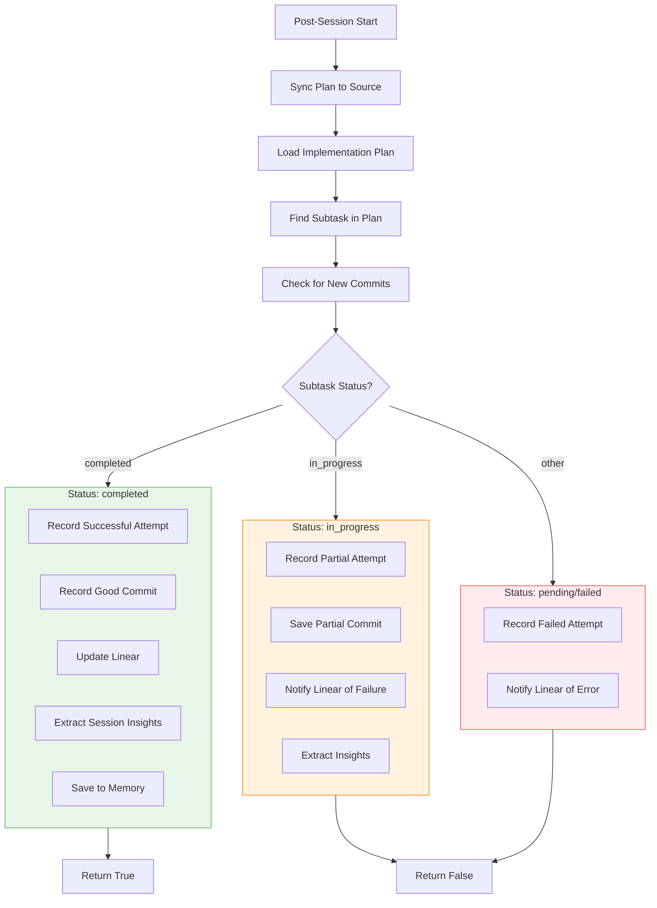

## Memory Manager

The memory manager (`memory_manager.py`) implements a dual-layer memory system for session persistence.

### Memory Architecture

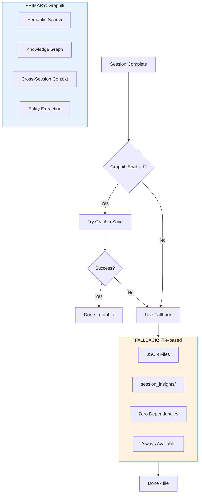

### Function: debug_memory_system_status

Prints memory system status for debugging (when `DEBUG=true`).

```python
def debug_memory_system_status() -> None
```

### Function: get_graphiti_context

Retrieves relevant context from Graphiti for the current subtask.

```python
async def get_graphiti_context(
    spec_dir: Path,
    project_dir: Path,
    subtask: dict,
) -> str | None
```

#### Context Retrieval Flow

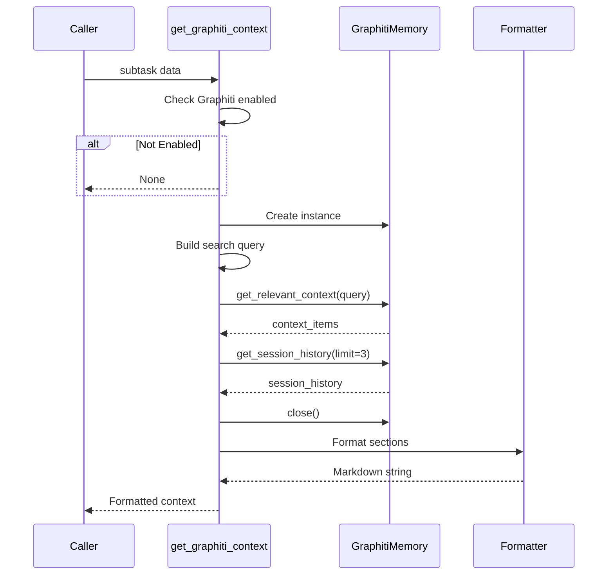

### Function: save_session_memory

Saves session insights using the dual-layer approach.

```python
async def save_session_memory(
    spec_dir: Path,
    project_dir: Path,
    subtask_id: str,
    session_num: int,
    success: bool,
    subtasks_completed: list[str],
    discoveries: dict | None = None,
) -> tuple[bool, str]
```

#### Return Values

| Storage Type | Description |
|--------------|-------------|
| `("graphiti", True)` | Successfully saved to Graphiti |
| `("file", True)` | Successfully saved to file-based storage |
| `("none", False)` | Both storage methods failed |

### Insights Structure

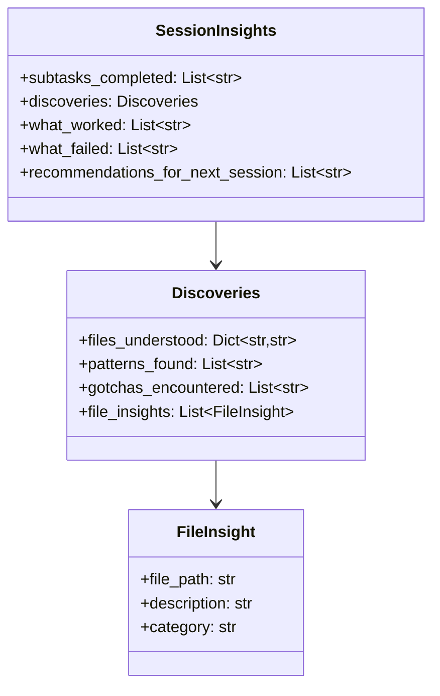

## Utils Module

The utils module (`utils.py`) provides helper functions for git operations and plan management.

### Function Overview

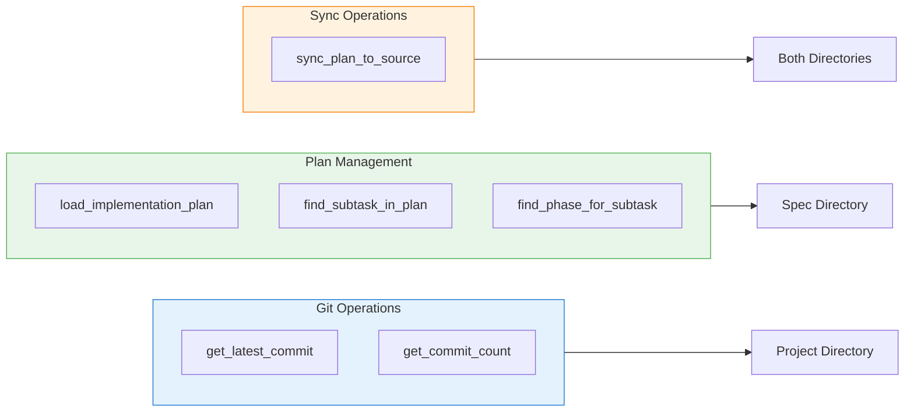

### Git Operations

#### get_latest_commit

```python
def get_latest_commit(project_dir: Path) -> str | None
```

Returns the hash of the latest git commit, or `None` if unavailable.

#### get_commit_count

```python
def get_commit_count(project_dir: Path) -> int
```

Returns the total number of commits in the repository.

### Plan Management

#### load_implementation_plan

```python
def load_implementation_plan(spec_dir: Path) -> dict | None
```

Loads and parses the `implementation_plan.json` file.

#### find_subtask_in_plan

```python
def find_subtask_in_plan(plan: dict, subtask_id: str) -> dict | None
```

Finds a subtask by ID in the plan, searching all phases.

#### find_phase_for_subtask

```python
def find_phase_for_subtask(plan: dict, subtask_id: str) -> dict | None
```

Returns the phase containing the specified subtask.

### Sync Operations

#### sync_plan_to_source

```python
def sync_plan_to_source(spec_dir: Path, source_spec_dir: Path | None) -> bool
```

Syncs `implementation_plan.json` from worktree back to main project.

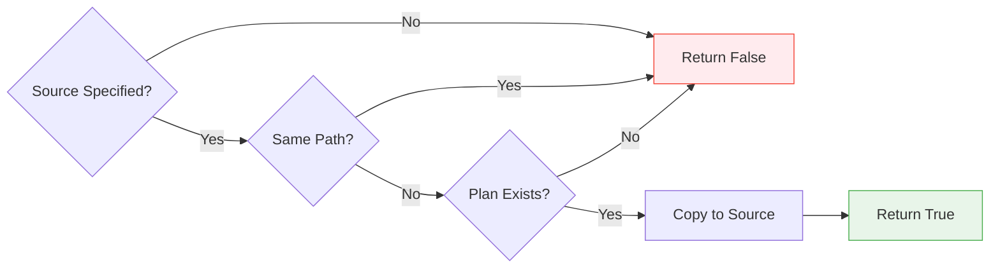

## Lazy Import Pattern

The `__init__.py` uses Python's `__getattr__` for lazy imports to avoid circular dependencies:

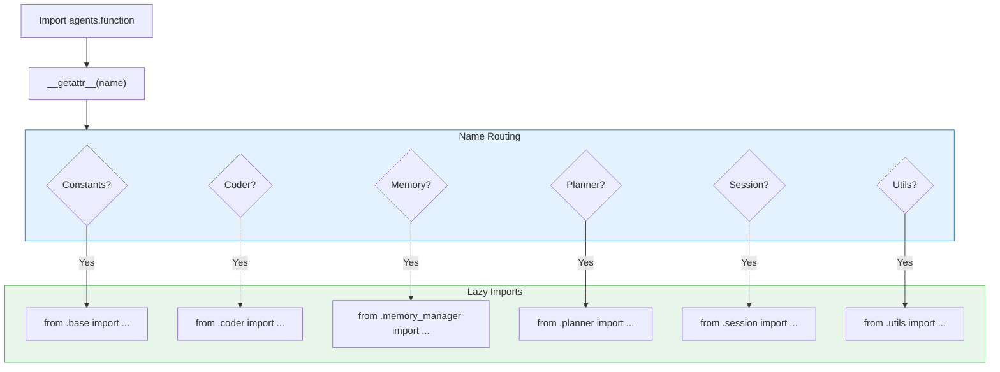

### Exported API

| Category | Functions |
|----------|-----------|
| **Main API** | `run_autonomous_agent`, `run_followup_planner` |
| **Memory** | `debug_memory_system_status`, `get_graphiti_context`, `save_session_memory`, `save_session_to_graphiti` |
| **Session** | `run_agent_session`, `post_session_processing` |
| **Utils** | `get_latest_commit`, `get_commit_count`, `load_implementation_plan`, `find_subtask_in_plan`, `find_phase_for_subtask`, `sync_plan_to_source` |
| **Constants** | `AUTO_CONTINUE_DELAY_SECONDS`, `HUMAN_INTERVENTION_FILE` |

## Integration Points

### External Dependencies

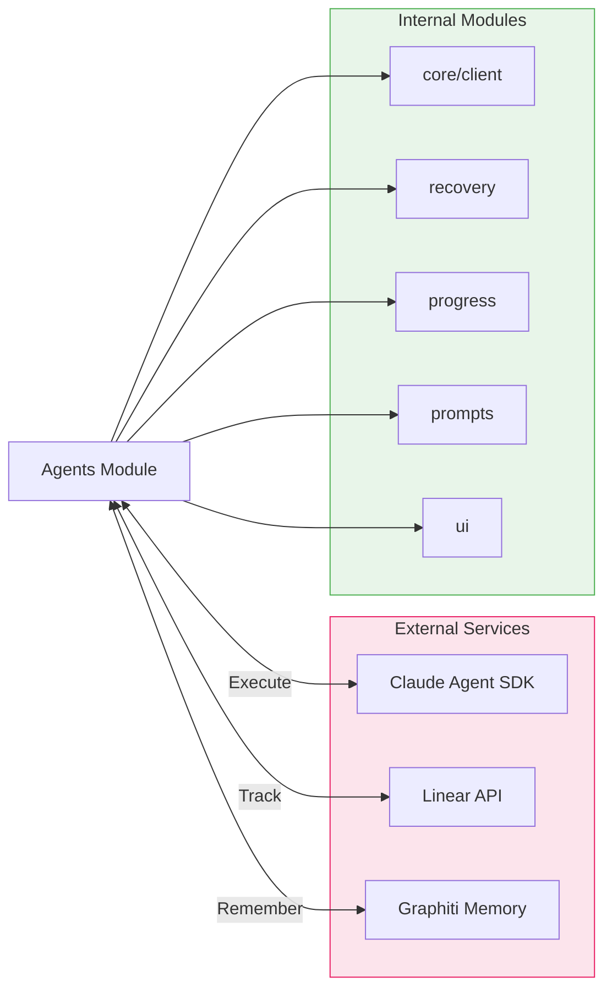

### Key Dependencies

| Module | Purpose |
|--------|---------|
| `claude_agent_sdk` | AI agent execution |
| `linear_updater` | Task progress tracking |
| `graphiti_memory` | Cross-session memory |
| `recovery` | Attempt tracking and rollback |
| `progress` | Build status tracking |
| `prompt_generator` | Dynamic prompt creation |
| `ui` | Status display and formatting |

## Error Handling

### Recovery Strategy

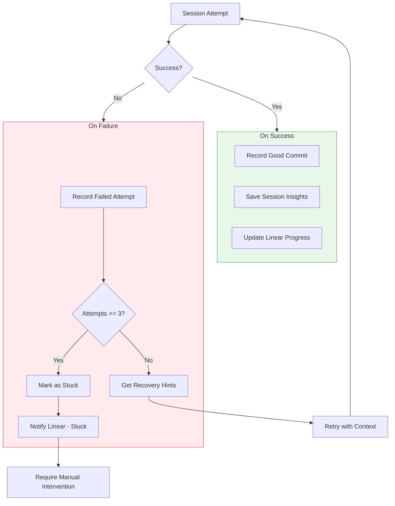

### Error States

| State | Trigger | Action |
|-------|---------|--------|
| **continue** | Session completed normally | Auto-continue to next subtask |
| **complete** | All subtasks done | Print banner, exit loop |
| **error** | Exception during session | Log error, retry with fresh session |
| **stuck** | 3+ failed attempts | Mark subtask as stuck, notify user |

## Performance Considerations

| Aspect | Implementation |
|--------|----------------|
| **Lazy Imports** | `__getattr__` pattern avoids loading unused modules |
| **Streaming Output** | Real-time display of agent responses |
| **Memory Fallback** | File-based storage when Graphiti unavailable |
| **Worktree Sync** | Efficient plan synchronization for isolated builds |

## Next Steps

- [Session Module](./session.md) - Detailed session management documentation
- [Memory System](./memory.md) - Memory architecture deep dive
- [Recovery Module](./recovery.md) - Error recovery and rollback
- [Custom Tools](./tools.md) - MCP tools for agent operations
