# Analysis Module

The analysis module provides comprehensive code analysis, project scanning, and risk assessment capabilities for Auto-Claude. It automatically detects project structure, frameworks, services, and potential security issues.

## Module Overview

The analysis module is organized into focused submodules with clear responsibilities:

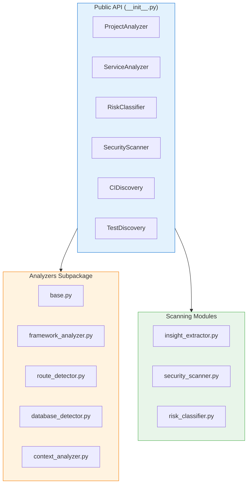
```mermaid
flowchart TB
    subgraph Public["Public API (__init__.py)"]
        ProjectAnalyzer[ProjectAnalyzer]
        ServiceAnalyzer[ServiceAnalyzer]
        RiskClassifier[RiskClassifier]
        SecurityScanner[SecurityScanner]
        CIDiscovery[CIDiscovery]
        TestDiscovery[TestDiscovery]
    end

    subgraph Analyzers["Analyzers Subpackage"]
        Base[base.py]
        FrameworkAnalyzer[framework_analyzer.py]
        RouteDetector[route_detector.py]
        DatabaseDetector[database_detector.py]
        ContextAnalyzer[context_analyzer.py]
    end

    subgraph Scanners["Scanning Modules"]
        InsightExtractor[insight_extractor.py]
        SecScan[security_scanner.py]
        RiskClass[risk_classifier.py]
    end

    Public --> Analyzers
    Public --> Scanners

    style Public fill:#e3f2fd,stroke:#1976d2
    style Analyzers fill:#fff3e0,stroke:#f57c00
    style Scanners fill:#e8f5e9,stroke:#4caf50
```

## Module Structure

```
apps/backend/analysis/
├── __init__.py              # Public API exports
├── analyzer.py              # Facade to modular analyzer system
├── project_analyzer.py      # Security profile analyzer
├── risk_classifier.py       # Risk assessment from complexity analysis
├── security_scanner.py      # Consolidated security scanning
├── insight_extractor.py     # Session insight extraction
├── ci_discovery.py          # CI/CD configuration parsing
├── test_discovery.py        # Test framework detection
└── analyzers/               # Modular analyzer subpackage
    ├── __init__.py          # Subpackage exports
    ├── base.py              # Base analyzer and constants
    ├── project_analyzer_module.py  # Project analysis
    ├── service_analyzer.py  # Service analysis
    ├── framework_analyzer.py # Framework detection
    ├── route_detector.py    # API route detection
    ├── database_detector.py # Database model detection
    ├── context_analyzer.py  # Context extraction
    ├── port_detector.py     # Port detection
    └── context/             # Context-specific detectors
        ├── api_docs_detector.py
        ├── auth_detector.py
        ├── env_detector.py
        ├── jobs_detector.py
        ├── migrations_detector.py
        ├── monitoring_detector.py
        └── services_detector.py
```

## Class Diagram

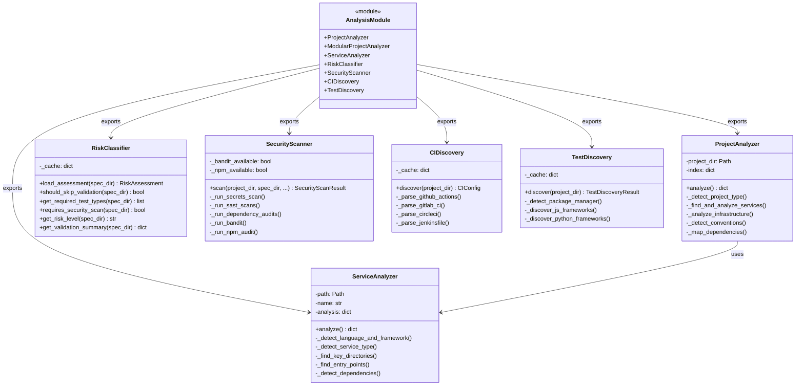
```mermaid
classDiagram
    class AnalysisModule {
        <<module>>
        +ProjectAnalyzer
        +ModularProjectAnalyzer
        +ServiceAnalyzer
        +RiskClassifier
        +SecurityScanner
        +CIDiscovery
        +TestDiscovery
    }

    class ProjectAnalyzer {
        -project_dir: Path
        -index: dict
        +analyze() dict
        -_detect_project_type()
        -_find_and_analyze_services()
        -_analyze_infrastructure()
        -_detect_conventions()
        -_map_dependencies()
    }

    class ServiceAnalyzer {
        -path: Path
        -name: str
        -analysis: dict
        +analyze() dict
        -_detect_language_and_framework()
        -_detect_service_type()
        -_find_key_directories()
        -_find_entry_points()
        -_detect_dependencies()
    }

    class RiskClassifier {
        -_cache: dict
        +load_assessment(spec_dir) RiskAssessment
        +should_skip_validation(spec_dir) bool
        +get_required_test_types(spec_dir) list
        +requires_security_scan(spec_dir) bool
        +get_risk_level(spec_dir) str
        +get_validation_summary(spec_dir) dict
    }

    class SecurityScanner {
        -_bandit_available: bool
        -_npm_available: bool
        +scan(project_dir, spec_dir, ...) SecurityScanResult
        -_run_secrets_scan()
        -_run_sast_scans()
        -_run_dependency_audits()
        -_run_bandit()
        -_run_npm_audit()
    }

    class CIDiscovery {
        -_cache: dict
        +discover(project_dir) CIConfig
        -_parse_github_actions()
        -_parse_gitlab_ci()
        -_parse_circleci()
        -_parse_jenkinsfile()
    }

    class TestDiscovery {
        -_cache: dict
        +discover(project_dir) TestDiscoveryResult
        -_detect_package_manager()
        -_discover_js_frameworks()
        -_discover_python_frameworks()
    }

    AnalysisModule --> ProjectAnalyzer : exports
    AnalysisModule --> ServiceAnalyzer : exports
    AnalysisModule --> RiskClassifier : exports
    AnalysisModule --> SecurityScanner : exports
    AnalysisModule --> CIDiscovery : exports
    AnalysisModule --> TestDiscovery : exports
    ProjectAnalyzer --> ServiceAnalyzer : uses
```

## Project Analyzer

The `ProjectAnalyzer` class analyzes entire projects, detecting monorepo structures, services, infrastructure, and conventions.

### Architecture

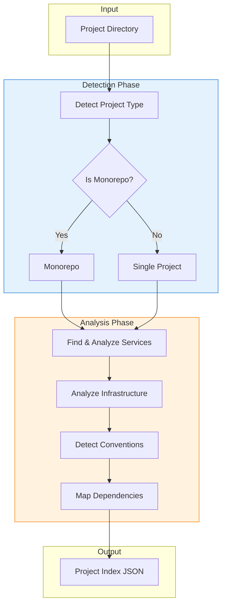
```mermaid
flowchart TB
    subgraph Input
        ProjectDir[Project Directory]
    end

    subgraph Detection["Detection Phase"]
        DetectType[Detect Project Type]
        IsMonorepo{Is Monorepo?}
        Single[Single Project]
        Monorepo[Monorepo]
    end

    subgraph Analysis["Analysis Phase"]
        FindServices[Find & Analyze Services]
        AnalyzeInfra[Analyze Infrastructure]
        DetectConventions[Detect Conventions]
        MapDeps[Map Dependencies]
    end

    subgraph Output
        ProjectIndex[Project Index JSON]
    end

    ProjectDir --> DetectType
    DetectType --> IsMonorepo
    IsMonorepo -->|Yes| Monorepo
    IsMonorepo -->|No| Single
    Monorepo --> FindServices
    Single --> FindServices
    FindServices --> AnalyzeInfra
    AnalyzeInfra --> DetectConventions
    DetectConventions --> MapDeps
    MapDeps --> ProjectIndex

    style Detection fill:#e3f2fd,stroke:#1976d2
    style Analysis fill:#fff3e0,stroke:#f57c00
```

### Monorepo Detection

The analyzer detects monorepos through multiple indicators:

| Indicator | Detection Method |
|-----------|------------------|
| **Tool Configuration** | `pnpm-workspace.yaml`, `lerna.json`, `nx.json`, `turbo.json`, `rush.json` |
| **Directory Structure** | `packages/` or `apps/` directories |
| **Multiple Services** | 2+ directories with service root files |

### Service Root Files

Files that indicate a service/package root:

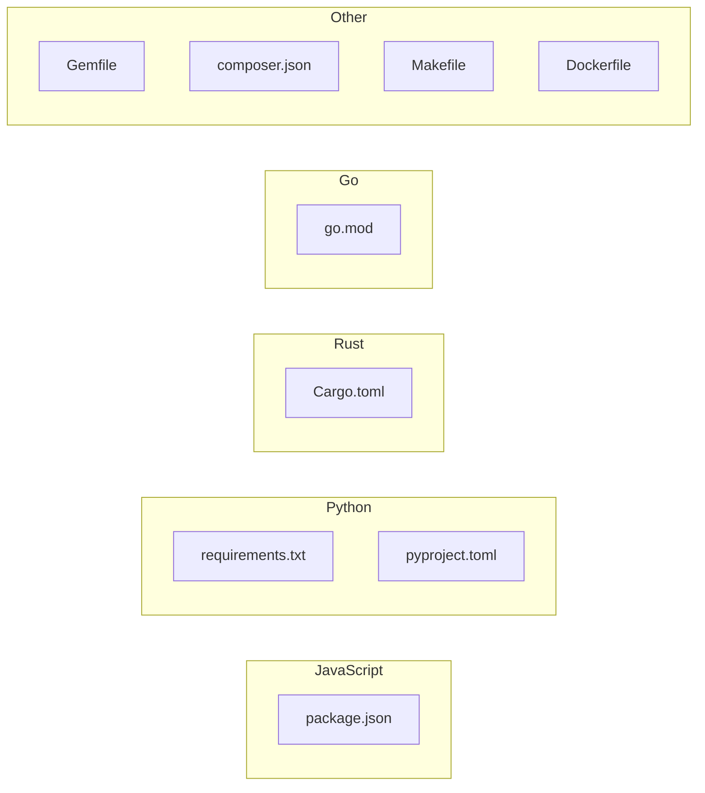
```mermaid
flowchart LR
    subgraph JavaScript
        PackageJSON[package.json]
    end

    subgraph Python
        Requirements[requirements.txt]
        Pyproject[pyproject.toml]
    end

    subgraph Rust
        CargoToml[Cargo.toml]
    end

    subgraph Go
        GoMod[go.mod]
    end

    subgraph Other
        Gemfile[Gemfile]
        ComposerJSON[composer.json]
        Makefile[Makefile]
        Dockerfile[Dockerfile]
    end
```

### Infrastructure Analysis

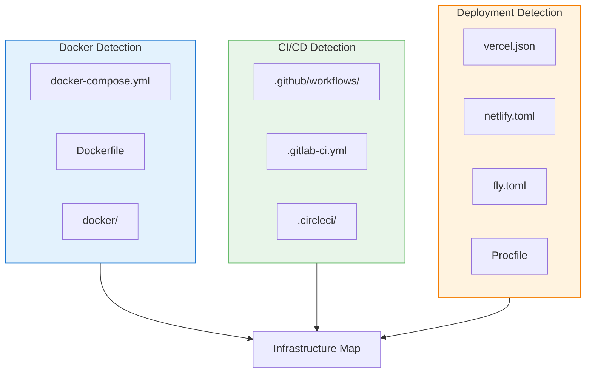
```mermaid
flowchart TB
    subgraph Docker["Docker Detection"]
        Compose[docker-compose.yml]
        Dockerfile[Dockerfile]
        DockerDir[docker/]
    end

    subgraph CI["CI/CD Detection"]
        GHA[.github/workflows/]
        GitLab[.gitlab-ci.yml]
        CircleCI[.circleci/]
    end

    subgraph Deploy["Deployment Detection"]
        Vercel[vercel.json]
        Netlify[netlify.toml]
        Fly[fly.toml]
        Heroku[Procfile]
    end

    Docker --> Infrastructure[Infrastructure Map]
    CI --> Infrastructure
    Deploy --> Infrastructure

    style Docker fill:#e3f2fd,stroke:#1976d2
    style CI fill:#e8f5e9,stroke:#4caf50
    style Deploy fill:#fff3e0,stroke:#f57c00
```

## Service Analyzer

The `ServiceAnalyzer` class performs detailed analysis of individual services or packages.

### Analysis Flow

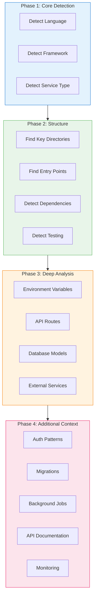
```mermaid
flowchart TB
    subgraph Phase1["Phase 1: Core Detection"]
        Lang[Detect Language]
        Framework[Detect Framework]
        Type[Detect Service Type]
    end

    subgraph Phase2["Phase 2: Structure"]
        KeyDirs[Find Key Directories]
        EntryPoints[Find Entry Points]
        Deps[Detect Dependencies]
        Testing[Detect Testing]
    end

    subgraph Phase3["Phase 3: Deep Analysis"]
        EnvVars[Environment Variables]
        Routes[API Routes]
        Models[Database Models]
        ExtServices[External Services]
    end

    subgraph Phase4["Phase 4: Additional Context"]
        Auth[Auth Patterns]
        Migrations[Migrations]
        Jobs[Background Jobs]
        APIDocs[API Documentation]
        Monitoring[Monitoring]
    end

    Phase1 --> Phase2
    Phase2 --> Phase3
    Phase3 --> Phase4

    style Phase1 fill:#e3f2fd,stroke:#1976d2
    style Phase2 fill:#e8f5e9,stroke:#4caf50
    style Phase3 fill:#fff3e0,stroke:#f57c00
    style Phase4 fill:#fce4ec,stroke:#e91e63
```

### Service Type Detection

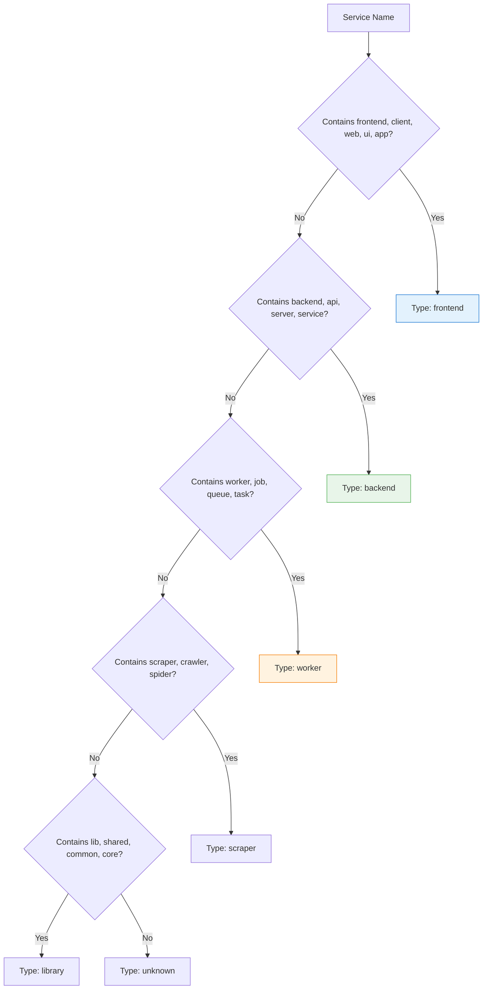
```mermaid
flowchart TB
    Start[Service Name]

    CheckFrontend{Contains frontend, client, web, ui, app?}
    CheckBackend{Contains backend, api, server, service?}
    CheckWorker{Contains worker, job, queue, task?}
    CheckScraper{Contains scraper, crawler, spider?}
    CheckLib{Contains lib, shared, common, core?}

    FrontendType[Type: frontend]
    BackendType[Type: backend]
    WorkerType[Type: worker]
    ScraperType[Type: scraper]
    LibraryType[Type: library]
    Unknown[Type: unknown]

    Start --> CheckFrontend
    CheckFrontend -->|Yes| FrontendType
    CheckFrontend -->|No| CheckBackend
    CheckBackend -->|Yes| BackendType
    CheckBackend -->|No| CheckWorker
    CheckWorker -->|Yes| WorkerType
    CheckWorker -->|No| CheckScraper
    CheckScraper -->|Yes| ScraperType
    CheckScraper -->|No| CheckLib
    CheckLib -->|Yes| LibraryType
    CheckLib -->|No| Unknown

    style FrontendType fill:#e3f2fd,stroke:#1976d2
    style BackendType fill:#e8f5e9,stroke:#4caf50
    style WorkerType fill:#fff3e0,stroke:#f57c00
```

### Integrated Analyzers

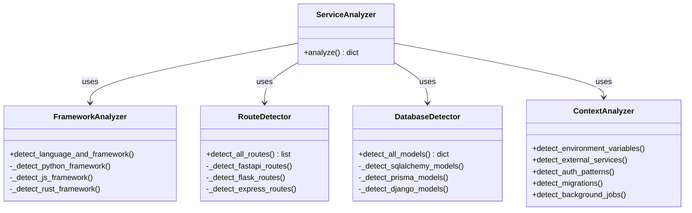
```mermaid
classDiagram
    class ServiceAnalyzer {
        +analyze() dict
    }

    class FrameworkAnalyzer {
        +detect_language_and_framework()
        -_detect_python_framework()
        -_detect_js_framework()
        -_detect_rust_framework()
    }

    class RouteDetector {
        +detect_all_routes() list
        -_detect_fastapi_routes()
        -_detect_flask_routes()
        -_detect_express_routes()
    }

    class DatabaseDetector {
        +detect_all_models() dict
        -_detect_sqlalchemy_models()
        -_detect_prisma_models()
        -_detect_django_models()
    }

    class ContextAnalyzer {
        +detect_environment_variables()
        +detect_external_services()
        +detect_auth_patterns()
        +detect_migrations()
        +detect_background_jobs()
    }

    ServiceAnalyzer --> FrameworkAnalyzer : uses
    ServiceAnalyzer --> RouteDetector : uses
    ServiceAnalyzer --> DatabaseDetector : uses
    ServiceAnalyzer --> ContextAnalyzer : uses
```

## Risk Classifier

The `RiskClassifier` reads AI-generated complexity assessments and provides programmatic access to risk classification and validation recommendations.

### Data Model

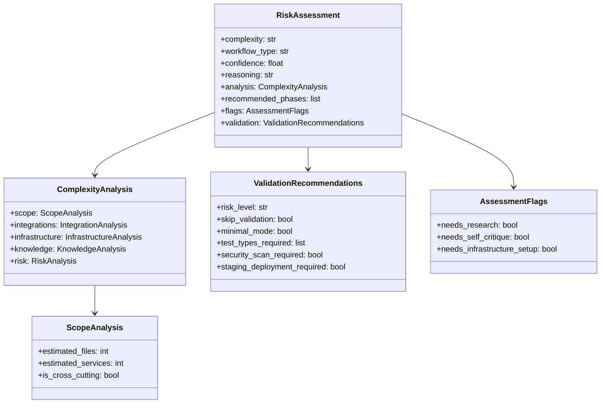
```mermaid
classDiagram
    class RiskAssessment {
        +complexity: str
        +workflow_type: str
        +confidence: float
        +reasoning: str
        +analysis: ComplexityAnalysis
        +recommended_phases: list
        +flags: AssessmentFlags
        +validation: ValidationRecommendations
    }

    class ComplexityAnalysis {
        +scope: ScopeAnalysis
        +integrations: IntegrationAnalysis
        +infrastructure: InfrastructureAnalysis
        +knowledge: KnowledgeAnalysis
        +risk: RiskAnalysis
    }

    class ValidationRecommendations {
        +risk_level: str
        +skip_validation: bool
        +minimal_mode: bool
        +test_types_required: list
        +security_scan_required: bool
        +staging_deployment_required: bool
    }

    class ScopeAnalysis {
        +estimated_files: int
        +estimated_services: int
        +is_cross_cutting: bool
    }

    class AssessmentFlags {
        +needs_research: bool
        +needs_self_critique: bool
        +needs_infrastructure_setup: bool
    }

    RiskAssessment --> ComplexityAnalysis
    RiskAssessment --> AssessmentFlags
    RiskAssessment --> ValidationRecommendations
    ComplexityAnalysis --> ScopeAnalysis
```

### Risk Assessment Flow

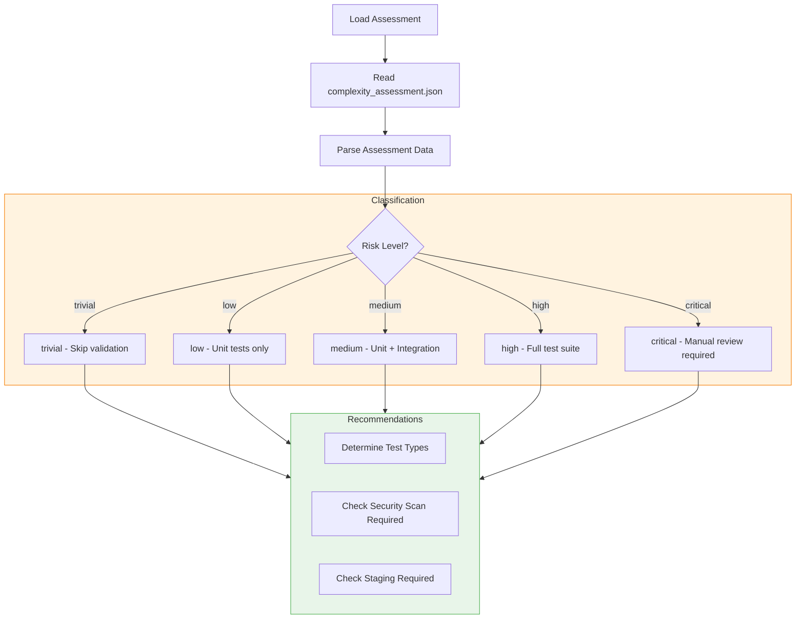
```mermaid
flowchart TB
    Start[Load Assessment]
    LoadJSON[Read complexity_assessment.json]
    Parse[Parse Assessment Data]

    subgraph Classification
        CheckRisk{Risk Level?}
        Trivial[trivial - Skip validation]
        Low[low - Unit tests only]
        Medium[medium - Unit + Integration]
        High[high - Full test suite]
        Critical[critical - Manual review required]
    end

    subgraph Recommendations
        TestTypes[Determine Test Types]
        SecurityScan[Check Security Scan Required]
        Staging[Check Staging Required]
    end

    Start --> LoadJSON
    LoadJSON --> Parse
    Parse --> CheckRisk
    CheckRisk -->|trivial| Trivial
    CheckRisk -->|low| Low
    CheckRisk -->|medium| Medium
    CheckRisk -->|high| High
    CheckRisk -->|critical| Critical

    Trivial --> Recommendations
    Low --> Recommendations
    Medium --> Recommendations
    High --> Recommendations
    Critical --> Recommendations

    style Classification fill:#fff3e0,stroke:#f57c00
    style Recommendations fill:#e8f5e9,stroke:#4caf50
```

### Key Methods

| Method | Purpose |
|--------|---------|
| `load_assessment(spec_dir)` | Load and parse complexity_assessment.json |
| `should_skip_validation(spec_dir)` | Check if validation can be skipped |
| `get_required_test_types(spec_dir)` | Get list of required test types |
| `requires_security_scan(spec_dir)` | Check if security scanning is needed |
| `get_risk_level(spec_dir)` | Get the task risk level |
| `get_validation_summary(spec_dir)` | Get complete validation summary |

### Validation Inference

When explicit validation recommendations aren't provided, the classifier infers them from the complexity analysis:

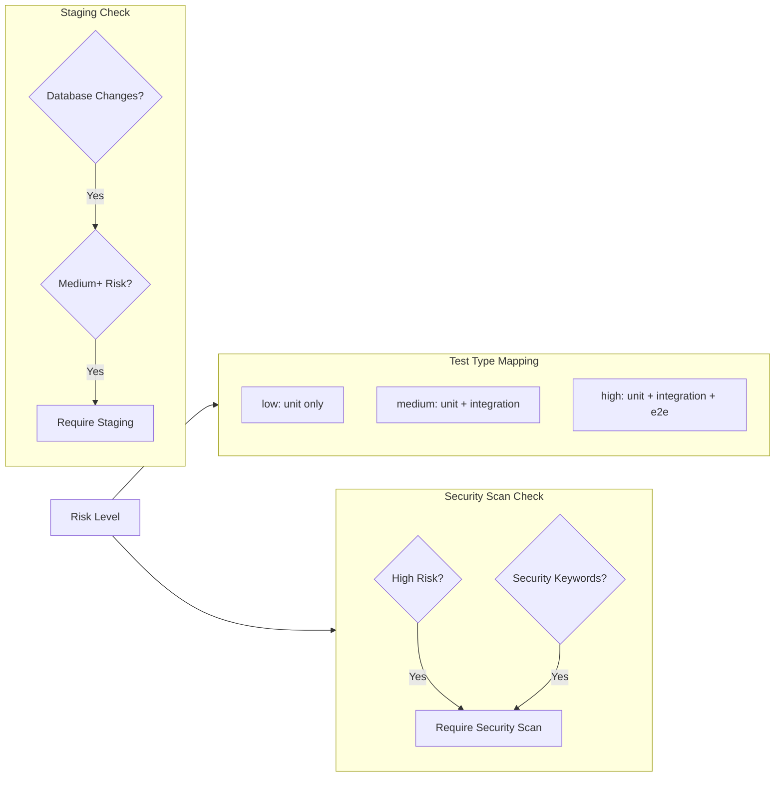
```mermaid
flowchart LR
    RiskLevel[Risk Level]

    subgraph TestMapping["Test Type Mapping"]
        LowRisk[low: unit only]
        MediumRisk[medium: unit + integration]
        HighRisk[high: unit + integration + e2e]
    end

    subgraph SecurityCheck["Security Scan Check"]
        HighLevel{High Risk?}
        SecurityKeywords{Security Keywords?}
        RequireScan[Require Security Scan]
    end

    subgraph StagingCheck["Staging Check"]
        DBChanges{Database Changes?}
        MedOrHigh{Medium+ Risk?}
        RequireStaging[Require Staging]
    end

    RiskLevel --> TestMapping
    RiskLevel --> SecurityCheck
    HighLevel -->|Yes| RequireScan
    SecurityKeywords -->|Yes| RequireScan
    DBChanges -->|Yes| MedOrHigh
    MedOrHigh -->|Yes| RequireStaging
```

## Security Scanner

The `SecurityScanner` consolidates all security scanning operations including secrets detection and SAST tools.

### Scanner Architecture

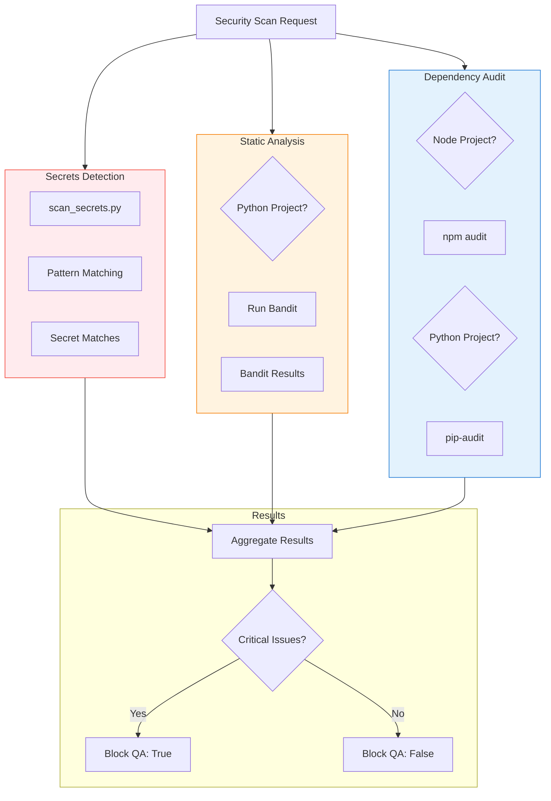
```mermaid
flowchart TB
    Start[Security Scan Request]

    subgraph Secrets["Secrets Detection"]
        ScanSecrets[scan_secrets.py]
        PatternMatch[Pattern Matching]
        SecretMatches[Secret Matches]
    end

    subgraph SAST["Static Analysis"]
        CheckPython{Python Project?}
        RunBandit[Run Bandit]
        BanditResults[Bandit Results]
    end

    subgraph DependencyAudit["Dependency Audit"]
        CheckNode{Node Project?}
        RunNPMAudit[npm audit]
        CheckPyDeps{Python Project?}
        RunPipAudit[pip-audit]
    end

    subgraph Results
        Aggregate[Aggregate Results]
        DetermineCritical{Critical Issues?}
        BlockQA[Block QA: True]
        AllowQA[Block QA: False]
    end

    Start --> Secrets
    Start --> SAST
    Start --> DependencyAudit

    Secrets --> Aggregate
    SAST --> Aggregate
    DependencyAudit --> Aggregate

    Aggregate --> DetermineCritical
    DetermineCritical -->|Yes| BlockQA
    DetermineCritical -->|No| AllowQA

    style Secrets fill:#ffebee,stroke:#f44336
    style SAST fill:#fff3e0,stroke:#f57c00
    style DependencyAudit fill:#e3f2fd,stroke:#1976d2
```

### Security Scan Result

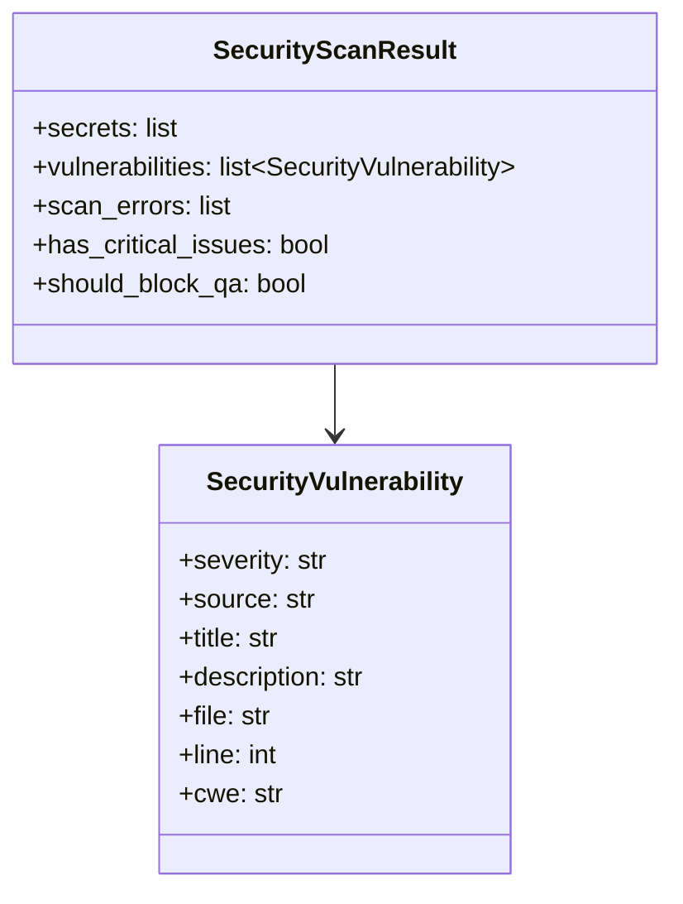
```mermaid
classDiagram
    class SecurityScanResult {
        +secrets: list
        +vulnerabilities: list~SecurityVulnerability~
        +scan_errors: list
        +has_critical_issues: bool
        +should_block_qa: bool
    }

    class SecurityVulnerability {
        +severity: str
        +source: str
        +title: str
        +description: str
        +file: str
        +line: int
        +cwe: str
    }

    SecurityScanResult --> SecurityVulnerability
```

### Severity Levels

| Severity | QA Impact | Examples |
|----------|-----------|----------|
| **critical** | Blocks QA | Exposed secrets, critical CVEs |
| **high** | Warning, review needed | High-severity vulnerabilities |
| **medium** | Noted in report | Moderate security issues |
| **low** | Informational | Minor concerns |
| **info** | Logged only | Informational findings |

### Integrated Scanners

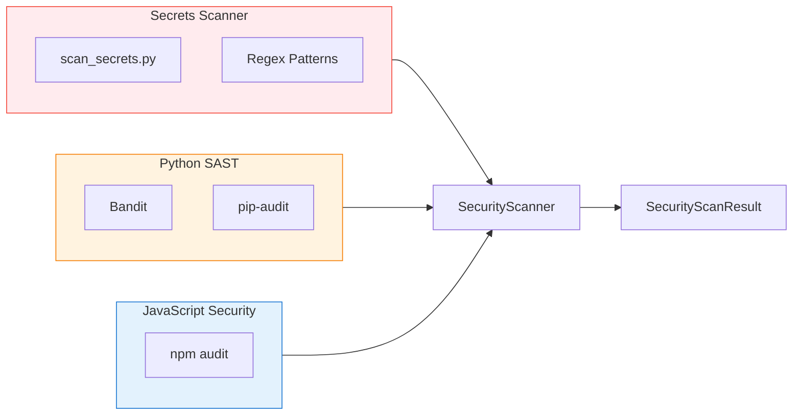
```mermaid
flowchart LR
    subgraph Secrets["Secrets Scanner"]
        ScanSecrets[scan_secrets.py]
        Patterns[Regex Patterns]
    end

    subgraph Python["Python SAST"]
        Bandit[Bandit]
        PipAudit[pip-audit]
    end

    subgraph JavaScript["JavaScript Security"]
        NPMAudit[npm audit]
    end

    Secrets --> SecurityScanner
    Python --> SecurityScanner
    JavaScript --> SecurityScanner
    SecurityScanner --> Results[SecurityScanResult]

    style Secrets fill:#ffebee,stroke:#f44336
    style Python fill:#fff3e0,stroke:#f57c00
    style JavaScript fill:#e3f2fd,stroke:#1976d2
```

## Insight Extractor

The insight extractor automatically extracts structured insights from completed coding sessions for the Graphiti memory system.

### Extraction Flow

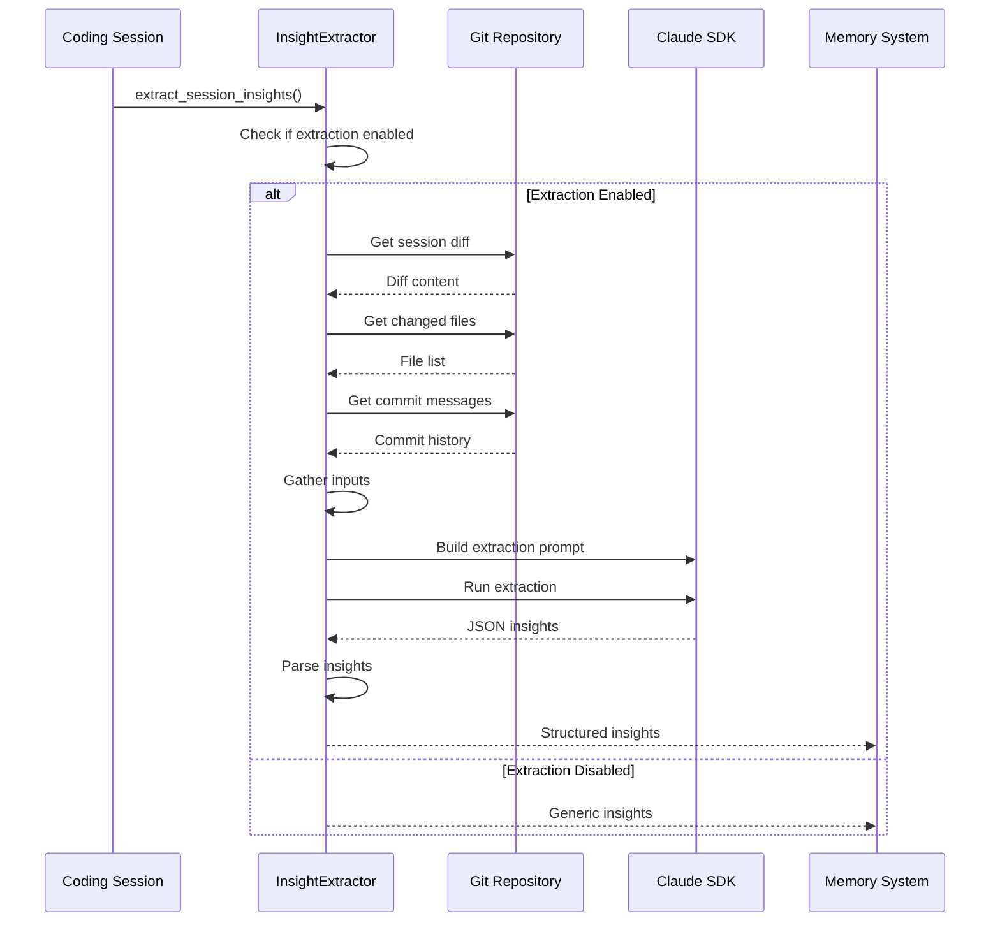
```mermaid
sequenceDiagram
    participant Session as Coding Session
    participant Extractor as InsightExtractor
    participant Git as Git Repository
    participant Claude as Claude SDK
    participant Memory as Memory System

    Session->>Extractor: extract_session_insights()
    Extractor->>Extractor: Check if extraction enabled

    alt Extraction Enabled
        Extractor->>Git: Get session diff
        Git-->>Extractor: Diff content
        Extractor->>Git: Get changed files
        Git-->>Extractor: File list
        Extractor->>Git: Get commit messages
        Git-->>Extractor: Commit history

        Extractor->>Extractor: Gather inputs
        Extractor->>Claude: Build extraction prompt
        Extractor->>Claude: Run extraction
        Claude-->>Extractor: JSON insights

        Extractor->>Extractor: Parse insights
        Extractor-->>Memory: Structured insights
    else Extraction Disabled
        Extractor-->>Memory: Generic insights
    end
```

### Insights Structure

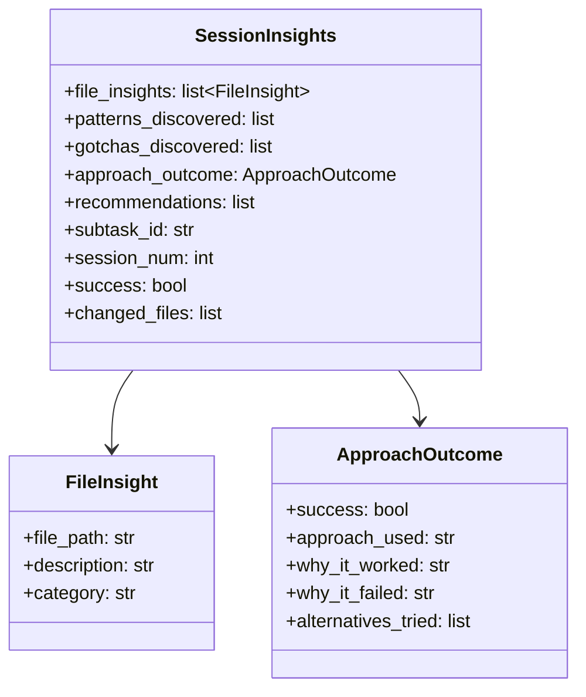
```mermaid
classDiagram
    class SessionInsights {
        +file_insights: list~FileInsight~
        +patterns_discovered: list
        +gotchas_discovered: list
        +approach_outcome: ApproachOutcome
        +recommendations: list
        +subtask_id: str
        +session_num: int
        +success: bool
        +changed_files: list
    }

    class FileInsight {
        +file_path: str
        +description: str
        +category: str
    }

    class ApproachOutcome {
        +success: bool
        +approach_used: str
        +why_it_worked: str
        +why_it_failed: str
        +alternatives_tried: list
    }

    SessionInsights --> FileInsight
    SessionInsights --> ApproachOutcome
```

### Configuration

| Environment Variable | Default | Description |
|---------------------|---------|-------------|
| `INSIGHT_EXTRACTION_ENABLED` | `true` | Enable/disable extraction |
| `INSIGHT_EXTRACTOR_MODEL` | `claude-3-5-haiku-latest` | Model for extraction |

### Extraction Limits

| Limit | Value | Purpose |
|-------|-------|---------|
| `MAX_DIFF_CHARS` | 15000 | Avoid context limits |
| `MAX_ATTEMPTS_TO_INCLUDE` | 3 | Limit history size |

## CI Discovery

The `CIDiscovery` module parses CI/CD configuration files to extract test commands and workflows.

### Supported CI Systems

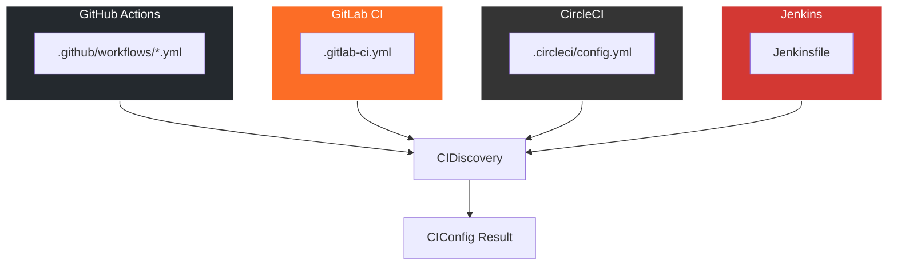
```mermaid
flowchart TB
    subgraph GitHub["GitHub Actions"]
        GHWorkflows[.github/workflows/*.yml]
    end

    subgraph GitLab["GitLab CI"]
        GLConfig[.gitlab-ci.yml]
    end

    subgraph CircleCI["CircleCI"]
        CCConfig[.circleci/config.yml]
    end

    subgraph Jenkins["Jenkins"]
        JFile[Jenkinsfile]
    end

    GitHub --> CIDiscovery
    GitLab --> CIDiscovery
    CircleCI --> CIDiscovery
    Jenkins --> CIDiscovery
    CIDiscovery --> CIConfig[CIConfig Result]

    style GitHub fill:#24292e,stroke:#fff,color:#fff
    style GitLab fill:#fc6d26,stroke:#fff,color:#fff
    style CircleCI fill:#343434,stroke:#fff,color:#fff
    style Jenkins fill:#d33833,stroke:#fff,color:#fff
```

### CI Configuration Model

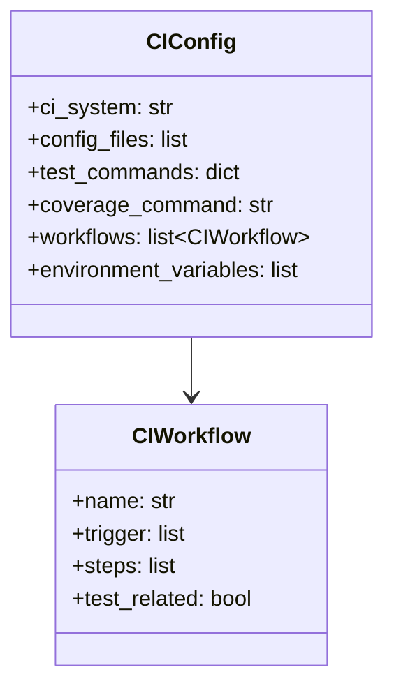
```mermaid
classDiagram
    class CIConfig {
        +ci_system: str
        +config_files: list
        +test_commands: dict
        +coverage_command: str
        +workflows: list~CIWorkflow~
        +environment_variables: list
    }

    class CIWorkflow {
        +name: str
        +trigger: list
        +steps: list
        +test_related: bool
    }

    CIConfig --> CIWorkflow
```

### Test Command Extraction

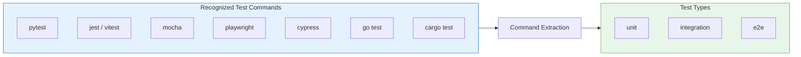
```mermaid
flowchart LR
    subgraph Commands["Recognized Test Commands"]
        Pytest[pytest]
        Jest[jest / vitest]
        Mocha[mocha]
        Playwright[playwright]
        Cypress[cypress]
        GoTest[go test]
        CargoTest[cargo test]
    end

    subgraph Types["Test Types"]
        Unit[unit]
        Integration[integration]
        E2E[e2e]
    end

    Commands --> Extraction[Command Extraction]
    Extraction --> Types

    style Commands fill:#e3f2fd,stroke:#1976d2
    style Types fill:#e8f5e9,stroke:#4caf50
```

## Test Discovery

The `TestDiscovery` module detects test frameworks, commands, and directories in a project.

### Framework Detection

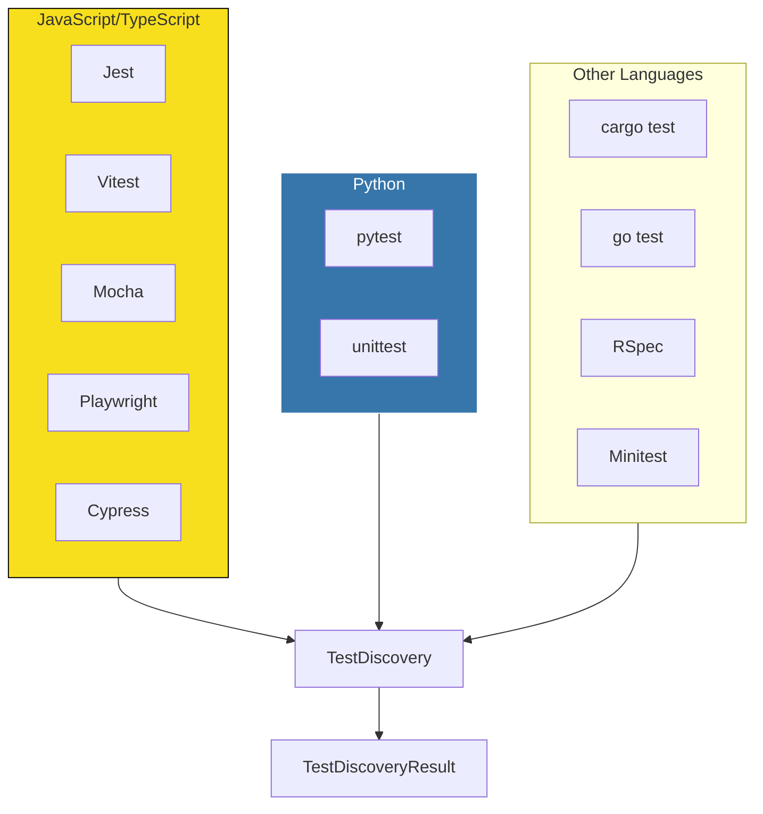
```mermaid
flowchart TB
    subgraph JavaScript["JavaScript/TypeScript"]
        Jest[Jest]
        Vitest[Vitest]
        Mocha[Mocha]
        Playwright[Playwright]
        Cypress[Cypress]
    end

    subgraph Python["Python"]
        Pytest[pytest]
        Unittest[unittest]
    end

    subgraph Other["Other Languages"]
        CargoTest[cargo test]
        GoTest[go test]
        RSpec[RSpec]
        Minitest[Minitest]
    end

    JavaScript --> TestDiscovery
    Python --> TestDiscovery
    Other --> TestDiscovery
    TestDiscovery --> Result[TestDiscoveryResult]

    style JavaScript fill:#f7df1e,stroke:#000
    style Python fill:#3776ab,stroke:#fff,color:#fff
```

### Discovery Process

```mermaid
flowchart TB
    Start[Start Discovery]

    subgraph PackageManager["Package Manager Detection"]
        CheckPnpm{pnpm-lock.yaml?}
        CheckYarn{yarn.lock?}
        CheckNpm{package-lock.json?}
        CheckPoetry{poetry.lock?}
        CheckCargo{Cargo.lock?}
    end

    subgraph Frameworks["Framework Detection"]
        CheckPackageJSON{package.json?}
        CheckPyProject{pyproject.toml?}
        CheckCargoToml{Cargo.toml?}
        CheckGoMod{go.mod?}
    end

    subgraph TestDirs["Test Directory Discovery"]
        Tests[tests/]
        Test[test/]
        Spec[spec/]
        UnderTests[__tests__/]
    end

    Start --> PackageManager
    PackageManager --> Frameworks
    Frameworks --> TestDirs
    TestDirs --> Result[TestDiscoveryResult]

    style PackageManager fill:#e3f2fd,stroke:#1976d2
    style Frameworks fill:#fff3e0,stroke:#f57c00
    style TestDirs fill:#e8f5e9,stroke:#4caf50
```

### Test Discovery Result

```mermaid
classDiagram
    class TestDiscoveryResult {
        +frameworks: list~TestFramework~
        +test_command: str
        +test_directories: list
        +package_manager: str
        +has_tests: bool
        +coverage_command: str
    }

    class TestFramework {
        +name: str
        +type: str
        +command: str
        +config_file: str
        +version: str
        +coverage_command: str
    }

    TestDiscoveryResult --> TestFramework
```

## Context Detectors

The `analyzers/context/` subpackage contains specialized detectors for extracting specific project context.

### Detector Overview

```mermaid
flowchart TB
    subgraph Detectors
        EnvDetector[env_detector.py]
        AuthDetector[auth_detector.py]
        ServicesDetector[services_detector.py]
        MigrationsDetector[migrations_detector.py]
        JobsDetector[jobs_detector.py]
        APIDocsDetector[api_docs_detector.py]
        MonitoringDetector[monitoring_detector.py]
    end

    subgraph Outputs
        EnvVars[Environment Variables]
        AuthPatterns[Authentication Patterns]
        ExtServices[External Services]
        Migrations[Database Migrations]
        BackgroundJobs[Background Jobs]
        APIDocs[API Documentation]
        Monitoring[Monitoring Config]
    end

    EnvDetector --> EnvVars
    AuthDetector --> AuthPatterns
    ServicesDetector --> ExtServices
    MigrationsDetector --> Migrations
    JobsDetector --> BackgroundJobs
    APIDocsDetector --> APIDocs
    MonitoringDetector --> Monitoring

    style Detectors fill:#e3f2fd,stroke:#1976d2
    style Outputs fill:#e8f5e9,stroke:#4caf50
```

### Detection Patterns

| Detector | What It Finds |
|----------|---------------|
| **env_detector** | `.env` files, environment variable usage |
| **auth_detector** | JWT, OAuth, session auth patterns |
| **services_detector** | AWS, GCP, Redis, Elasticsearch, etc. |
| **migrations_detector** | Alembic, Django, Prisma migrations |
| **jobs_detector** | Celery, Bull, Sidekiq background jobs |
| **api_docs_detector** | OpenAPI, Swagger, GraphQL schemas |
| **monitoring_detector** | Prometheus, DataDog, Sentry config |

## Base Analyzer

The `BaseAnalyzer` class provides common utilities for all analyzers.

### Skip Directories

Directories automatically excluded from analysis:

```python
SKIP_DIRS = {
    "node_modules", ".git", "__pycache__", ".venv", "venv",
    "dist", "build", ".next", ".nuxt", "target", "vendor",
    ".idea", ".vscode", ".pytest_cache", ".mypy_cache",
    "coverage", ".turbo", ".cache", ".worktrees", ".auto-claude"
}
```

### Service Indicators

Common service directory names:

```python
SERVICE_INDICATORS = {
    "backend", "frontend", "api", "web", "app", "server",
    "client", "worker", "workers", "services", "packages",
    "apps", "libs", "scraper", "crawler", "proxy", "gateway",
    "admin", "dashboard", "mobile", "desktop", "cli", "sdk"
}
```

## Usage Examples

### Analyze a Project

```python
from analysis.analyzers import analyze_project
from pathlib import Path

# Analyze entire project
results = analyze_project(Path("/path/to/project"))

print(f"Project Type: {results['project_type']}")
print(f"Services: {list(results['services'].keys())}")
print(f"CI System: {results['infrastructure'].get('ci')}")
```

### Run Security Scan

```python
from analysis import SecurityScanner

scanner = SecurityScanner()
result = scanner.scan(
    project_dir=Path("/path/to/project"),
    spec_dir=Path("/path/to/spec"),
    run_secrets=True,
    run_sast=True,
)

if result.should_block_qa:
    print("Security issues found - blocking QA")
    for vuln in result.vulnerabilities:
        print(f"  [{vuln.severity}] {vuln.title}")
```

### Classify Risk

```python
from analysis import RiskClassifier

classifier = RiskClassifier()
summary = classifier.get_validation_summary(spec_dir)

print(f"Risk Level: {summary['risk_level']}")
print(f"Test Types: {summary['test_types']}")
print(f"Skip Validation: {summary['skip_validation']}")
```

### Discover Tests

```python
from analysis.test_discovery import discover_tests

result = discover_tests(Path("/path/to/project"))

print(f"Frameworks: {[f.name for f in result.frameworks]}")
print(f"Test Command: {result.test_command}")
print(f"Has Tests: {result.has_tests}")
```

## Integration Points

```mermaid
flowchart LR
    Analysis[Analysis Module]

    subgraph Consumers["Module Consumers"]
        Planner[Planner Agent]
        QA[QA Agent]
        Coder[Coder Agent]
        CLI[CLI Commands]
    end

    subgraph External["External Tools"]
        Git[Git]
        Bandit[Bandit]
        NPM[npm audit]
        Claude[Claude SDK]
    end

    Analysis --> Consumers
    External --> Analysis

    style Consumers fill:#e8f5e9,stroke:#4caf50
    style External fill:#fce4ec,stroke:#e91e63
```

### Key Dependencies

| Module | Purpose |
|--------|---------|
| `scan_secrets.py` | Secrets detection patterns |
| `claude_agent_sdk` | AI-powered insight extraction |
| `bandit` | Python static analysis (optional) |
| `npm` | JavaScript dependency audit (optional) |

## Error Handling

### Graceful Degradation

All analyzers implement graceful degradation:

```mermaid
flowchart TB
    Start[Analyzer Call]
    Try[Try Primary Analysis]
    Error{Error Occurred?}
    Cache[Use Cached Result]
    Default[Return Default/Empty]
    Success[Return Analysis]

    Start --> Try
    Try --> Error
    Error -->|No| Success
    Error -->|Yes| Cache
    Cache -->|Available| Success
    Cache -->|Not Available| Default

    style Success fill:#e8f5e9,stroke:#4caf50
    style Default fill:#fff3e0,stroke:#f57c00
```

### Caching Strategy

| Analyzer | Cache Key | Invalidation |
|----------|-----------|--------------|
| `RiskClassifier` | `spec_dir` path | `clear_cache()` |
| `CIDiscovery` | `project_dir` path | `clear_cache()` |
| `TestDiscovery` | `project_dir` path | `clear_cache()` |

## Next Steps

- [Core Module](./core.md) - Core infrastructure and authentication
- [CLI Module](./cli.md) - Command-line interface
- [Agents Module](./agents.md) - Agent system architecture
- [Planning Module](./planning.md) - Implementation planning
