# CLI Module

The CLI module provides the command-line interface for Auto-Claude, enabling autonomous multi-session coding agent operations. It handles task execution, workspace management, QA validation, and batch operations.

## Module Overview

The CLI module is organized into focused command modules with clear responsibilities:

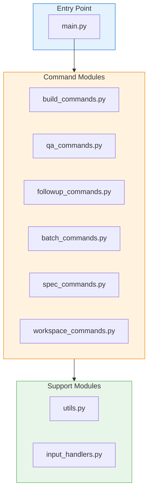
```mermaid
flowchart TB
    subgraph Entry["Entry Point"]
        Main[main.py]
    end

    subgraph Commands["Command Modules"]
        Build[build_commands.py]
        QA[qa_commands.py]
        Followup[followup_commands.py]
        Batch[batch_commands.py]
        Spec[spec_commands.py]
        Workspace[workspace_commands.py]
    end

    subgraph Support["Support Modules"]
        Utils[utils.py]
        InputHandlers[input_handlers.py]
    end

    Main --> Commands
    Commands --> Support

    style Entry fill:#e3f2fd,stroke:#1976d2
    style Commands fill:#fff3e0,stroke:#f57c00
    style Support fill:#e8f5e9,stroke:#4caf50
```

## Module Structure

```
apps/backend/cli/
├── __init__.py           # Package exports (main)
├── main.py               # Argument parsing and command routing
├── build_commands.py     # Build execution and workspace setup
├── qa_commands.py        # QA validation commands
├── followup_commands.py  # Follow-up task management
├── batch_commands.py     # Batch task creation and status
├── spec_commands.py      # Spec listing and discovery
├── workspace_commands.py # Merge, review, discard operations
├── input_handlers.py     # User input collection utilities
└── utils.py              # Shared utilities and configuration
```

## Command Flow Architecture

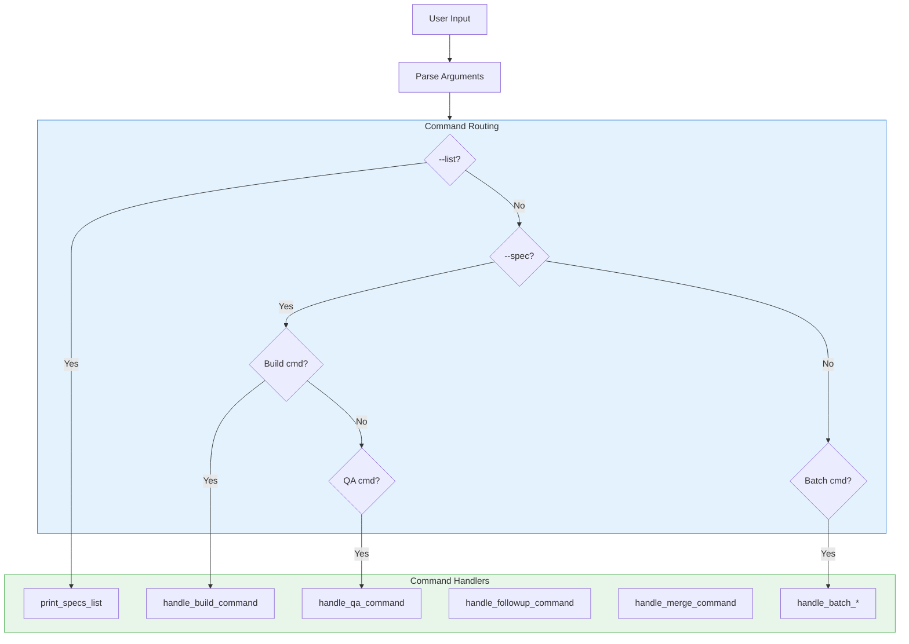
```mermaid
flowchart TB
    User[User Input]
    ParseArgs[Parse Arguments]

    subgraph Routing["Command Routing"]
        ListCheck{--list?}
        SpecCheck{--spec?}
        BatchCheck{Batch cmd?}
        BuildCheck{Build cmd?}
        QACheck{QA cmd?}
    end

    subgraph Commands["Command Handlers"]
        PrintSpecs[print_specs_list]
        BuildCmd[handle_build_command]
        QACmd[handle_qa_command]
        FollowupCmd[handle_followup_command]
        MergeCmd[handle_merge_command]
        BatchCmd[handle_batch_*]
    end

    User --> ParseArgs
    ParseArgs --> Routing
    ListCheck -->|Yes| PrintSpecs
    ListCheck -->|No| SpecCheck
    SpecCheck -->|No| BatchCheck
    BatchCheck -->|Yes| BatchCmd
    SpecCheck -->|Yes| BuildCheck
    BuildCheck -->|Yes| BuildCmd
    BuildCheck -->|No| QACheck
    QACheck -->|Yes| QACmd

    style Routing fill:#e3f2fd,stroke:#1976d2
    style Commands fill:#e8f5e9,stroke:#4caf50
```

## Build Commands

The `build_commands.py` module handles the main build execution flow, workspace management, and agent orchestration.

### Build Flow

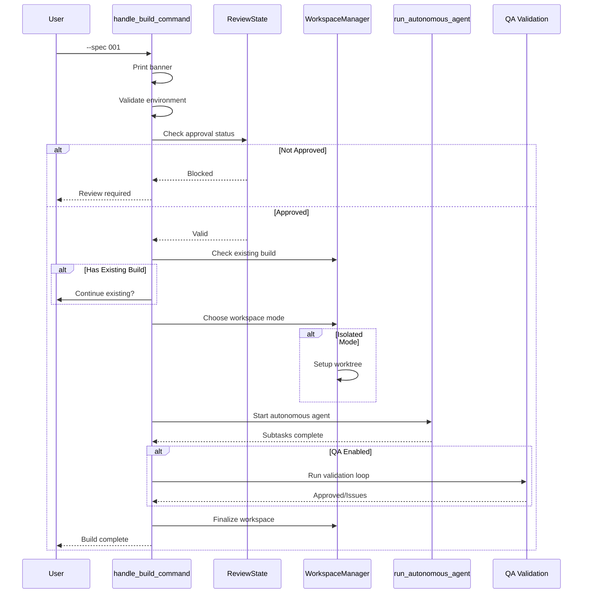
```mermaid
sequenceDiagram
    participant User
    participant CLI as handle_build_command
    participant Review as ReviewState
    participant Workspace as WorkspaceManager
    participant Agent as run_autonomous_agent
    participant QA as QA Validation

    User->>CLI: --spec 001
    CLI->>CLI: Print banner
    CLI->>CLI: Validate environment
    CLI->>Review: Check approval status

    alt Not Approved
        Review-->>CLI: Blocked
        CLI-->>User: Review required
    else Approved
        Review-->>CLI: Valid
        CLI->>Workspace: Check existing build

        alt Has Existing Build
            CLI->>User: Continue existing?
        end

        CLI->>Workspace: Choose workspace mode

        alt Isolated Mode
            Workspace->>Workspace: Setup worktree
        end

        CLI->>Agent: Start autonomous agent
        Agent-->>CLI: Subtasks complete

        alt QA Enabled
            CLI->>QA: Run validation loop
            QA-->>CLI: Approved/Issues
        end

        CLI->>Workspace: Finalize workspace
        CLI-->>User: Build complete
    end
```

### Workspace Modes

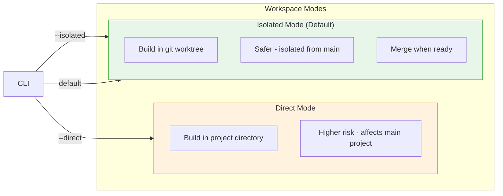
```mermaid
flowchart LR
    subgraph Modes["Workspace Modes"]
        Direct[Direct Mode]
        Isolated[Isolated Mode]
    end

    subgraph Direct["Direct Mode"]
        DirectDesc[Build in project directory]
        DirectRisk[Higher risk - affects main project]
    end

    subgraph Isolated["Isolated Mode (Default)"]
        IsolatedDesc[Build in git worktree]
        IsolatedSafe[Safer - isolated from main]
        IsolatedMerge[Merge when ready]
    end

    CLI[CLI] -->|--direct| Direct
    CLI -->|--isolated| Isolated
    CLI -->|default| Isolated

    style Isolated fill:#e8f5e9,stroke:#4caf50
    style Direct fill:#fff3e0,stroke:#f57c00
```

### Build Interrupt Handling

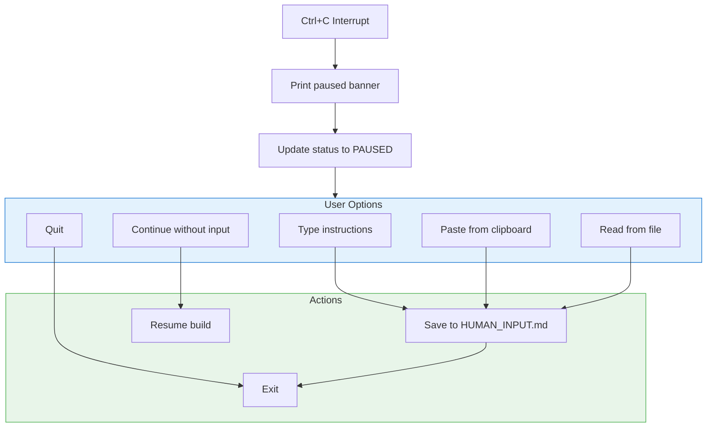
```mermaid
flowchart TB
    Interrupt[Ctrl+C Interrupt]
    PrintBanner[Print paused banner]
    UpdateStatus[Update status to PAUSED]

    subgraph Options["User Options"]
        Type[Type instructions]
        Paste[Paste from clipboard]
        File[Read from file]
        Skip[Continue without input]
        Quit[Quit]
    end

    subgraph Actions
        SaveInput[Save to HUMAN_INPUT.md]
        Resume[Resume build]
        Exit[Exit]
    end

    Interrupt --> PrintBanner
    PrintBanner --> UpdateStatus
    UpdateStatus --> Options

    Type --> SaveInput
    Paste --> SaveInput
    File --> SaveInput
    Skip --> Resume
    Quit --> Exit
    SaveInput --> Exit

    style Options fill:#e3f2fd,stroke:#1976d2
    style Actions fill:#e8f5e9,stroke:#4caf50
```

### Key Functions

| Function | Purpose |
|----------|---------|
| `handle_build_command()` | Main build orchestration |
| `_handle_build_interrupt()` | Handle Ctrl+C during build |

### Command Line Options

| Option | Description |
|--------|-------------|
| `--spec <id>` | Spec to run (required) |
| `--model <model>` | Claude model to use |
| `--max-iterations <n>` | Max agent sessions |
| `--isolated` | Force isolated workspace |
| `--direct` | Force direct mode |
| `--auto-continue` | Non-interactive mode |
| `--skip-qa` | Skip QA validation |
| `--force` | Bypass approval check |
| `--base-branch <branch>` | Base branch for worktree |

## QA Commands

The `qa_commands.py` module provides QA validation operations for completed builds.

### QA Flow

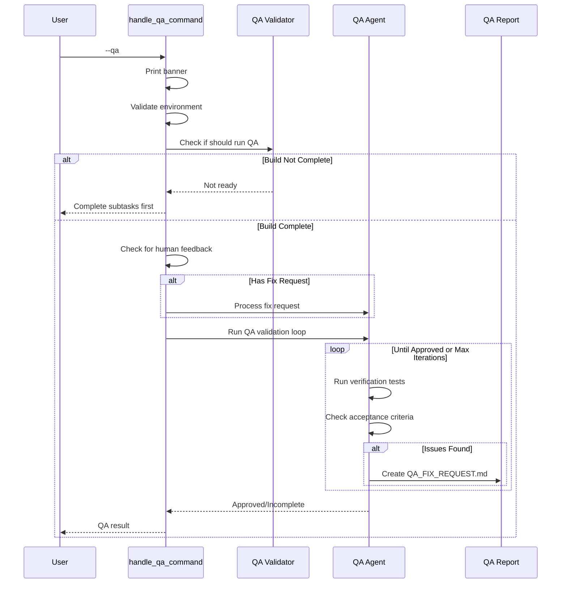
```mermaid
sequenceDiagram
    participant User
    participant CLI as handle_qa_command
    participant Validator as QA Validator
    participant Agent as QA Agent
    participant Report as QA Report

    User->>CLI: --qa
    CLI->>CLI: Print banner
    CLI->>CLI: Validate environment
    CLI->>Validator: Check if should run QA

    alt Build Not Complete
        Validator-->>CLI: Not ready
        CLI-->>User: Complete subtasks first
    else Build Complete
        CLI->>CLI: Check for human feedback

        alt Has Fix Request
            CLI->>Agent: Process fix request
        end

        CLI->>Agent: Run QA validation loop

        loop Until Approved or Max Iterations
            Agent->>Agent: Run verification tests
            Agent->>Agent: Check acceptance criteria

            alt Issues Found
                Agent->>Report: Create QA_FIX_REQUEST.md
            end
        end

        Agent-->>CLI: Approved/Incomplete
        CLI-->>User: QA result
    end
```

### QA Status Commands

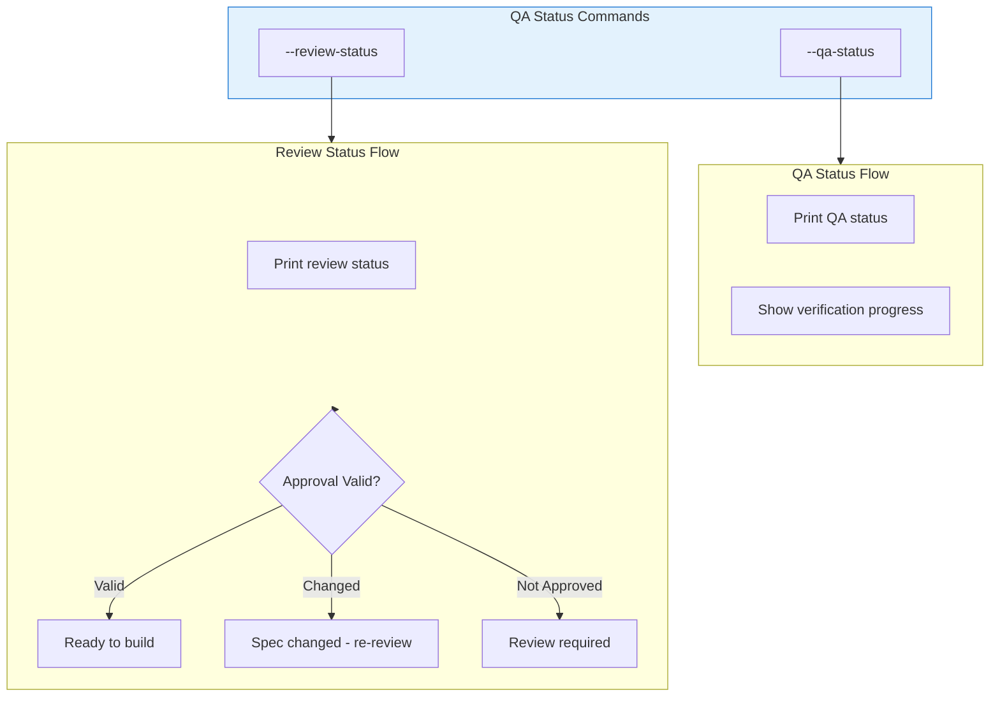
```mermaid
flowchart TB
    subgraph Commands["QA Status Commands"]
        QAStatus[--qa-status]
        ReviewStatus[--review-status]
    end

    subgraph QAStatusFlow["QA Status Flow"]
        PrintQA[Print QA status]
        ShowProgress[Show verification progress]
    end

    subgraph ReviewStatusFlow["Review Status Flow"]
        PrintReview[Print review status]
        CheckApproval{Approval Valid?}
        Ready[Ready to build]
        Changed[Spec changed - re-review]
        NeedsReview[Review required]
    end

    QAStatus --> QAStatusFlow
    ReviewStatus --> ReviewStatusFlow
    ReviewStatusFlow --> CheckApproval
    CheckApproval -->|Valid| Ready
    CheckApproval -->|Changed| Changed
    CheckApproval -->|Not Approved| NeedsReview

    style Commands fill:#e3f2fd,stroke:#1976d2
```

### Key Functions

| Function | Purpose |
|----------|---------|
| `handle_qa_command()` | Run QA validation loop |
| `handle_qa_status_command()` | Display QA status |
| `handle_review_status_command()` | Display review/approval status |

## Followup Commands

The `followup_commands.py` module enables adding follow-up tasks to completed specs.

### Followup Flow

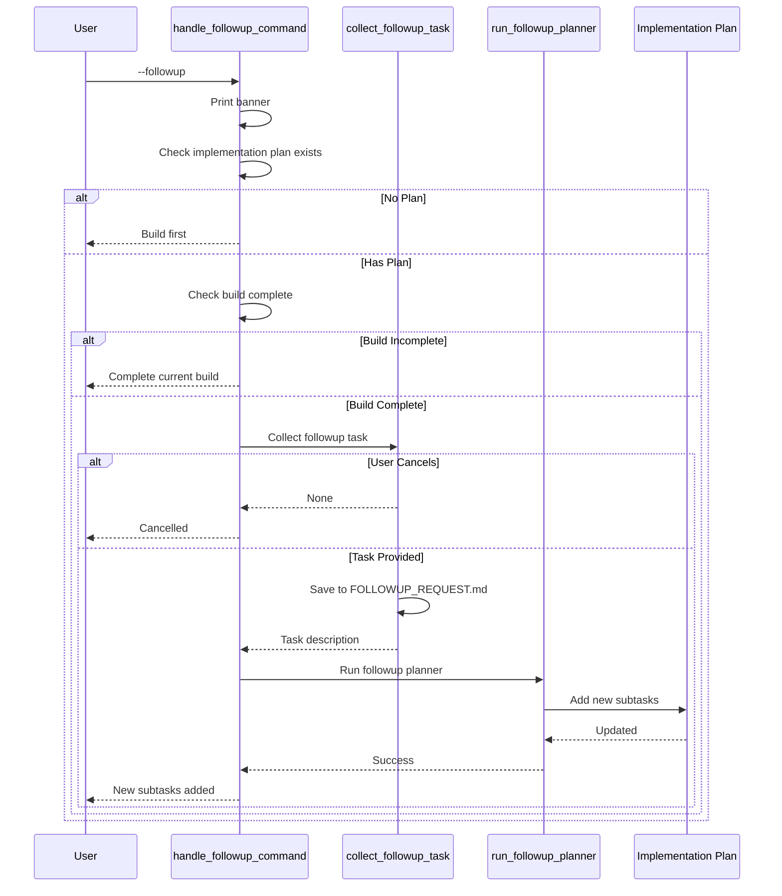
```mermaid
sequenceDiagram
    participant User
    participant CLI as handle_followup_command
    participant Collector as collect_followup_task
    participant Planner as run_followup_planner
    participant Plan as Implementation Plan

    User->>CLI: --followup
    CLI->>CLI: Print banner
    CLI->>CLI: Check implementation plan exists

    alt No Plan
        CLI-->>User: Build first
    else Has Plan
        CLI->>CLI: Check build complete

        alt Build Incomplete
            CLI-->>User: Complete current build
        else Build Complete
            CLI->>Collector: Collect followup task

            alt User Cancels
                Collector-->>CLI: None
                CLI-->>User: Cancelled
            else Task Provided
                Collector->>Collector: Save to FOLLOWUP_REQUEST.md
                Collector-->>CLI: Task description

                CLI->>Planner: Run followup planner
                Planner->>Plan: Add new subtasks
                Plan-->>Planner: Updated
                Planner-->>CLI: Success
                CLI-->>User: New subtasks added
            end
        end
    end
```

### Input Collection Methods

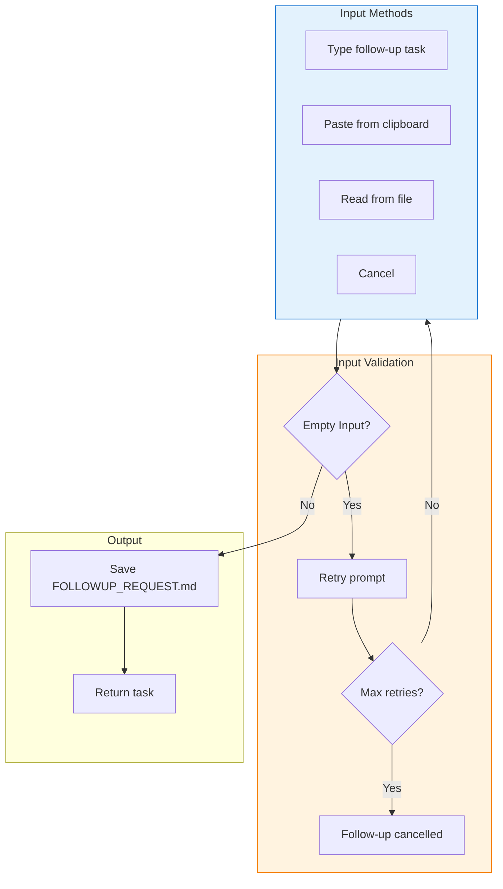
```mermaid
flowchart TB
    subgraph Methods["Input Methods"]
        Type[Type follow-up task]
        Paste[Paste from clipboard]
        File[Read from file]
        Cancel[Cancel]
    end

    subgraph Validation["Input Validation"]
        CheckEmpty{Empty Input?}
        Retry[Retry prompt]
        MaxRetries{Max retries?}
        Failed[Follow-up cancelled]
    end

    subgraph Output
        Save[Save FOLLOWUP_REQUEST.md]
        Return[Return task]
    end

    Methods --> CheckEmpty
    CheckEmpty -->|Yes| Retry
    Retry --> MaxRetries
    MaxRetries -->|No| Methods
    MaxRetries -->|Yes| Failed
    CheckEmpty -->|No| Save
    Save --> Return

    style Methods fill:#e3f2fd,stroke:#1976d2
    style Validation fill:#fff3e0,stroke:#f57c00
```

### Key Functions

| Function | Purpose |
|----------|---------|
| `handle_followup_command()` | Orchestrate follow-up workflow |
| `collect_followup_task()` | Collect user input for follow-up |

## Batch Commands

The `batch_commands.py` module provides batch task management for creating and managing multiple tasks.

### Batch Create Flow

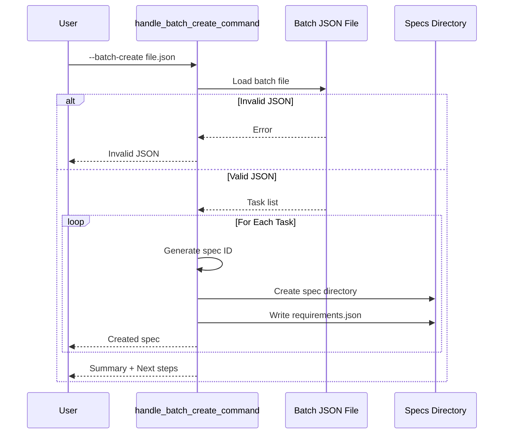
```mermaid
sequenceDiagram
    participant User
    participant CLI as handle_batch_create_command
    participant JSON as Batch JSON File
    participant Specs as Specs Directory

    User->>CLI: --batch-create file.json
    CLI->>JSON: Load batch file

    alt Invalid JSON
        JSON-->>CLI: Error
        CLI-->>User: Invalid JSON
    else Valid JSON
        JSON-->>CLI: Task list

        loop For Each Task
            CLI->>CLI: Generate spec ID
            CLI->>Specs: Create spec directory
            CLI->>Specs: Write requirements.json
            CLI-->>User: Created spec
        end

        CLI-->>User: Summary + Next steps
    end
```

### Batch JSON Format

```json
{
  "tasks": [
    {
      "title": "Task Title",
      "description": "Detailed description",
      "workflow_type": "feature",
      "services": ["frontend", "backend"],
      "priority": 5,
      "complexity": "standard",
      "estimated_hours": 4.0,
      "estimated_days": 0.5
    }
  ]
}
```

### Batch Status Display

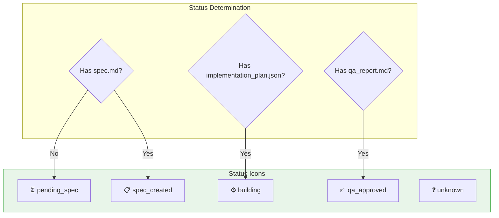
```mermaid
flowchart TB
    subgraph Status["Status Icons"]
        Pending["⏳ pending_spec"]
        Created["📋 spec_created"]
        Building["⚙️ building"]
        Approved["✅ qa_approved"]
        Unknown["❓ unknown"]
    end

    subgraph Determination["Status Determination"]
        HasSpec{Has spec.md?}
        HasPlan{Has implementation_plan.json?}
        HasQA{Has qa_report.md?}
    end

    HasSpec -->|No| Pending
    HasSpec -->|Yes| Created
    HasPlan -->|Yes| Building
    HasQA -->|Yes| Approved

    style Status fill:#e8f5e9,stroke:#4caf50
```

### Key Functions

| Function | Purpose |
|----------|---------|
| `handle_batch_create_command()` | Create specs from batch JSON |
| `handle_batch_status_command()` | Show status of all specs |
| `handle_batch_cleanup_command()` | Clean up completed specs |

### Batch Commands

| Command | Description |
|---------|-------------|
| `--batch-create <file>` | Create specs from JSON |
| `--batch-status` | Show all spec statuses |
| `--batch-cleanup` | Clean up completed specs |
| `--no-dry-run` | Actually delete in cleanup |

## Workspace Commands

The `workspace_commands.py` module provides workspace management operations for isolated builds.

### Merge Flow

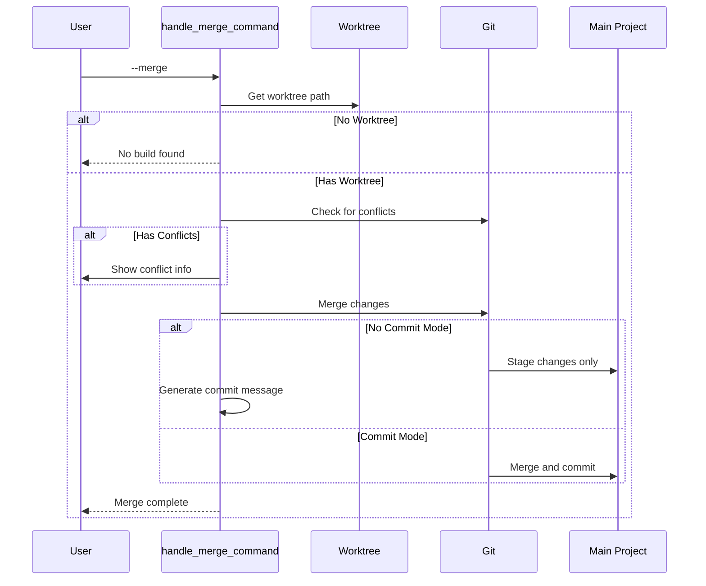
```mermaid
sequenceDiagram
    participant User
    participant CLI as handle_merge_command
    participant Worktree as Worktree
    participant Git as Git
    participant Main as Main Project

    User->>CLI: --merge
    CLI->>Worktree: Get worktree path

    alt No Worktree
        CLI-->>User: No build found
    else Has Worktree
        CLI->>Git: Check for conflicts

        alt Has Conflicts
            CLI->>User: Show conflict info
        end

        CLI->>Git: Merge changes

        alt No Commit Mode
            Git->>Main: Stage changes only
            CLI->>CLI: Generate commit message
        else Commit Mode
            Git->>Main: Merge and commit
        end

        CLI-->>User: Merge complete
    end
```

### Merge Preview

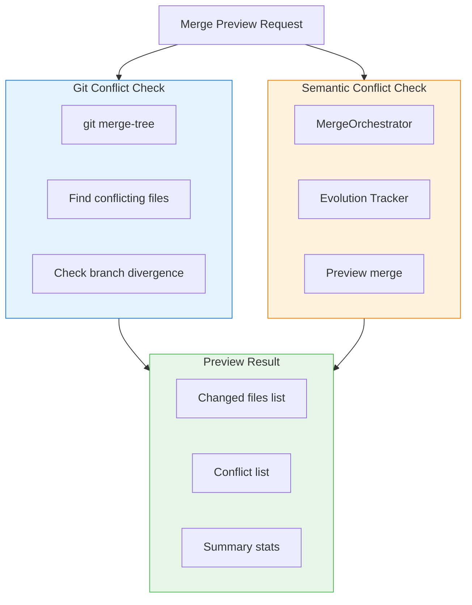
```mermaid
flowchart TB
    Start[Merge Preview Request]

    subgraph GitCheck["Git Conflict Check"]
        MergeTree[git merge-tree]
        FindConflicts[Find conflicting files]
        CheckDivergence[Check branch divergence]
    end

    subgraph SemanticCheck["Semantic Conflict Check"]
        Orchestrator[MergeOrchestrator]
        EvolutionTracker[Evolution Tracker]
        PreviewMerge[Preview merge]
    end

    subgraph Result["Preview Result"]
        Files[Changed files list]
        Conflicts[Conflict list]
        Summary[Summary stats]
    end

    Start --> GitCheck
    Start --> SemanticCheck
    GitCheck --> Result
    SemanticCheck --> Result

    style GitCheck fill:#e3f2fd,stroke:#1976d2
    style SemanticCheck fill:#fff3e0,stroke:#f57c00
    style Result fill:#e8f5e9,stroke:#4caf50
```

### Worktree Operations

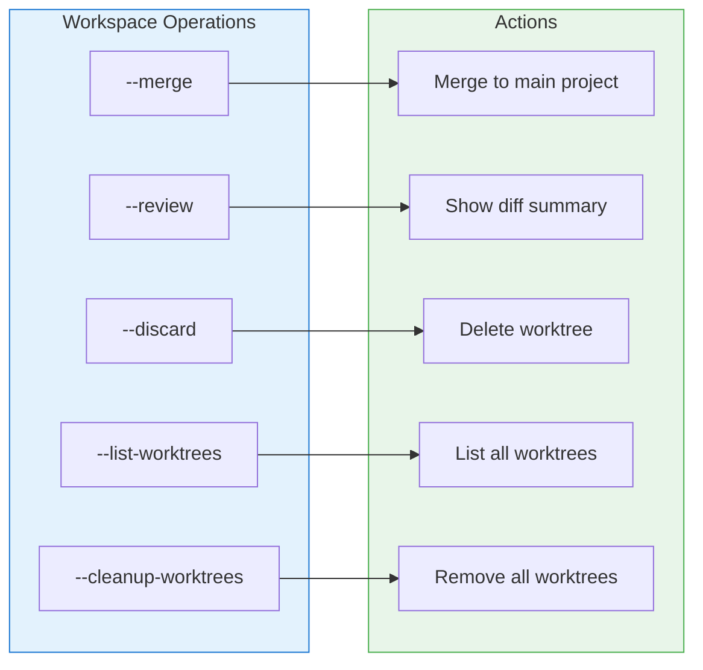
```mermaid
flowchart LR
    subgraph Operations["Workspace Operations"]
        Merge[--merge]
        Review[--review]
        Discard[--discard]
        List[--list-worktrees]
        Cleanup[--cleanup-worktrees]
    end

    subgraph Actions
        MergeAction[Merge to main project]
        ReviewAction[Show diff summary]
        DiscardAction[Delete worktree]
        ListAction[List all worktrees]
        CleanupAction[Remove all worktrees]
    end

    Merge --> MergeAction
    Review --> ReviewAction
    Discard --> DiscardAction
    List --> ListAction
    Cleanup --> CleanupAction

    style Operations fill:#e3f2fd,stroke:#1976d2
    style Actions fill:#e8f5e9,stroke:#4caf50
```

### Key Functions

| Function | Purpose |
|----------|---------|
| `handle_merge_command()` | Merge worktree to main |
| `handle_merge_preview_command()` | Preview merge conflicts |
| `handle_review_command()` | Review worktree contents |
| `handle_discard_command()` | Discard worktree |
| `handle_list_worktrees_command()` | List all worktrees |
| `handle_cleanup_worktrees_command()` | Cleanup all worktrees |

## Spec Commands

The `spec_commands.py` module provides spec listing and discovery operations.

### Spec Discovery

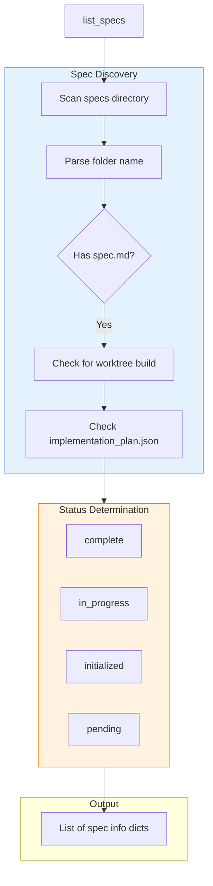
```mermaid
flowchart TB
    Start[list_specs]

    subgraph Discovery["Spec Discovery"]
        ScanDir[Scan specs directory]
        ParseName[Parse folder name]
        CheckSpec{Has spec.md?}
        CheckBuild[Check for worktree build]
        CheckProgress[Check implementation_plan.json]
    end

    subgraph Status["Status Determination"]
        Complete[complete]
        InProgress[in_progress]
        Initialized[initialized]
        Pending[pending]
    end

    subgraph Output
        SpecList[List of spec info dicts]
    end

    Start --> ScanDir
    ScanDir --> ParseName
    ParseName --> CheckSpec
    CheckSpec -->|Yes| CheckBuild
    CheckBuild --> CheckProgress
    CheckProgress --> Status
    Status --> SpecList

    style Discovery fill:#e3f2fd,stroke:#1976d2
    style Status fill:#fff3e0,stroke:#f57c00
```

### Auto-Create Workflow

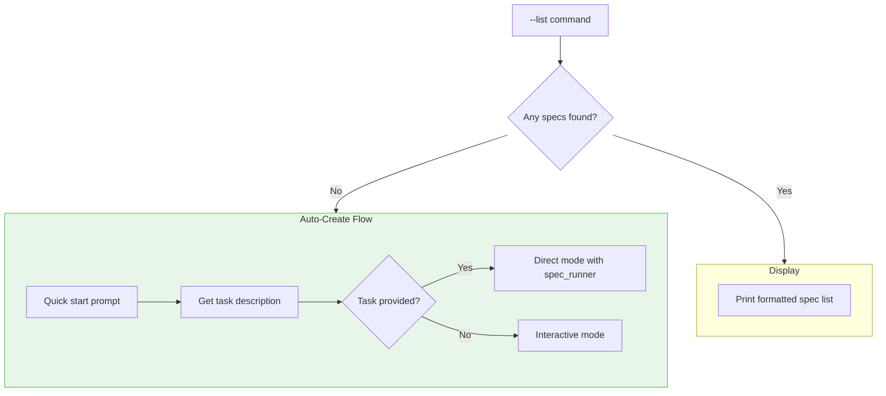
```mermaid
flowchart TB
    List[--list command]
    NoSpecs{Any specs found?}

    subgraph AutoCreate["Auto-Create Flow"]
        Prompt[Quick start prompt]
        GetTask[Get task description]
        HasTask{Task provided?}
        Direct[Direct mode with spec_runner]
        Interactive[Interactive mode]
    end

    subgraph Display
        PrintSpecs[Print formatted spec list]
    end

    List --> NoSpecs
    NoSpecs -->|No| AutoCreate
    NoSpecs -->|Yes| Display
    Prompt --> GetTask
    GetTask --> HasTask
    HasTask -->|Yes| Direct
    HasTask -->|No| Interactive

    style AutoCreate fill:#e8f5e9,stroke:#4caf50
```

### Key Functions

| Function | Purpose |
|----------|---------|
| `list_specs()` | Get all specs with status |
| `print_specs_list()` | Display formatted spec list |

## Input Handlers

The `input_handlers.py` module provides reusable user input collection utilities.

### Input Flow

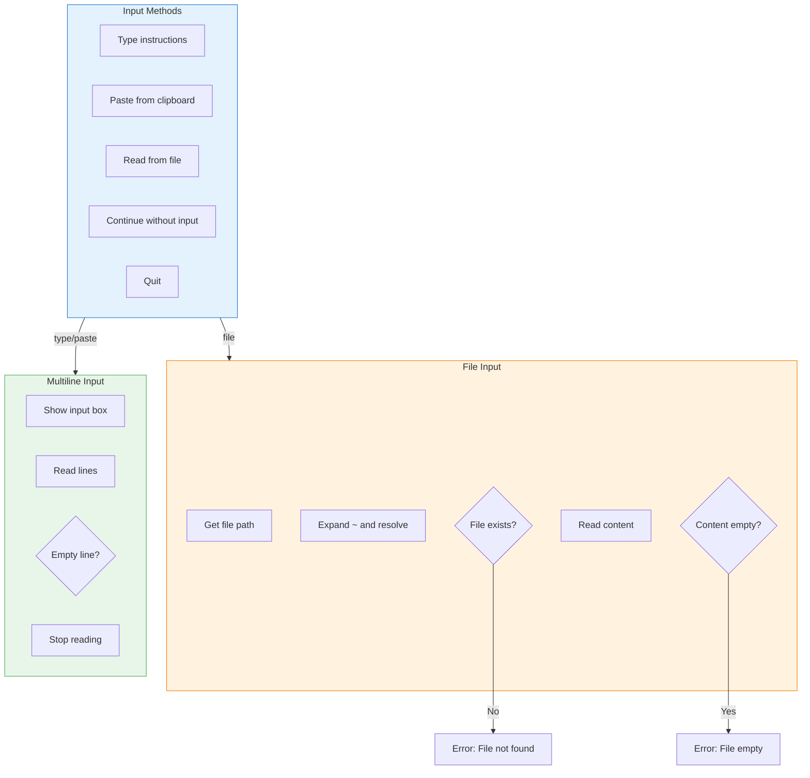
```mermaid
flowchart TB
    subgraph Methods["Input Methods"]
        Type[Type instructions]
        Paste[Paste from clipboard]
        File[Read from file]
        Skip[Continue without input]
        Quit[Quit]
    end

    subgraph FileInput["File Input"]
        GetPath[Get file path]
        Expand[Expand ~ and resolve]
        CheckExists{File exists?}
        ReadContent[Read content]
        CheckEmpty{Content empty?}
    end

    subgraph MultilineInput["Multiline Input"]
        ShowPrompt[Show input box]
        ReadLines[Read lines]
        EmptyLine{Empty line?}
        StopReading[Stop reading]
    end

    Methods -->|file| FileInput
    Methods -->|type/paste| MultilineInput
    CheckExists -->|No| Error[Error: File not found]
    CheckEmpty -->|Yes| Error2[Error: File empty]

    style Methods fill:#e3f2fd,stroke:#1976d2
    style FileInput fill:#fff3e0,stroke:#f57c00
    style MultilineInput fill:#e8f5e9,stroke:#4caf50
```

### Key Functions

| Function | Purpose |
|----------|---------|
| `collect_user_input_interactive()` | Interactive input collection |
| `read_from_file()` | Read from user-provided file path |
| `read_multiline_input()` | Read multi-line text input |

## Utilities

The `utils.py` module provides shared utilities and configuration for all CLI commands.

### Configuration

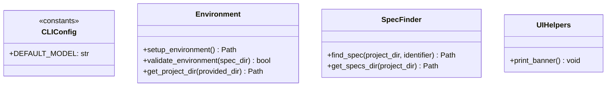
```mermaid
classDiagram
    class CLIConfig {
        <<constants>>
        +DEFAULT_MODEL: str
    }

    class Environment {
        +setup_environment() Path
        +validate_environment(spec_dir) bool
        +get_project_dir(provided_dir) Path
    }

    class SpecFinder {
        +find_spec(project_dir, identifier) Path
        +get_specs_dir(project_dir) Path
    }

    class UIHelpers {
        +print_banner() void
    }
```

### Environment Validation

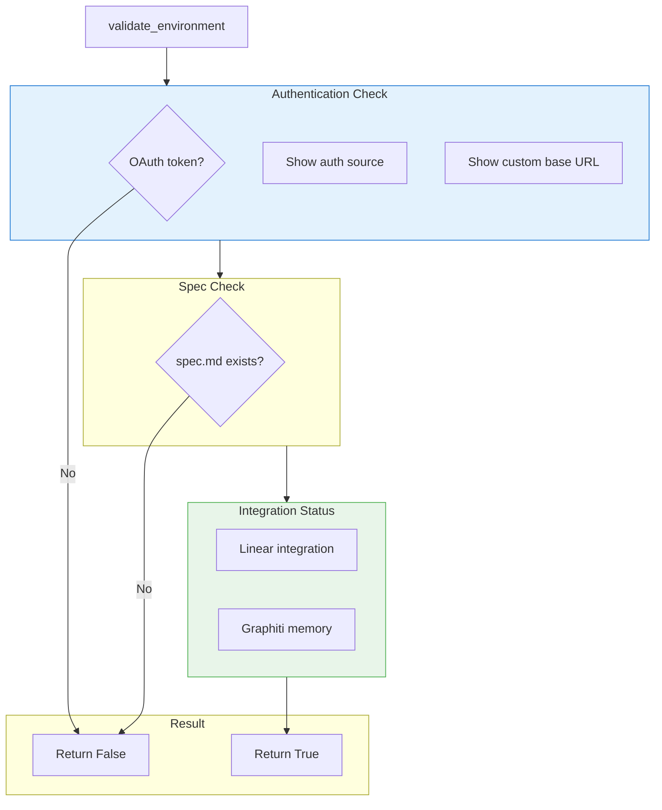
```mermaid
flowchart TB
    Start[validate_environment]

    subgraph Auth["Authentication Check"]
        CheckToken{OAuth token?}
        ShowSource[Show auth source]
        ShowURL[Show custom base URL]
    end

    subgraph Spec["Spec Check"]
        CheckSpecMd{spec.md exists?}
    end

    subgraph Integrations["Integration Status"]
        LinearCheck[Linear integration]
        GraphitiCheck[Graphiti memory]
    end

    subgraph Result
        Valid[Return True]
        Invalid[Return False]
    end

    Start --> Auth
    Auth --> Spec
    Spec --> Integrations
    CheckToken -->|No| Invalid
    CheckSpecMd -->|No| Invalid
    Integrations --> Valid

    style Auth fill:#e3f2fd,stroke:#1976d2
    style Integrations fill:#e8f5e9,stroke:#4caf50
```

### Spec Finding

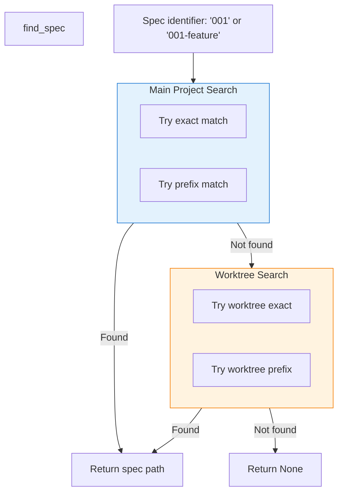
```mermaid
flowchart TB
    Start[find_spec]
    Input[Spec identifier: '001' or '001-feature']

    subgraph Main["Main Project Search"]
        ExactMatch[Try exact match]
        PrefixMatch[Try prefix match]
    end

    subgraph Worktree["Worktree Search"]
        WTExact[Try worktree exact]
        WTPrefix[Try worktree prefix]
    end

    Found[Return spec path]
    NotFound[Return None]

    Input --> Main
    Main -->|Not found| Worktree
    Main -->|Found| Found
    Worktree -->|Found| Found
    Worktree -->|Not found| NotFound

    style Main fill:#e3f2fd,stroke:#1976d2
    style Worktree fill:#fff3e0,stroke:#f57c00
```

### Key Functions

| Function | Purpose |
|----------|---------|
| `setup_environment()` | Initialize environment, load .env |
| `find_spec()` | Find spec by number or name |
| `validate_environment()` | Validate auth and spec |
| `print_banner()` | Print CLI banner |
| `get_project_dir()` | Determine project directory |

## Class Diagram

```mermaid
classDiagram
    class CLIModule {
        <<module>>
        +main()
        +parse_args()
    }

    class BuildCommands {
        +handle_build_command()
        -_handle_build_interrupt()
    }

    class QACommands {
        +handle_qa_command()
        +handle_qa_status_command()
        +handle_review_status_command()
    }

    class FollowupCommands {
        +handle_followup_command()
        +collect_followup_task()
    }

    class BatchCommands {
        +handle_batch_create_command()
        +handle_batch_status_command()
        +handle_batch_cleanup_command()
    }

    class SpecCommands {
        +list_specs()
        +print_specs_list()
    }

    class WorkspaceCommands {
        +handle_merge_command()
        +handle_merge_preview_command()
        +handle_review_command()
        +handle_discard_command()
        +handle_list_worktrees_command()
        +handle_cleanup_worktrees_command()
    }

    class InputHandlers {
        +collect_user_input_interactive()
        +read_from_file()
        +read_multiline_input()
    }

    class Utils {
        +setup_environment()
        +find_spec()
        +validate_environment()
        +print_banner()
        +get_project_dir()
    }

    CLIModule --> BuildCommands : uses
    CLIModule --> QACommands : uses
    CLIModule --> FollowupCommands : uses
    CLIModule --> BatchCommands : uses
    CLIModule --> SpecCommands : uses
    CLIModule --> WorkspaceCommands : uses
    BuildCommands --> InputHandlers : uses
    BuildCommands --> Utils : uses
    FollowupCommands --> InputHandlers : uses
    QACommands --> Utils : uses
```

## Complete Command Reference

### Main Commands

| Command | Description |
|---------|-------------|
| `--list` | List all specs and their status |
| `--spec <id>` | Run/manage a specific spec |

### Build Commands

| Command | Description |
|---------|-------------|
| `--isolated` | Force isolated workspace mode |
| `--direct` | Build directly in project |
| `--auto-continue` | Non-interactive mode |
| `--skip-qa` | Skip QA validation |
| `--force` | Bypass approval check |
| `--max-iterations <n>` | Limit agent sessions |
| `--model <model>` | Specify Claude model |
| `--base-branch <branch>` | Base for worktree |
| `--verbose` | Enable verbose output |

### Workspace Commands

| Command | Description |
|---------|-------------|
| `--merge` | Merge build to project |
| `--review` | Review build contents |
| `--discard` | Discard build |
| `--no-commit` | Stage only, don't commit |
| `--merge-preview` | Preview merge conflicts (JSON) |
| `--list-worktrees` | List all worktrees |
| `--cleanup-worktrees` | Remove all worktrees |

### QA Commands

| Command | Description |
|---------|-------------|
| `--qa` | Run QA validation loop |
| `--qa-status` | Show QA status |
| `--review-status` | Show approval status |

### Followup Commands

| Command | Description |
|---------|-------------|
| `--followup` | Add follow-up tasks |

### Batch Commands

| Command | Description |
|---------|-------------|
| `--batch-create <file>` | Create specs from JSON |
| `--batch-status` | Show all spec statuses |
| `--batch-cleanup` | Clean up completed specs |
| `--no-dry-run` | Actually delete files |

## Usage Examples

### Run a Build

```bash
# Run a spec
python auto-claude/run.py --spec 001

# Run with specific model
python auto-claude/run.py --spec 001 --model claude-sonnet-4-20250514

# Run in direct mode (no isolation)
python auto-claude/run.py --spec 001 --direct

# Non-interactive mode
python auto-claude/run.py --spec 001 --auto-continue
```

### Manage Workspaces

```bash
# List all worktrees
python auto-claude/run.py --list-worktrees

# Merge completed build
python auto-claude/run.py --spec 001 --merge

# Stage changes without committing
python auto-claude/run.py --spec 001 --merge --no-commit

# Review what was built
python auto-claude/run.py --spec 001 --review

# Discard a build
python auto-claude/run.py --spec 001 --discard
```

### QA Operations

```bash
# Run QA validation
python auto-claude/run.py --spec 001 --qa

# Check QA status
python auto-claude/run.py --spec 001 --qa-status

# Check review status
python auto-claude/run.py --spec 001 --review-status
```

### Batch Operations

```bash
# Create specs from batch file
python auto-claude/run.py --batch-create tasks.json

# Check all spec statuses
python auto-claude/run.py --batch-status

# Clean up completed specs (dry run)
python auto-claude/run.py --batch-cleanup

# Actually clean up
python auto-claude/run.py --batch-cleanup --no-dry-run
```

### Followup Tasks

```bash
# Add follow-up to completed spec
python auto-claude/run.py --spec 001 --followup
```

## Integration Points

```mermaid
flowchart LR
    CLI[CLI Module]

    subgraph Internal["Internal Dependencies"]
        Agent[Agent Module]
        QALoop[QA Loop]
        Workspace[Workspace Module]
        Review[Review Module]
        Progress[Progress Module]
    end

    subgraph External["External Tools"]
        Git[Git]
        Claude[Claude SDK]
    end

    subgraph UI["User Interface"]
        Terminal[Terminal]
        MenuSystem[Menu System]
    end

    CLI --> Internal
    CLI --> External
    CLI --> UI

    style Internal fill:#e8f5e9,stroke:#4caf50
    style External fill:#e3f2fd,stroke:#1976d2
    style UI fill:#fff3e0,stroke:#f57c00
```

### Key Dependencies

| Module | Purpose |
|--------|---------|
| `agent` | Agent execution (`run_autonomous_agent`) |
| `qa_loop` | QA validation loop |
| `workspace` | Worktree management |
| `review` | Approval state management |
| `progress` | Subtask counting |
| `ui` | Terminal UI components |

## Error Handling

### Graceful Exit Handling

```mermaid
flowchart TB
    Error[Error Condition]

    subgraph Handlers["Error Handlers"]
        KeyboardInt[KeyboardInterrupt]
        EOFError[EOFError]
        Exception[General Exception]
    end

    subgraph Actions["Recovery Actions"]
        SaveState[Save state to disk]
        PrintHelp[Print resume command]
        UpdateStatus[Update status file]
        Exit[Exit with code]
    end

    Error --> Handlers
    KeyboardInt --> SaveState
    SaveState --> PrintHelp
    PrintHelp --> UpdateStatus
    UpdateStatus --> Exit
    Exception --> Exit

    style Handlers fill:#ffebee,stroke:#f44336
    style Actions fill:#e8f5e9,stroke:#4caf50
```

### Exit Codes

| Code | Meaning |
|------|---------|
| 0 | Success |
| 1 | Error (validation, missing spec, etc.) |

## Next Steps

- [Build Commands](./build_commands.md) - Detailed build execution
- [Agents Module](./agents.md) - Agent system architecture
- [Core Module](./core.md) - Core infrastructure
- [Analysis Module](./analysis.md) - Project analysis
