# Core and Context Modules

The core and context modules provide the foundational infrastructure for Auto-Claude's autonomous coding system. The core module handles authentication, client creation, workspace management, and progress tracking, while the context module builds task-specific context by searching the codebase.

## Module Overview

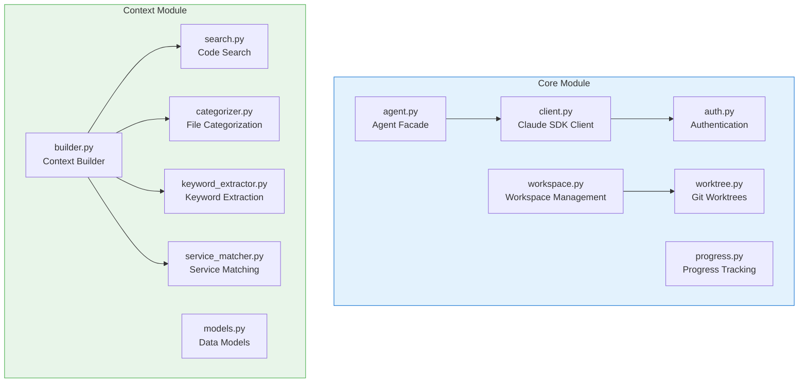

## Core Module Structure

```
apps/backend/core/
├── __init__.py          # Public API with lazy imports
├── agent.py             # Agent session facade (re-exports from agents/)
├── auth.py              # Authentication helpers
├── client.py            # Claude SDK client configuration
├── debug.py             # Debug utilities
├── phase_event.py       # Phase event definitions
├── progress.py          # Progress tracking utilities
├── workspace.py         # Workspace management
├── worktree.py          # Git worktree manager
└── workspace/           # Refactored workspace submodules
    ├── __init__.py      # Package exports
    ├── display.py       # UI display functions
    ├── finalization.py  # User interaction flows
    ├── git_utils.py     # Git operation utilities
    ├── models.py        # Data models and enums
    └── setup.py         # Workspace setup functions
```

## Context Module Structure

```
apps/backend/context/
├── __init__.py              # Public API exports
├── builder.py               # Main context builder class
├── categorizer.py           # File categorization logic
├── constants.py             # Shared constants
├── graphiti_integration.py  # Graphiti memory integration
├── keyword_extractor.py     # Keyword extraction from tasks
├── main.py                  # CLI entry point
├── models.py                # Data models (FileMatch, TaskContext)
├── pattern_discovery.py     # Pattern discovery in files
├── search.py                # Code search functionality
├── serialization.py         # Context serialization
└── service_matcher.py       # Service suggestion logic
```

## Core Class Diagram

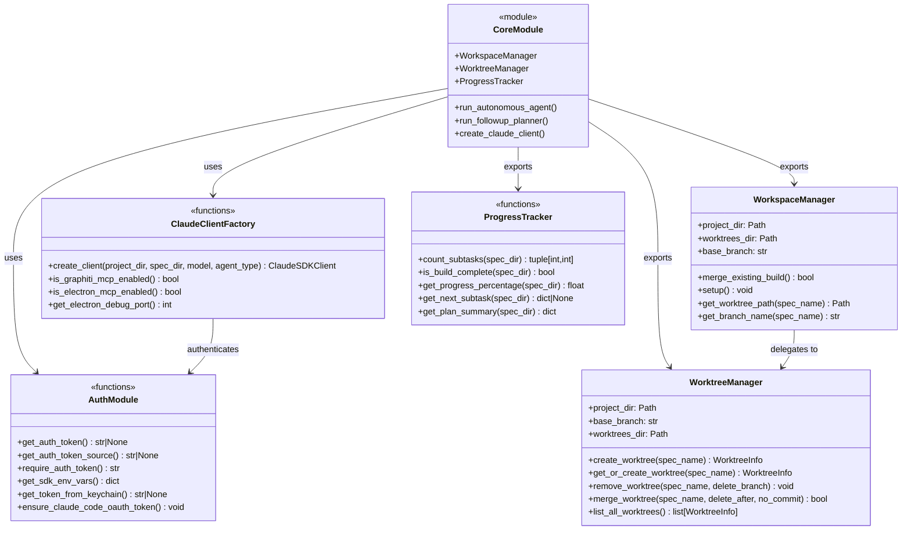

## Context Class Diagram

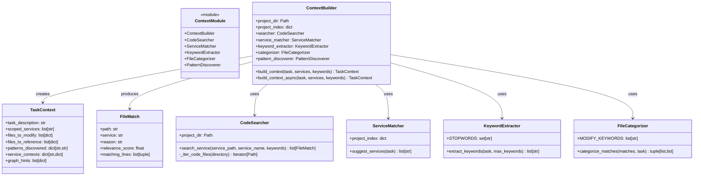

## Authentication System

The `auth.py` module provides centralized authentication token resolution with fallback support.

### Token Resolution Priority

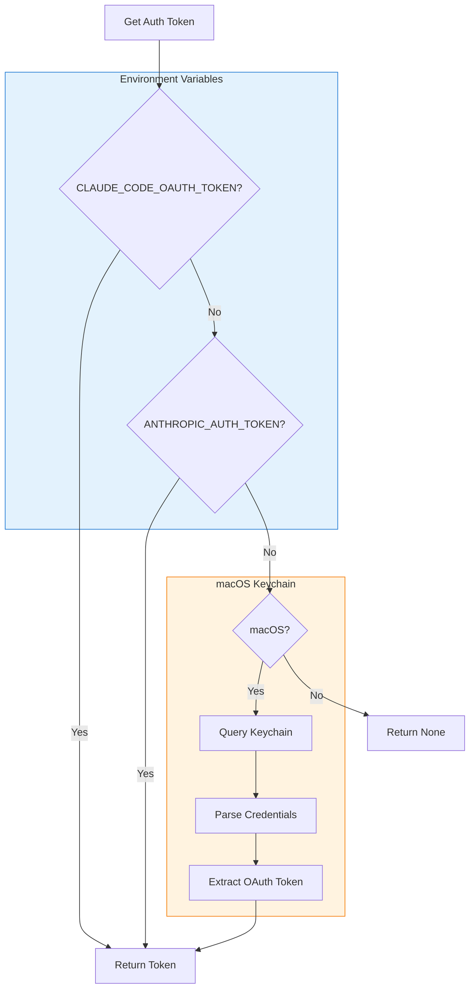

### Authentication Functions

| Function | Description | Returns |
|----------|-------------|---------|
| `get_auth_token()` | Get token from env vars or Keychain | `str \| None` |
| `get_auth_token_source()` | Get name of token source | `str \| None` |
| `require_auth_token()` | Get token or raise ValueError | `str` |
| `get_sdk_env_vars()` | Get env vars to pass to SDK | `dict[str, str]` |
| `ensure_claude_code_oauth_token()` | Ensure token is set in env | `None` |

### Security Note

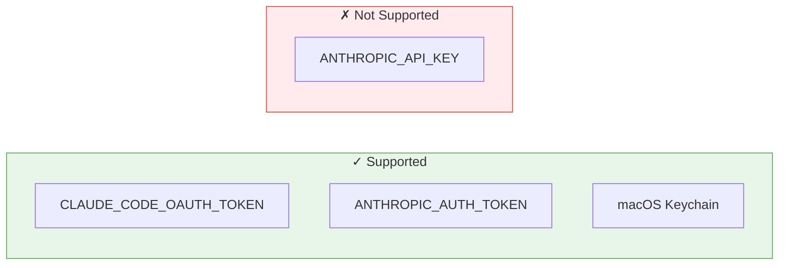

> **Important**: `ANTHROPIC_API_KEY` is intentionally NOT supported to prevent silent billing to user's API credits when OAuth is misconfigured.

## Claude SDK Client Creation

The `client.py` module creates configured Claude Agent SDK clients with multi-layered security.

### Client Creation Flow

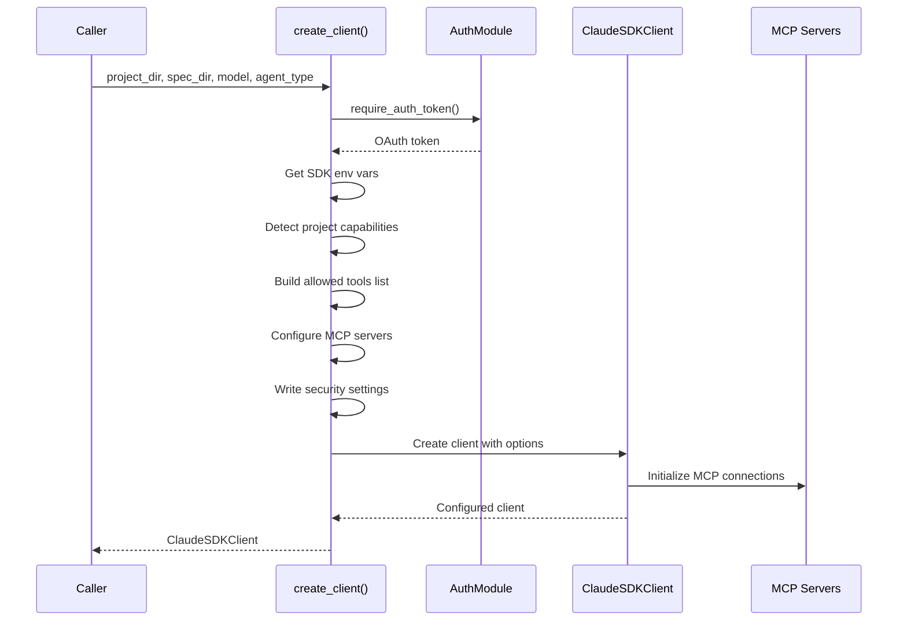

### Security Layers

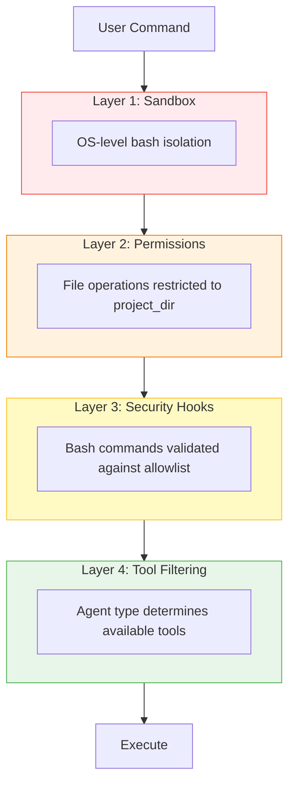

### MCP Server Configuration

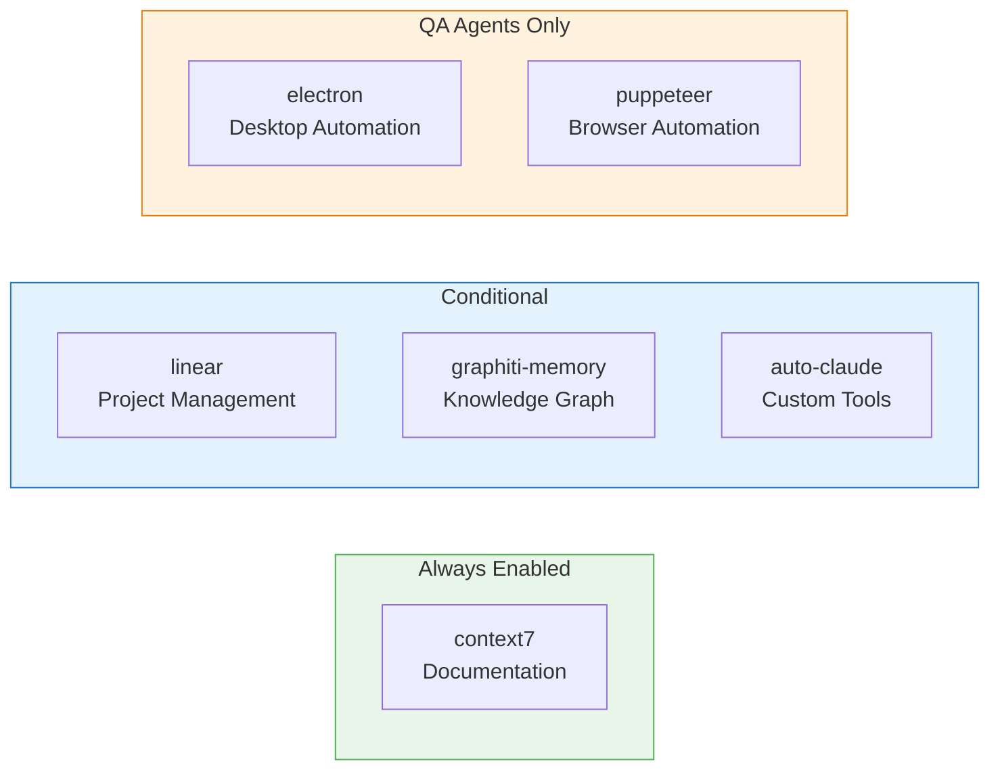

### Agent Types and Tools

| Agent Type | Base Tools | Custom Tools | MCP Tools |
|------------|------------|--------------|-----------|
| `planner` | Read, Glob, Grep | Plan-specific | Context7 |
| `coder` | All built-in | Coder-specific | Context7, Linear |
| `qa_reviewer` | All built-in | QA-specific | + Electron/Puppeteer |
| `qa_fixer` | All built-in | QA-specific | + Electron/Puppeteer |

## Workspace Management

The workspace module provides Git worktree isolation for each spec.

### Worktree Architecture

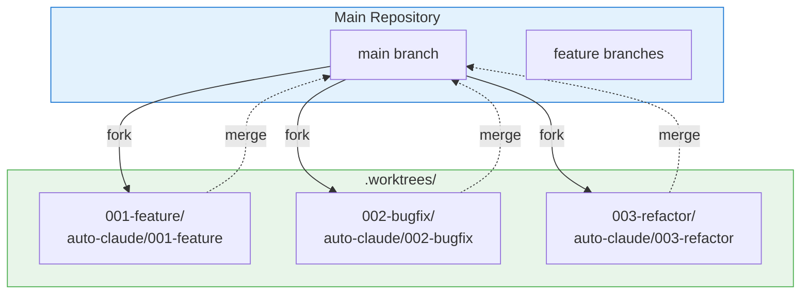

### WorktreeManager Class

```python
class WorktreeManager:
    """
    Manages per-spec Git worktrees.

    Each spec gets its own worktree in .worktrees/{spec-name}/ with
    a corresponding branch auto-claude/{spec-name}.
    """

    def __init__(self, project_dir: Path, base_branch: str | None = None):
        self.project_dir = project_dir
        self.base_branch = base_branch or self._detect_base_branch()
        self.worktrees_dir = project_dir / ".worktrees"
```

### WorktreeInfo Data Class

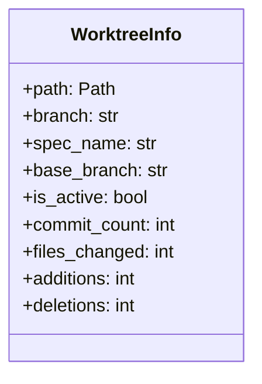

### Worktree Lifecycle

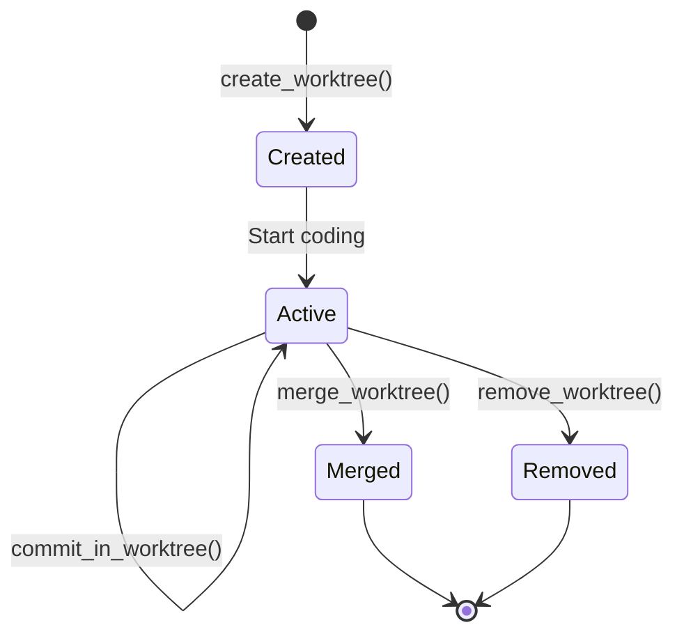

### Key Methods

| Method | Description | Returns |
|--------|-------------|---------|
| `create_worktree(spec_name)` | Create new worktree for spec | `WorktreeInfo` |
| `get_or_create_worktree(spec_name)` | Get existing or create new | `WorktreeInfo` |
| `merge_worktree(spec_name, ...)` | Merge worktree back to base | `bool` |
| `remove_worktree(spec_name, delete_branch)` | Remove worktree | `None` |
| `list_all_worktrees()` | List all spec worktrees | `list[WorktreeInfo]` |
| `get_changed_files(spec_name)` | Get changed files in worktree | `list[tuple]` |

## AI-Powered Merge System

The workspace module includes an AI-powered merge system for resolving conflicts.

### Merge Flow

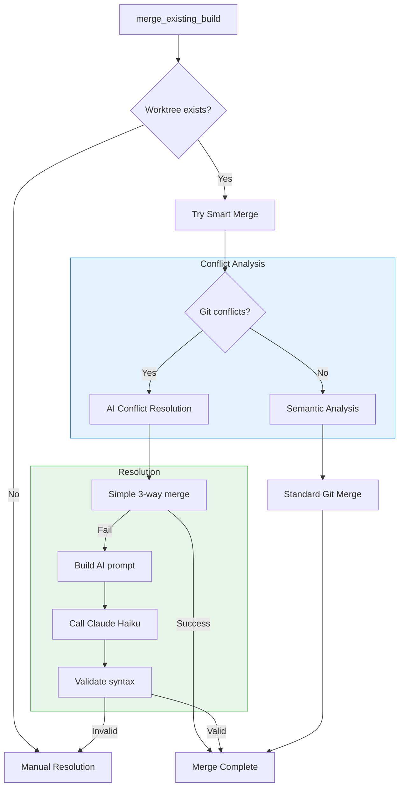

### Parallel Merge Processing

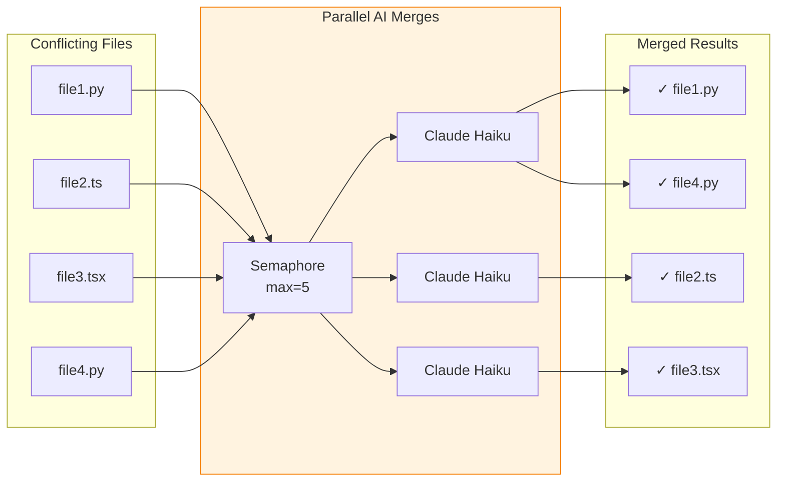

## Progress Tracking

The `progress.py` module tracks implementation plan progress.

### Progress Functions

| Function | Description | Returns |
|----------|-------------|---------|
| `count_subtasks(spec_dir)` | Count completed/total subtasks | `tuple[int, int]` |
| `is_build_complete(spec_dir)` | Check if all subtasks done | `bool` |
| `get_progress_percentage(spec_dir)` | Get progress as percentage | `float` |
| `get_next_subtask(spec_dir)` | Find next subtask to work on | `dict \| None` |
| `get_plan_summary(spec_dir)` | Get detailed plan summary | `dict` |
| `get_current_phase(spec_dir)` | Get current phase info | `dict \| None` |

### Progress Display

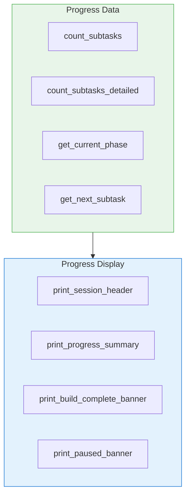

## Context Building

The context module builds task-specific context by searching the codebase.

### Context Building Flow

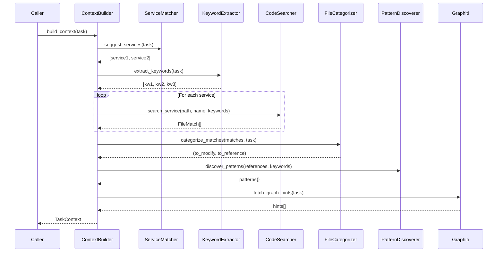

### ContextBuilder Class

```python
class ContextBuilder:
    """Builds task-specific context by searching the codebase."""

    def __init__(self, project_dir: Path, project_index: dict | None = None):
        self.project_dir = project_dir.resolve()
        self.project_index = project_index or self._load_project_index()

        # Initialize components
        self.searcher = CodeSearcher(self.project_dir)
        self.service_matcher = ServiceMatcher(self.project_index)
        self.keyword_extractor = KeywordExtractor()
        self.categorizer = FileCategorizer()
        self.pattern_discoverer = PatternDiscoverer(self.project_dir)
```

### TaskContext Structure

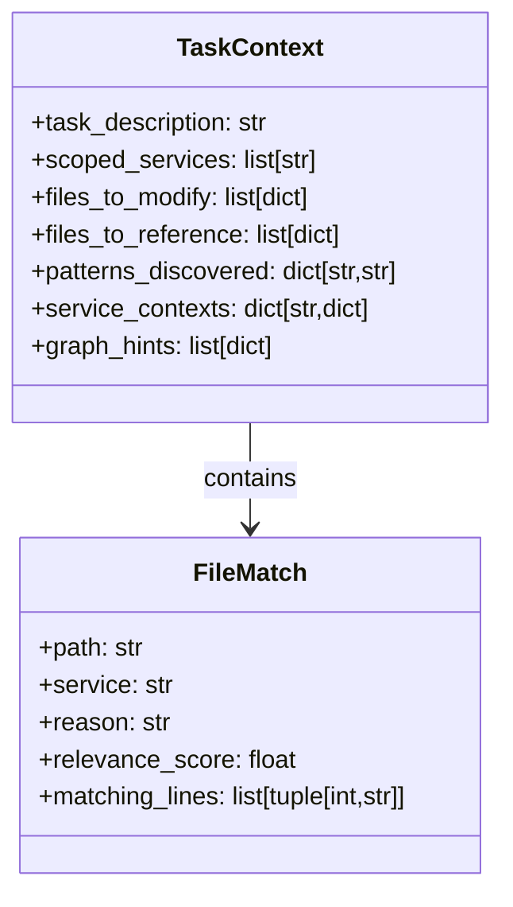

## Code Search

The `search.py` module searches code files for relevant matches.

### Search Algorithm

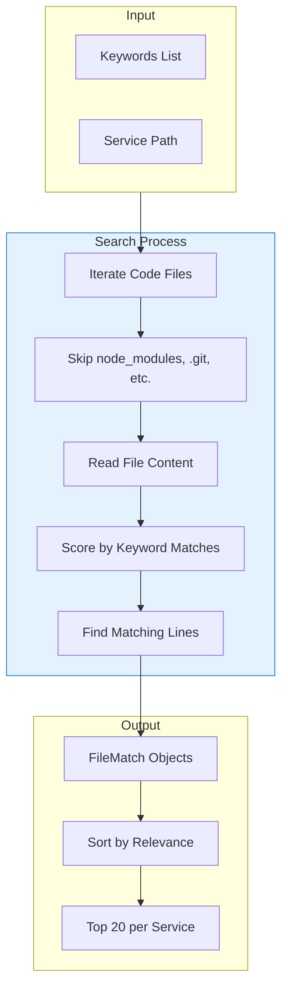

### Scoring System

| Factor | Score Impact |
|--------|--------------|
| Keyword occurrence | +1-10 per keyword (capped) |
| Multiple keywords | Additive |
| Line matches | Stored for context |

## File Categorization

The `categorizer.py` module categorizes files into modification vs reference targets.

### Categorization Logic

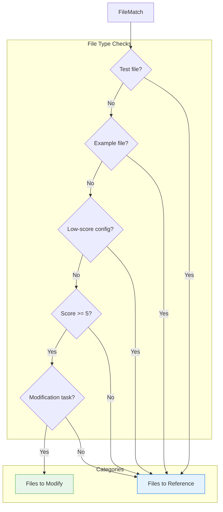

### Modification Keywords

The categorizer uses these keywords to detect modification tasks:

| Keyword | Action Type |
|---------|-------------|
| `add`, `create`, `new` | Creation |
| `implement`, `build` | Implementation |
| `fix`, `update`, `change`, `modify` | Modification |

## Service Matching

The `service_matcher.py` module suggests relevant services based on task description.

### Service Scoring

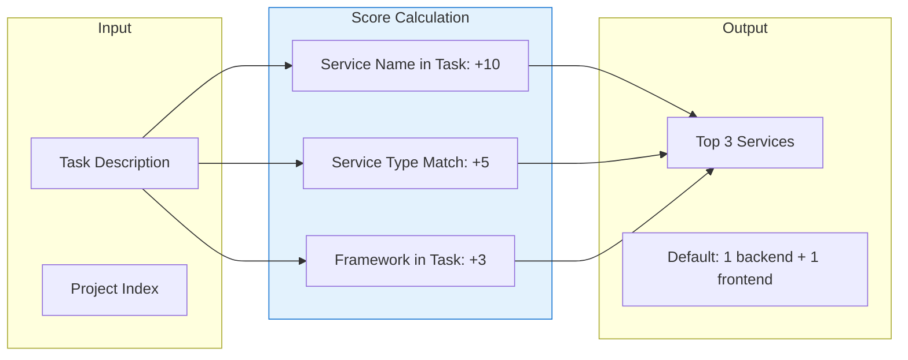

### Service Type Mapping

| Service Type | Trigger Keywords |
|--------------|------------------|
| `backend` | api, endpoint, route, database, model |
| `frontend` | ui, component, page, button, form |
| `worker` | job, task, queue, background, async |
| `scraper` | scrape, crawl, fetch, parse |

## Keyword Extraction

The `keyword_extractor.py` module extracts meaningful keywords from task descriptions.

### Extraction Process

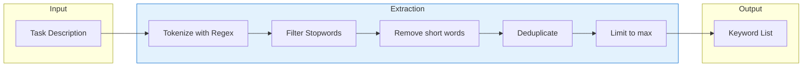

### Stopwords

Common words filtered out include:
- Articles: a, an, the
- Prepositions: to, for, of, in, on, at, by, with
- Verbs: is, are, was, were, be, have, has, do, does
- Action words: add, create, make, implement, build, fix, update

## Lazy Import Pattern

Both modules use Python's `__getattr__` for lazy imports:

```mermaid
flowchart TB
    Import[Import core.function]
    GetAttr["__getattr__(name)"]

    subgraph Routes["Name Routing"]
        CheckAgent{Agent functions?}
        CheckWorkspace{Workspace?}
        CheckWorktree{Worktree?}
        CheckProgress{Progress?}
        CheckClient{Client?}
    end

    subgraph Imports["Lazy Imports"]
        ImportAgent[from .agent import ...]
        ImportWorkspace[from .workspace import ...]
        ImportWorktree[from .worktree import ...]
        ImportProgress[from .progress import ...]
        ImportClient[from .client import ...]
    end

    Import --> GetAttr
    GetAttr --> Routes
    CheckAgent -->|Yes| ImportAgent
    CheckWorkspace -->|Yes| ImportWorkspace
    CheckWorktree -->|Yes| ImportWorktree
    CheckProgress -->|Yes| ImportProgress
    CheckClient -->|Yes| ImportClient

    style Routes fill:#e3f2fd,stroke:#1976d2
    style Imports fill:#e8f5e9,stroke:#4caf50
```

## Integration Points

### External Dependencies

```mermaid
flowchart LR
    Core[Core Module]
    Context[Context Module]

    subgraph External["External Services"]
        Claude[Claude Agent SDK]
        Git[Git]
        Graphiti[Graphiti Memory]
    end

    subgraph Internal["Internal Modules"]
        Agents[agents/]
        Analysis[analysis/]
        UI[ui/]
        Security[security/]
    end

    Core <-->|Execute| Claude
    Core <-->|Manage| Git
    Context <-->|Hints| Graphiti
    Core --> Agents
    Context --> Analysis
    Core --> UI
    Core --> Security

    style External fill:#fce4ec,stroke:#e91e63
    style Internal fill:#e8f5e9,stroke:#4caf50
```

### Key Dependencies

| Module | Dependency | Purpose |
|--------|------------|---------|
| `core.client` | `claude_agent_sdk` | AI agent execution |
| `core.auth` | `subprocess`, `json` | Keychain access |
| `core.workspace` | `subprocess`, `git` | Git operations |
| `context.builder` | `analysis` | Project index loading |
| `context.graphiti_integration` | `graphiti_memory` | Cross-session memory |

## Error Handling

### Authentication Errors

```mermaid
flowchart TB
    Check{Token found?}
    Check -->|No| BuildError[Build Error Message]
    BuildError --> CheckOS{macOS?}
    CheckOS -->|Yes| MacHelp[Keychain + .env instructions]
    CheckOS -->|No| WinHelp[.env instructions only]
    MacHelp --> Raise[Raise ValueError]
    WinHelp --> Raise
```

### Worktree Errors

| Error | Cause | Resolution |
|-------|-------|------------|
| `WorktreeError` | Branch namespace conflict | Rename conflicting branch |
| Merge conflict | Diverged branches | AI resolution or manual |
| Missing worktree | Deleted or corrupted | Recreate from spec |

## Next Steps

- [Agents Module](./agents.md) - Agent execution system
- [Analysis Module](./analysis.md) - Project analysis system
- [CLI Module](./cli.md) - Command-line interface
- [Integration Points](../architecture/integration.md) - System integration
