# Implementation Plan & Integrations

The implementation plan module provides the data structures and logic for managing task execution plans, while integrations connect Auto-Claude to external services like Graphiti (memory) and Linear (task tracking).

## Module Overview

The planning system organizes work into hierarchical structures: Plans contain Phases, which contain Subtasks. This enables complex features to be broken down into manageable, trackable units of work.

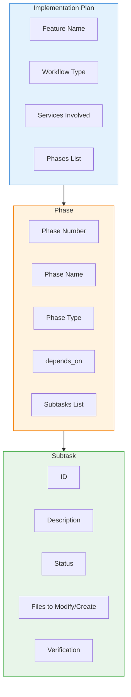

## Directory Structure

```
apps/backend/
├── implementation_plan/
│   ├── __init__.py          # Public API exports
│   ├── enums.py             # Workflow, Phase, Status, Verification enums
│   ├── factories.py         # Plan creation factory functions
│   ├── phase.py             # Phase model
│   ├── plan.py              # ImplementationPlan model
│   ├── subtask.py           # Subtask model
│   └── verification.py      # Verification model
└── integrations/
    ├── __init__.py
    ├── graphiti/            # Memory integration
    │   ├── __init__.py
    │   ├── config.py        # GraphitiConfig, providers
    │   ├── memory.py        # GraphitiMemory facade
    │   └── providers_pkg/   # LLM & embedder providers
    └── linear/              # Task tracking integration
        ├── __init__.py
        ├── config.py        # LinearConfig, status mappings
        ├── integration.py   # LinearManager
        └── updater.py       # Linear update operations
```

## Implementation Plan Module

### Class Diagram

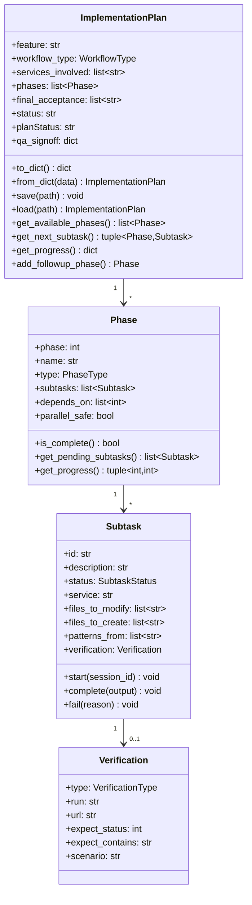

### Enumerations

The `enums.py` module defines all status and type constants:

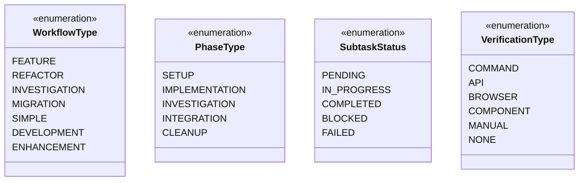

#### Workflow Types

| Type | Description | Use Case |
|------|-------------|----------|
| `FEATURE` | Multi-service feature | New functionality spanning services |
| `REFACTOR` | Stage-based migration | Add new → migrate → remove old |
| `INVESTIGATION` | Bug hunting | Reproduce → investigate → fix |
| `MIGRATION` | Data migration | Prepare → test → execute → cleanup |
| `SIMPLE` | Single-service | Minimal overhead tasks |
| `DEVELOPMENT` | General dev work | Standard development |
| `ENHANCEMENT` | Improving existing | Updates to existing features |

#### Phase Types

| Type | Description |
|------|-------------|
| `SETUP` | Project scaffolding, environment setup |
| `IMPLEMENTATION` | Writing code |
| `INVESTIGATION` | Research, debugging, analysis |
| `INTEGRATION` | Wiring services together |
| `CLEANUP` | Removing old code, polish |

#### Subtask Status Flow

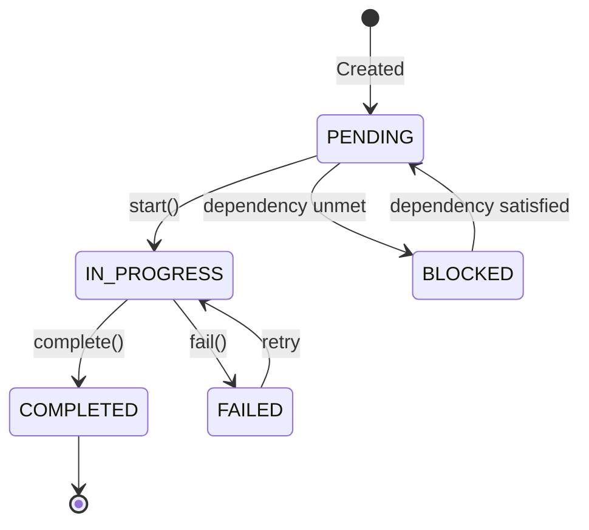

### ImplementationPlan Model

The main entry point for plan management.

#### Key Methods

```python
class ImplementationPlan:
    def get_available_phases(self) -> list[Phase]:
        """Get phases whose dependencies are satisfied."""

    def get_next_subtask(self) -> tuple[Phase, Subtask] | None:
        """Get the next subtask to work on, respecting dependencies."""

    def get_progress(self) -> dict:
        """Get overall progress statistics."""

    def add_followup_phase(
        self,
        name: str,
        subtasks: list[Subtask],
        phase_type: PhaseType = PhaseType.IMPLEMENTATION,
        parallel_safe: bool = False,
    ) -> Phase:
        """Add a new follow-up phase to an existing plan."""

    def reset_for_followup(self) -> bool:
        """Reset plan status from completed back to in_progress."""
```

#### Progress Tracking

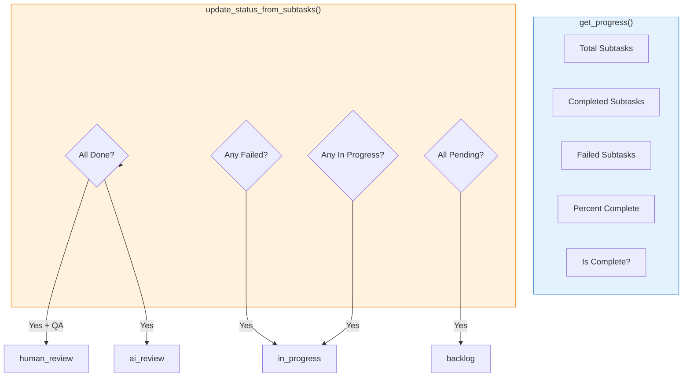

#### Status Fields

| Field | Values | Description |
|-------|--------|-------------|
| `status` | backlog, in_progress, ai_review, human_review, done | Overall task status |
| `planStatus` | pending, in_progress, review, completed | Plan execution status |

### Phase Model

Groups subtasks with dependency management.

```python
@dataclass
class Phase:
    phase: int                           # Phase number (1-indexed)
    name: str                            # Human-readable name
    type: PhaseType                      # Phase type
    subtasks: list[Subtask]              # Work items
    depends_on: list[int]                # Phase numbers that must complete first
    parallel_safe: bool = False          # Can subtasks run in parallel?
```

#### Dependency Resolution

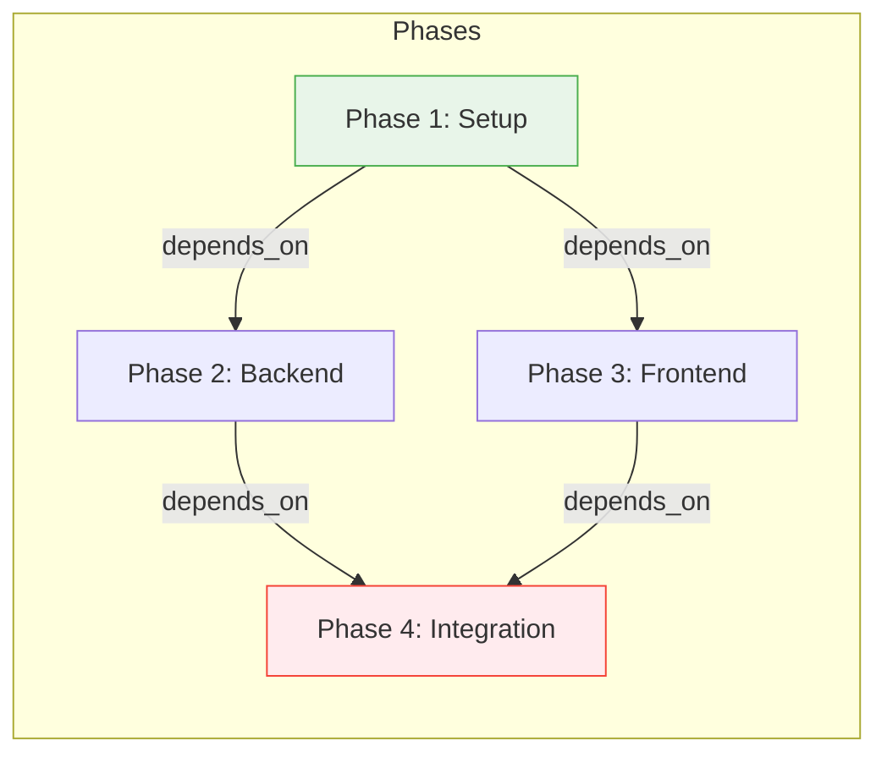

### Subtask Model

Represents a single unit of work.

```python
@dataclass
class Subtask:
    id: str                              # Unique identifier (e.g., "subtask-1-1")
    description: str                     # What needs to be done
    status: SubtaskStatus               # Current status
    service: str | None                  # Target service (backend, frontend, etc.)
    all_services: bool = False           # True for integration subtasks
    files_to_modify: list[str]           # Existing files to change
    files_to_create: list[str]           # New files to create
    patterns_from: list[str]             # Reference files for patterns
    verification: Verification | None    # How to verify completion
    expected_output: str | None          # For investigation subtasks
    actual_output: str | None            # What was discovered/done
    session_id: int | None               # Which session completed this
```

#### Subtask Lifecycle

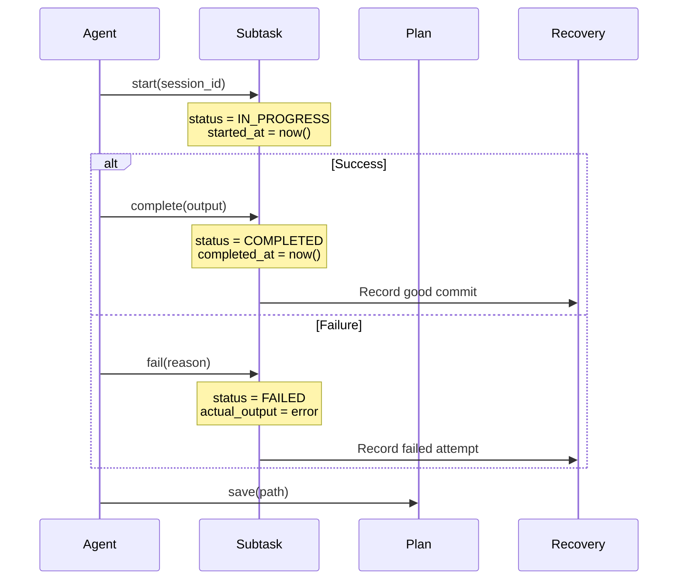

### Verification Model

Defines how to verify subtask completion.

```python
@dataclass
class Verification:
    type: VerificationType               # How to verify
    run: str | None                      # Command to run
    url: str | None                      # URL for API/browser tests
    method: str | None                   # HTTP method
    expect_status: int | None            # Expected HTTP status
    expect_contains: str | None          # Expected content
    scenario: str | None                 # Description for manual tests
```

#### Verification Types

| Type | Usage | Example |
|------|-------|---------|
| `COMMAND` | Shell command | `npm test`, `pytest` |
| `API` | HTTP request | Health check endpoint |
| `BROWSER` | Browser automation | Playwright test |
| `COMPONENT` | Component render test | React component test |
| `MANUAL` | Human verification | Visual inspection |
| `NONE` | Investigation tasks | No verification needed |

### Factory Functions

The `factories.py` module provides helpers for creating plans:

```python
def create_feature_plan(
    feature: str,
    services: list[str],
    phases_config: list[dict],
) -> ImplementationPlan:
    """Create a standard feature implementation plan."""

def create_investigation_plan(
    bug_description: str,
    services: list[str],
) -> ImplementationPlan:
    """Create an investigation plan with structured debugging phases."""

def create_refactor_plan(
    refactor_description: str,
    services: list[str],
    stages: list[dict],
) -> ImplementationPlan:
    """Create a refactor plan with stage-based phases."""
```

#### Investigation Plan Structure

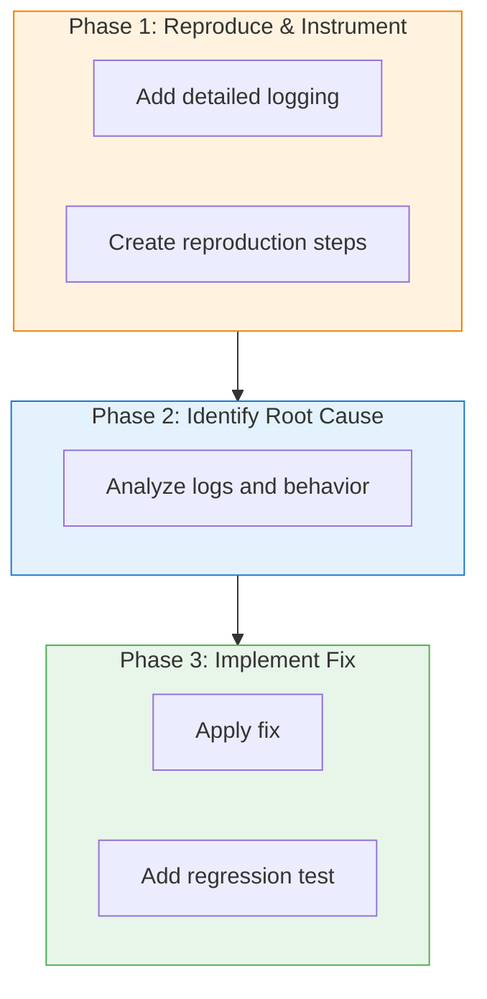

---

## Graphiti Integration

Graphiti provides persistent cross-session memory using a knowledge graph database (LadybugDB).

### Architecture

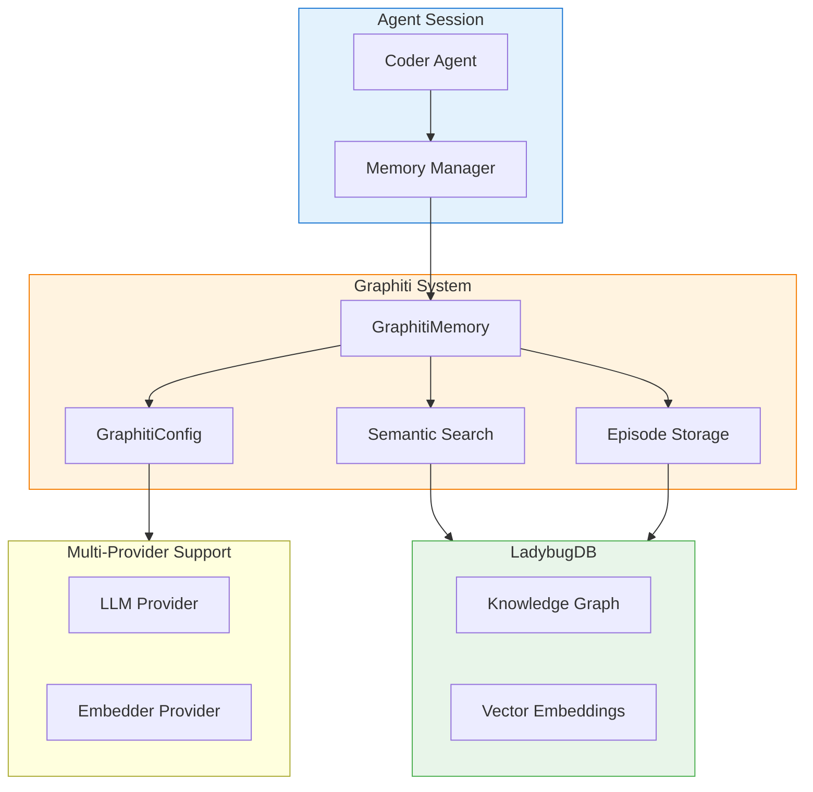

### GraphitiConfig

Configuration for multi-provider memory integration:

```python
@dataclass
class GraphitiConfig:
    # Core settings
    enabled: bool = False
    llm_provider: str = "openai"
    embedder_provider: str = "openai"

    # Database settings (LadybugDB - embedded, no Docker required)
    database: str = "auto_claude_memory"
    db_path: str = "~/.auto-claude/memories"

    # Provider-specific settings
    openai_api_key: str = ""
    anthropic_api_key: str = ""
    voyage_api_key: str = ""
    google_api_key: str = ""
    ollama_base_url: str = "http://localhost:11434"

    @classmethod
    def from_env(cls) -> "GraphitiConfig":
        """Create config from environment variables."""

    def is_valid(self) -> bool:
        """Check if config has minimum required values."""

    def get_embedding_dimension(self) -> int:
        """Get the embedding dimension for current provider."""
```

### Supported Providers

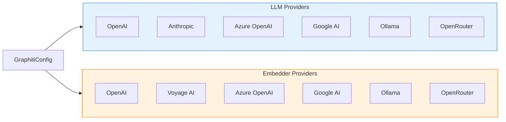

### Environment Variables

| Variable | Description | Default |
|----------|-------------|---------|
| `GRAPHITI_ENABLED` | Enable Graphiti integration | false |
| `GRAPHITI_LLM_PROVIDER` | LLM provider | openai |
| `GRAPHITI_EMBEDDER_PROVIDER` | Embedder provider | openai |
| `GRAPHITI_DATABASE` | Database name | auto_claude_memory |
| `GRAPHITI_DB_PATH` | Database storage path | ~/.auto-claude/memories |
| `OPENAI_API_KEY` | OpenAI API key | - |
| `VOYAGE_API_KEY` | Voyage AI API key | - |
| `OLLAMA_EMBEDDING_MODEL` | Ollama embedding model | - |

### Episode Types

Memory is stored as episodes with semantic categorization:

| Type | Description |
|------|-------------|
| `session_insight` | Session learnings and outcomes |
| `codebase_discovery` | File and pattern discoveries |
| `pattern` | Code patterns and conventions |
| `gotcha` | Pitfalls and warnings |
| `task_outcome` | Task completion results |
| `qa_result` | QA validation results |
| `historical_context` | Historical project context |

### Memory Flow

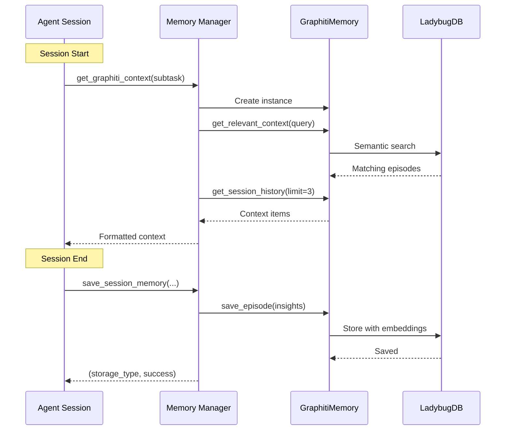

### GraphitiMemory API

```python
class GraphitiMemory:
    def __init__(
        self,
        spec_dir: Path,
        project_dir: Path,
        group_id_mode: str = "spec",
    ):
        """Initialize memory for a spec."""

    async def get_relevant_context(
        self,
        query: str,
        limit: int = 10,
    ) -> list[dict]:
        """Search for relevant context using semantic search."""

    async def get_session_history(
        self,
        limit: int = 5,
    ) -> list[dict]:
        """Get recent session history."""

    async def save_episode(
        self,
        content: str,
        episode_type: str,
        metadata: dict | None = None,
    ) -> bool:
        """Save a new episode to the knowledge graph."""

    async def close(self) -> None:
        """Close connections and cleanup."""
```

### Group ID Modes

| Mode | Description | Use Case |
|------|-------------|----------|
| `spec` | Isolated memory per spec | Default - each build has own context |
| `project` | Shared across project | Cross-build knowledge sharing |

---

## Linear Integration

Linear integration provides real-time task tracking visibility through Linear's project management system.

### Architecture

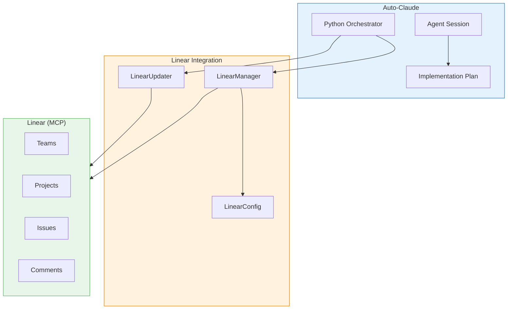

### Design Principles

1. **ONE task per spec** - Not one issue per subtask
2. **Python orchestrator controls** - Updates happen at key transitions
3. **Small focused prompts** - Can't lose context
4. **Graceful degradation** - Build continues if Linear unavailable

### Status Flow

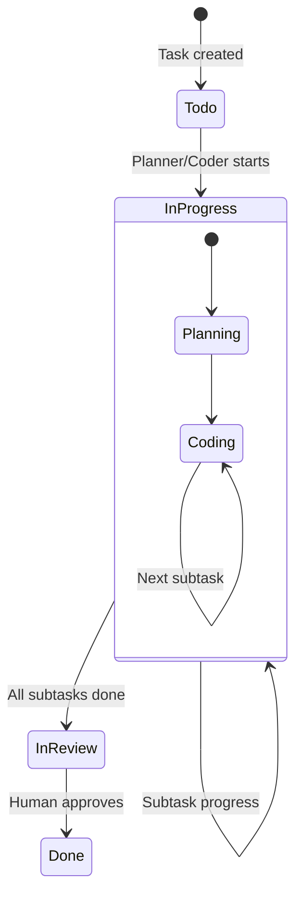

### LinearConfig

```python
@dataclass
class LinearConfig:
    api_key: str
    team_id: str | None = None
    project_id: str | None = None
    project_name: str | None = None
    meta_issue_id: str | None = None
    enabled: bool = True

    @classmethod
    def from_env(cls) -> "LinearConfig":
        """Create config from environment variables."""

    def is_valid(self) -> bool:
        """Check if config has minimum required values."""
```

### LinearManager

High-level interface for Linear operations:

```python
class LinearManager:
    def __init__(self, spec_dir: Path, project_dir: Path):
        """Initialize Linear manager."""

    @property
    def is_enabled(self) -> bool:
        """Check if Linear integration is enabled."""

    @property
    def is_initialized(self) -> bool:
        """Check if Linear project has been initialized."""

    def get_issue_id(self, subtask_id: str) -> str | None:
        """Get the Linear issue ID for a subtask."""

    def set_issue_id(self, subtask_id: str, issue_id: str) -> None:
        """Store subtask to issue mapping."""

    def initialize_project(self, team_id: str, project_name: str) -> bool:
        """Initialize a Linear project for this spec."""

    def record_session_result(
        self,
        subtask_id: str,
        session_num: int,
        success: bool,
        approach: str = "",
        error: str = "",
        git_commit: str = "",
    ) -> str:
        """Record a session result as a Linear comment."""

    def prepare_stuck_escalation(
        self,
        subtask_id: str,
        attempt_count: int,
        attempts: list[dict],
        reason: str = "",
    ) -> dict:
        """Prepare data for escalating a stuck subtask."""
```

### LinearUpdater

Python-orchestrated Linear updates via mini-agent calls:

```python
async def create_linear_task(
    spec_dir: Path,
    title: str,
    description: str | None = None,
) -> LinearTaskState | None:
    """Create a new Linear task for a spec."""

async def update_linear_status(
    spec_dir: Path,
    new_status: str,
) -> bool:
    """Update the Linear task status."""

async def add_linear_comment(
    spec_dir: Path,
    comment: str,
) -> bool:
    """Add a comment to the Linear task."""
```

### Convenience Functions

| Function | Trigger | Description |
|----------|---------|-------------|
| `linear_task_started()` | Planner begins | Mark task In Progress |
| `linear_subtask_completed()` | Coder succeeds | Record completion comment |
| `linear_subtask_failed()` | Coder fails | Record failure comment |
| `linear_build_complete()` | All done | Record completion |
| `linear_qa_started()` | QA begins | Mark In Review |
| `linear_qa_approved()` | QA passes | Record approval |
| `linear_qa_rejected()` | QA fails | Record issues found |
| `linear_task_stuck()` | Max retries | Record stuck status |

### Linear MCP Tools

| Tool | Description |
|------|-------------|
| `mcp__linear-server__list_teams` | List available teams |
| `mcp__linear-server__create_issue` | Create a new issue |
| `mcp__linear-server__update_issue` | Update issue status |
| `mcp__linear-server__create_comment` | Add comment to issue |
| `mcp__linear-server__list_issue_statuses` | Get workflow states |

### Status Mappings

| Subtask Status | Linear Status |
|----------------|---------------|
| `pending` | Todo |
| `in_progress` | In Progress |
| `completed` | Done |
| `blocked` | Blocked |
| `failed` | Blocked |
| `stuck` | Blocked |

### Priority Mapping

Priority is based on phase position:

| Position | Priority | Value |
|----------|----------|-------|
| First 25% | Urgent | 1 |
| 25-50% | High | 2 |
| 50-75% | Medium | 3 |
| Last 25% | Low | 4 |

---

## Integration Points

### Plan + Graphiti Flow

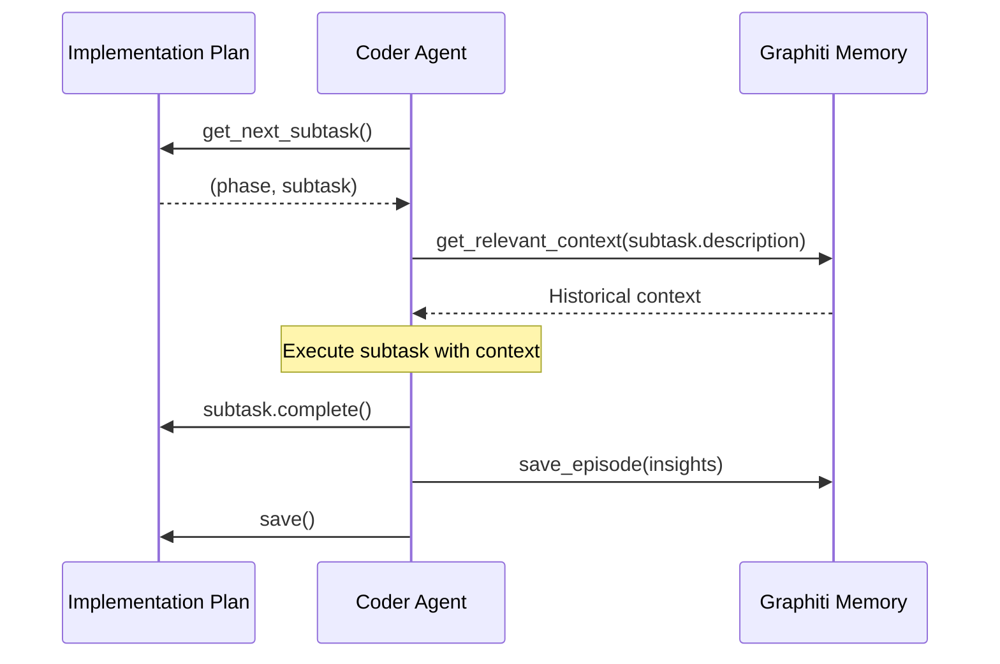

### Plan + Linear Flow

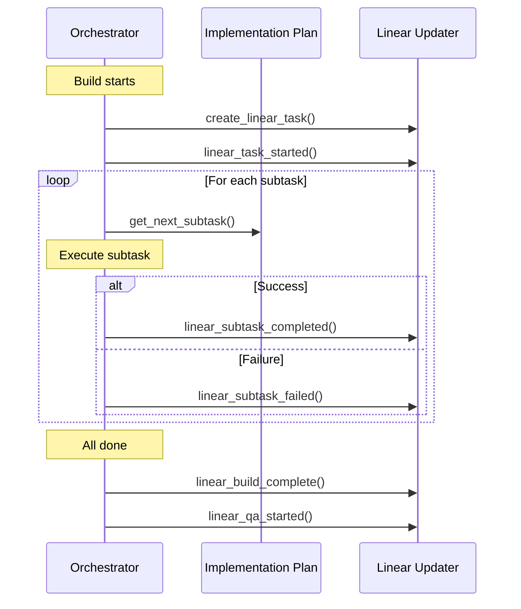

## Error Handling

### Graceful Degradation

Both integrations are designed to fail gracefully:

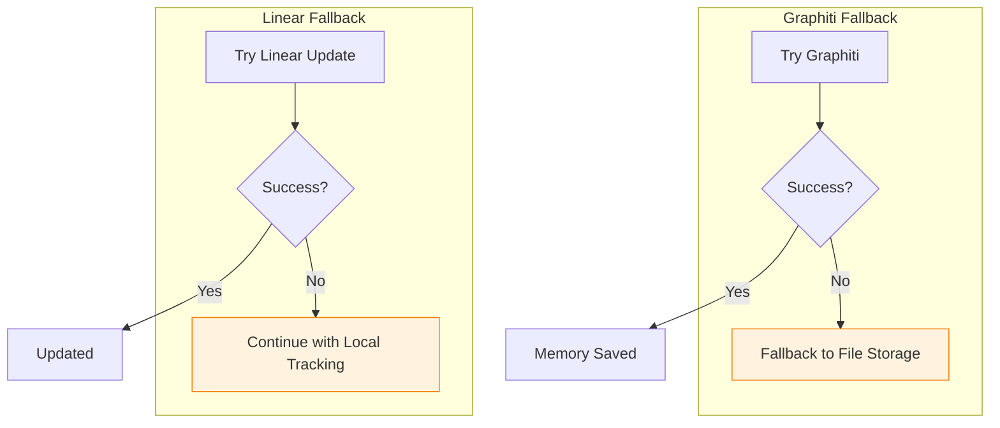

### Key Error Behaviors

| Scenario | Graphiti | Linear |
|----------|----------|--------|
| Not enabled | Skip silently | Skip silently |
| Connection failed | Fallback to file | Log warning, continue |
| API error | Fallback to file | Log error, continue |
| Invalid config | Return None | Return False |

## Usage Examples

### Creating a Plan

```python
from implementation_plan import ImplementationPlan, create_feature_plan

# Create from factory
plan = create_feature_plan(
    feature="Add user authentication",
    services=["backend", "frontend"],
    phases_config=[
        {
            "name": "Backend Setup",
            "type": "implementation",
            "subtasks": [
                {
                    "id": "subtask-1-1",
                    "description": "Add auth middleware",
                    "service": "backend",
                    "files_to_create": ["apps/backend/auth/middleware.py"],
                }
            ],
        },
        {
            "name": "Frontend Integration",
            "type": "implementation",
            "depends_on": [1],
            "subtasks": [...],
        },
    ],
)

# Save plan
plan.save(spec_dir / "implementation_plan.json")
```

### Using Graphiti Memory

```python
from integrations.graphiti import GraphitiMemory, is_graphiti_enabled

if is_graphiti_enabled():
    memory = GraphitiMemory(spec_dir, project_dir)

    # Get context for a subtask
    context = await memory.get_relevant_context(
        "implement authentication middleware"
    )

    # Save session insights
    await memory.save_episode(
        content="Discovered auth pattern in existing code",
        episode_type="codebase_discovery",
        metadata={"file": "apps/backend/auth/existing.py"},
    )

    await memory.close()
```

### Using Linear Integration

```python
from integrations.linear import (
    is_linear_enabled,
    create_linear_task,
    linear_task_started,
    linear_subtask_completed,
)

if is_linear_enabled():
    # Create task at build start
    state = await create_linear_task(
        spec_dir,
        title="Add user authentication",
        description="Implement OAuth2 login flow",
    )

    # Mark as started
    await linear_task_started(spec_dir)

    # Record subtask completion
    await linear_subtask_completed(
        spec_dir,
        subtask_id="subtask-1-1",
        completed_count=1,
        total_count=5,
    )
```

## Next Steps

- [Agents Module](./agents.md) - Agent system documentation
- [Context Module](./context.md) - Context building and search
- [CLI Module](./cli.md) - Command-line interface
- [Recovery Module](./recovery.md) - Error recovery and rollback
