# IPC Handlers

The IPC (Inter-Process Communication) handlers module provides the communication layer between Electron's main process and renderer process. It organizes all IPC handlers by domain into separate modules for maintainability and clear separation of concerns.

## Module Overview

The IPC handlers are organized into domain-specific modules, each handling a specific area of functionality:

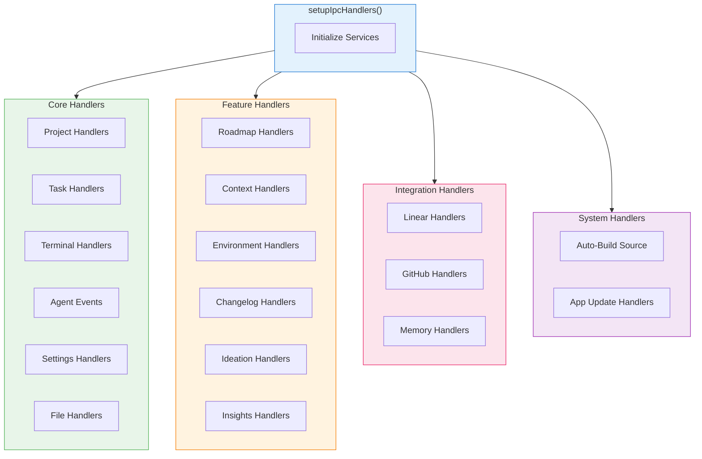

## Module Structure

```
apps/frontend/src/main/ipc-handlers/
├── index.ts                    # Main setup function, exports all handlers
├── project-handlers.ts         # Project CRUD, Git operations, Python env
├── task-handlers.ts            # Task entry point (delegates to task/)
├── task/                       # Task module subdirectory
│   ├── index.ts               # Task handler registration
│   ├── crud-handlers.ts       # Create, Read, Update, Delete
│   ├── execution-handlers.ts  # Start, Stop, Review, Status
│   ├── worktree-handlers.ts   # Git worktree operations
│   ├── logs-handlers.ts       # Task log management
│   └── shared.ts              # Shared utilities
├── terminal-handlers.ts        # Terminal/PTY management, Claude profiles
├── agent-events-handlers.ts    # Event forwarding to renderer
├── settings-handlers.ts        # App settings, dialogs
├── file-handlers.ts            # File explorer operations
├── roadmap-handlers.ts         # Roadmap generation/management
├── context-handlers.ts         # Context entry point (delegates to context/)
├── context/                    # Context module subdirectory
│   ├── index.ts               # Context handler registration
│   ├── memory-status-handlers.ts
│   ├── memory-data-handlers.ts
│   └── project-context-handlers.ts
├── env-handlers.ts             # Environment configuration
├── linear-handlers.ts          # Linear integration
├── github-handlers.ts          # GitHub entry point (delegates to github/)
├── github/                     # GitHub module subdirectory
│   ├── index.ts               # GitHub handler registration
│   ├── repository-handlers.ts
│   ├── issue-handlers.ts
│   ├── investigation-handlers.ts
│   ├── import-handlers.ts
│   ├── release-handlers.ts
│   ├── utils.ts
│   ├── spec-utils.ts
│   └── types.ts
├── ideation-handlers.ts        # Ideation entry point (delegates to ideation/)
├── ideation/                   # Ideation module subdirectory
├── changelog-handlers.ts       # Changelog generation
├── insights-handlers.ts        # AI insights/chat
├── memory-handlers.ts          # Memory infrastructure (Graphiti/LadybugDB)
├── autobuild-source-handlers.ts # Source updates
├── app-update-handlers.ts      # Electron auto-updates
└── utils.ts                    # Shared utility functions
```

## Communication Architecture

### IPC Communication Flow

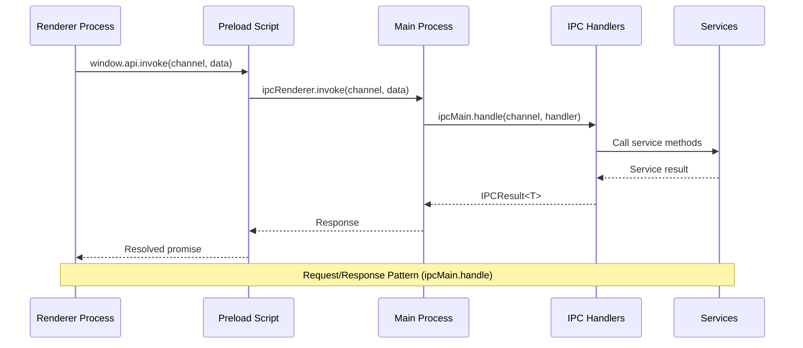

### Event-Based Communication

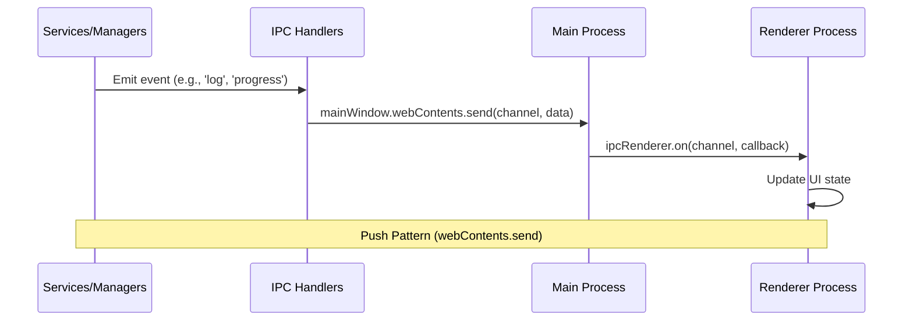

## Handler Registration Flow

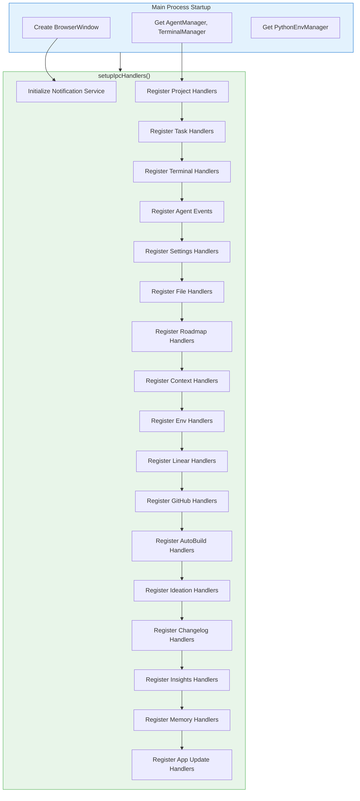

## Core Handlers

### Project Handlers

Manages project lifecycle, Git operations, and Python environment initialization.

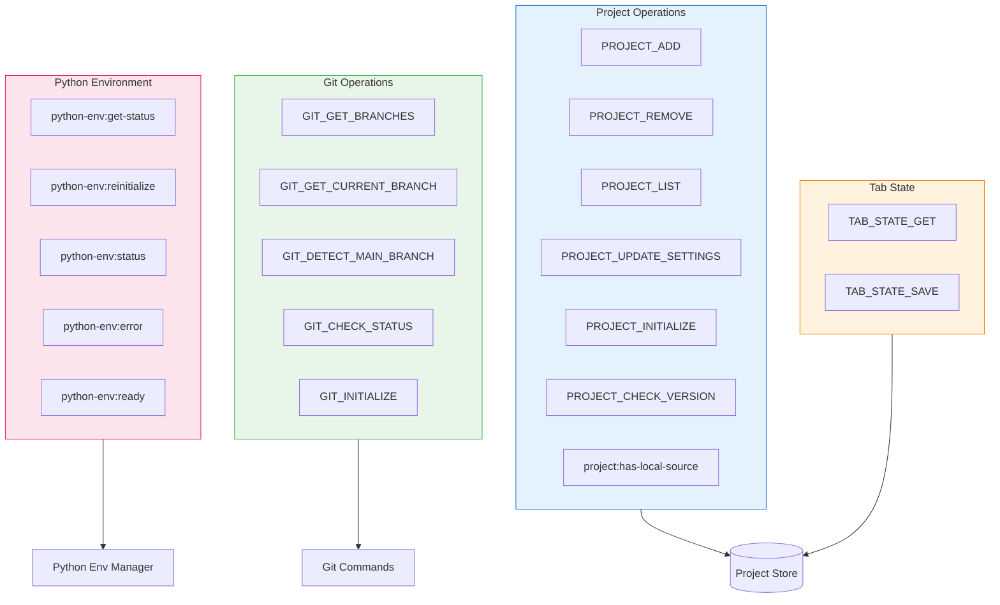

#### Key IPC Channels

| Channel | Type | Description |
|---------|------|-------------|
| `PROJECT_ADD` | handle | Add a new project to the workspace |
| `PROJECT_REMOVE` | handle | Remove a project from the workspace |
| `PROJECT_LIST` | handle | Get all projects with validation |
| `PROJECT_UPDATE_SETTINGS` | handle | Update project-specific settings |
| `PROJECT_INITIALIZE` | handle | Initialize .auto-claude in project |
| `GIT_GET_BRANCHES` | handle | List all git branches |
| `GIT_DETECT_MAIN_BRANCH` | handle | Auto-detect main/master branch |
| `python-env:get-status` | handle | Get Python environment status |
| `python-env:reinitialize` | handle | Reinitialize Python venv |

### Task Handlers

Organized into focused submodules for task management, execution, and worktree operations.

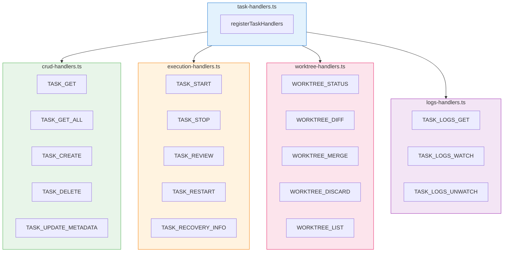

#### Task Execution Sequence

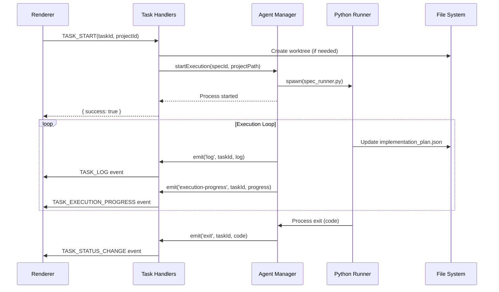

### Terminal Handlers

Manages PTY terminals and Claude profile multi-account support.

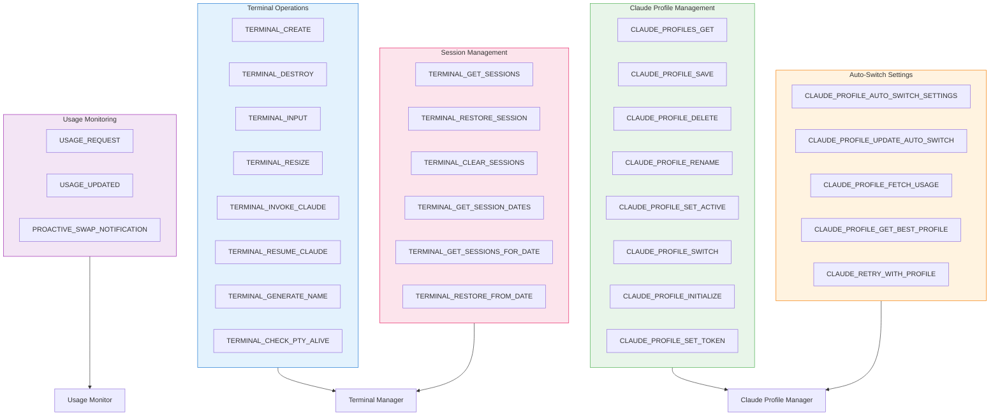

#### Claude Profile Switch Flow

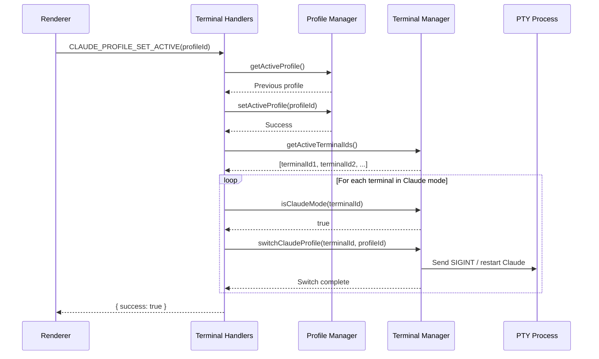

### Agent Events Handlers

Forwards events from the Agent Manager to the renderer process.

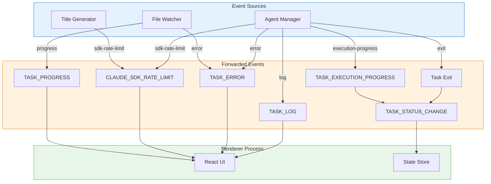

#### Event Flow for Task Execution

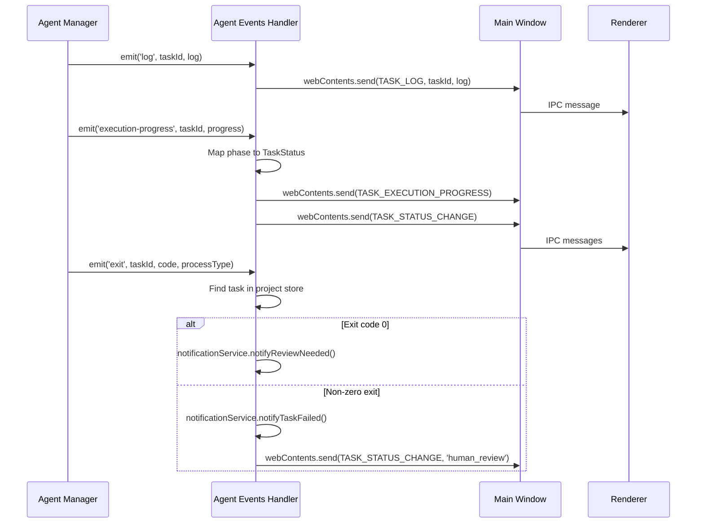

### Settings Handlers

Manages application settings, dialog operations, and shell commands.

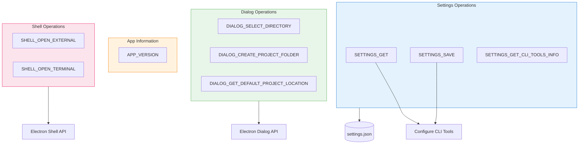

### File Handlers

Provides file explorer functionality with smart filtering.

```mermaid
flowchart LR
    subgraph Request
        List[FILE_EXPLORER_LIST]
        DirPath[Directory Path]
    end

    subgraph Processing
        ReadDir[readdir with types]
        Filter[Filter Ignored]
        Sort[Sort Results]
    end

    subgraph Ignored["Ignored Directories"]
        NodeModules[node_modules]
        Git[.git]
        PyCache[__pycache__]
        Dist[dist/build]
        VEnv[.venv/venv]
        Worktrees[.worktrees]
    end

    subgraph Output
        FileNodes[FileNode[]]
    end

    List --> DirPath
    DirPath --> ReadDir
    ReadDir --> Filter
    Filter -.->|Skip| Ignored
    Filter --> Sort
    Sort --> FileNodes

    style Request fill:#e3f2fd,stroke:#1976d2
    style Processing fill:#e8f5e9,stroke:#4caf50
    style Ignored fill:#ffebee,stroke:#f44336
    style Output fill:#fff3e0,stroke:#f57c00
```

## Feature Handlers

### Roadmap Handlers

Manages AI-powered roadmap generation and feature management.

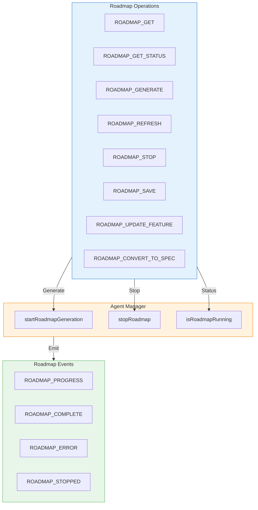

#### Roadmap Generation Sequence

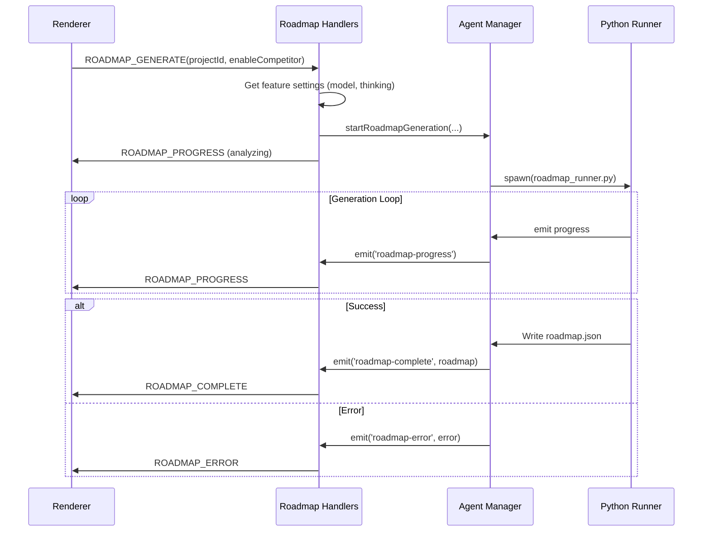

### Changelog Handlers

Generates changelogs from completed tasks or git history.

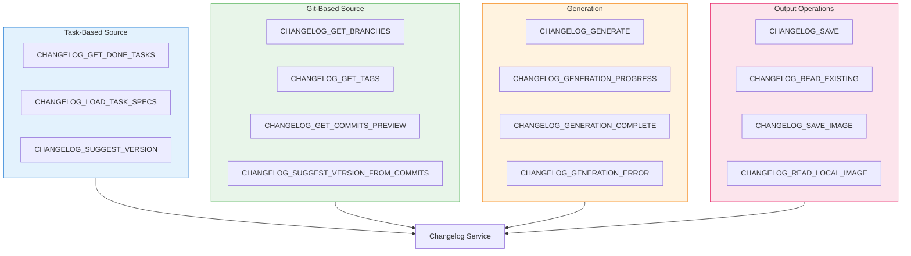

### Ideation Handlers

Manages AI-powered idea generation sessions.

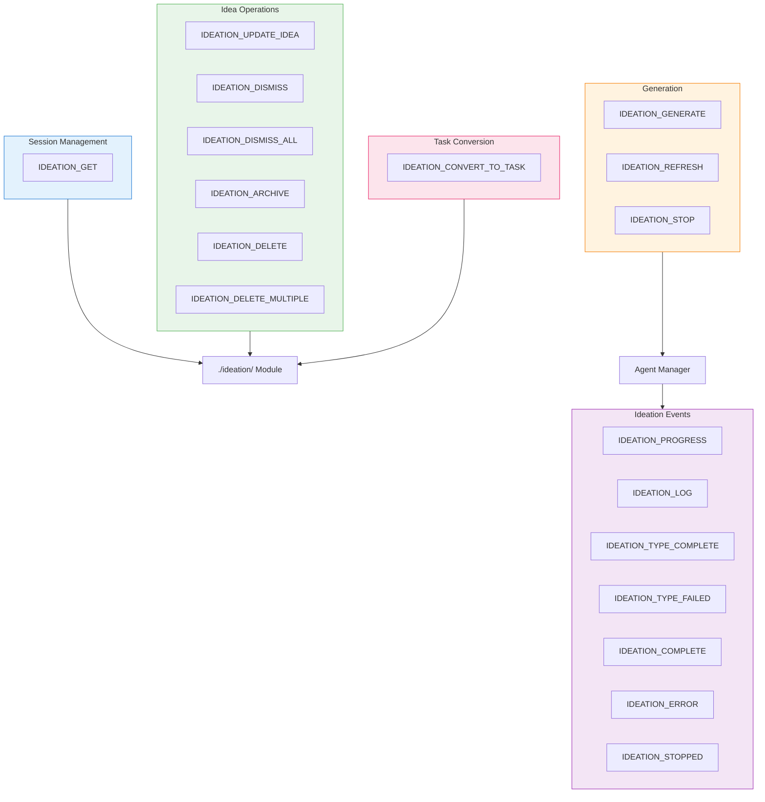

### Insights Handlers

Provides AI-powered codebase chat/analysis.

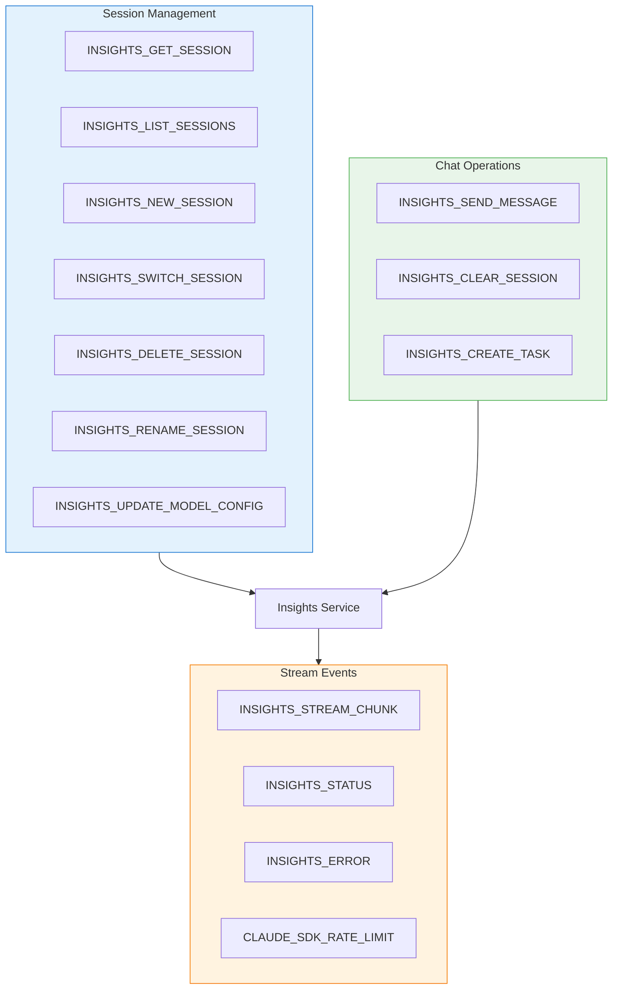

### Context Handlers

Manages project context and memory operations.

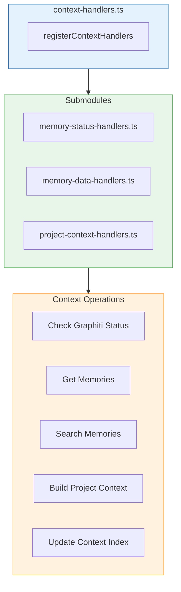

### Environment Handlers

Manages project-specific .env configuration.

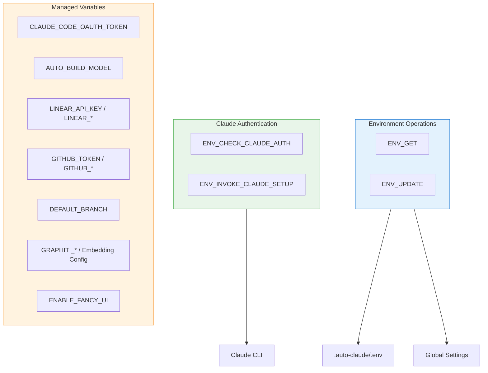

## Integration Handlers

### Linear Handlers

Integrates with Linear issue tracking.

```mermaid
flowchart TB
    subgraph Connection["Connection"]
        CheckConnection[LINEAR_CHECK_CONNECTION]
    end

    subgraph Queries["Queries"]
        GetTeams[LINEAR_GET_TEAMS]
        GetProjects[LINEAR_GET_PROJECTS]
        GetIssues[LINEAR_GET_ISSUES]
    end

    subgraph Import["Import"]
        ImportIssues[LINEAR_IMPORT_ISSUES]
    end

    subgraph Flow["Import Flow"]
        SelectIssues[Select Issues]
        FetchDetails[Fetch Issue Details]
        CreateSpec[Create Spec Directory]
        StartAgent[Start Spec Creation]
    end

    LinearAPI[Linear GraphQL API]
    ProjectStore[Project Store]
    AgentManager[Agent Manager]

    Connection --> LinearAPI
    Queries --> LinearAPI
    Import --> LinearAPI
    Import --> ProjectStore
    Import --> AgentManager

    style Connection fill:#e3f2fd,stroke:#1976d2
    style Queries fill:#e8f5e9,stroke:#4caf50
    style Import fill:#fff3e0,stroke:#f57c00
    style Flow fill:#fce4ec,stroke:#e91e63
```

#### Linear Import Sequence

```mermaid
sequenceDiagram
    participant UI as Renderer
    participant IPC as Linear Handlers
    participant API as Linear GraphQL
    participant FS as File System
    participant AM as Agent Manager

    UI->>IPC: LINEAR_IMPORT_ISSUES(projectId, issueIds)
    IPC->>API: Fetch issue details (GraphQL)
    API-->>IPC: Issue data

    loop For each issue
        IPC->>FS: Create spec directory
        IPC->>FS: Write implementation_plan.json
        IPC->>FS: Write requirements.json
        IPC->>FS: Write task_metadata.json
        IPC->>AM: startSpecCreation(specId, ...)
    end

    IPC-->>UI: { imported: N, failed: M }
```

### GitHub Handlers

Organized into modular subhandlers for GitHub integration.

```mermaid
flowchart TB
    subgraph Entry["github-handlers.ts"]
        Register[registerGithubHandlers]
    end

    subgraph Modules["Submodules"]
        Repo[repository-handlers.ts]
        Issues[issue-handlers.ts]
        Investigation[investigation-handlers.ts]
        Import[import-handlers.ts]
        Release[release-handlers.ts]
    end

    subgraph Operations["Operations"]
        CheckConnection[Check GitHub Connection]
        GetIssues[Get Issues]
        InvestigateIssue[AI Investigation]
        ImportIssues[Import to Tasks]
        CreateRelease[Create Release]
    end

    subgraph Utils["Utilities"]
        GitHubUtils[utils.ts]
        SpecUtils[spec-utils.ts]
        Types[types.ts]
    end

    Entry --> Modules
    Modules --> Operations
    Modules --> Utils

    style Entry fill:#e3f2fd,stroke:#1976d2
    style Modules fill:#e8f5e9,stroke:#4caf50
    style Operations fill:#fff3e0,stroke:#f57c00
    style Utils fill:#fce4ec,stroke:#e91e63
```

### Memory Handlers

Manages memory infrastructure (Graphiti/LadybugDB) and Ollama integration.

```mermaid
flowchart TB
    subgraph MemoryInfra["Memory Infrastructure"]
        Status[MEMORY_STATUS]
        ListDB[MEMORY_LIST_DATABASES]
        TestConnection[MEMORY_TEST_CONNECTION]
    end

    subgraph Validation["Graphiti Validation"]
        ValidateLLM[GRAPHITI_VALIDATE_LLM]
        TestGraphiti[GRAPHITI_TEST_CONNECTION]
    end

    subgraph Ollama["Ollama Operations"]
        CheckStatus[OLLAMA_CHECK_STATUS]
        ListModels[OLLAMA_LIST_MODELS]
        ListEmbedding[OLLAMA_LIST_EMBEDDING_MODELS]
        PullModel[OLLAMA_PULL_MODEL]
        PullProgress[OLLAMA_PULL_PROGRESS]
    end

    subgraph Services["Services"]
        MemService[Memory Service]
        OllamaDetector[ollama_model_detector.py]
        APIValidation[API Validation Service]
    end

    MemoryInfra --> MemService
    Validation --> APIValidation
    Ollama --> OllamaDetector

    style MemoryInfra fill:#e3f2fd,stroke:#1976d2
    style Validation fill:#e8f5e9,stroke:#4caf50
    style Ollama fill:#fff3e0,stroke:#f57c00
    style Services fill:#fce4ec,stroke:#e91e63
```

#### Ollama Model Pull Sequence

```mermaid
sequenceDiagram
    participant UI as Renderer
    participant IPC as Memory Handlers
    participant Py as ollama_model_detector.py
    participant Ollama as Ollama Service

    UI->>IPC: OLLAMA_PULL_MODEL(modelName)
    IPC->>Py: spawn(['pull-model', modelName])
    Py->>Ollama: ollama pull modelName

    loop Download Progress
        Ollama->>Py: NDJSON progress
        Py->>IPC: stderr with progress JSON
        IPC->>IPC: Parse NDJSON
        IPC->>UI: OLLAMA_PULL_PROGRESS event
    end

    Py->>IPC: Exit code + final status
    IPC-->>UI: { model, status: completed }
```

## System Handlers

### Auto-Build Source Handlers

Manages Auto-Claude source code updates.

```mermaid
flowchart TB
    subgraph Updates["Update Operations"]
        Check[AUTOBUILD_SOURCE_CHECK]
        Download[AUTOBUILD_SOURCE_DOWNLOAD]
        Version[AUTOBUILD_SOURCE_VERSION]
    end

    subgraph Progress["Update Progress Events"]
        Checking[Stage: checking]
        Downloading[Stage: downloading]
        Extracting[Stage: extracting]
        Complete[Stage: complete]
        Error[Stage: error]
    end

    subgraph Env["Source Environment"]
        EnvGet[AUTOBUILD_SOURCE_ENV_GET]
        EnvUpdate[AUTOBUILD_SOURCE_ENV_UPDATE]
        EnvCheckToken[AUTOBUILD_SOURCE_ENV_CHECK_TOKEN]
    end

    Updater[auto-claude-updater]

    Updates --> Updater
    Download --> Progress
    Env --> SourcePath[Effective Source Path]

    style Updates fill:#e3f2fd,stroke:#1976d2
    style Progress fill:#fff3e0,stroke:#f57c00
    style Env fill:#e8f5e9,stroke:#4caf50
```

### App Update Handlers

Handles Electron app auto-updates.

```mermaid
flowchart LR
    subgraph Handlers["App Update Handlers"]
        Check[APP_UPDATE_CHECK]
        Download[APP_UPDATE_DOWNLOAD]
        Install[APP_UPDATE_INSTALL]
        GetVersion[APP_UPDATE_GET_VERSION]
    end

    subgraph Updater["App Updater"]
        CheckFn[checkForUpdates]
        DownloadFn[downloadUpdate]
        InstallFn[quitAndInstall]
        VersionFn[getCurrentVersion]
    end

    Check --> CheckFn
    Download --> DownloadFn
    Install --> InstallFn
    GetVersion --> VersionFn

    style Handlers fill:#e3f2fd,stroke:#1976d2
    style Updater fill:#e8f5e9,stroke:#4caf50
```

## IPCResult Pattern

All IPC handlers return a consistent `IPCResult<T>` type:

```mermaid
classDiagram
    class IPCResult~T~ {
        +success: boolean
        +data?: T
        +error?: string
    }

    class SuccessResult~T~ {
        +success: true
        +data: T
    }

    class ErrorResult {
        +success: false
        +error: string
    }

    IPCResult <|-- SuccessResult
    IPCResult <|-- ErrorResult
```

### Usage Pattern

```typescript
// Handler implementation
ipcMain.handle(
  IPC_CHANNELS.EXAMPLE_CHANNEL,
  async (_, param: string): Promise<IPCResult<Data>> => {
    try {
      const result = await someOperation(param);
      return { success: true, data: result };
    } catch (error) {
      return {
        success: false,
        error: error instanceof Error ? error.message : 'Unknown error'
      };
    }
  }
);

// Renderer usage
const result = await window.api.invoke('example:channel', param);
if (result.success) {
  console.log(result.data);
} else {
  console.error(result.error);
}
```

## Handler Types

### ipcMain.handle vs ipcMain.on

```mermaid
flowchart TB
    subgraph Handle["ipcMain.handle (Request/Response)"]
        HandleReq[Renderer invokes]
        HandleProc[Handler processes]
        HandleRes[Returns Promise<IPCResult>]
        HandleReq --> HandleProc --> HandleRes
    end

    subgraph On["ipcMain.on (Fire-and-Forget)"]
        OnReq[Renderer sends]
        OnProc[Handler processes]
        OnEvent[Sends events back via webContents.send]
        OnReq --> OnProc --> OnEvent
    end

    style Handle fill:#e3f2fd,stroke:#1976d2
    style On fill:#fff3e0,stroke:#f57c00
```

| Method | Use Case | Return |
|--------|----------|--------|
| `ipcMain.handle` | Request/response pattern | `Promise<IPCResult<T>>` |
| `ipcMain.on` | Long-running operations, streaming | Events via `webContents.send` |

## Error Handling Strategy

```mermaid
flowchart TB
    Handler[IPC Handler]
    TryCatch{Try/Catch Block}

    subgraph Success["Success Path"]
        Process[Process Request]
        Return[Return { success: true, data }]
    end

    subgraph Error["Error Path"]
        Catch[Catch Exception]
        Format[Format Error Message]
        ReturnError[Return { success: false, error }]
    end

    Handler --> TryCatch
    TryCatch -->|try| Process
    Process --> Return
    TryCatch -->|catch| Catch
    Catch --> Format
    Format --> ReturnError

    style Success fill:#e8f5e9,stroke:#4caf50
    style Error fill:#ffebee,stroke:#f44336
```

## Security Considerations

### Input Validation

All handlers validate inputs before processing:

```mermaid
flowchart LR
    Input[User Input]
    Validate{Validate}
    Process[Process Request]
    Error[Return Error]

    Input --> Validate
    Validate -->|Valid| Process
    Validate -->|Invalid| Error

    style Validate fill:#fff3e0,stroke:#f57c00
    style Process fill:#e8f5e9,stroke:#4caf50
    style Error fill:#ffebee,stroke:#f44336
```

### Path Security

- Project paths validated for existence
- File operations restricted to project directories
- Shell commands use `execFileSync` with argument arrays (no shell injection)

## Performance Considerations

| Aspect | Implementation |
|--------|----------------|
| **Lazy Loading** | Handler modules loaded on demand |
| **Event Batching** | Progress events throttled where appropriate |
| **Streaming** | Long-running operations stream updates |
| **Connection Pooling** | Linear/GitHub API connections reused |
| **Caching** | Settings and environment configs cached |

## Next Steps

- [Preload API](./preload-api.md) - Preload script documentation
- [Agent Manager](./agent-manager.md) - Agent Manager documentation
- [Terminal Manager](./terminal-manager.md) - Terminal Manager documentation
- [Services](./services.md) - Backend services documentation
