# Main Process Architecture

The Electron main process serves as the backend of the Auto-Claude desktop application, orchestrating agent processes, managing terminals, handling IPC communication with the renderer, and integrating with Python backend scripts. It provides the core infrastructure that bridges the user interface with the autonomous coding system.

## Module Overview

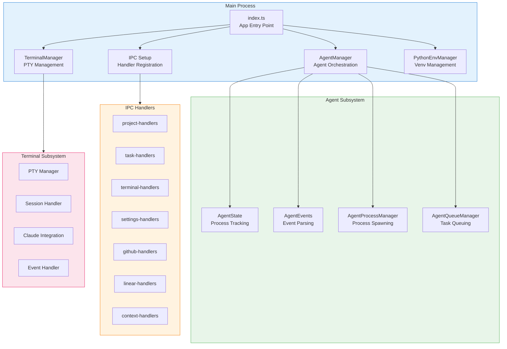

## Directory Structure

```
apps/frontend/src/main/
├── index.ts                    # Application entry point
├── ipc-setup.ts               # IPC handler setup facade
├── agent-manager.ts           # Legacy facade (re-exports)
├── terminal-manager.ts        # Legacy facade (re-exports)
├── python-env-manager.ts      # Python venv management
├── python-detector.ts         # Python path detection
├── agent/                     # Agent orchestration
│   ├── agent-manager.ts       # Main orchestrator
│   ├── agent-state.ts         # Process state tracking
│   ├── agent-events.ts        # Event parsing
│   ├── agent-process.ts       # Process spawning
│   ├── agent-queue.ts         # Task queue management
│   ├── phase-event-parser.ts  # Phase event parsing
│   └── types.ts               # Type definitions
├── terminal/                  # Terminal management
│   ├── terminal-manager.ts    # Main terminal orchestrator
│   ├── pty-manager.ts         # PTY process handling
│   ├── session-handler.ts     # Session persistence
│   ├── terminal-lifecycle.ts  # Create/destroy lifecycle
│   ├── claude-integration.ts  # Claude Code integration
│   └── types.ts               # Type definitions
├── ipc-handlers/              # IPC handler modules
│   ├── index.ts               # Handler registration
│   ├── project-handlers.ts    # Project CRUD
│   ├── task-handlers.ts       # Task execution
│   ├── terminal-handlers.ts   # Terminal operations
│   ├── settings-handlers.ts   # App settings
│   ├── github-handlers.ts     # GitHub integration
│   ├── linear-handlers.ts     # Linear integration
│   ├── context-handlers.ts    # Project context
│   └── ...                    # Other handlers
└── claude-profile/            # Claude profile management
    ├── profile-storage.ts     # Profile persistence
    ├── usage-monitor.ts       # Usage tracking
    └── rate-limit-manager.ts  # Rate limit handling
```

## Application Lifecycle

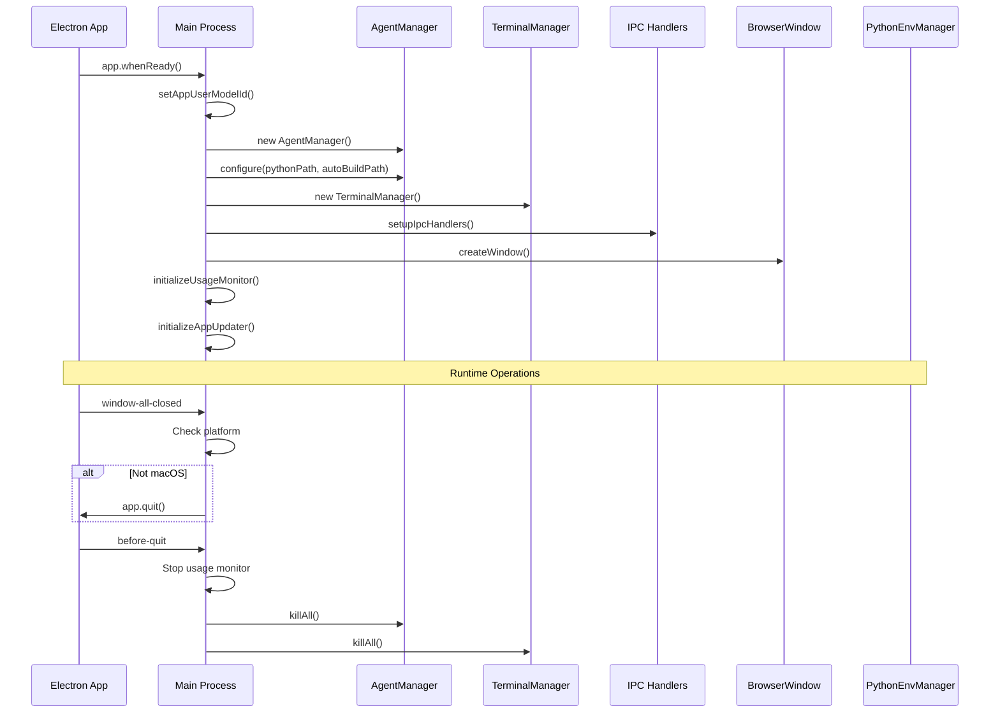

## AgentManager

The `AgentManager` is the central orchestrator for all agent-related operations, including spec creation, task execution, roadmap generation, and ideation.

### Class Diagram

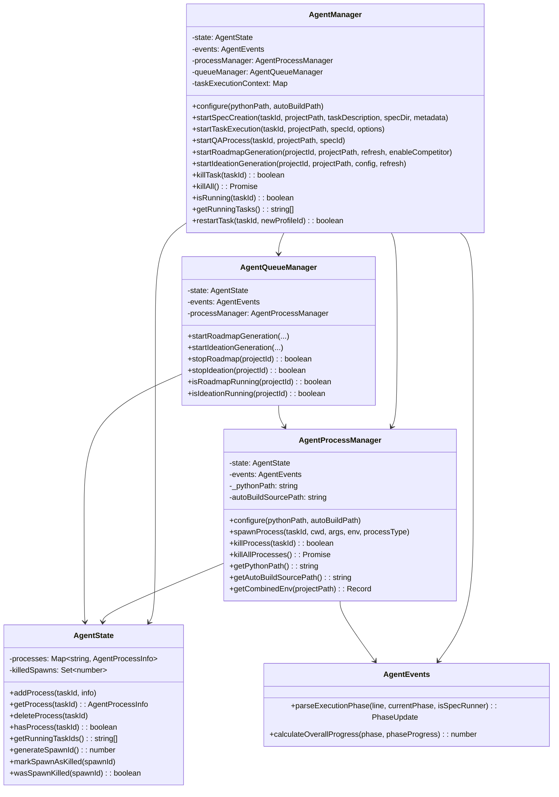

### Task Execution Flow

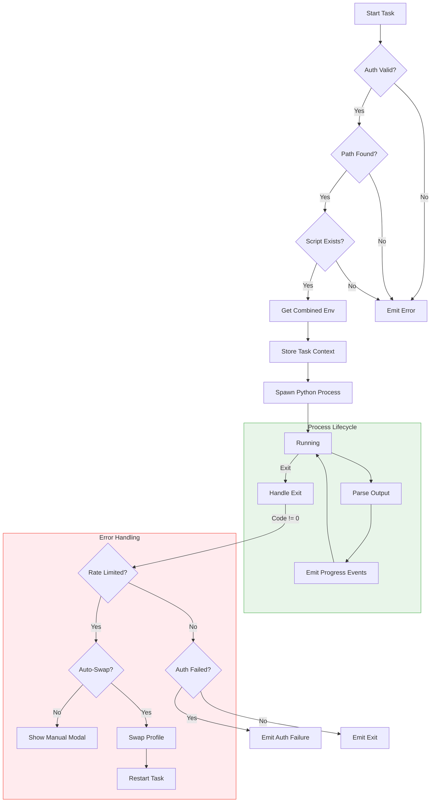

### Event Emissions

| Event | Description | Payload |
|-------|-------------|---------|
| `execution-progress` | Phase progress update | `{ phase, phaseProgress, overallProgress, message }` |
| `log` | Process output line | `taskId, line` |
| `exit` | Process exited | `taskId, code, processType` |
| `error` | Error occurred | `taskId, message` |
| `sdk-rate-limit` | Rate limit detected | `{ source, resetTime, profileId, ... }` |
| `auth-failure` | Authentication failed | `taskId, { profileId, failureType, message }` |
| `auto-swap-restart-task` | Auto-swap triggered restart | `taskId, newProfileId` |

### Execution Phases

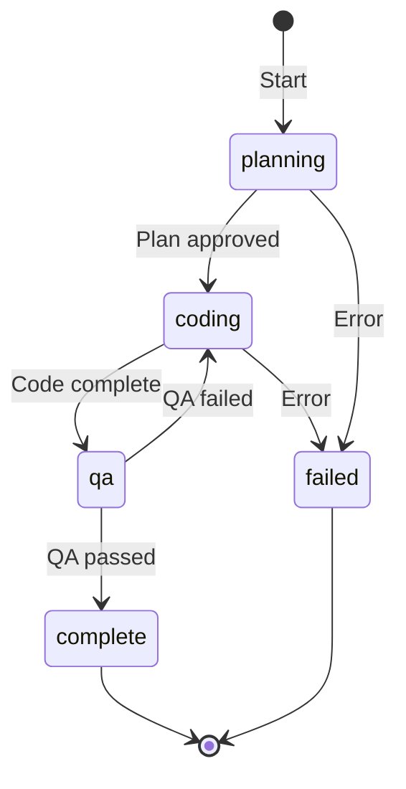

## IPC Handler System

The IPC system bridges the renderer process (UI) with the main process, organized into domain-specific handler modules.

### Handler Registration Flow

```mermaid
flowchart LR
    subgraph Setup["setupIpcHandlers()"]
        Init[Initialize Services]
        RegisterAll[Register All Handlers]
    end

    subgraph Handlers["Handler Modules"]
        Project[Project<br/>CRUD, init]
        Task[Task<br/>Execution]
        Terminal[Terminal<br/>PTY, Claude]
        Settings[Settings<br/>Config, dialogs]
        GitHub[GitHub<br/>PRs, issues]
        Linear[Linear<br/>Integration]
        Context[Context<br/>Memory]
        File[File<br/>Explorer]
        Roadmap[Roadmap<br/>Generation]
        Ideation[Ideation<br/>Ideas]
        Changelog[Changelog<br/>Generation]
        Insights[Insights<br/>AI chat]
        Memory[Memory<br/>Graphiti]
        AppUpdate[Updates<br/>Auto-update]
    end

    Init --> RegisterAll
    RegisterAll --> Handlers

    style Setup fill:#e3f2fd,stroke:#1976d2
```

### IPC Communication Pattern

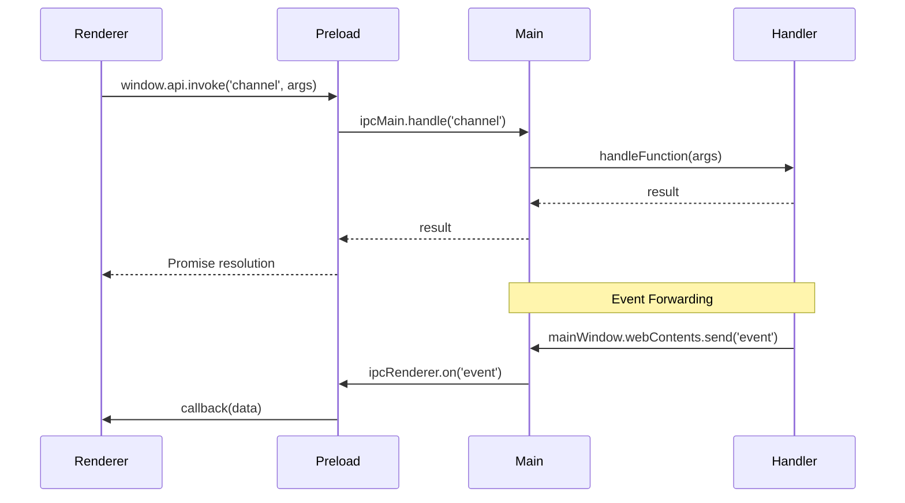

### Key IPC Channels

| Domain | Invoke Channels | Send Channels |
|--------|----------------|---------------|
| Project | `project:list`, `project:create`, `project:delete` | `project:updated` |
| Task | `task:start`, `task:stop`, `task:status` | `task:progress`, `task:complete` |
| Terminal | `terminal:create`, `terminal:write`, `terminal:resize` | `terminal:data`, `terminal:exit` |
| Agent | `agent:start-spec`, `agent:start-task`, `agent:kill` | `agent:log`, `agent:progress`, `agent:exit` |
| Settings | `settings:get`, `settings:save`, `dialog:open-folder` | `settings:changed` |
| GitHub | `github:get-prs`, `github:create-pr`, `github:import-repo` | `github:oauth-success` |

## Terminal Management

The `TerminalManager` handles PTY (pseudo-terminal) processes, integrating with Claude Code for AI-powered terminal sessions.

### Architecture

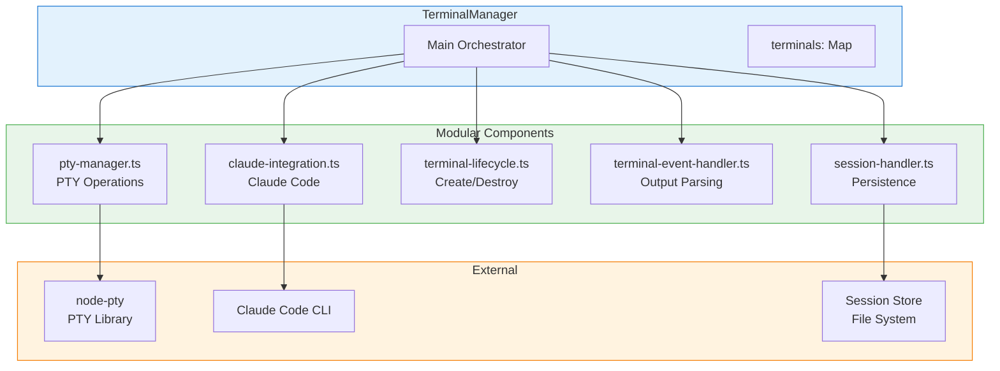

### Terminal Lifecycle

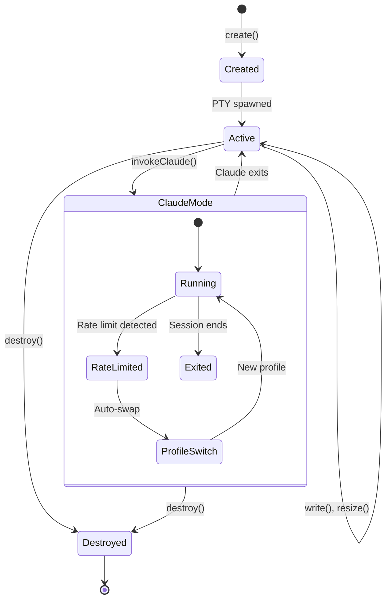

### TerminalProcess Interface

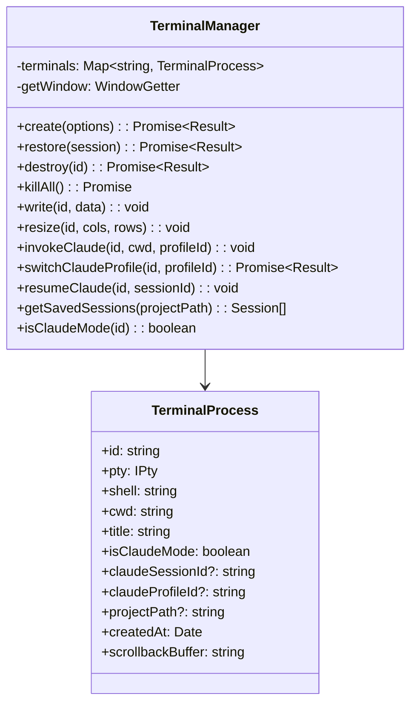

### Session Persistence

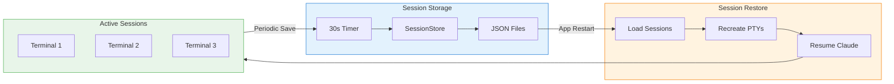

## Python Integration

The `PythonEnvManager` manages the Python virtual environment required for running Auto-Claude backend scripts.

### Environment Setup Flow

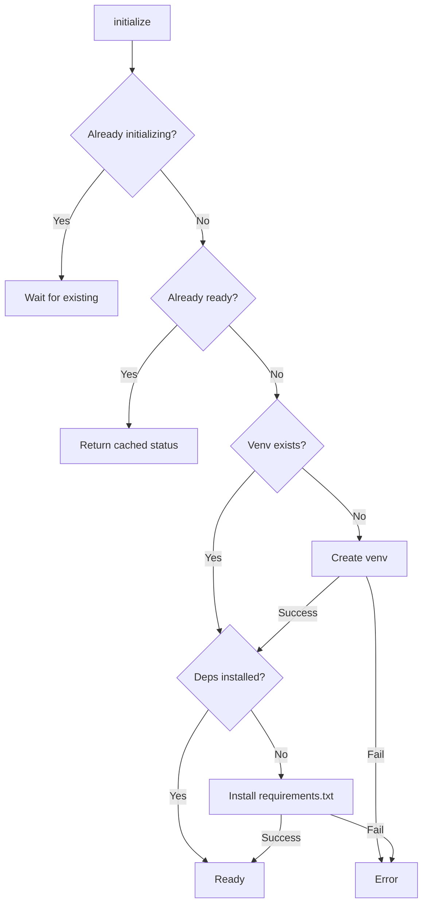

### Python Path Resolution

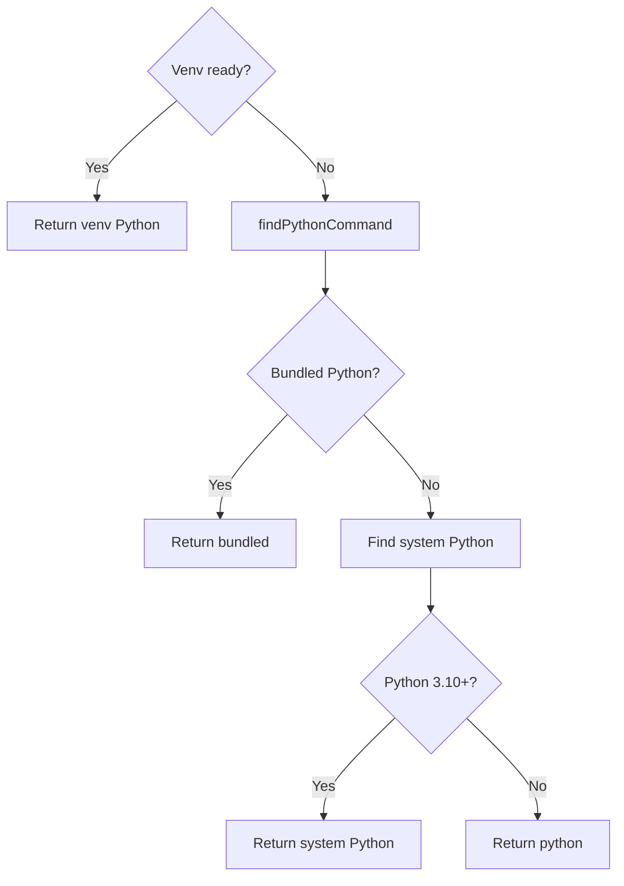

### Venv Location Strategy

| Environment | Venv Path | Reason |
|-------------|-----------|--------|
| Development | `{source}/.venv` | Standard location in source |
| Packaged (Windows/Mac) | `{source}/.venv` | Writable app resources |
| Packaged (Linux AppImage) | `{userData}/python-venv` | AppImage resources are read-only |

### PythonEnvManager Class

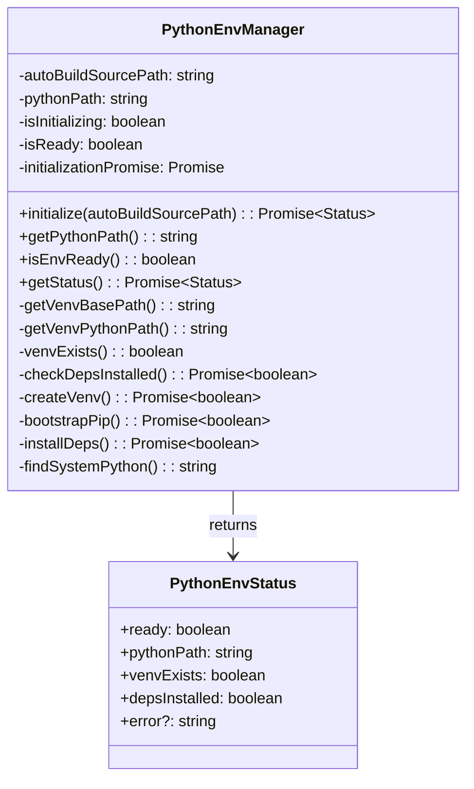

## Rate Limit Handling

The main process includes sophisticated rate limit detection and automatic profile switching.

### Rate Limit Detection Flow

```mermaid
flowchart TB
    Output[Process Output]
    Detect[detectRateLimit()]

    subgraph Detection["Pattern Detection"]
        SDKPattern[SDK Rate Limit Pattern]
        APIPattern[API Rate Limit Pattern]
        ParseReset[Parse Reset Time]
        ParseProfile[Parse Profile ID]
    end

    subgraph Response["Response Handling"]
        AutoSwapEnabled{Auto-swap?}
        FindProfile[Find best profile]
        ProfileAvailable{Profile OK?}
        SwapProfile[Swap to new profile]
        RestartTask[Restart task]
        ShowModal[Show manual modal]
    end

    Output --> Detect
    Detect --> Detection
    Detection --> AutoSwapEnabled

    AutoSwapEnabled -->|Yes| FindProfile
    AutoSwapEnabled -->|No| ShowModal
    FindProfile --> ProfileAvailable
    ProfileAvailable -->|Yes| SwapProfile
    ProfileAvailable -->|No| ShowModal
    SwapProfile --> RestartTask

    style Detection fill:#e3f2fd,stroke:#1976d2
    style Response fill:#e8f5e9,stroke:#4caf50
```

### Auto-Swap Mechanism

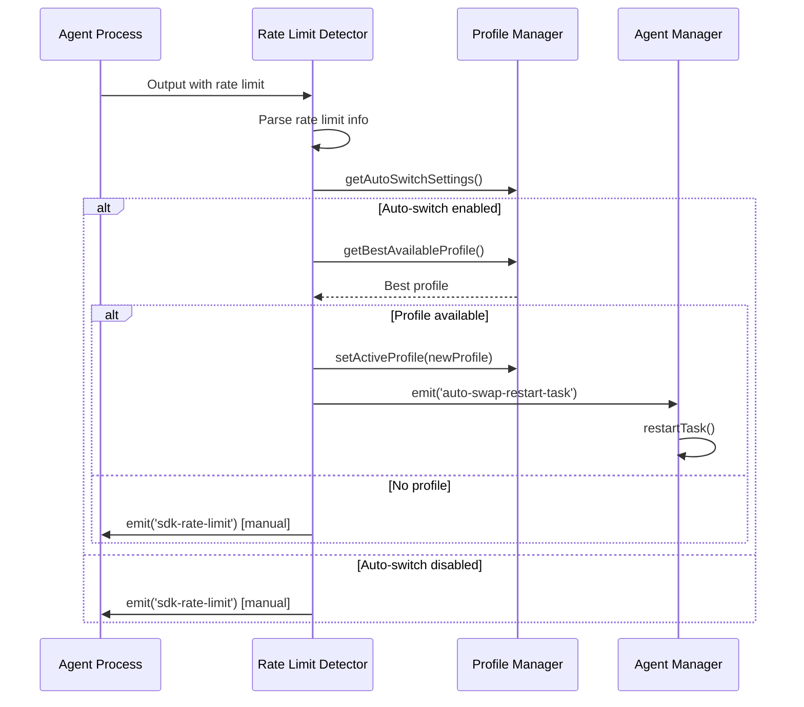

## Window Management

### BrowserWindow Configuration

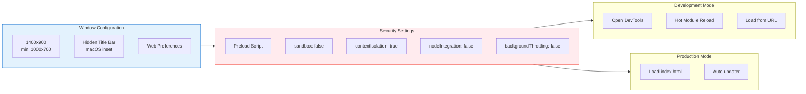

### Platform-Specific Behavior

| Platform | Behavior |
|----------|----------|
| macOS | Hidden title bar with traffic lights, dock icon, re-create window on activate |
| Windows | App user model ID for taskbar grouping, auto-hide menu bar |
| Linux | AppImage-compatible venv path, standard window controls |

## Error Handling

### Global Error Handlers

```typescript
// Uncaught exceptions
process.on('uncaughtException', (error) => {
  console.error('Uncaught exception:', error);
});

// Unhandled promise rejections
process.on('unhandledRejection', (reason) => {
  console.error('Unhandled rejection:', reason);
});
```

### Cleanup on Quit

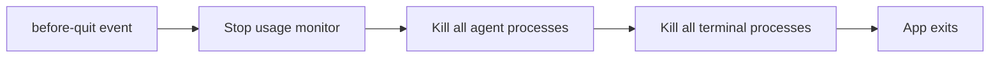

## Integration Points

### External Dependencies

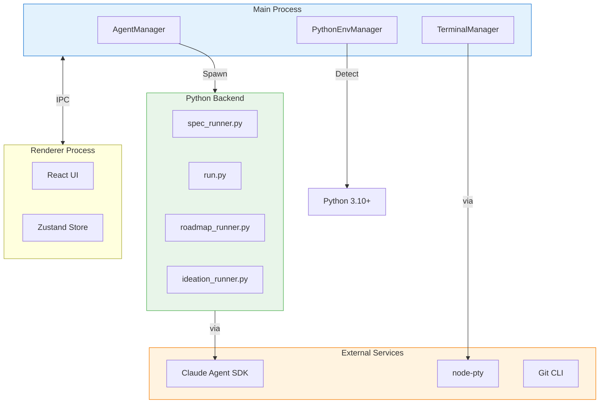

### Key Dependencies

| Module | Dependency | Purpose |
|--------|------------|---------|
| AgentManager | `child_process` | Spawn Python processes |
| AgentManager | `claude-profile-manager` | Profile authentication |
| TerminalManager | `node-pty` | PTY process management |
| TerminalManager | Claude Code CLI | AI-powered terminals |
| PythonEnvManager | `child_process` | Venv creation, pip install |
| IPC Handlers | `electron.ipcMain` | Process communication |

## Next Steps

- [Renderer Process](./renderer-process.md) - React UI architecture
- [Preload Bridge](./preload-bridge.md) - IPC bridge and API exposure
- [State Management](./state-management.md) - Zustand stores
- [Backend Integration](../architecture/integration.md) - Python backend connection
