# Renderer Components

The React renderer process provides the user interface for Auto-Claude, built on React 19, Radix UI primitives, Tailwind CSS, and Zustand for state management. Components are organized hierarchically from foundational UI primitives to complex feature components.

## Component Hierarchy Overview


## Directory Structure

```
apps/frontend/src/renderer/
├── App.tsx                         # Root application component
├── components/                     # All React components
│   ├── ui/                        # Radix UI primitives (shadcn/ui)
│   │   ├── alert-dialog.tsx
│   │   ├── badge.tsx
│   │   ├── button.tsx
│   │   ├── card.tsx
│   │   ├── checkbox.tsx
│   │   ├── dialog.tsx
│   │   ├── dropdown-menu.tsx
│   │   ├── full-screen-dialog.tsx
│   │   ├── input.tsx
│   │   ├── label.tsx
│   │   ├── progress.tsx
│   │   ├── scroll-area.tsx
│   │   ├── select.tsx
│   │   ├── separator.tsx
│   │   ├── switch.tsx
│   │   ├── tabs.tsx
│   │   ├── textarea.tsx
│   │   └── tooltip.tsx
│   ├── Sidebar.tsx                # Navigation sidebar
│   ├── ProjectTabBar.tsx          # Project tab management
│   ├── KanbanBoard.tsx            # Task kanban view
│   ├── TaskCard.tsx               # Task display card
│   ├── TaskCreationWizard.tsx     # New task wizard
│   ├── TaskEditDialog.tsx         # Edit task dialog
│   ├── TerminalGrid.tsx           # Terminal container
│   ├── Terminal.tsx               # Individual terminal
│   ├── Roadmap.tsx                # Roadmap view
│   ├── Context.tsx                # Project context view
│   ├── Ideation.tsx               # Ideation view
│   ├── Insights.tsx               # AI insights view
│   ├── GitHubIssues.tsx           # GitHub issues view
│   ├── Changelog.tsx              # Changelog view
│   ├── Worktrees.tsx              # Git worktrees view
│   ├── WelcomeScreen.tsx          # New user welcome
│   │
│   ├── changelog/                 # Changelog feature
│   ├── context/                   # Context visualization
│   ├── github-issues/             # GitHub issues feature
│   ├── github-prs/                # GitHub PRs feature
│   ├── ideation/                  # Ideation feature
│   ├── linear-import/             # Linear import feature
│   ├── onboarding/                # Onboarding wizard
│   ├── project-settings/          # Project settings
│   ├── roadmap/                   # Roadmap feature
│   ├── settings/                  # App settings
│   └── task-detail/               # Task detail modal
├── hooks/                         # Custom React hooks
├── stores/                        # Zustand state stores
└── lib/                           # Utility functions
```

## Root Component: App.tsx

The `App` component serves as the application entry point, orchestrating global state, routing between views, and managing modals.

### Component State Flow


### Key Responsibilities

| Responsibility | Implementation |
|---------------|----------------|
| State Initialization | Loads projects, tasks, settings on mount |
| View Routing | Manages `activeView` state for navigation |
| Modal Management | Controls dialogs (settings, task creation, etc.) |
| Project Tab Management | Handles multi-project tab bar with DnD |
| Keyboard Shortcuts | Global keyboard navigation |
| IPC Listeners | Real-time updates via `useIpcListeners` |

### View Navigation Flow


## UI Primitives (Radix UI)

The `/ui` directory contains foundational components built on [Radix UI](https://www.radix-ui.com/) primitives with Tailwind CSS styling, following the shadcn/ui pattern.

### Component Library

```mermaid
classDiagram
    class Dialog {
        +DialogTrigger
        +DialogContent
        +DialogHeader
        +DialogTitle
        +DialogDescription
        +DialogFooter
    }

    class AlertDialog {
        +AlertDialogTrigger
        +AlertDialogContent
        +AlertDialogHeader
        +AlertDialogTitle
        +AlertDialogDescription
        +AlertDialogFooter
        +AlertDialogAction
        +AlertDialogCancel
    }

    class FullScreenDialog {
        +FullScreenDialogContent
        +FullScreenDialogHeader
        +FullScreenDialogBody
        +FullScreenDialogFooter
        +FullScreenDialogTitle
        +FullScreenDialogDescription
    }

    class Button {
        +variant: default|destructive|outline|ghost|link|warning
        +size: default|sm|lg|icon
    }

    class Badge {
        +variant: default|secondary|destructive|outline|success|warning|info|purple
    }

    class Card {
        +CardHeader
        +CardTitle
        +CardDescription
        +CardContent
        +CardFooter
    }

    class Select {
        +SelectTrigger
        +SelectValue
        +SelectContent
        +SelectItem
        +SelectGroup
        +SelectLabel
    }

    class Tabs {
        +TabsList
        +TabsTrigger
        +TabsContent
    }
```



### UI Component Usage Patterns

| Component | Purpose | Key Props |
|-----------|---------|-----------|
| `Dialog` | Modal overlays for focused interactions | `open`, `onOpenChange` |
| `FullScreenDialog` | Full-screen modals (settings, onboarding) | `open`, `onOpenChange` |
| `AlertDialog` | Confirmation dialogs | `open`, `onOpenChange` |
| `Button` | Actions and interactions | `variant`, `size`, `disabled` |
| `Badge` | Status indicators and labels | `variant` |
| `Card` | Content containers | Uses CardContent, CardHeader |
| `Select` | Dropdown selection | `value`, `onValueChange` |
| `Tabs` | Tabbed content navigation | `value`, `onValueChange` |
| `ScrollArea` | Scrollable containers | Custom scrollbar styling |
| `Tooltip` | Contextual hints | Requires `TooltipProvider` |

## Navigation Components

### Sidebar

The `Sidebar` component provides primary navigation between views and project actions.


### ProjectTabBar

Manages multiple open projects with drag-and-drop tab reordering.


## View Components

### KanbanBoard

The task management view with drag-and-drop columns for workflow visualization.


### TerminalGrid

Container for multiple PTY terminal instances.


### Context View

Displays analyzed project context including services, dependencies, and memories.


## Dialog Components

### TaskCreationWizard

Multi-step wizard for creating new tasks with metadata, images, and file references.


### TaskDetailModal

Full-screen modal for viewing and managing task details.


### AppSettingsDialog

Full-screen settings dialog with app and project configuration sections.


### OnboardingWizard

First-run wizard for new user setup.


## Card Components

### TaskCard

Displays task information in the kanban board with status, metadata, and actions.


### SortableTaskCard

Wrapper around TaskCard providing drag-and-drop functionality via @dnd-kit.


## Feature Module Components

### Changelog Module


### GitHub Issues Module


### Ideation Module


### Settings Module


## Component Patterns

### Props Interface Pattern

All components follow a consistent props interface pattern:

```typescript
interface ComponentProps {
  // Required props first
  data: DataType;
  onAction: (value: ValueType) => void;

  // Optional props with defaults
  variant?: 'default' | 'secondary';
  disabled?: boolean;
  className?: string;
}

export function Component({
  data,
  onAction,
  variant = 'default',
  disabled = false,
  className
}: ComponentProps) {
  // Implementation
}
```

### State Management Pattern

Components use Zustand stores for global state and local React state for UI concerns:


### Styling Pattern

Components use Tailwind CSS with the `cn()` utility for conditional classes:

```typescript
import { cn } from '../lib/utils';

<div className={cn(
  'base-classes',
  variant === 'primary' && 'primary-classes',
  disabled && 'opacity-50 pointer-events-none',
  className
)}>
```

### IPC Communication Pattern

Components interact with the main process via the `window.electronAPI` bridge:

```mermaid
sequenceDiagram
    participant Component
    participant Store as Zustand Store
    participant API as window.electronAPI
    participant Main as Main Process

    Component->>Store: dispatch action
    Store->>API: invoke IPC method
    API->>Main: ipcRenderer.invoke()
    Main-->>API: IPCResult<T>
    API-->>Store: result
    Store-->>Component: state update
    Component->>Component: re-render
```

## Accessibility

Components follow accessibility best practices:

| Pattern | Implementation |
|---------|----------------|
| Keyboard Navigation | Focus management, keyboard shortcuts |
| ARIA Labels | Descriptive labels for screen readers |
| Focus Trapping | Modals trap focus within content |
| Color Contrast | Tailwind color palette meets WCAG |
| Motion Reduction | Respects `prefers-reduced-motion` |

## Internationalization

Components support i18n via react-i18next:

```typescript
import { useTranslation } from 'react-i18next';

function Component() {
  const { t } = useTranslation('namespace');
  return <span>{t('key.path')}</span>;
}
```

Translation namespaces: `common`, `tasks`, `settings`, `dialogs`, `navigation`, `onboarding`

## Related Documentation

- [State Management](./state.md) - Zustand stores and React hooks
- [IPC Handlers](./ipc-handlers.md) - Main process communication
- [Main Process](./main-process.md) - Electron main process architecture
- [Frontend Architecture](../architecture/frontend.md) - Overall frontend design
