# State Management

The Auto-Claude frontend uses [Zustand](https://github.com/pmndrs/zustand) for state management, providing a lightweight, performant alternative to Redux. Stores are organized by domain and follow consistent patterns for actions, selectors, and IPC integration.

## State Management Architecture

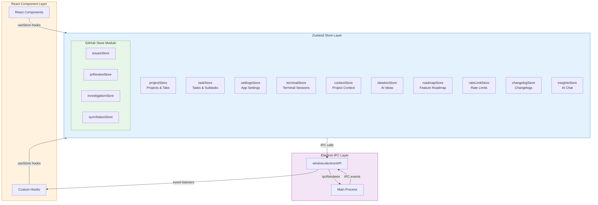

## Store Inventory

| Store | Purpose | Key State | Key Actions |
|-------|---------|-----------|-------------|
| `projectStore` | Project and tab management | `projects`, `openProjectIds`, `activeProjectId` | `openProjectTab`, `closeProjectTab`, `setActiveProject` |
| `taskStore` | Task lifecycle management | `tasks`, `selectedTaskId`, `isLoading` | `addTask`, `updateTask`, `updateTaskStatus` |
| `settingsStore` | Application settings | `settings`, `isLoading` | `setSettings`, `updateSettings` |
| `terminalStore` | Terminal session management | `terminals`, `activeTerminalId` | `addTerminal`, `removeTerminal`, `setClaudeMode` |
| `contextStore` | Project context and memory | `projectIndex`, `memoryStatus`, `searchResults` | `setProjectIndex`, `setSearchResults` |
| `ideationStore` | AI-powered ideation | `session`, `generationStatus`, `typeStates` | `setSession`, `addIdeasForType`, `dismissIdea` |
| `roadmapStore` | Feature roadmap | `roadmap`, `generationStatus` | `setRoadmap`, `updateFeatureStatus`, `reorderFeatures` |
| `rateLimitStore` | Rate limit modals | `isModalOpen`, `rateLimitInfo` | `showRateLimitModal`, `hideRateLimitModal` |
| `changelogStore` | Release changelogs | `changelog`, `generationStatus` | `setChangelog`, `setGenerationStatus` |
| `insightsStore` | AI chat sessions | `messages`, `isLoading` | `addMessage`, `clearMessages` |
| `fileExplorerStore` | File tree browser | `files`, `expandedFolders` | `loadDirectory`, `toggleFolder` |
| `claudeProfileStore` | Claude API profile | `profile`, `rateLimit` | `setProfile`, `setRateLimit` |

### GitHub Store Module

The GitHub integration uses a modular store architecture:

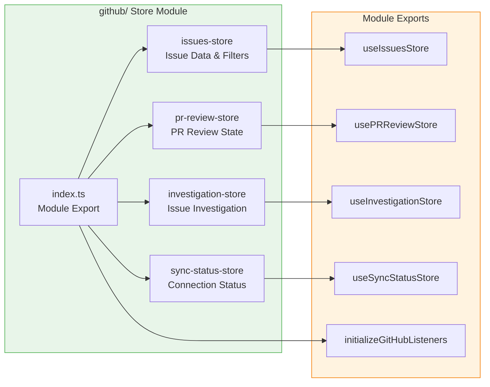

## Core Data Flow Patterns

### Component-Store-IPC Data Flow

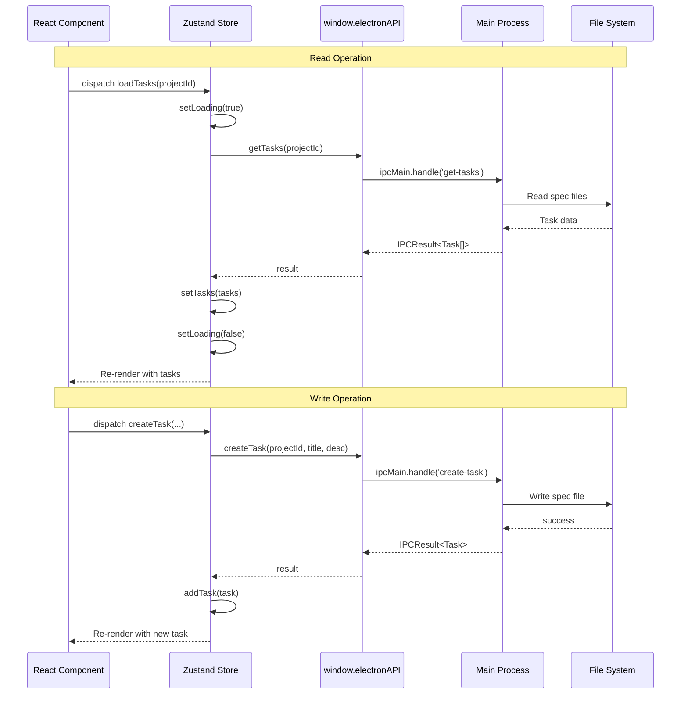

### Real-Time Event Updates

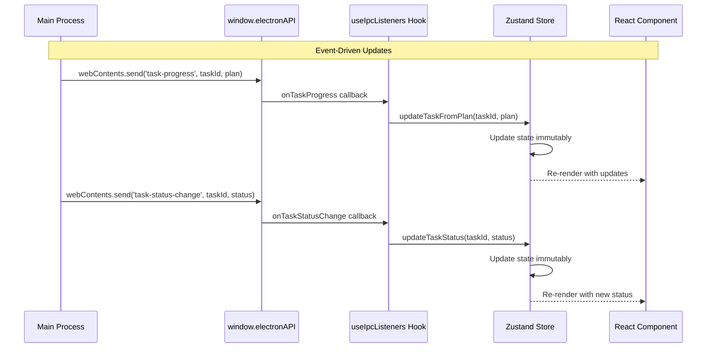

## Store Patterns

### Standard Store Structure

All stores follow a consistent pattern:

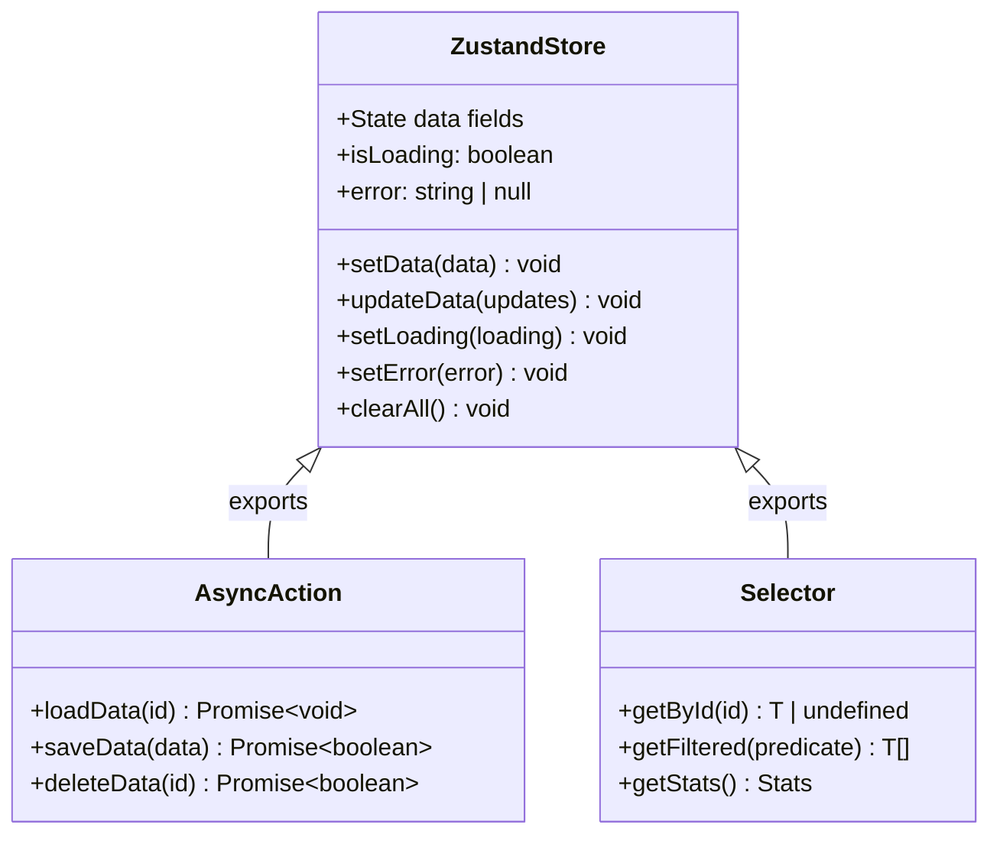

### State Immutability Pattern

```typescript
// Store definition with immutable updates
export const useTaskStore = create<TaskState>((set, get) => ({
  tasks: [],

  // Immutable array update
  updateTask: (taskId, updates) =>
    set((state) => ({
      tasks: state.tasks.map((t) =>
        t.id === taskId ? { ...t, ...updates } : t
      )
    })),

  // Selector using get()
  getSelectedTask: () => {
    const state = get();
    return state.tasks.find((t) => t.id === state.selectedTaskId);
  }
}));
```

## Task Store Deep Dive

The task store manages the complete task lifecycle:

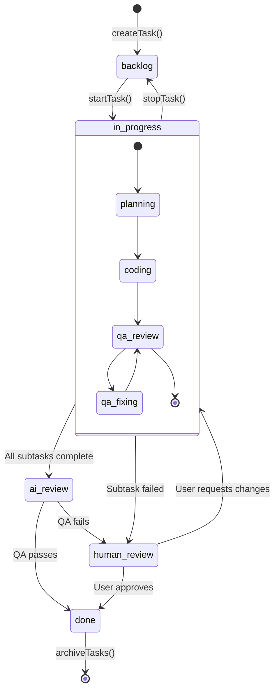

### Task Store State

```mermaid
flowchart TB
    subgraph TaskState["Task Store State"]
        Tasks[tasks: Task[]]
        SelectedId[selectedTaskId: string | null]
        Loading[isLoading: boolean]
        Error[error: string | null]
    end

    subgraph TaskActions["Actions"]
        SetTasks[setTasks]
        AddTask[addTask]
        UpdateTask[updateTask]
        UpdateStatus[updateTaskStatus]
        UpdateFromPlan[updateTaskFromPlan]
        UpdateProgress[updateExecutionProgress]
        AppendLog[appendLog]
        SelectTask[selectTask]
        ClearTasks[clearTasks]
    end

    subgraph Selectors["Selectors"]
        GetSelected[getSelectedTask]
        GetByStatus[getTasksByStatus]
    end

    subgraph AsyncActions["Async Actions (exported)"]
        LoadTasks[loadTasks]
        CreateTask[createTask]
        StartTask[startTask]
        StopTask[stopTask]
        SubmitReview[submitReview]
        PersistStatus[persistTaskStatus]
        DeleteTask[deleteTask]
        ArchiveTasks[archiveTasks]
        RecoverStuck[recoverStuckTask]
    end

    TaskActions --> TaskState
    Selectors --> TaskState
    AsyncActions --> TaskActions
    AsyncActions --> ElectronAPI[window.electronAPI]

    style TaskState fill:#e3f2fd,stroke:#1976d2
    style TaskActions fill:#e8f5e9,stroke:#4caf50
    style Selectors fill:#fff3e0,stroke:#f57c00
    style AsyncActions fill:#f3e5f5,stroke:#9c27b0
```

## Project Store Deep Dive

The project store manages multi-project tabs:

```mermaid
flowchart TB
    subgraph ProjectState["Project Store State"]
        Projects[projects: Project[]]
        SelectedId[selectedProjectId: string | null]

        subgraph TabState["Tab State"]
            OpenIds[openProjectIds: string[]]
            ActiveId[activeProjectId: string | null]
            TabOrder[tabOrder: string[]]
        end
    end

    subgraph TabActions["Tab Management"]
        OpenTab[openProjectTab]
        CloseTab[closeProjectTab]
        SetActive[setActiveProject]
        Reorder[reorderTabs]
        Restore[restoreTabState]
    end

    subgraph Persistence["Persistence"]
        SaveToMain[saveTabStateToMain<br/>Debounced IPC]
        LoadFromMain[getTabState IPC]
    end

    TabActions --> TabState
    TabActions --> Persistence
    Persistence --> MainProcess[Main Process Storage]

    style ProjectState fill:#e3f2fd,stroke:#1976d2
    style TabState fill:#fff3e0,stroke:#f57c00
    style Persistence fill:#f3e5f5,stroke:#9c27b0
```

### Tab State Persistence Flow

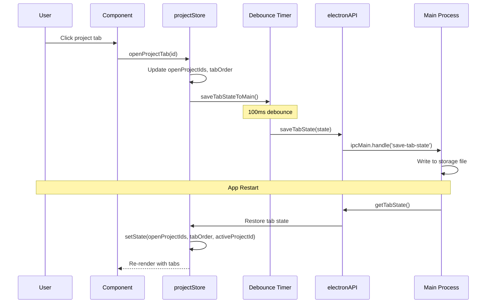

## Terminal Store Deep Dive

The terminal store manages PTY terminal sessions:

```mermaid
flowchart TB
    subgraph TerminalState["Terminal Store State"]
        Terminals[terminals: Terminal[]]
        ActiveId[activeTerminalId: string | null]
        MaxTerminals[maxTerminals: 12]
        HasRestored[hasRestoredSessions: boolean]
    end

    subgraph TerminalFields["Terminal Object"]
        Id[id: string]
        Title[title: string]
        Status[status: TerminalStatus]
        CWD[cwd: string]
        ClaudeMode[isClaudeMode: boolean]
        ClaudeSession[claudeSessionId: string]
        TaskId[associatedTaskId: string]
        ProjectPath[projectPath: string]
    end

    subgraph Actions["Actions"]
        Add[addTerminal]
        AddRestored[addRestoredTerminal]
        Remove[removeTerminal]
        SetStatus[setTerminalStatus]
        SetClaude[setClaudeMode]
        Clear[clearAllTerminals]
    end

    subgraph BufferMgr["Buffer Manager"]
        BufferMgr_Singleton[terminalBufferManager<br/>Singleton]
        Get[get(id)]
        Set[set(id, data)]
        Dispose[dispose(id)]
    end

    TerminalFields --> Terminals
    Actions --> TerminalState
    Add --> BufferMgr_Singleton
    Remove --> BufferMgr_Singleton

    style TerminalState fill:#e3f2fd,stroke:#1976d2
    style TerminalFields fill:#f5f5f5,stroke:#9e9e9e
    style BufferMgr fill:#e8f5e9,stroke:#4caf50
```

### Terminal Status State Machine

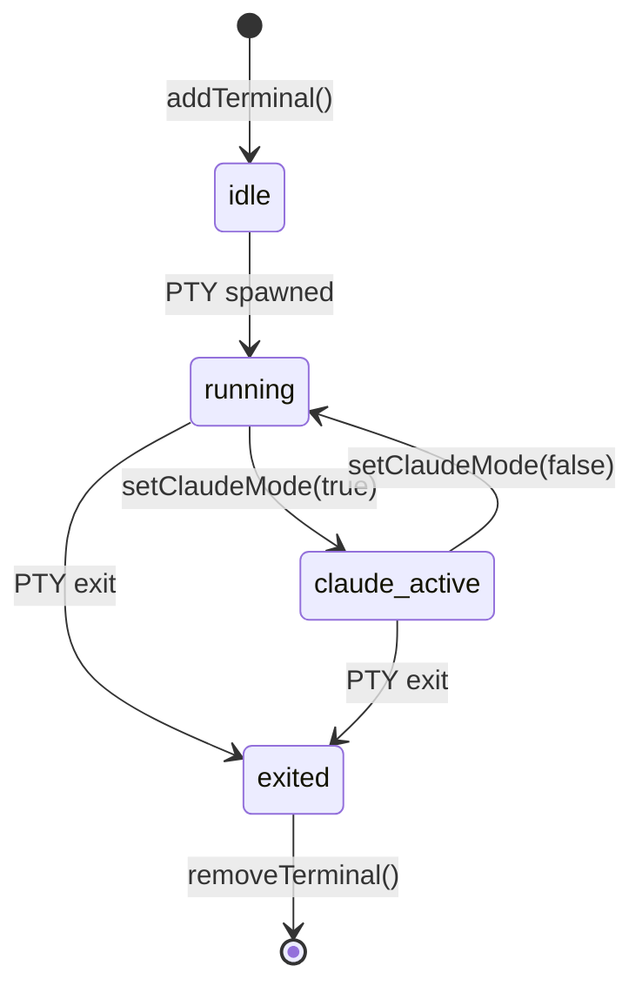

## Ideation Store Deep Dive

The ideation store manages AI-powered feature suggestions:

```mermaid
flowchart TB
    subgraph IdeationState["Ideation Store State"]
        Session[session: IdeationSession | null]
        Status[generationStatus: IdeationGenerationStatus]
        Config[config: IdeationConfig]
        TypeStates[typeStates: Record&lt;IdeationType, IdeationTypeState&gt;]
        IsGenerating[isGenerating: boolean]
        Logs[logs: string[]]
        Selected[selectedIds: Set&lt;string&gt;]
    end

    subgraph IdeationTypes["Ideation Types"]
        CodeImp[code_improvements]
        UIUX[ui_ux_improvements]
        Docs[documentation_gaps]
        Security[security_hardening]
        Perf[performance_optimizations]
        Quality[code_quality]
    end

    subgraph TypeStateFlow["Type State Machine"]
        Pending[pending]
        Generating[generating]
        Completed[completed]
        Failed[failed]
    end

    Pending --> Generating: initializeTypeStates
    Generating --> Completed: addIdeasForType
    Generating --> Failed: onIdeationTypeFailed

    IdeationTypes --> TypeStates

    style IdeationState fill:#e3f2fd,stroke:#1976d2
    style IdeationTypes fill:#e8f5e9,stroke:#4caf50
    style TypeStateFlow fill:#fff3e0,stroke:#f57c00
```

### Parallel Ideation Generation

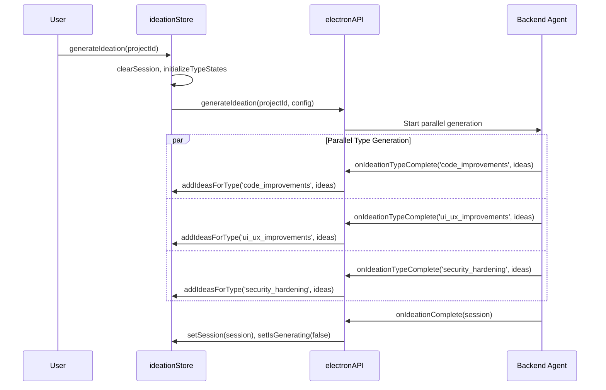

## Roadmap Store Deep Dive

The roadmap store manages feature planning:

```mermaid
flowchart TB
    subgraph RoadmapState["Roadmap Store State"]
        Roadmap[roadmap: Roadmap | null]
        CompetitorAnalysis[competitorAnalysis: CompetitorAnalysis | null]
        GenStatus[generationStatus: RoadmapGenerationStatus]
        CurrentProject[currentProjectId: string | null]
    end

    subgraph Features["Feature Management"]
        FeatureList[features: RoadmapFeature[]]
        Phases[phases: RoadmapPhase[]]
    end

    subgraph DragDrop["Drag & Drop Actions"]
        ReorderFeatures[reorderFeatures<br/>Within Phase]
        UpdatePhase[updateFeaturePhase<br/>Between Phases]
        AddFeature[addFeature<br/>New Feature]
    end

    subgraph StatusFlow["Feature Status Flow"]
        UnderReview[under_review]
        Planned[planned]
        InProgress[in_progress]
        Done[done]
    end

    Features --> Roadmap
    DragDrop --> FeatureList
    UnderReview --> Planned --> InProgress --> Done

    style RoadmapState fill:#e3f2fd,stroke:#1976d2
    style DragDrop fill:#e8f5e9,stroke:#4caf50
    style StatusFlow fill:#fff3e0,stroke:#f57c00
```

## React Hooks

### useIpcListeners Hook

The primary hook for setting up IPC event listeners:

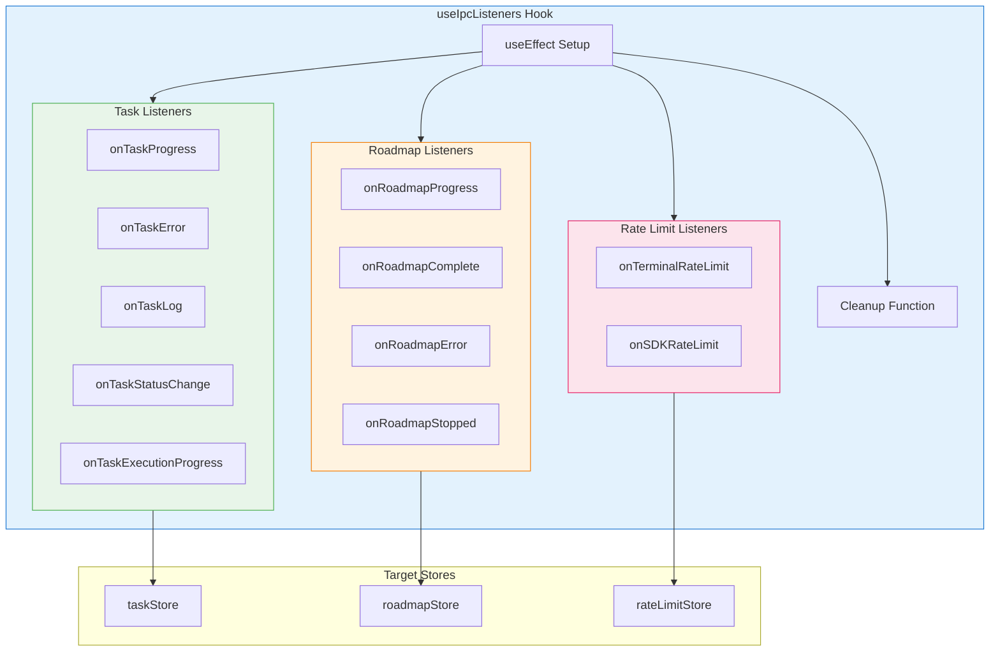

### useVirtualizedTree Hook

Hook for virtualized file tree rendering:

```mermaid
flowchart TB
    subgraph useVirtualizedTree["useVirtualizedTree Hook"]
        Input[rootPath: string]

        subgraph StoreAccess["Store Access"]
            ExpandedFolders[expandedFolders: Set]
            Files[files: Map]
            IsLoading[isLoading: Map]
            ToggleFolder[toggleFolder action]
            LoadDirectory[loadDirectory action]
        end

        subgraph Computation["Memoized Computation"]
            FlattenTree[flattenTree function]
            FlattenedNodes[flattenedNodes: FlattenedNode[]]
        end

        subgraph Output["Return Value"]
            Nodes[flattenedNodes array]
            Count[count: number]
            HandleToggle[handleToggle function]
            IsRootLoading[isRootLoading: boolean]
            HasRootFiles[hasRootFiles: boolean]
        end
    end

    subgraph FlattenedNode["FlattenedNode Type"]
        Node[node: FileNode]
        Depth[depth: number]
        IsExpanded[isExpanded: boolean]
        NodeIsLoading[isLoading: boolean]
        Key[key: string]
    end

    Input --> StoreAccess
    StoreAccess --> Computation
    Computation --> Output
    FlattenedNodes --> FlattenedNode

    style useVirtualizedTree fill:#e3f2fd,stroke:#1976d2
    style Computation fill:#e8f5e9,stroke:#4caf50
    style Output fill:#fff3e0,stroke:#f57c00
```

### Hook Index Exports

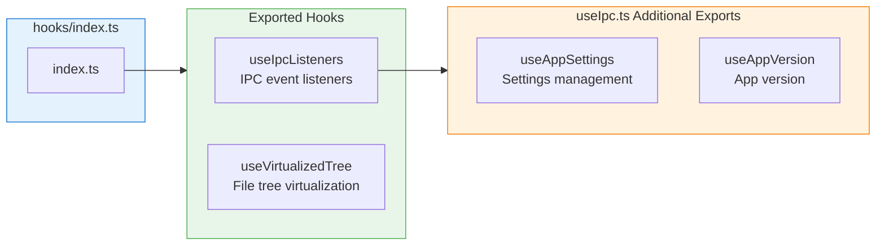

## Store Relationships

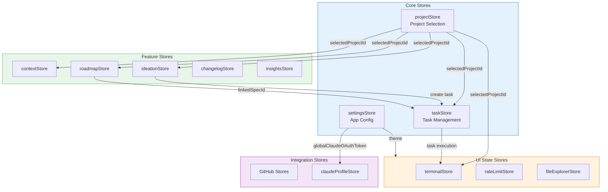

## IPC Integration Pattern

### Store-IPC Contract

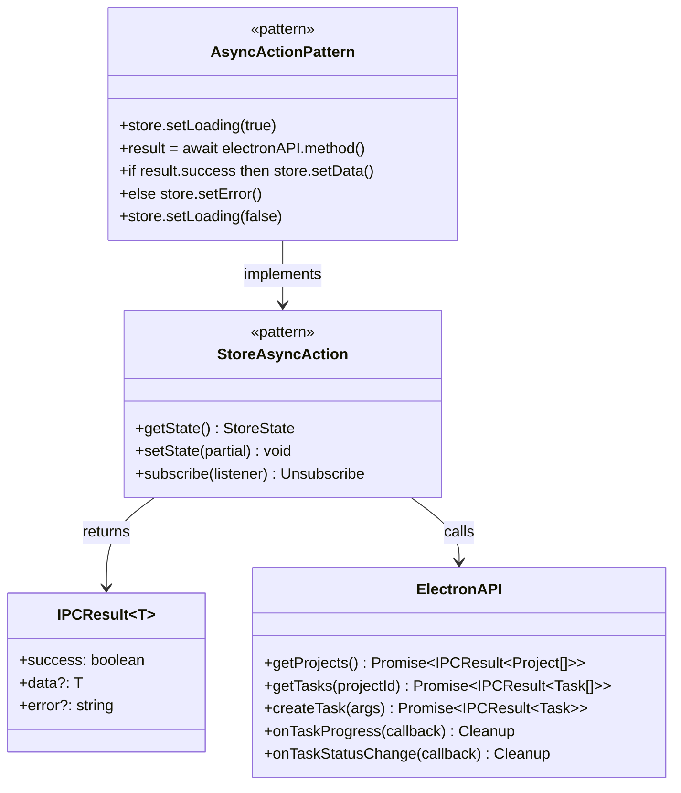

### Event Listener Setup Pattern

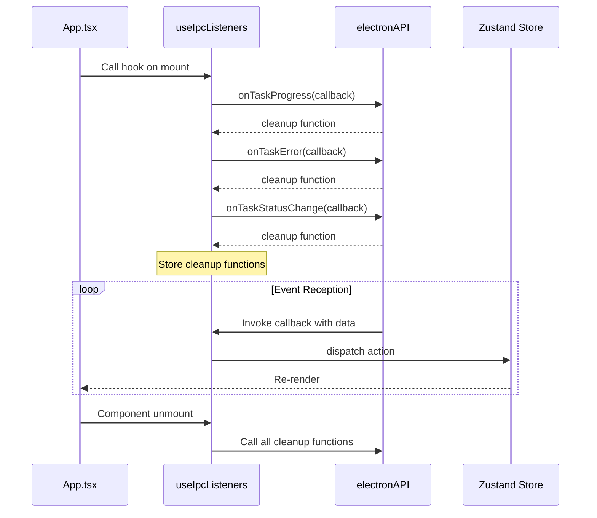

## Performance Considerations

### Selector Optimization

```mermaid
flowchart TB
    subgraph BadPattern["Anti-Pattern: Inline Selector"]
        Component1[Component]
        Store1[Store]
        FullState[Full State Object]
        Rerender1[Re-render on ANY change]

        Component1 -->|useStore state => state| Store1
        Store1 --> FullState
        FullState --> Rerender1
    end

    subgraph GoodPattern["Best Practice: Specific Selector"]
        Component2[Component]
        Store2[Store]
        SpecificField[Specific Field Only]
        Rerender2[Re-render only when field changes]

        Component2 -->|useStore state => state.tasks| Store2
        Store2 --> SpecificField
        SpecificField --> Rerender2
    end

    style BadPattern fill:#ffebee,stroke:#c62828
    style GoodPattern fill:#e8f5e9,stroke:#2e7d32
```

### Debounced Persistence

```mermaid
sequenceDiagram
    participant U as User Action
    participant S as Store
    participant D as Debounce Timer
    participant API as IPC

    U->>S: Tab change 1
    S->>D: Schedule save (100ms)
    U->>S: Tab change 2 (within 100ms)
    D->>D: Reset timer
    U->>S: Tab change 3 (within 100ms)
    D->>D: Reset timer
    Note over D: 100ms elapsed
    D->>API: saveTabState(finalState)
```

## Related Documentation

- [Renderer Components](./renderer.md) - React component architecture
- [IPC Handlers](./ipc-handlers.md) - Main process IPC handlers
- [Main Process](./main-process.md) - Electron main process
- [Frontend Architecture](../architecture/frontend.md) - Overall frontend design
