# Class Structure Diagrams

This document provides comprehensive class diagrams for Auto-Claude, illustrating the key interfaces, class hierarchies, and relationships for agents, stores, and services. Class diagrams help understand the type system, inheritance patterns, and component interfaces.

## Overview

Class diagrams in Auto-Claude document the type structures across three main domains:

| Domain | Description | Key Classes |
|--------|-------------|-------------|
| **Backend Agents** | Python agent system for task execution | CoderAgent, PlannerAgent, MemoryManager |
| **Backend Services** | Core services for analysis, context, and integrations | Analyzers, ContextBuilder, Graphiti |
| **Frontend Services** | TypeScript services in Electron main process | AgentManager, TerminalManager, ProfileManager |
| **Frontend Stores** | Zustand state stores for React renderer | TaskStore, ProjectStore, SettingsStore |

---

## Backend Agent Classes

### Agent Class Hierarchy

The agent system is built on a modular architecture with specialized agents for different phases:

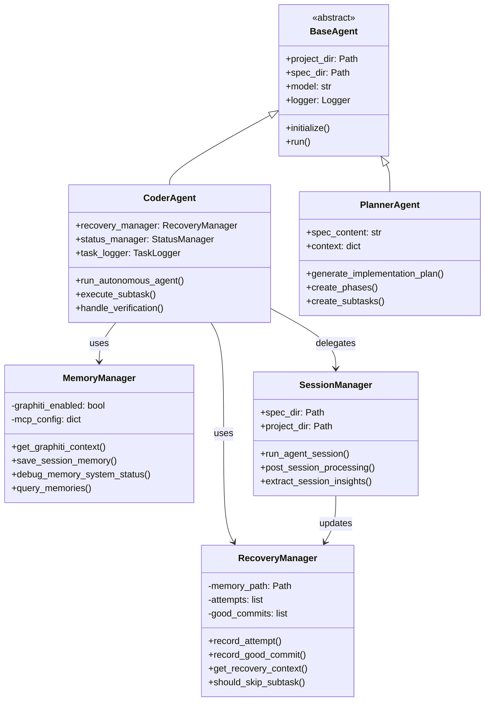
```mermaid
classDiagram
    direction TB

    class BaseAgent {
        <<abstract>>
        +project_dir: Path
        +spec_dir: Path
        +model: str
        +logger: Logger
        +initialize()
        +run()
    }

    class CoderAgent {
        +recovery_manager: RecoveryManager
        +status_manager: StatusManager
        +task_logger: TaskLogger
        +run_autonomous_agent()
        +execute_subtask()
        +handle_verification()
    }

    class PlannerAgent {
        +spec_content: str
        +context: dict
        +generate_implementation_plan()
        +create_phases()
        +create_subtasks()
    }

    class MemoryManager {
        -graphiti_enabled: bool
        -mcp_config: dict
        +get_graphiti_context()
        +save_session_memory()
        +debug_memory_system_status()
        +query_memories()
    }

    class SessionManager {
        +spec_dir: Path
        +project_dir: Path
        +run_agent_session()
        +post_session_processing()
        +extract_session_insights()
    }

    class RecoveryManager {
        -memory_path: Path
        -attempts: list
        -good_commits: list
        +record_attempt()
        +record_good_commit()
        +get_recovery_context()
        +should_skip_subtask()
    }

    BaseAgent <|-- CoderAgent
    BaseAgent <|-- PlannerAgent
    CoderAgent --> MemoryManager : uses
    CoderAgent --> SessionManager : delegates
    CoderAgent --> RecoveryManager : uses
    SessionManager --> RecoveryManager : updates
```

### Agent Tool Interfaces

The agent uses Claude SDK tools for various operations:

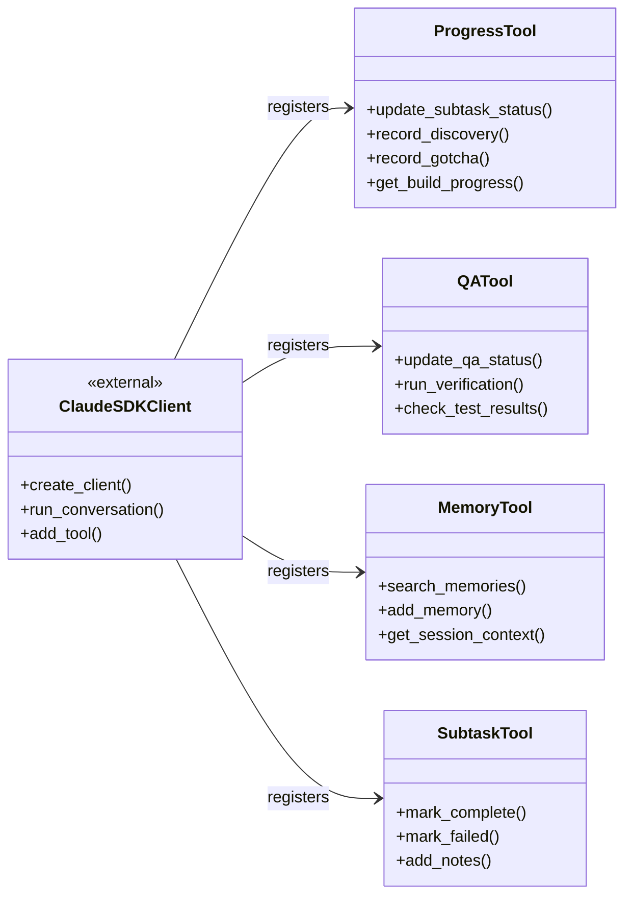
```mermaid
classDiagram
    direction LR

    class ClaudeSDKClient {
        <<external>>
        +create_client()
        +run_conversation()
        +add_tool()
    }

    class ProgressTool {
        +update_subtask_status()
        +record_discovery()
        +record_gotcha()
        +get_build_progress()
    }

    class QATool {
        +update_qa_status()
        +run_verification()
        +check_test_results()
    }

    class MemoryTool {
        +search_memories()
        +add_memory()
        +get_session_context()
    }

    class SubtaskTool {
        +mark_complete()
        +mark_failed()
        +add_notes()
    }

    ClaudeSDKClient --> ProgressTool : registers
    ClaudeSDKClient --> QATool : registers
    ClaudeSDKClient --> MemoryTool : registers
    ClaudeSDKClient --> SubtaskTool : registers
```

### Agent State Machine

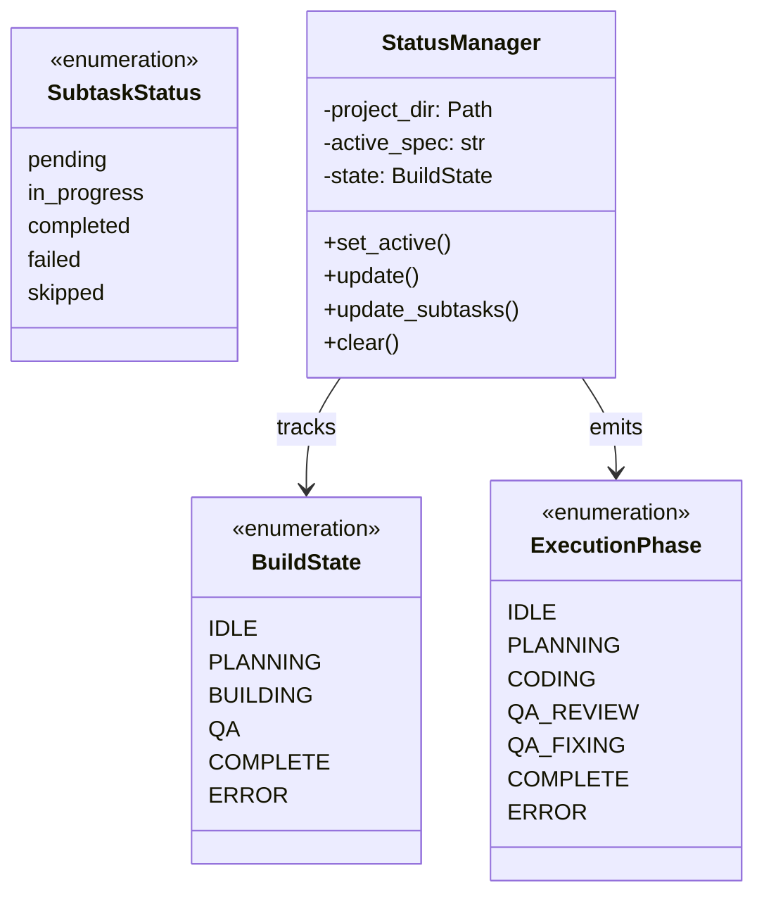
```mermaid
classDiagram
    class ExecutionPhase {
        <<enumeration>>
        IDLE
        PLANNING
        CODING
        QA_REVIEW
        QA_FIXING
        COMPLETE
        ERROR
    }

    class BuildState {
        <<enumeration>>
        IDLE
        PLANNING
        BUILDING
        QA
        COMPLETE
        ERROR
    }

    class SubtaskStatus {
        <<enumeration>>
        pending
        in_progress
        completed
        failed
        skipped
    }

    class StatusManager {
        -project_dir: Path
        -active_spec: str
        -state: BuildState
        +set_active()
        +update()
        +update_subtasks()
        +clear()
    }

    StatusManager --> BuildState : tracks
    StatusManager --> ExecutionPhase : emits
```

---

## Backend Analysis Classes

### Analyzer Class Hierarchy

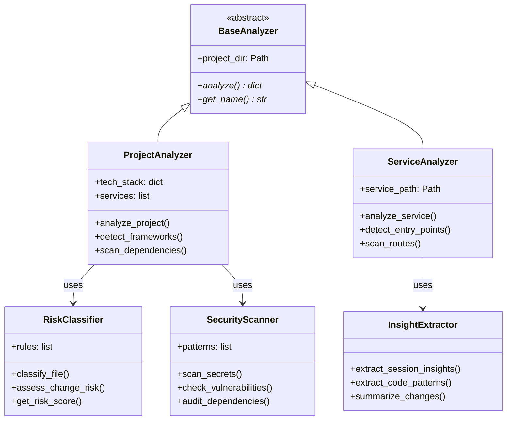
```mermaid
classDiagram
    direction TB

    class BaseAnalyzer {
        <<abstract>>
        +project_dir: Path
        +analyze()* dict
        +get_name()* str
    }

    class ProjectAnalyzer {
        +tech_stack: dict
        +services: list
        +analyze_project()
        +detect_frameworks()
        +scan_dependencies()
    }

    class ServiceAnalyzer {
        +service_path: Path
        +analyze_service()
        +detect_entry_points()
        +scan_routes()
    }

    class RiskClassifier {
        +rules: list
        +classify_file()
        +assess_change_risk()
        +get_risk_score()
    }

    class SecurityScanner {
        +patterns: list
        +scan_secrets()
        +check_vulnerabilities()
        +audit_dependencies()
    }

    class InsightExtractor {
        +extract_session_insights()
        +extract_code_patterns()
        +summarize_changes()
    }

    BaseAnalyzer <|-- ProjectAnalyzer
    BaseAnalyzer <|-- ServiceAnalyzer
    ProjectAnalyzer --> RiskClassifier : uses
    ProjectAnalyzer --> SecurityScanner : uses
    ServiceAnalyzer --> InsightExtractor : uses
```

### Context Detection Classes

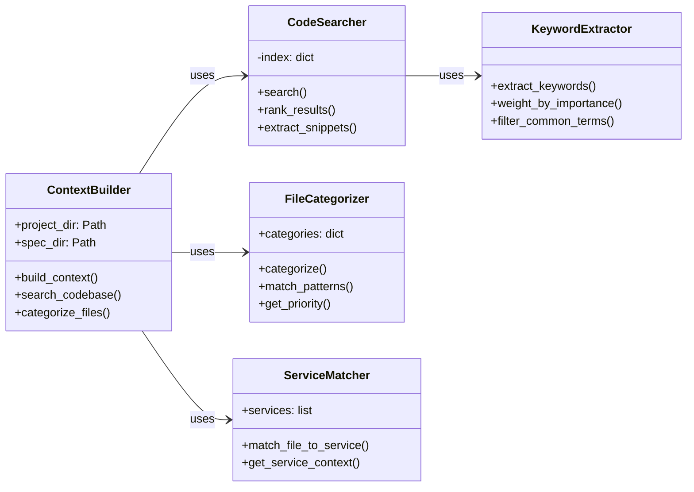
```mermaid
classDiagram
    direction LR

    class ContextBuilder {
        +project_dir: Path
        +spec_dir: Path
        +build_context()
        +search_codebase()
        +categorize_files()
    }

    class CodeSearcher {
        -index: dict
        +search()
        +rank_results()
        +extract_snippets()
    }

    class FileCategorizer {
        +categories: dict
        +categorize()
        +match_patterns()
        +get_priority()
    }

    class ServiceMatcher {
        +services: list
        +match_file_to_service()
        +get_service_context()
    }

    class KeywordExtractor {
        +extract_keywords()
        +weight_by_importance()
        +filter_common_terms()
    }

    ContextBuilder --> CodeSearcher : uses
    ContextBuilder --> FileCategorizer : uses
    ContextBuilder --> ServiceMatcher : uses
    CodeSearcher --> KeywordExtractor : uses
```

### Implementation Plan Classes

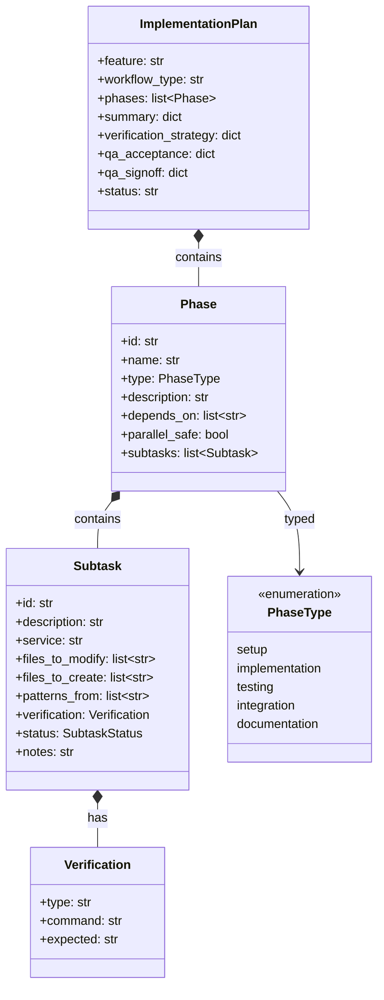
```mermaid
classDiagram
    class ImplementationPlan {
        +feature: str
        +workflow_type: str
        +phases: list~Phase~
        +summary: dict
        +verification_strategy: dict
        +qa_acceptance: dict
        +qa_signoff: dict
        +status: str
    }

    class Phase {
        +id: str
        +name: str
        +type: PhaseType
        +description: str
        +depends_on: list~str~
        +parallel_safe: bool
        +subtasks: list~Subtask~
    }

    class Subtask {
        +id: str
        +description: str
        +service: str
        +files_to_modify: list~str~
        +files_to_create: list~str~
        +patterns_from: list~str~
        +verification: Verification
        +status: SubtaskStatus
        +notes: str
    }

    class Verification {
        +type: str
        +command: str
        +expected: str
    }

    class PhaseType {
        <<enumeration>>
        setup
        implementation
        testing
        integration
        documentation
    }

    ImplementationPlan *-- Phase : contains
    Phase *-- Subtask : contains
    Subtask *-- Verification : has
    Phase --> PhaseType : typed
```

---

## Backend Integration Classes

### External Integration Interfaces

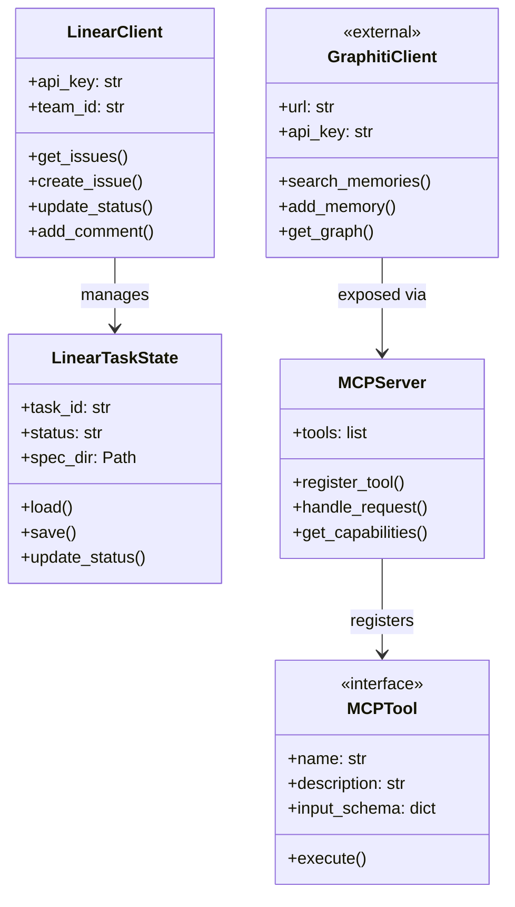
```mermaid
classDiagram
    direction TB

    class GraphitiClient {
        <<external>>
        +url: str
        +api_key: str
        +search_memories()
        +add_memory()
        +get_graph()
    }

    class LinearClient {
        +api_key: str
        +team_id: str
        +get_issues()
        +create_issue()
        +update_status()
        +add_comment()
    }

    class LinearTaskState {
        +task_id: str
        +status: str
        +spec_dir: Path
        +load()
        +save()
        +update_status()
    }

    class MCPServer {
        +tools: list
        +register_tool()
        +handle_request()
        +get_capabilities()
    }

    class MCPTool {
        <<interface>>
        +name: str
        +description: str
        +input_schema: dict
        +execute()
    }

    GraphitiClient --> MCPServer : exposed via
    MCPServer --> MCPTool : registers
    LinearClient --> LinearTaskState : manages
```

---

## Frontend Service Classes

### Main Process Service Architecture

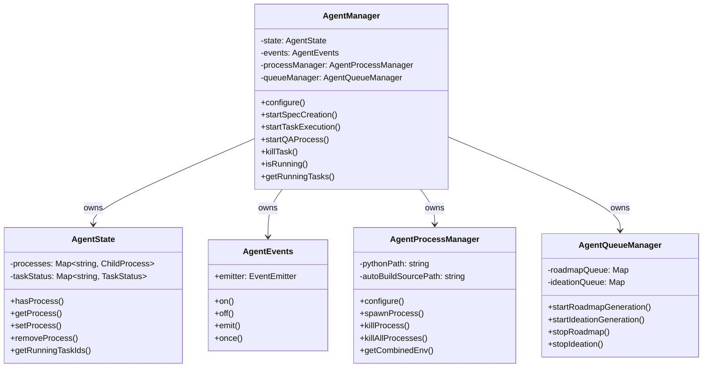
```mermaid
classDiagram
    direction TB

    class AgentManager {
        -state: AgentState
        -events: AgentEvents
        -processManager: AgentProcessManager
        -queueManager: AgentQueueManager
        +configure()
        +startSpecCreation()
        +startTaskExecution()
        +startQAProcess()
        +killTask()
        +isRunning()
        +getRunningTasks()
    }

    class AgentState {
        -processes: Map~string, ChildProcess~
        -taskStatus: Map~string, TaskStatus~
        +hasProcess()
        +getProcess()
        +setProcess()
        +removeProcess()
        +getRunningTaskIds()
    }

    class AgentEvents {
        +emitter: EventEmitter
        +on()
        +off()
        +emit()
        +once()
    }

    class AgentProcessManager {
        -pythonPath: string
        -autoBuildSourcePath: string
        +configure()
        +spawnProcess()
        +killProcess()
        +killAllProcesses()
        +getCombinedEnv()
    }

    class AgentQueueManager {
        -roadmapQueue: Map
        -ideationQueue: Map
        +startRoadmapGeneration()
        +startIdeationGeneration()
        +stopRoadmap()
        +stopIdeation()
    }

    AgentManager --> AgentState : owns
    AgentManager --> AgentEvents : owns
    AgentManager --> AgentProcessManager : owns
    AgentManager --> AgentQueueManager : owns
```

### Terminal Management Classes

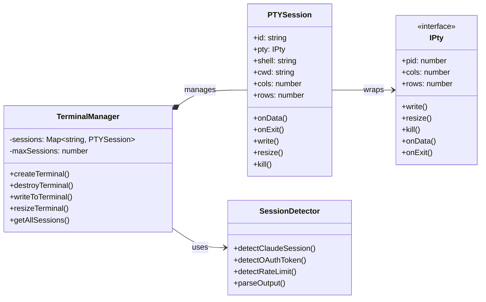
```mermaid
classDiagram
    direction LR

    class TerminalManager {
        -sessions: Map~string, PTYSession~
        -maxSessions: number
        +createTerminal()
        +destroyTerminal()
        +writeToTerminal()
        +resizeTerminal()
        +getAllSessions()
    }

    class PTYSession {
        +id: string
        +pty: IPty
        +shell: string
        +cwd: string
        +cols: number
        +rows: number
        +onData()
        +onExit()
        +write()
        +resize()
        +kill()
    }

    class SessionDetector {
        +detectClaudeSession()
        +detectOAuthToken()
        +detectRateLimit()
        +parseOutput()
    }

    class IPty {
        <<interface>>
        +pid: number
        +cols: number
        +rows: number
        +write()
        +resize()
        +kill()
        +onData()
        +onExit()
    }

    TerminalManager *-- PTYSession : manages
    PTYSession --> IPty : wraps
    TerminalManager --> SessionDetector : uses
```

### Profile Management Classes

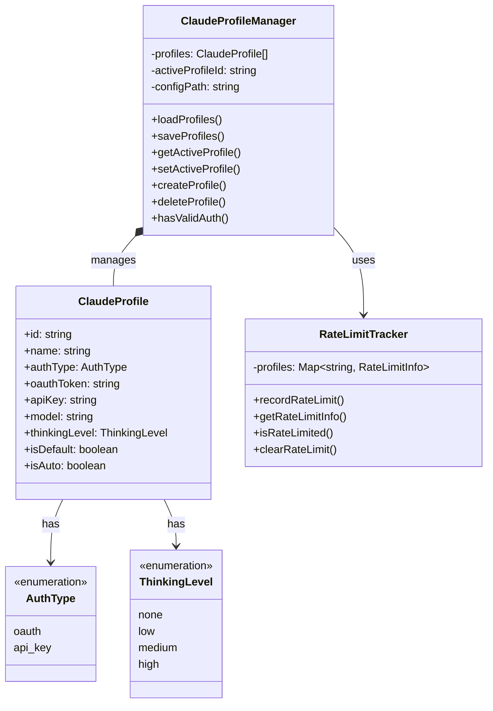
```mermaid
classDiagram
    class ClaudeProfileManager {
        -profiles: ClaudeProfile[]
        -activeProfileId: string
        -configPath: string
        +loadProfiles()
        +saveProfiles()
        +getActiveProfile()
        +setActiveProfile()
        +createProfile()
        +deleteProfile()
        +hasValidAuth()
    }

    class ClaudeProfile {
        +id: string
        +name: string
        +authType: AuthType
        +oauthToken: string
        +apiKey: string
        +model: string
        +thinkingLevel: ThinkingLevel
        +isDefault: boolean
        +isAuto: boolean
    }

    class AuthType {
        <<enumeration>>
        oauth
        api_key
    }

    class ThinkingLevel {
        <<enumeration>>
        none
        low
        medium
        high
    }

    class RateLimitTracker {
        -profiles: Map~string, RateLimitInfo~
        +recordRateLimit()
        +getRateLimitInfo()
        +isRateLimited()
        +clearRateLimit()
    }

    ClaudeProfileManager *-- ClaudeProfile : manages
    ClaudeProfile --> AuthType : has
    ClaudeProfile --> ThinkingLevel : has
    ClaudeProfileManager --> RateLimitTracker : uses
```

---

## Frontend IPC Handler Classes

### IPC Handler Architecture

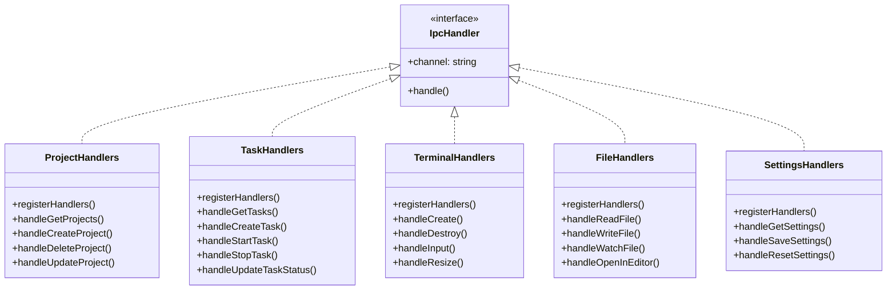
```mermaid
classDiagram
    direction TB

    class IpcHandler {
        <<interface>>
        +channel: string
        +handle()
    }

    class ProjectHandlers {
        +registerHandlers()
        +handleGetProjects()
        +handleCreateProject()
        +handleDeleteProject()
        +handleUpdateProject()
    }

    class TaskHandlers {
        +registerHandlers()
        +handleGetTasks()
        +handleCreateTask()
        +handleStartTask()
        +handleStopTask()
        +handleUpdateTaskStatus()
    }

    class TerminalHandlers {
        +registerHandlers()
        +handleCreate()
        +handleDestroy()
        +handleInput()
        +handleResize()
    }

    class FileHandlers {
        +registerHandlers()
        +handleReadFile()
        +handleWriteFile()
        +handleWatchFile()
        +handleOpenInEditor()
    }

    class SettingsHandlers {
        +registerHandlers()
        +handleGetSettings()
        +handleSaveSettings()
        +handleResetSettings()
    }

    IpcHandler <|.. ProjectHandlers
    IpcHandler <|.. TaskHandlers
    IpcHandler <|.. TerminalHandlers
    IpcHandler <|.. FileHandlers
    IpcHandler <|.. SettingsHandlers
```

### IPC Message Types

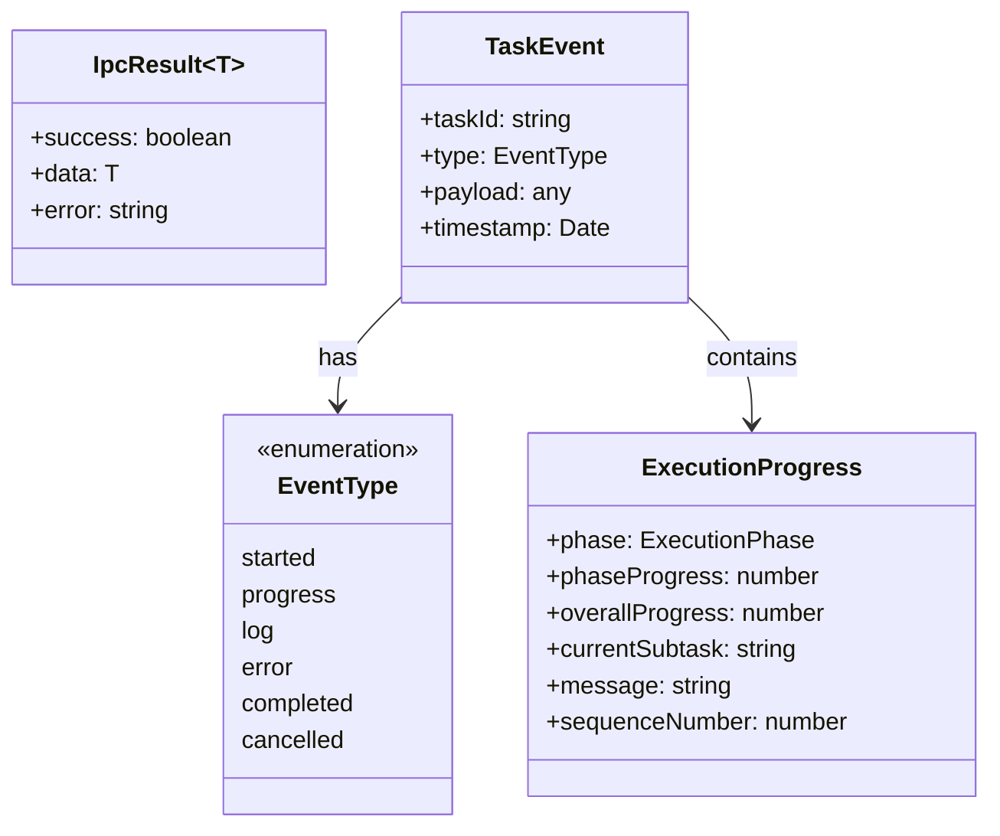
```mermaid
classDiagram
    class IpcResult~T~ {
        +success: boolean
        +data: T
        +error: string
    }

    class TaskEvent {
        +taskId: string
        +type: EventType
        +payload: any
        +timestamp: Date
    }

    class ExecutionProgress {
        +phase: ExecutionPhase
        +phaseProgress: number
        +overallProgress: number
        +currentSubtask: string
        +message: string
        +sequenceNumber: number
    }

    class EventType {
        <<enumeration>>
        started
        progress
        log
        error
        completed
        cancelled
    }

    TaskEvent --> EventType : has
    TaskEvent --> ExecutionProgress : contains
```

---

## Frontend State Store Classes

### Zustand Store Architecture

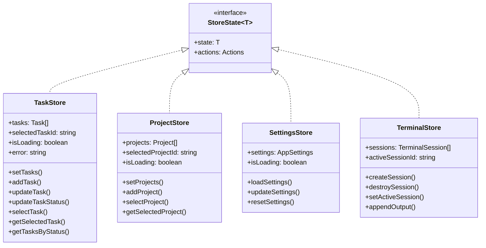
```mermaid
classDiagram
    direction TB

    class StoreState~T~ {
        <<interface>>
        +state: T
        +actions: Actions
    }

    class TaskStore {
        +tasks: Task[]
        +selectedTaskId: string
        +isLoading: boolean
        +error: string
        +setTasks()
        +addTask()
        +updateTask()
        +updateTaskStatus()
        +selectTask()
        +getSelectedTask()
        +getTasksByStatus()
    }

    class ProjectStore {
        +projects: Project[]
        +selectedProjectId: string
        +isLoading: boolean
        +setProjects()
        +addProject()
        +selectProject()
        +getSelectedProject()
    }

    class SettingsStore {
        +settings: AppSettings
        +isLoading: boolean
        +loadSettings()
        +updateSettings()
        +resetSettings()
    }

    class TerminalStore {
        +sessions: TerminalSession[]
        +activeSessionId: string
        +createSession()
        +destroySession()
        +setActiveSession()
        +appendOutput()
    }

    StoreState <|.. TaskStore
    StoreState <|.. ProjectStore
    StoreState <|.. SettingsStore
    StoreState <|.. TerminalStore
```

### Task Domain Types

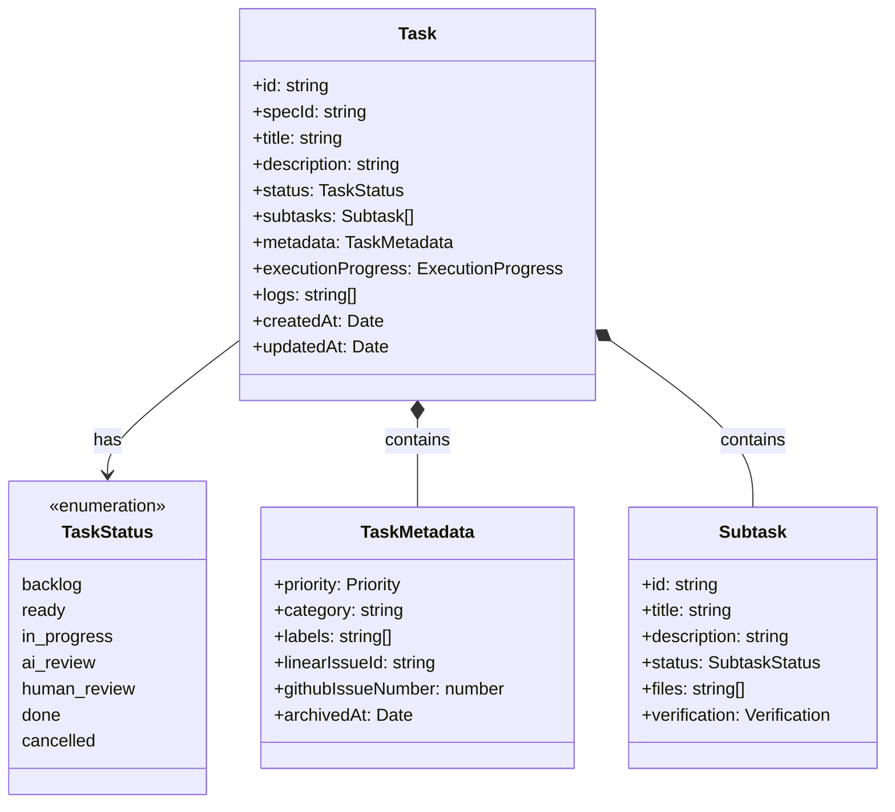
```mermaid
classDiagram
    class Task {
        +id: string
        +specId: string
        +title: string
        +description: string
        +status: TaskStatus
        +subtasks: Subtask[]
        +metadata: TaskMetadata
        +executionProgress: ExecutionProgress
        +logs: string[]
        +createdAt: Date
        +updatedAt: Date
    }

    class TaskStatus {
        <<enumeration>>
        backlog
        ready
        in_progress
        ai_review
        human_review
        done
        cancelled
    }

    class TaskMetadata {
        +priority: Priority
        +category: string
        +labels: string[]
        +linearIssueId: string
        +githubIssueNumber: number
        +archivedAt: Date
    }

    class Subtask {
        +id: string
        +title: string
        +description: string
        +status: SubtaskStatus
        +files: string[]
        +verification: Verification
    }

    Task --> TaskStatus : has
    Task *-- TaskMetadata : contains
    Task *-- Subtask : contains
```

### Context Store Classes

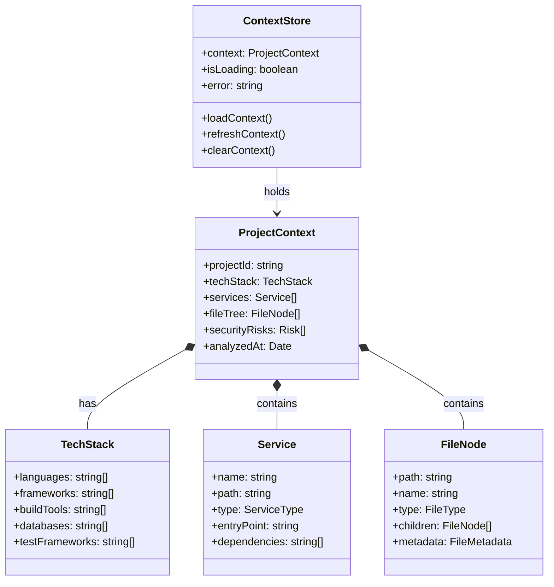
```mermaid
classDiagram
    class ContextStore {
        +context: ProjectContext
        +isLoading: boolean
        +error: string
        +loadContext()
        +refreshContext()
        +clearContext()
    }

    class ProjectContext {
        +projectId: string
        +techStack: TechStack
        +services: Service[]
        +fileTree: FileNode[]
        +securityRisks: Risk[]
        +analyzedAt: Date
    }

    class TechStack {
        +languages: string[]
        +frameworks: string[]
        +buildTools: string[]
        +databases: string[]
        +testFrameworks: string[]
    }

    class Service {
        +name: string
        +path: string
        +type: ServiceType
        +entryPoint: string
        +dependencies: string[]
    }

    class FileNode {
        +path: string
        +name: string
        +type: FileType
        +children: FileNode[]
        +metadata: FileMetadata
    }

    ContextStore --> ProjectContext : holds
    ProjectContext *-- TechStack : has
    ProjectContext *-- Service : contains
    ProjectContext *-- FileNode : contains
```

### Additional Store Interfaces

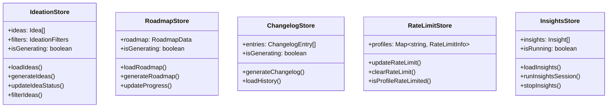
```mermaid
classDiagram
    class IdeationStore {
        +ideas: Idea[]
        +filters: IdeationFilters
        +isGenerating: boolean
        +loadIdeas()
        +generateIdeas()
        +updateIdeaStatus()
        +filterIdeas()
    }

    class RoadmapStore {
        +roadmap: RoadmapData
        +isGenerating: boolean
        +loadRoadmap()
        +generateRoadmap()
        +updateProgress()
    }

    class ChangelogStore {
        +entries: ChangelogEntry[]
        +isGenerating: boolean
        +generateChangelog()
        +loadHistory()
    }

    class RateLimitStore {
        +profiles: Map~string, RateLimitInfo~
        +updateRateLimit()
        +clearRateLimit()
        +isProfileRateLimited()
    }

    class InsightsStore {
        +insights: Insight[]
        +isRunning: boolean
        +loadInsights()
        +runInsightsSession()
        +stopInsights()
    }
```

---

## Cross-Domain Relationships

### System Integration Overview

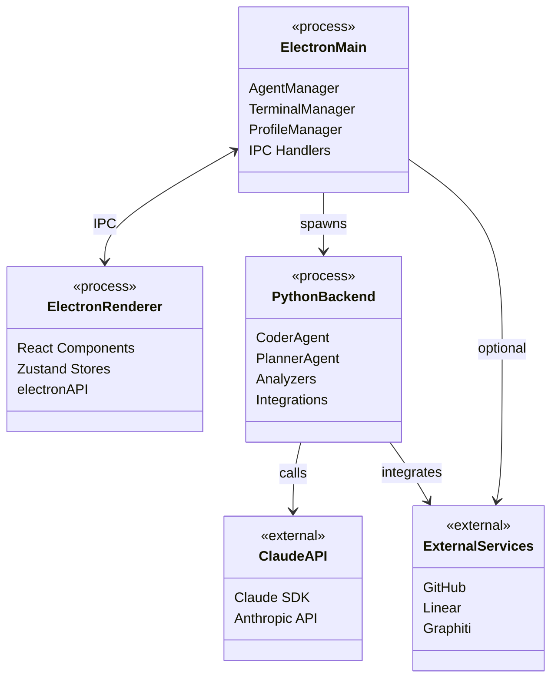
```mermaid
classDiagram
    direction TB

    class ElectronMain {
        <<process>>
        AgentManager
        TerminalManager
        ProfileManager
        IPC Handlers
    }

    class ElectronRenderer {
        <<process>>
        React Components
        Zustand Stores
        electronAPI
    }

    class PythonBackend {
        <<process>>
        CoderAgent
        PlannerAgent
        Analyzers
        Integrations
    }

    class ClaudeAPI {
        <<external>>
        Claude SDK
        Anthropic API
    }

    class ExternalServices {
        <<external>>
        GitHub
        Linear
        Graphiti
    }

    ElectronMain <--> ElectronRenderer : IPC
    ElectronMain --> PythonBackend : spawns
    PythonBackend --> ClaudeAPI : calls
    PythonBackend --> ExternalServices : integrates
    ElectronMain --> ExternalServices : optional
```

### Data Flow Diagram

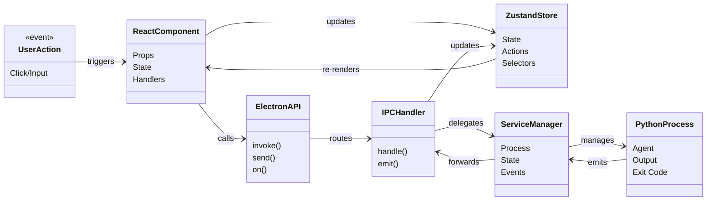
```mermaid
classDiagram
    direction LR

    class UserAction {
        <<event>>
        Click/Input
    }

    class ReactComponent {
        Props
        State
        Handlers
    }

    class ZustandStore {
        State
        Actions
        Selectors
    }

    class ElectronAPI {
        invoke()
        send()
        on()
    }

    class IPCHandler {
        handle()
        emit()
    }

    class ServiceManager {
        Process
        State
        Events
    }

    class PythonProcess {
        Agent
        Output
        Exit Code
    }

    UserAction --> ReactComponent : triggers
    ReactComponent --> ZustandStore : updates
    ReactComponent --> ElectronAPI : calls
    ElectronAPI --> IPCHandler : routes
    IPCHandler --> ServiceManager : delegates
    ServiceManager --> PythonProcess : manages
    PythonProcess --> ServiceManager : emits
    ServiceManager --> IPCHandler : forwards
    IPCHandler --> ZustandStore : updates
    ZustandStore --> ReactComponent : re-renders
```

---

## Class Diagram Reference

### Relationship Types

| Symbol | Meaning | Description |
|--------|---------|-------------|
| `<\|--` | Inheritance | Class extends another class |
| `*--` | Composition | Strong ownership (lifecycle tied) |
| `o--` | Aggregation | Weak ownership (independent lifecycle) |
| `-->` | Association | Uses or references |
| `..>` | Dependency | Temporary usage |
| `<\|..` | Realization | Implements interface |

### Visibility Modifiers

| Symbol | Meaning |
|--------|---------|
| `+` | Public |
| `-` | Private |
| `#` | Protected |
| `~` | Package/Internal |

### Stereotypes Used

| Stereotype | Meaning |
|------------|---------|
| `<<interface>>` | Interface definition |
| `<<abstract>>` | Abstract class |
| `<<enumeration>>` | Enum type |
| `<<external>>` | Third-party dependency |
| `<<process>>` | Runtime process |
| `<<event>>` | Event type |

---

## Related Documentation

- [Use Case Diagrams](./use-cases.md) - Actor interactions and workflows
- [Sequence Diagrams](./sequences.md) - Temporal flow of operations
- [Architecture Overview](../architecture/overview.md) - System architecture
- [Backend Components](../components/backend/agents.md) - Detailed agent documentation
- [Frontend Components](../components/frontend/state.md) - State management details
