# Sequence Diagrams

This document provides comprehensive sequence diagrams for Auto-Claude, illustrating the temporal flow of operations, inter-process communication, and component interactions. Sequence diagrams help visualize the exact order of events and message passing between system components.

## Overview

Sequence diagrams in Auto-Claude document critical flows across three main domains:

| Domain | Description | Key Participants |
|--------|-------------|------------------|
| **Task Execution** | Full lifecycle from task creation to completion | UI, Store, AgentManager, Python Backend |
| **IPC Communication** | Message passing between Electron processes | Renderer, Preload, Main, IPC Handlers |
| **Agent Lifecycle** | Python agent phases and state transitions | AgentManager, ProcessManager, Claude API |

---

## Task Execution Sequences

### Complete Task Execution Flow

The complete flow from user clicking "Start Task" to task completion:

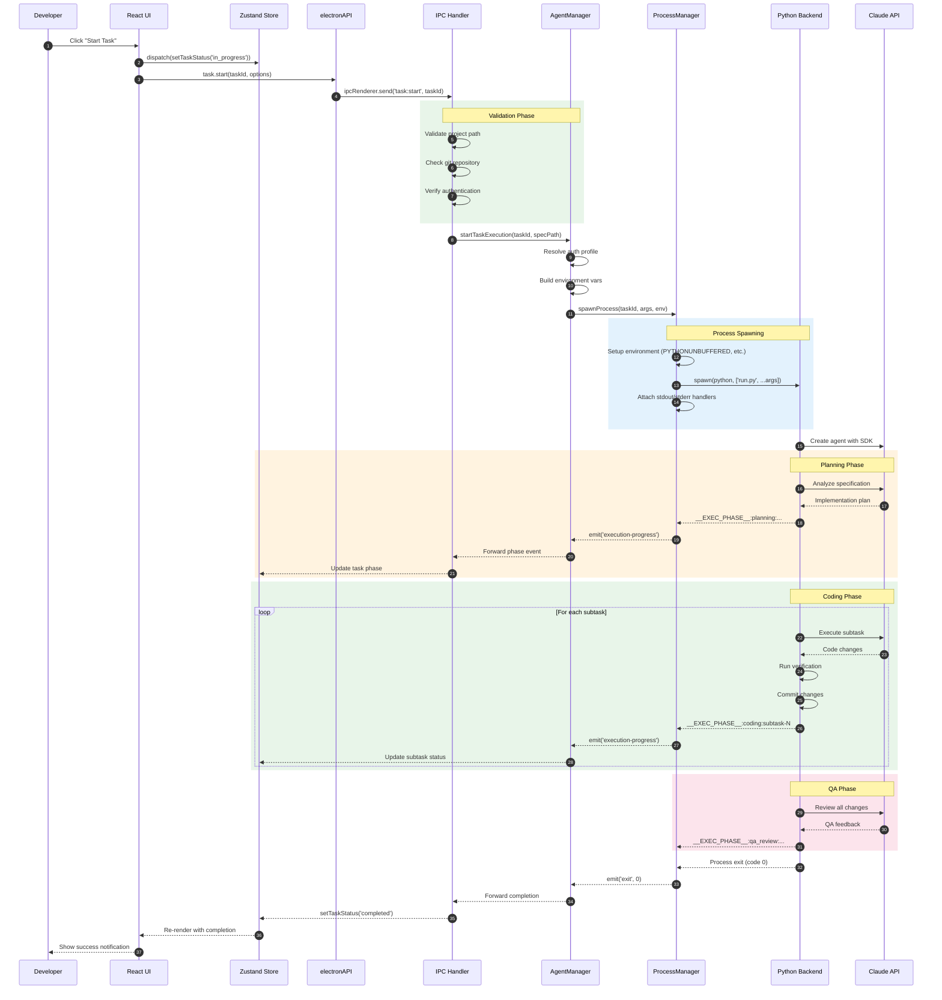
```mermaid
sequenceDiagram
    autonumber
    participant User as Developer
    participant UI as React UI
    participant Store as Zustand Store
    participant API as electronAPI
    participant IPC as IPC Handler
    participant AM as AgentManager
    participant PM as ProcessManager
    participant Py as Python Backend
    participant Claude as Claude API

    User->>UI: Click "Start Task"
    UI->>Store: dispatch(setTaskStatus('in_progress'))
    UI->>API: task.start(taskId, options)
    API->>IPC: ipcRenderer.send('task:start', taskId)

    rect rgb(232, 245, 233)
        Note over IPC,AM: Validation Phase
        IPC->>IPC: Validate project path
        IPC->>IPC: Check git repository
        IPC->>IPC: Verify authentication
    end

    IPC->>AM: startTaskExecution(taskId, specPath)
    AM->>AM: Resolve auth profile
    AM->>AM: Build environment vars
    AM->>PM: spawnProcess(taskId, args, env)

    rect rgb(227, 242, 253)
        Note over PM,Py: Process Spawning
        PM->>PM: Setup environment (PYTHONUNBUFFERED, etc.)
        PM->>Py: spawn(python, ['run.py', ...args])
        PM->>PM: Attach stdout/stderr handlers
    end

    Py->>Claude: Create agent with SDK

    rect rgb(255, 243, 224)
        Note over Py,Claude: Planning Phase
        Py->>Claude: Analyze specification
        Claude-->>Py: Implementation plan
        Py-->>PM: __EXEC_PHASE__:planning:...
        PM-->>AM: emit('execution-progress')
        AM-->>IPC: Forward phase event
        IPC-->>Store: Update task phase
    end

    rect rgb(232, 245, 233)
        Note over Py,Claude: Coding Phase
        loop For each subtask
            Py->>Claude: Execute subtask
            Claude-->>Py: Code changes
            Py->>Py: Run verification
            Py->>Py: Commit changes
            Py-->>PM: __EXEC_PHASE__:coding:subtask-N
            PM-->>AM: emit('execution-progress')
            AM-->>Store: Update subtask status
        end
    end

    rect rgb(252, 228, 236)
        Note over Py,Claude: QA Phase
        Py->>Claude: Review all changes
        Claude-->>Py: QA feedback
        Py-->>PM: __EXEC_PHASE__:qa_review:...
    end

    Py-->>PM: Process exit (code 0)
    PM-->>AM: emit('exit', 0)
    AM-->>IPC: Forward completion
    IPC-->>Store: setTaskStatus('completed')
    Store-->>UI: Re-render with completion
    UI-->>User: Show success notification
```

### Task Creation Sequence

Creating a new task through the UI wizard:

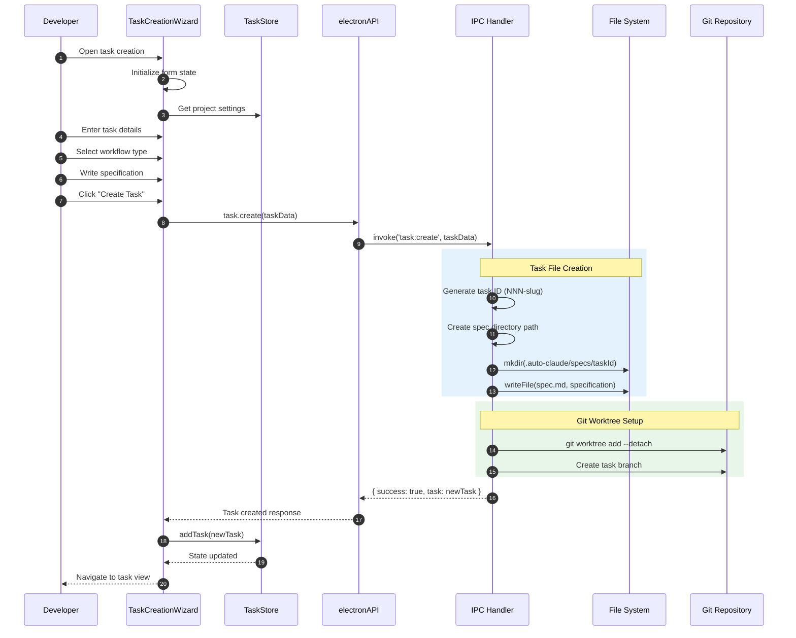
```mermaid
sequenceDiagram
    autonumber
    participant User as Developer
    participant Wizard as TaskCreationWizard
    participant Store as TaskStore
    participant API as electronAPI
    participant IPC as IPC Handler
    participant FS as File System
    participant Git as Git Repository

    User->>Wizard: Open task creation
    Wizard->>Wizard: Initialize form state
    Wizard->>Store: Get project settings

    User->>Wizard: Enter task details
    User->>Wizard: Select workflow type
    User->>Wizard: Write specification

    User->>Wizard: Click "Create Task"

    Wizard->>API: task.create(taskData)
    API->>IPC: invoke('task:create', taskData)

    rect rgb(227, 242, 253)
        Note over IPC,FS: Task File Creation
        IPC->>IPC: Generate task ID (NNN-slug)
        IPC->>IPC: Create spec directory path
        IPC->>FS: mkdir(.auto-claude/specs/taskId)
        IPC->>FS: writeFile(spec.md, specification)
    end

    rect rgb(232, 245, 233)
        Note over IPC,Git: Git Worktree Setup
        IPC->>Git: git worktree add --detach
        IPC->>Git: Create task branch
    end

    IPC-->>API: { success: true, task: newTask }
    API-->>Wizard: Task created response
    Wizard->>Store: addTask(newTask)
    Store-->>Wizard: State updated
    Wizard-->>User: Navigate to task view
```

### Task Cancellation Sequence

Cancelling a running task gracefully:

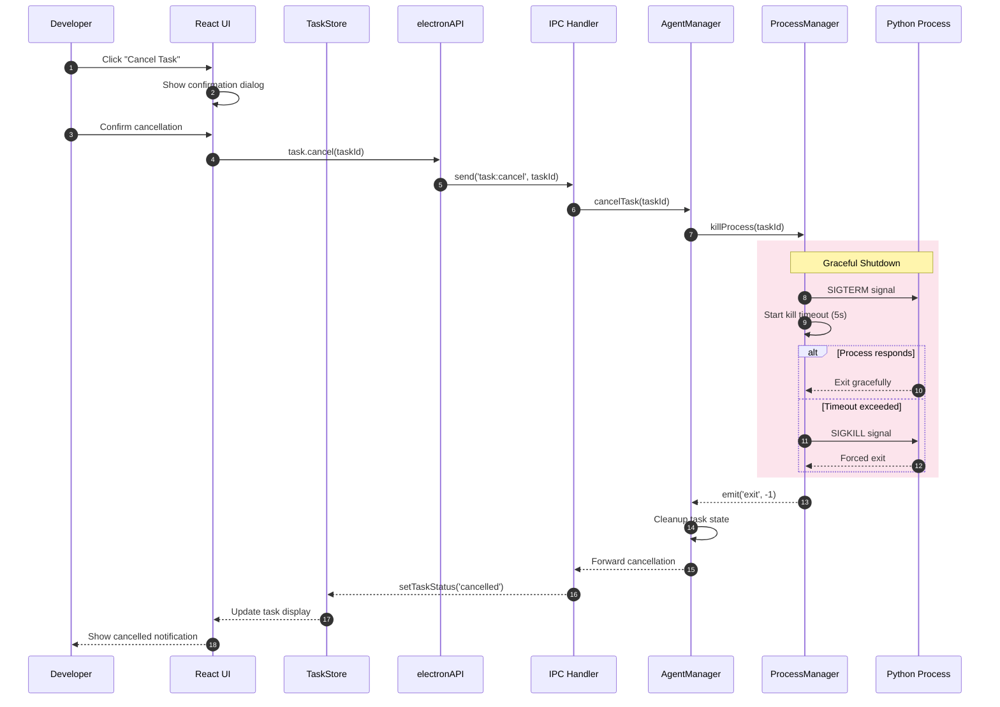
```mermaid
sequenceDiagram
    autonumber
    participant User as Developer
    participant UI as React UI
    participant Store as TaskStore
    participant API as electronAPI
    participant IPC as IPC Handler
    participant AM as AgentManager
    participant PM as ProcessManager
    participant Py as Python Process

    User->>UI: Click "Cancel Task"
    UI->>UI: Show confirmation dialog
    User->>UI: Confirm cancellation

    UI->>API: task.cancel(taskId)
    API->>IPC: send('task:cancel', taskId)

    IPC->>AM: cancelTask(taskId)
    AM->>PM: killProcess(taskId)

    rect rgb(252, 228, 236)
        Note over PM,Py: Graceful Shutdown
        PM->>Py: SIGTERM signal
        PM->>PM: Start kill timeout (5s)

        alt Process responds
            Py-->>PM: Exit gracefully
        else Timeout exceeded
            PM->>Py: SIGKILL signal
            Py-->>PM: Forced exit
        end
    end

    PM-->>AM: emit('exit', -1)
    AM->>AM: Cleanup task state
    AM-->>IPC: Forward cancellation
    IPC-->>Store: setTaskStatus('cancelled')
    Store-->>UI: Update task display
    UI-->>User: Show cancelled notification
```

---

## IPC Communication Sequences

### Renderer to Main Communication

Standard request-response pattern for IPC:

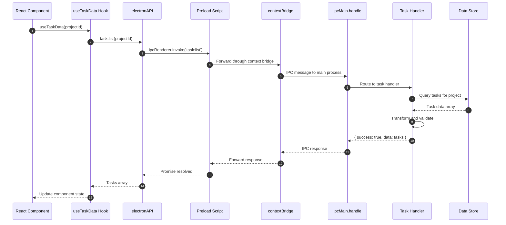
```mermaid
sequenceDiagram
    autonumber
    participant React as React Component
    participant Hook as useTaskData Hook
    participant API as electronAPI
    participant Preload as Preload Script
    participant Bridge as contextBridge
    participant Main as ipcMain.handle
    participant Handler as Task Handler
    participant Store as Data Store

    React->>Hook: useTaskData(projectId)
    Hook->>API: task.list(projectId)
    API->>Preload: ipcRenderer.invoke('task:list')
    Preload->>Bridge: Forward through context bridge
    Bridge->>Main: IPC message to main process

    Main->>Handler: Route to task handler
    Handler->>Store: Query tasks for project
    Store-->>Handler: Task data array
    Handler->>Handler: Transform and validate
    Handler-->>Main: { success: true, data: tasks }

    Main-->>Bridge: IPC response
    Bridge-->>Preload: Forward response
    Preload-->>API: Promise resolved
    API-->>Hook: Tasks array
    Hook-->>React: Update component state
```

### Event Streaming (Main to Renderer)

Real-time event streaming for task progress:

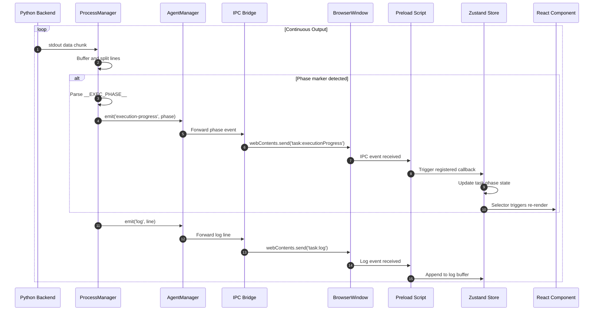
```mermaid
sequenceDiagram
    autonumber
    participant Py as Python Backend
    participant PM as ProcessManager
    participant AM as AgentManager
    participant IPC as IPC Bridge
    participant Win as BrowserWindow
    participant Preload as Preload Script
    participant Store as Zustand Store
    participant React as React Component

    loop Continuous Output
        Py->>PM: stdout data chunk
        PM->>PM: Buffer and split lines

        alt Phase marker detected
            PM->>PM: Parse __EXEC_PHASE__
            PM->>AM: emit('execution-progress', phase)
            AM->>IPC: Forward phase event
            IPC->>Win: webContents.send('task:executionProgress')
            Win->>Preload: IPC event received
            Preload->>Store: Trigger registered callback
            Store->>Store: Update task phase state
            Store->>React: Selector triggers re-render
        end

        PM->>AM: emit('log', line)
        AM->>IPC: Forward log line
        IPC->>Win: webContents.send('task:log')
        Win->>Preload: Log event received
        Preload->>Store: Append to log buffer
    end
```

### Multi-Handler IPC Registration

How IPC handlers are registered at app startup:

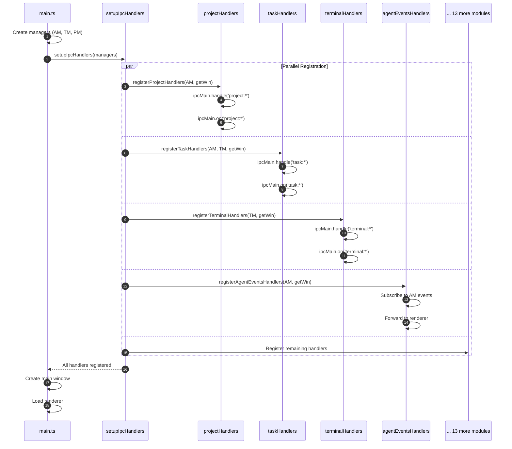
```mermaid
sequenceDiagram
    autonumber
    participant Main as main.ts
    participant Setup as setupIpcHandlers
    participant Project as projectHandlers
    participant Task as taskHandlers
    participant Terminal as terminalHandlers
    participant Agent as agentEventsHandlers
    participant More as ... 13 more modules

    Main->>Main: Create managers (AM, TM, PM)
    Main->>Setup: setupIpcHandlers(managers)

    par Parallel Registration
        Setup->>Project: registerProjectHandlers(AM, getWin)
        Project->>Project: ipcMain.handle('project:*')
        Project->>Project: ipcMain.on('project:*')
    and
        Setup->>Task: registerTaskHandlers(AM, TM, getWin)
        Task->>Task: ipcMain.handle('task:*')
        Task->>Task: ipcMain.on('task:*')
    and
        Setup->>Terminal: registerTerminalHandlers(TM, getWin)
        Terminal->>Terminal: ipcMain.handle('terminal:*')
        Terminal->>Terminal: ipcMain.on('terminal:*')
    and
        Setup->>Agent: registerAgentEventsHandlers(AM, getWin)
        Agent->>Agent: Subscribe to AM events
        Agent->>Agent: Forward to renderer
    and
        Setup->>More: Register remaining handlers
    end

    Setup-->>Main: All handlers registered
    Main->>Main: Create main window
    Main->>Main: Load renderer
```

### Secure Context Bridge

Security layer for IPC communication:

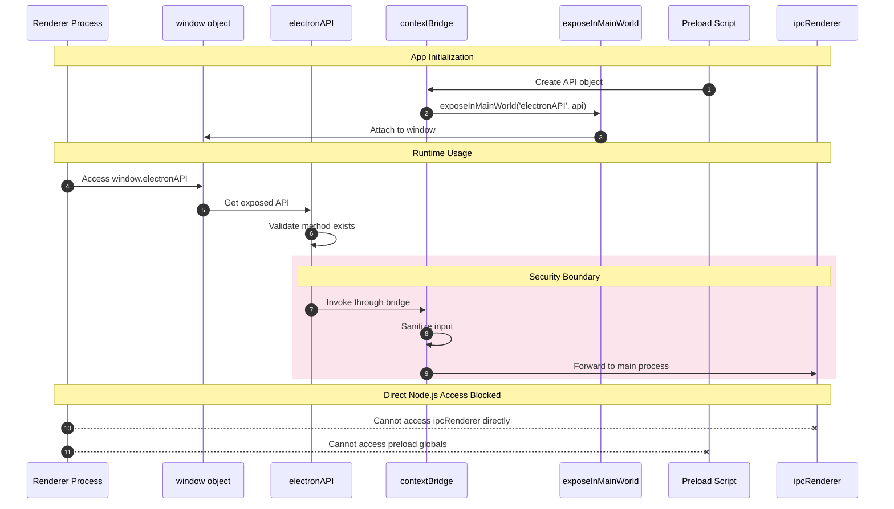
```mermaid
sequenceDiagram
    autonumber
    participant Renderer as Renderer Process
    participant Window as window object
    participant API as electronAPI
    participant Bridge as contextBridge
    participant Expose as exposeInMainWorld
    participant Preload as Preload Script
    participant IPC as ipcRenderer

    Note over Renderer,IPC: App Initialization

    Preload->>Bridge: Create API object
    Bridge->>Expose: exposeInMainWorld('electronAPI', api)
    Expose->>Window: Attach to window

    Note over Renderer,IPC: Runtime Usage

    Renderer->>Window: Access window.electronAPI
    Window->>API: Get exposed API
    API->>API: Validate method exists

    rect rgb(252, 228, 236)
        Note over API,IPC: Security Boundary
        API->>Bridge: Invoke through bridge
        Bridge->>Bridge: Sanitize input
        Bridge->>IPC: Forward to main process
    end

    Note over Renderer,IPC: Direct Node.js Access Blocked
    Renderer--xIPC: Cannot access ipcRenderer directly
    Renderer--xPreload: Cannot access preload globals
```

---

## Agent Lifecycle Sequences

### Agent Initialization

Starting the Python agent process:

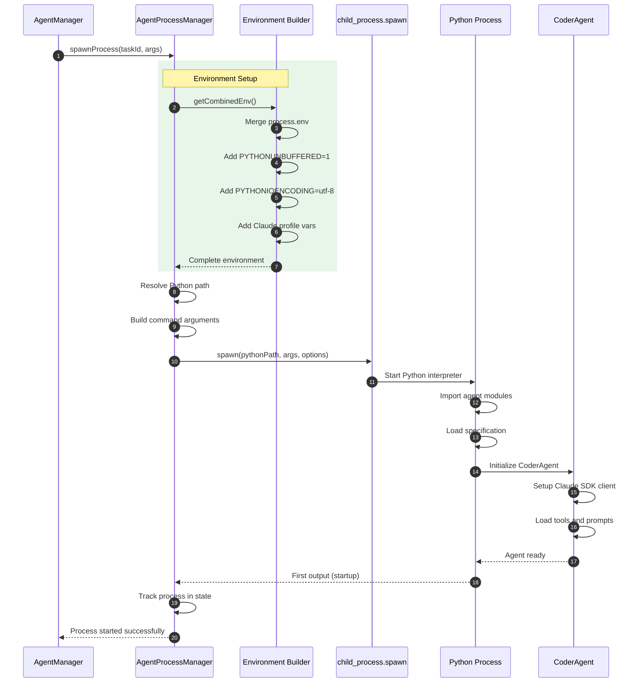
```mermaid
sequenceDiagram
    autonumber
    participant AM as AgentManager
    participant PM as AgentProcessManager
    participant Env as Environment Builder
    participant Spawn as child_process.spawn
    participant Py as Python Process
    participant Agent as CoderAgent

    AM->>PM: spawnProcess(taskId, args)

    rect rgb(232, 245, 233)
        Note over PM,Env: Environment Setup
        PM->>Env: getCombinedEnv()
        Env->>Env: Merge process.env
        Env->>Env: Add PYTHONUNBUFFERED=1
        Env->>Env: Add PYTHONIOENCODING=utf-8
        Env->>Env: Add Claude profile vars
        Env-->>PM: Complete environment
    end

    PM->>PM: Resolve Python path
    PM->>PM: Build command arguments
    PM->>Spawn: spawn(pythonPath, args, options)
    Spawn->>Py: Start Python interpreter

    Py->>Py: Import agent modules
    Py->>Py: Load specification
    Py->>Agent: Initialize CoderAgent
    Agent->>Agent: Setup Claude SDK client
    Agent->>Agent: Load tools and prompts

    Agent-->>Py: Agent ready
    Py-->>PM: First output (startup)
    PM->>PM: Track process in state
    PM-->>AM: Process started successfully
```

### Agent Phase Transitions

State machine for agent execution phases:

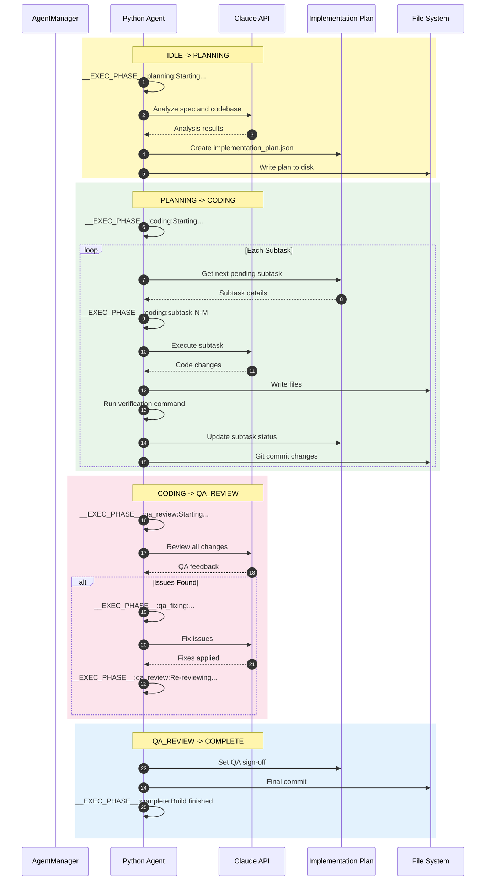
```mermaid
sequenceDiagram
    autonumber
    participant AM as AgentManager
    participant Py as Python Agent
    participant Claude as Claude API
    participant Plan as Implementation Plan
    participant FS as File System

    rect rgb(255, 249, 196)
        Note over Py,Claude: IDLE -> PLANNING
        Py->>Py: __EXEC_PHASE__:planning:Starting...
        Py->>Claude: Analyze spec and codebase
        Claude-->>Py: Analysis results
        Py->>Plan: Create implementation_plan.json
        Py->>FS: Write plan to disk
    end

    rect rgb(232, 245, 233)
        Note over Py,Claude: PLANNING -> CODING
        Py->>Py: __EXEC_PHASE__:coding:Starting...

        loop Each Subtask
            Py->>Plan: Get next pending subtask
            Plan-->>Py: Subtask details
            Py->>Py: __EXEC_PHASE__:coding:subtask-N-M
            Py->>Claude: Execute subtask
            Claude-->>Py: Code changes
            Py->>FS: Write files
            Py->>Py: Run verification command
            Py->>Plan: Update subtask status
            Py->>FS: Git commit changes
        end
    end

    rect rgb(252, 228, 236)
        Note over Py,Claude: CODING -> QA_REVIEW
        Py->>Py: __EXEC_PHASE__:qa_review:Starting...
        Py->>Claude: Review all changes
        Claude-->>Py: QA feedback

        alt Issues Found
            Py->>Py: __EXEC_PHASE__:qa_fixing:...
            Py->>Claude: Fix issues
            Claude-->>Py: Fixes applied
            Py->>Py: __EXEC_PHASE__:qa_review:Re-reviewing...
        end
    end

    rect rgb(227, 242, 253)
        Note over Py,Claude: QA_REVIEW -> COMPLETE
        Py->>Plan: Set QA sign-off
        Py->>FS: Final commit
        Py->>Py: __EXEC_PHASE__:complete:Build finished
    end
```

### Agent Error Recovery

Handling errors and recovery scenarios:

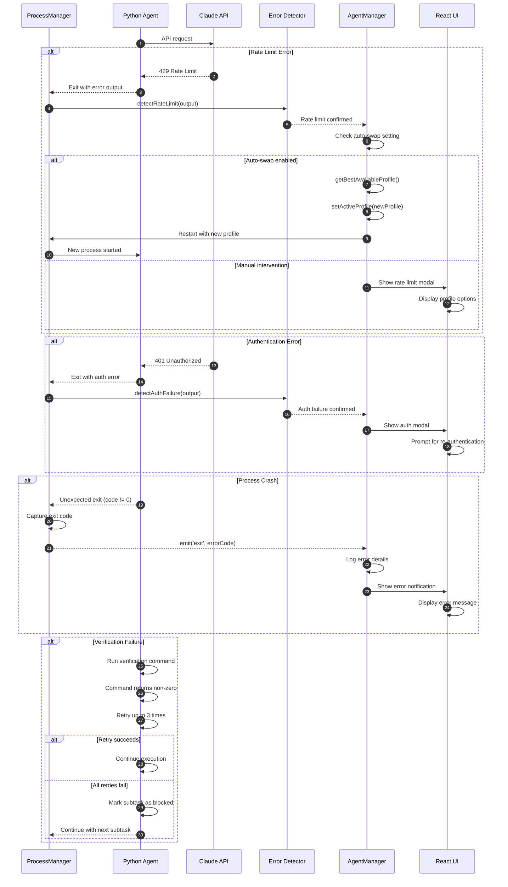
```mermaid
sequenceDiagram
    autonumber
    participant PM as ProcessManager
    participant Py as Python Agent
    participant Claude as Claude API
    participant Detect as Error Detector
    participant AM as AgentManager
    participant UI as React UI

    Py->>Claude: API request

    alt Rate Limit Error
        Claude-->>Py: 429 Rate Limit
        Py-->>PM: Exit with error output
        PM->>Detect: detectRateLimit(output)
        Detect-->>AM: Rate limit confirmed
        AM->>AM: Check auto-swap setting

        alt Auto-swap enabled
            AM->>AM: getBestAvailableProfile()
            AM->>AM: setActiveProfile(newProfile)
            AM->>PM: Restart with new profile
            PM->>Py: New process started
        else Manual intervention
            AM->>UI: Show rate limit modal
            UI->>UI: Display profile options
        end
    end

    alt Authentication Error
        Claude-->>Py: 401 Unauthorized
        Py-->>PM: Exit with auth error
        PM->>Detect: detectAuthFailure(output)
        Detect-->>AM: Auth failure confirmed
        AM->>UI: Show auth modal
        UI->>UI: Prompt for re-authentication
    end

    alt Process Crash
        Py-->>PM: Unexpected exit (code != 0)
        PM->>PM: Capture exit code
        PM-->>AM: emit('exit', errorCode)
        AM->>AM: Log error details
        AM->>UI: Show error notification
        UI->>UI: Display error message
    end

    alt Verification Failure
        Py->>Py: Run verification command
        Py->>Py: Command returns non-zero
        Py->>Py: Retry up to 3 times

        alt Retry succeeds
            Py->>Py: Continue execution
        else All retries fail
            Py->>Py: Mark subtask as blocked
            Py-->>PM: Continue with next subtask
        end
    end
```

### Agent Memory Integration

How the agent interacts with Graphiti memory:

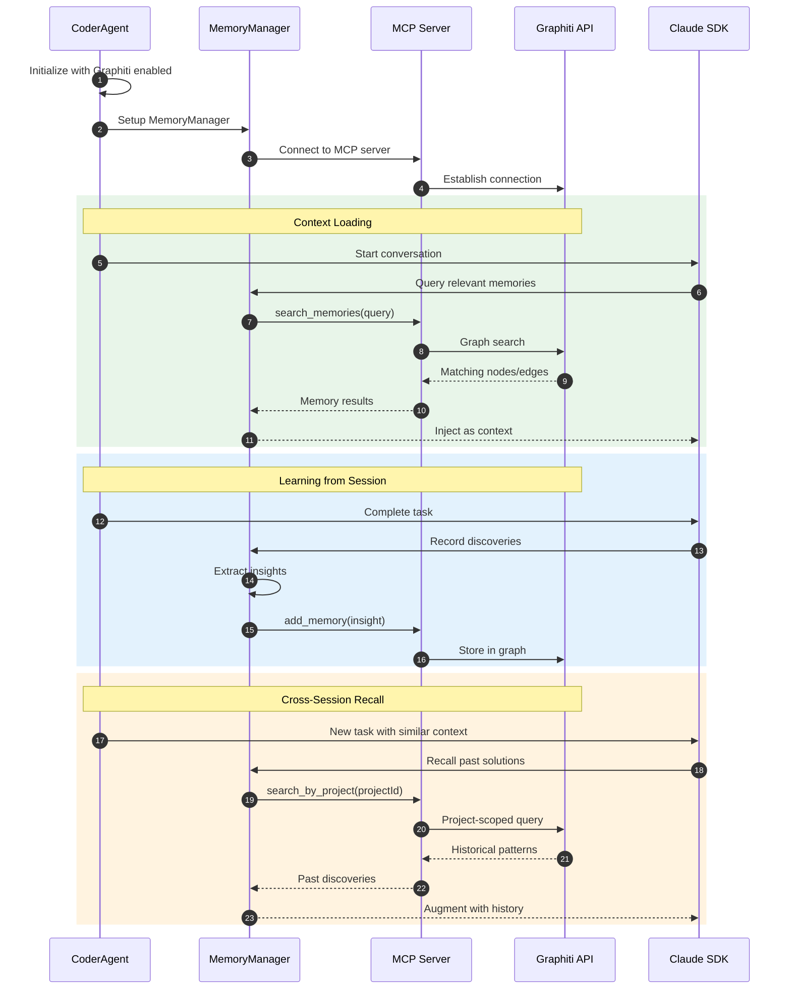
```mermaid
sequenceDiagram
    autonumber
    participant Agent as CoderAgent
    participant Memory as MemoryManager
    participant MCP as MCP Server
    participant Graphiti as Graphiti API
    participant Claude as Claude SDK

    Agent->>Agent: Initialize with Graphiti enabled
    Agent->>Memory: Setup MemoryManager
    Memory->>MCP: Connect to MCP server
    MCP->>Graphiti: Establish connection

    rect rgb(232, 245, 233)
        Note over Agent,Graphiti: Context Loading
        Agent->>Claude: Start conversation
        Claude->>Memory: Query relevant memories
        Memory->>MCP: search_memories(query)
        MCP->>Graphiti: Graph search
        Graphiti-->>MCP: Matching nodes/edges
        MCP-->>Memory: Memory results
        Memory-->>Claude: Inject as context
    end

    rect rgb(227, 242, 253)
        Note over Agent,Graphiti: Learning from Session
        Agent->>Claude: Complete task
        Claude->>Memory: Record discoveries
        Memory->>Memory: Extract insights
        Memory->>MCP: add_memory(insight)
        MCP->>Graphiti: Store in graph
    end

    rect rgb(255, 243, 224)
        Note over Agent,Graphiti: Cross-Session Recall
        Agent->>Claude: New task with similar context
        Claude->>Memory: Recall past solutions
        Memory->>MCP: search_by_project(projectId)
        MCP->>Graphiti: Project-scoped query
        Graphiti-->>MCP: Historical patterns
        MCP-->>Memory: Past discoveries
        Memory-->>Claude: Augment with history
    end
```

---

## Terminal Integration Sequences

### Terminal Session Creation

Creating a new PTY session:

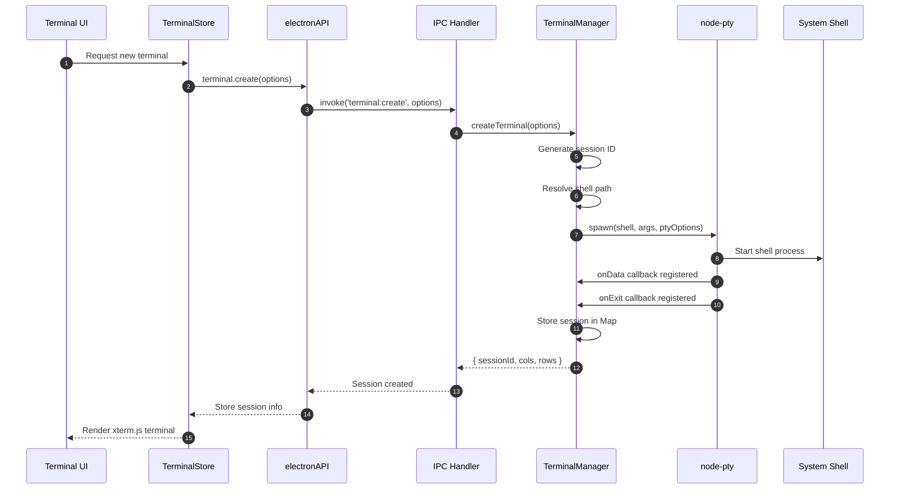
```mermaid
sequenceDiagram
    autonumber
    participant UI as Terminal UI
    participant Store as TerminalStore
    participant API as electronAPI
    participant IPC as IPC Handler
    participant TM as TerminalManager
    participant PTY as node-pty
    participant Shell as System Shell

    UI->>Store: Request new terminal
    Store->>API: terminal.create(options)
    API->>IPC: invoke('terminal:create', options)

    IPC->>TM: createTerminal(options)
    TM->>TM: Generate session ID
    TM->>TM: Resolve shell path

    TM->>PTY: spawn(shell, args, ptyOptions)
    PTY->>Shell: Start shell process

    PTY->>TM: onData callback registered
    PTY->>TM: onExit callback registered

    TM->>TM: Store session in Map
    TM-->>IPC: { sessionId, cols, rows }
    IPC-->>API: Session created
    API-->>Store: Store session info
    Store-->>UI: Render xterm.js terminal
```

### Claude Code Invocation

Invoking Claude Code within a terminal:

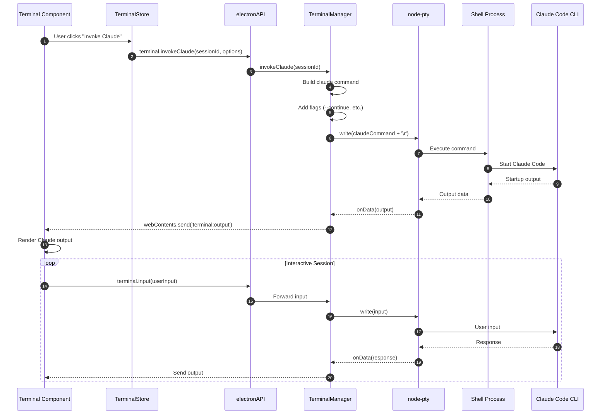
```mermaid
sequenceDiagram
    autonumber
    participant UI as Terminal Component
    participant Store as TerminalStore
    participant API as electronAPI
    participant TM as TerminalManager
    participant PTY as node-pty
    participant Shell as Shell Process
    participant Claude as Claude Code CLI

    UI->>Store: User clicks "Invoke Claude"
    Store->>API: terminal.invokeClaude(sessionId, options)
    API->>TM: invokeClaude(sessionId)

    TM->>TM: Build claude command
    TM->>TM: Add flags (--continue, etc.)
    TM->>PTY: write(claudeCommand + '\r')

    PTY->>Shell: Execute command
    Shell->>Claude: Start Claude Code

    Claude-->>Shell: Startup output
    Shell-->>PTY: Output data
    PTY-->>TM: onData(output)
    TM-->>UI: webContents.send('terminal:output')

    UI->>UI: Render Claude output

    loop Interactive Session
        UI->>API: terminal.input(userInput)
        API->>TM: Forward input
        TM->>PTY: write(input)
        PTY->>Claude: User input
        Claude-->>PTY: Response
        PTY-->>TM: onData(response)
        TM-->>UI: Send output
    end
```

### Terminal Session Detection

Detecting Claude session states:

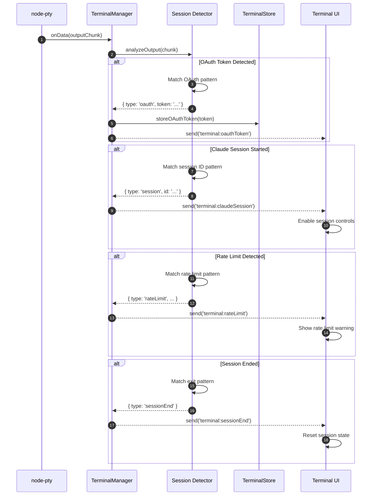
```mermaid
sequenceDiagram
    autonumber
    participant PTY as node-pty
    participant TM as TerminalManager
    participant Detect as Session Detector
    participant Store as TerminalStore
    participant UI as Terminal UI

    PTY->>TM: onData(outputChunk)
    TM->>Detect: analyzeOutput(chunk)

    alt OAuth Token Detected
        Detect->>Detect: Match OAuth pattern
        Detect-->>TM: { type: 'oauth', token: '...' }
        TM->>Store: storeOAuthToken(token)
        TM-->>UI: send('terminal:oauthToken')
    end

    alt Claude Session Started
        Detect->>Detect: Match session ID pattern
        Detect-->>TM: { type: 'session', id: '...' }
        TM-->>UI: send('terminal:claudeSession')
        UI->>UI: Enable session controls
    end

    alt Rate Limit Detected
        Detect->>Detect: Match rate limit pattern
        Detect-->>TM: { type: 'rateLimit', ... }
        TM-->>UI: send('terminal:rateLimit')
        UI->>UI: Show rate limit warning
    end

    alt Session Ended
        Detect->>Detect: Match exit pattern
        Detect-->>TM: { type: 'sessionEnd' }
        TM-->>UI: send('terminal:sessionEnd')
        UI->>UI: Reset session state
    end
```

---

## File Watcher Sequences

### Implementation Plan Watching

Monitoring plan file changes during execution:

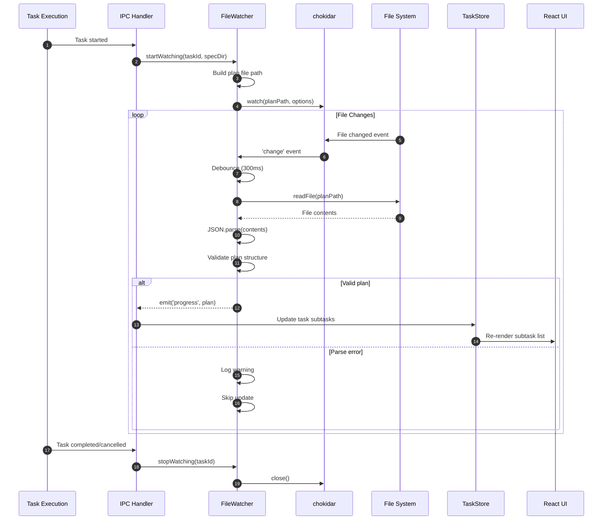
```mermaid
sequenceDiagram
    autonumber
    participant Task as Task Execution
    participant IPC as IPC Handler
    participant FW as FileWatcher
    participant Chok as chokidar
    participant FS as File System
    participant Store as TaskStore
    participant UI as React UI

    Task->>IPC: Task started
    IPC->>FW: startWatching(taskId, specDir)
    FW->>FW: Build plan file path
    FW->>Chok: watch(planPath, options)

    loop File Changes
        FS->>Chok: File changed event
        Chok->>FW: 'change' event
        FW->>FW: Debounce (300ms)
        FW->>FS: readFile(planPath)
        FS-->>FW: File contents
        FW->>FW: JSON.parse(contents)
        FW->>FW: Validate plan structure

        alt Valid plan
            FW-->>IPC: emit('progress', plan)
            IPC->>Store: Update task subtasks
            Store->>UI: Re-render subtask list
        else Parse error
            FW->>FW: Log warning
            FW->>FW: Skip update
        end
    end

    Task->>IPC: Task completed/cancelled
    IPC->>FW: stopWatching(taskId)
    FW->>Chok: close()
```

### Spec File Change Detection

Detecting changes to specification files:

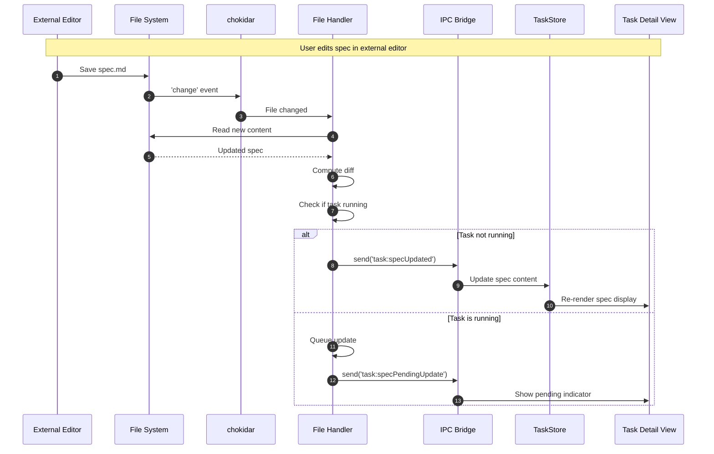
```mermaid
sequenceDiagram
    autonumber
    participant Editor as External Editor
    participant FS as File System
    participant Chok as chokidar
    participant Handler as File Handler
    participant IPC as IPC Bridge
    participant Store as TaskStore
    participant UI as Task Detail View

    Note over Editor,UI: User edits spec in external editor

    Editor->>FS: Save spec.md
    FS->>Chok: 'change' event
    Chok->>Handler: File changed

    Handler->>FS: Read new content
    FS-->>Handler: Updated spec
    Handler->>Handler: Compute diff
    Handler->>Handler: Check if task running

    alt Task not running
        Handler->>IPC: send('task:specUpdated')
        IPC->>Store: Update spec content
        Store->>UI: Re-render spec display
    else Task is running
        Handler->>Handler: Queue update
        Handler->>IPC: send('task:specPendingUpdate')
        IPC->>UI: Show pending indicator
    end
```

---

## Integration Sequences

### Linear Issue Import

Importing issues from Linear:

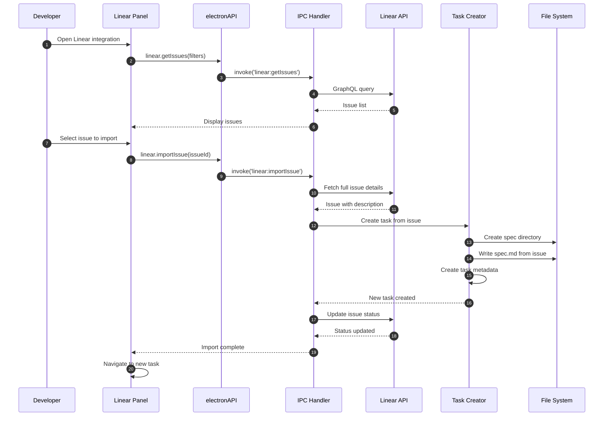
```mermaid
sequenceDiagram
    autonumber
    participant User as Developer
    participant UI as Linear Panel
    participant API as electronAPI
    participant IPC as IPC Handler
    participant Linear as Linear API
    participant Task as Task Creator
    participant FS as File System

    User->>UI: Open Linear integration
    UI->>API: linear.getIssues(filters)
    API->>IPC: invoke('linear:getIssues')
    IPC->>Linear: GraphQL query
    Linear-->>IPC: Issue list
    IPC-->>UI: Display issues

    User->>UI: Select issue to import
    UI->>API: linear.importIssue(issueId)
    API->>IPC: invoke('linear:importIssue')

    IPC->>Linear: Fetch full issue details
    Linear-->>IPC: Issue with description
    IPC->>Task: Create task from issue
    Task->>FS: Create spec directory
    Task->>FS: Write spec.md from issue
    Task->>Task: Create task metadata
    Task-->>IPC: New task created

    IPC->>Linear: Update issue status
    Linear-->>IPC: Status updated
    IPC-->>UI: Import complete
    UI->>UI: Navigate to new task
```

### GitHub PR Creation

Creating a pull request after task completion:

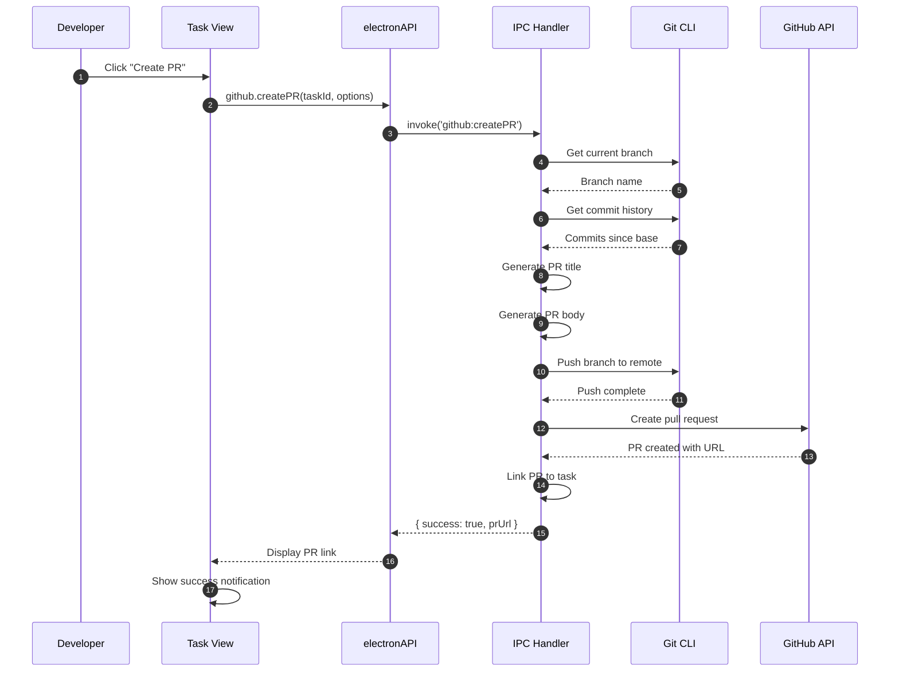
```mermaid
sequenceDiagram
    autonumber
    participant User as Developer
    participant UI as Task View
    participant API as electronAPI
    participant IPC as IPC Handler
    participant Git as Git CLI
    participant GH as GitHub API

    User->>UI: Click "Create PR"
    UI->>API: github.createPR(taskId, options)
    API->>IPC: invoke('github:createPR')

    IPC->>Git: Get current branch
    Git-->>IPC: Branch name
    IPC->>Git: Get commit history
    Git-->>IPC: Commits since base

    IPC->>IPC: Generate PR title
    IPC->>IPC: Generate PR body

    IPC->>Git: Push branch to remote
    Git-->>IPC: Push complete

    IPC->>GH: Create pull request
    GH-->>IPC: PR created with URL

    IPC->>IPC: Link PR to task
    IPC-->>API: { success: true, prUrl }
    API-->>UI: Display PR link
    UI->>UI: Show success notification
```

---

## Sequence Diagram Reference

### Participant Types

| Participant | Color | Description |
|-------------|-------|-------------|
| **User/Developer** | Default | Human actor initiating actions |
| **UI Components** | Blue | React components and views |
| **Stores** | Green | Zustand state stores |
| **IPC Layer** | Orange | Electron IPC handlers |
| **Backend** | Pink | Python processes |
| **External APIs** | Purple | Third-party services |

### Message Types

| Arrow Style | Meaning |
|-------------|---------|
| `->` | Synchronous call |
| `-->` | Async response |
| `->>` | Async message (no response) |
| `-->>` | Return value |
| `-x` | Blocked/failed |

### Sequence Patterns

| Pattern | Use Case |
|---------|----------|
| **Request-Response** | IPC invoke/handle |
| **Fire-and-Forget** | Event emission |
| **Streaming** | Real-time output |
| **Loop** | Repeated operations |
| **Alt** | Conditional branching |
| **Par** | Parallel execution |
| **Rect** | Logical grouping |

---

## Related Documentation

- [Use Case Diagrams](./use-cases.md) - Actor interactions and workflows
- [Class Diagrams](./classes.md) - Type and interface structures
- [Architecture Overview](../architecture/overview.md) - System architecture
- [Integration Guide](../architecture/integration.md) - IPC communication details
