# Use Case Diagrams

This document provides comprehensive use case diagrams for Auto-Claude, illustrating how different actors interact with the system to accomplish tasks. Use case diagrams help visualize the functional requirements and user-system interactions.

## Actor Overview

Auto-Claude involves several key actors that interact with the system:

```mermaid
flowchart LR
    subgraph Actors["System Actors"]
        Developer["Developer<br/>👤 Primary User"]
        Claude["Claude AI<br/>🤖 Agent"]
        Git["Git/GitHub<br/>📦 VCS"]
        Linear["Linear<br/>📋 Issue Tracker"]
        Graphiti["Graphiti<br/>🧠 Memory Store"]
    end

    subgraph System["Auto-Claude System"]
        Frontend["Frontend<br/>(Electron)"]
        Backend["Backend<br/>(Python)"]
    end

    Developer --> Frontend
    Frontend --> Backend
    Backend --> Claude
    Backend --> Git
    Backend --> Linear
    Backend --> Graphiti

    style Developer fill:#e1f5fe,stroke:#0288d1
    style Claude fill:#fff3e0,stroke:#f57c00
    style System fill:#f3e5f5,stroke:#7b1fa2
```

| Actor | Description | Primary Interactions |
|-------|-------------|---------------------|
| **Developer** | Human user operating the application | Task creation, build triggering, code review |
| **Claude AI** | Anthropic's AI assistant executing tasks | Code generation, analysis, testing |
| **Git/GitHub** | Version control and collaboration | Commits, branches, PRs |
| **Linear** | Project management integration | Issue sync, status updates |
| **Graphiti** | Memory and context persistence | Learning, cross-session context |

---

## Task Creation Use Cases

### Primary Task Creation Flow

The main use case for creating and configuring a new task:

```mermaid
flowchart LR
    subgraph Developer["Developer"]
        D[👤]
    end

    subgraph "Task Creation Use Cases"
        UC1[Create New Task]
        UC2[Write Spec File]
        UC3[Configure Task Parameters]
        UC4[Set Priority/Labels]
        UC5[Import from Linear]
        UC6[Import from GitHub Issue]
    end

    D --> UC1
    D --> UC2
    D --> UC3
    D --> UC4
    D --> UC5
    D --> UC6

    UC5 -.->|extends| UC1
    UC6 -.->|extends| UC1
    UC2 -.->|includes| UC1
    UC3 -.->|includes| UC1

    style UC1 fill:#c8e6c9,stroke:#388e3c
    style UC5 fill:#fff9c4,stroke:#fbc02d
    style UC6 fill:#fff9c4,stroke:#fbc02d
```

### Task Creation Detailed Flow

### Linear Import Use Case

```mermaid
flowchart LR
    subgraph Developer["Developer"]
        D[👤]
    end

    subgraph "Linear Integration"
        UC1[Browse Linear Issues]
        UC2[Search Issues]
        UC3[Filter by Status]
        UC4[Select Issue]
        UC5[Import to Auto-Claude]
        UC6[Map Fields]
    end

    subgraph Linear["Linear API"]
        L[📋]
    end

    D --> UC1
    D --> UC2
    D --> UC3
    UC1 --> UC4
    UC2 --> UC4
    UC3 --> UC4
    UC4 --> UC5
    UC5 --> UC6

    Linear -.->|provides data| UC1
    Linear -.->|provides data| UC2

    style UC5 fill:#c8e6c9,stroke:#388e3c
```

---

## Build Execution Use Cases

### Build Lifecycle Overview

```mermaid
flowchart LR
    subgraph Developer["Developer"]
        D[👤]
    end

    subgraph "Build Execution Use Cases"
        UC1[Start Build]
        UC2[Monitor Progress]
        UC3[View Live Output]
        UC4[Pause/Resume Build]
        UC5[Cancel Build]
        UC6[Retry Failed Build]
        UC7[View Build History]
    end

    D --> UC1
    D --> UC2
    D --> UC3
    D --> UC4
    D --> UC5
    D --> UC6
    D --> UC7

    UC2 -.->|includes| UC1
    UC3 -.->|includes| UC2
    UC6 -.->|extends| UC5

    style UC1 fill:#c8e6c9,stroke:#388e3c
    style UC5 fill:#ffcdd2,stroke:#d32f2f
```

### Agent Execution Use Case

When a build is started, the agent system executes multiple sub-use cases:

### Real-time Monitoring Use Case

```mermaid
flowchart LR
    subgraph Developer["Developer"]
        D[👤]
    end

    subgraph "Monitoring Use Cases"
        UC1[View Terminal Output]
        UC2[Track Phase Progress]
        UC3[View File Changes]
        UC4[Monitor Rate Limits]
        UC5[View Agent Logs]
        UC6[Check Commit History]
    end

    subgraph System["Auto-Claude"]
        Terminal[Terminal Panel]
        Progress[Progress Indicators]
        Diff[File Diff View]
        Stats[Rate Limit Stats]
    end

    D --> UC1
    D --> UC2
    D --> UC3
    D --> UC4
    D --> UC5
    D --> UC6

    UC1 --> Terminal
    UC2 --> Progress
    UC3 --> Diff
    UC4 --> Stats

    style Terminal fill:#e3f2fd,stroke:#1976d2
    style Progress fill:#e3f2fd,stroke:#1976d2
```

### Batch Build Use Cases

```mermaid
flowchart LR
    subgraph Developer["Developer"]
        D[👤]
    end

    subgraph "Batch Operations"
        UC1[Queue Multiple Tasks]
        UC2[Set Execution Order]
        UC3[Run Batch Build]
        UC4[Monitor All Builds]
        UC5[View Aggregate Results]
        UC6[Handle Batch Failures]
    end

    D --> UC1
    D --> UC2
    D --> UC3
    D --> UC4
    D --> UC5
    D --> UC6

    UC1 --> UC2
    UC2 --> UC3
    UC3 --> UC4
    UC4 --> UC5
    UC6 -.->|extends| UC4

    style UC3 fill:#c8e6c9,stroke:#388e3c
```

---

## Review Workflow Use Cases

### Code Review Overview

```mermaid
flowchart LR
    subgraph Developer["Developer"]
        D[👤]
    end

    subgraph "Review Use Cases"
        UC1[View Generated Code]
        UC2[Compare Diffs]
        UC3[Review Commit Messages]
        UC4[Accept Changes]
        UC5[Request Revisions]
        UC6[Reject Changes]
        UC7[Create Pull Request]
    end

    D --> UC1
    D --> UC2
    D --> UC3
    D --> UC4
    D --> UC5
    D --> UC6
    D --> UC7

    UC1 --> UC2
    UC2 --> UC3
    UC3 --> UC4
    UC3 --> UC5
    UC3 --> UC6
    UC4 --> UC7

    style UC4 fill:#c8e6c9,stroke:#388e3c
    style UC5 fill:#fff9c4,stroke:#fbc02d
    style UC6 fill:#ffcdd2,stroke:#d32f2f
```

### QA Review Process

### Merge & Deploy Use Cases

```mermaid
flowchart LR
    subgraph Developer["Developer"]
        D[👤]
    end

    subgraph "Merge Operations"
        UC1[View Worktree Branches]
        UC2[Preview Merge]
        UC3[Resolve Conflicts]
        UC4[Execute Merge]
        UC5[Push to Remote]
        UC6[Create Release]
    end

    subgraph Git["Git/GitHub"]
        G[📦]
    end

    D --> UC1
    D --> UC2
    D --> UC3
    D --> UC4
    D --> UC5
    D --> UC6

    UC2 --> UC3
    UC3 --> UC4
    UC4 --> UC5
    UC5 --> UC6

    UC4 -.->|uses| Git
    UC5 -.->|uses| Git
    UC6 -.->|uses| Git

    style UC4 fill:#c8e6c9,stroke:#388e3c
```

---

## Context & Memory Use Cases

### Context Building

```mermaid
flowchart LR
    subgraph Developer["Developer"]
        D[👤]
    end

    subgraph "Context Use Cases"
        UC1[View Project Context]
        UC2[Explore File Tree]
        UC3[Search Codebase]
        UC4[View Dependencies]
        UC5[Analyze Tech Stack]
        UC6[Review Security Risks]
    end

    subgraph Analysis["Analysis Engine"]
        A[🔍]
    end

    D --> UC1
    D --> UC2
    D --> UC3
    D --> UC4
    D --> UC5
    D --> UC6

    Analysis -.->|provides| UC1
    Analysis -.->|provides| UC5
    Analysis -.->|provides| UC6

    style UC1 fill:#e3f2fd,stroke:#1976d2
```

### Memory & Learning

```mermaid
flowchart LR
    subgraph Developer["Developer"]
        D[👤]
    end

    subgraph "Memory Use Cases"
        UC1[View Session History]
        UC2[Access Insights]
        UC3[Export Memory]
        UC4[Clear History]
        UC5[Share Context]
        UC6[Configure Memory Settings]
    end

    subgraph Graphiti["Graphiti Store"]
        G[🧠]
    end

    D --> UC1
    D --> UC2
    D --> UC3
    D --> UC4
    D --> UC5
    D --> UC6

    Graphiti -.->|provides| UC1
    Graphiti -.->|provides| UC2
    UC3 -.->|uses| Graphiti
    UC4 -.->|modifies| Graphiti

    style Graphiti fill:#fff3e0,stroke:#f57c00
```

---

## Integration Use Cases

### GitHub Integration

```mermaid
flowchart LR
    subgraph Developer["Developer"]
        D[👤]
    end

    subgraph "GitHub Use Cases"
        UC1[Browse GitHub Issues]
        UC2[Create Issue from Task]
        UC3[Link PR to Task]
        UC4[Sync Issue Status]
        UC5[View PR Reviews]
        UC6[Merge via GitHub]
    end

    subgraph GitHub["GitHub API"]
        GH[🐙]
    end

    D --> UC1
    D --> UC2
    D --> UC3
    D --> UC4
    D --> UC5
    D --> UC6

    GitHub -.->|syncs with| UC1
    GitHub -.->|syncs with| UC4
    UC2 -.->|creates in| GitHub
    UC3 -.->|links to| GitHub

    style GitHub fill:#f3e5f5,stroke:#7b1fa2
```

### External Tool Integration

---

## Settings & Configuration Use Cases

### Application Settings

```mermaid
flowchart LR
    subgraph Developer["Developer"]
        D[👤]
    end

    subgraph "Settings Use Cases"
        UC1[Configure API Keys]
        UC2[Set Default Paths]
        UC3[Customize UI Theme]
        UC4[Configure Rate Limits]
        UC5[Set Agent Preferences]
        UC6[Manage Allowed Commands]
    end

    D --> UC1
    D --> UC2
    D --> UC3
    D --> UC4
    D --> UC5
    D --> UC6

    style UC1 fill:#ffcdd2,stroke:#d32f2f
```

### Project Configuration

```mermaid
flowchart LR
    subgraph Developer["Developer"]
        D[👤]
    end

    subgraph "Project Config Use Cases"
        UC1[Select Project Directory]
        UC2[Configure Worktree Settings]
        UC3[Set Build Commands]
        UC4[Configure Test Commands]
        UC5[Define File Patterns]
        UC6[Setup Pre-commit Hooks]
    end

    D --> UC1
    D --> UC2
    D --> UC3
    D --> UC4
    D --> UC5
    D --> UC6

    UC1 --> UC2
    UC2 --> UC3
    UC3 --> UC4

    style UC1 fill:#c8e6c9,stroke:#388e3c
```

---

## Use Case Summary Matrix

| Category | Primary Use Cases | Actors Involved |
|----------|-------------------|-----------------|
| **Task Creation** | Create task, write spec, import issues | Developer, Linear |
| **Build Execution** | Start build, monitor, pause/cancel | Developer, Claude AI |
| **Review Workflow** | View diffs, approve/reject, create PR | Developer, Git |
| **Context & Memory** | View context, search code, access history | Developer, Graphiti |
| **Integration** | GitHub sync, Linear import, tool config | Developer, External Services |
| **Configuration** | API keys, paths, preferences | Developer |

---

## Related Documentation

- [Architecture Overview](../architecture/overview.md) - System architecture details
- [Sequence Diagrams](./sequences.md) - Detailed interaction flows
- [Class Diagrams](./classes.md) - Type and interface structures
- [Integration Guide](../architecture/integration.md) - Frontend-backend communication
