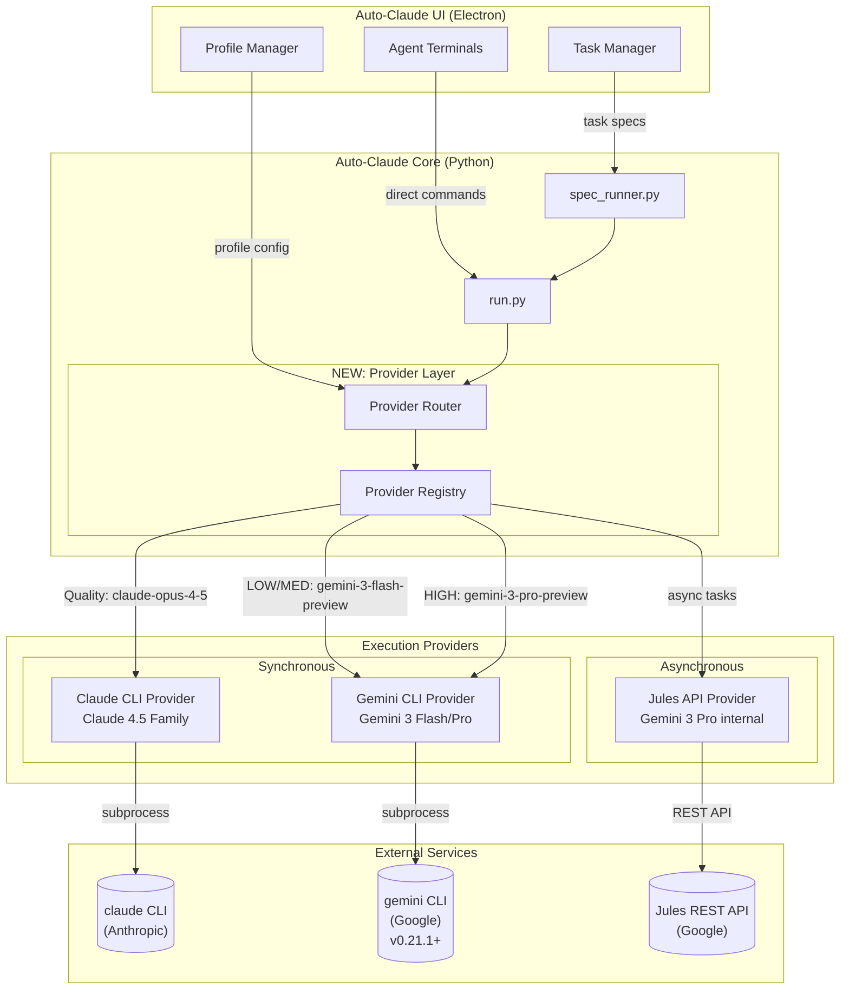
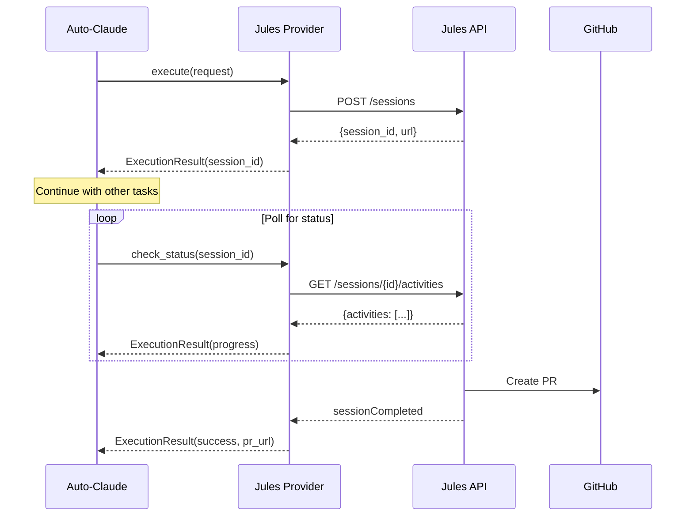
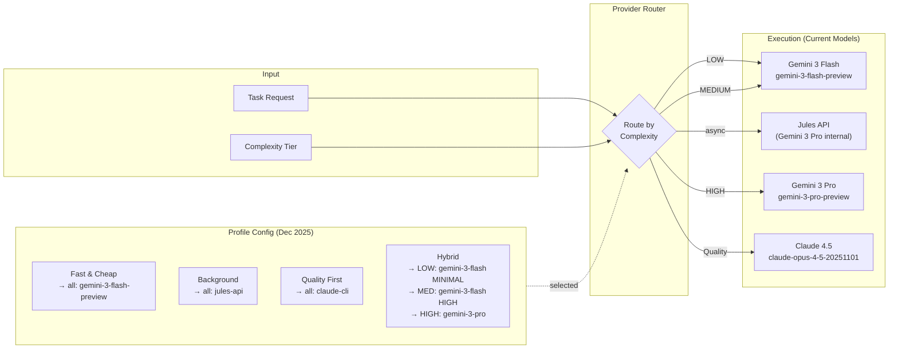

# Auto-Claude-Gemini Fork Roadmap

> **Fork of [AndyMik90/Auto-Claude](https://github.com/AndyMik90/Auto-Claude)**
>
> This roadmap outlines the features and enhancements specific to our fork, focusing on multi-provider support (Gemini, Jules) and Antigravity integration.

---

## Executive Summary

Our fork extends Auto-Claude with a **multi-provider architecture** enabling:

1. **Gemini CLI Provider** – Synchronous CLI execution with Gemini 3 models
2. **Jules API Provider** – Asynchronous background agent with REST polling
3. **Profile-Based Routing** – User-configurable provider selection per complexity tier
4. **Antigravity Integration** – Compatibility with Antigravity agent workflows

**Design Principle**: New files over modifications. Abstraction layers that existing code can adopt incrementally.

---

## Architecture Overview



---

## Phase 1: Provider Abstraction Layer 🚀

**Status**: 🟡 Planning  
**Target**: v0.1.0  
**Priority**: HIGH

### Objectives

- [ ] Create `providers/` package with base abstractions
- [ ] Extract existing Claude CLI logic into `ClaudeCliProvider`
- [ ] Implement `ProviderInterface` contract
- [ ] Create `ProviderRegistry` and `ProviderRouter`

### File Structure

```
auto-claude/
├── providers/                    # NEW DIRECTORY
│   ├── __init__.py              # Export all providers
│   ├── base.py                  # ProviderInterface, types
│   ├── claude_cli.py            # Claude CLI provider
│   └── router.py                # ProviderRouter, Registry
```

### Key Types

| Type               | Description                           |
| ------------------ | ------------------------------------- |
| `ExecutionRequest` | Standardized request to any provider  |
| `ExecutionResult`  | Standardized result from any provider |
| `ComplexityTier`   | LOW, MEDIUM, HIGH task classification |
| `ExecutionMode`    | SYNC or ASYNC execution mode          |

---

## Phase 2: Gemini CLI Provider ⚡

**Status**: 🔴 Not Started  
**Target**: v0.2.0  
**Priority**: HIGH

### Objectives

- [ ] Implement `GeminiCliProvider` class
- [ ] Add Gemini 3 model mappings (Flash, Pro)
- [ ] Implement thinking level configuration
- [ ] Add JSON output parsing
- [ ] Add stream execution support

### Model Mapping (December 2025)

| Complexity | Model                    | Thinking Level | Notes                |
| ---------- | ------------------------ | -------------- | -------------------- |
| **LOW**    | `gemini-3-flash-preview` | MINIMAL        | Fastest, cheapest    |
| **MEDIUM** | `gemini-3-flash-preview` | HIGH           | Best balance         |
| **HIGH**   | `gemini-3-pro-preview`   | HIGH           | Maximum intelligence |

### Gemini 3 Key Features

- 78% on SWE-bench (outperforms Pro on agentic coding!)
- `thinking_level` parameter: MINIMAL, LOW, MEDIUM, HIGH
- 1M token context window
- 3x faster than Gemini 2.5 Pro at ~25% cost

### Pricing (Dec 2025)

- Gemini 3 Flash: $0.50/1M input, $3.00/1M output
- Gemini 3 Pro: ~4x cost of Flash

---

## Phase 3: Jules API Provider 🤖

**Status**: 🔴 Not Started  
**Target**: v0.3.0  
**Priority**: MEDIUM

### Objectives

- [ ] Implement `JulesApiProvider` class
- [ ] Add session lifecycle management
- [ ] Implement polling mechanism
- [ ] Add GitHub PR integration
- [ ] Handle async status tracking

### Jules Session Lifecycle



### API Endpoints

| Endpoint                                  | Purpose            |
| ----------------------------------------- | ------------------ |
| `POST /v1alpha/sessions`                  | Create session     |
| `GET /v1alpha/sessions/{id}`              | Get session status |
| `GET /v1alpha/sessions/{id}/activities`   | List activities    |
| `POST /v1alpha/sessions/{id}:sendMessage` | Send message       |

---

## Phase 4: Profile-Based Routing 🎛️

**Status**: 🔴 Not Started  
**Target**: v0.4.0  
**Priority**: MEDIUM

### Objectives

- [ ] Extend profile schema with `provider_routing`
- [ ] Create example profile configurations
- [ ] Integrate router with existing profile loading
- [ ] Add profile validation

### Profile-Based Routing Flow



### Example Profile Configurations

| Profile               | Use Case             | Routing                         |
| --------------------- | -------------------- | ------------------------------- |
| **Fast & Cheap**      | Quick iterations     | All → Gemini Flash              |
| **Background Worker** | Long-running tasks   | All → Jules API                 |
| **Quality First**     | Critical code        | All → Claude CLI                |
| **Hybrid Optimal**    | Cost/quality balance | LOW/MED → Gemini, HIGH → Claude |

---

## Phase 5: Antigravity Integration 🌌

**Status**: 🟡 Planning  
**Target**: v0.5.0  
**Priority**: HIGH

### Objectives

- [ ] Ensure ANTIGRAVITY.md compatibility
- [ ] Add provider-aware workflows
- [ ] Create Antigravity-specific profiles
- [ ] Document Antigravity usage patterns

### Antigravity Workflows

- `/run_backend_tests` – Run Python backend tests
- `/run_frontend_tests` – Run Electron frontend tests
- `/start_feature` – Start a new feature branch
- `/sync_upstream` – Sync fork with upstream

---

## Phase 6: Testing & Documentation 📚

**Status**: 🔴 Not Started  
**Target**: v0.6.0  
**Priority**: MEDIUM

### Testing Objectives

- [ ] Unit tests for each provider
- [ ] Integration tests for router
- [ ] Mock tests for external APIs
- [ ] End-to-end workflow tests

### Documentation Objectives

- [ ] Update CLAUDE.md with provider info
- [ ] Create provider usage guide
- [ ] Document profile configuration
- [ ] Add troubleshooting section

---

## Open Design Decisions

> [!IMPORTANT]
> These decisions need to be finalized before implementation.

### Q1: Profile Storage Location

Where should extended profiles be stored?

- **A)** Same location as existing profiles (extend schema)
- **B)** Separate `provider-profiles/` directory
- **C)** Single config file with all profiles

### Q2: Jules Session Tracking

How should we persist Jules session IDs for status tracking?

- **A)** SQLite table (existing DB)
- **B)** JSON file in `.auto-claude/`
- **C)** In-memory only (require manual tracking)

### Q3: Error Handling Strategy

When a provider fails, should we:

- **A)** Fail immediately
- **B)** Fallback to default provider (Claude CLI)
- **C)** User-configurable fallback chain

### Q4: UI Integration Scope

Should the first version include:

- **A)** Backend only (CLI/Python)
- **B)** Full UI integration with provider selection
- **C)** UI integration in follow-up phase

---

## File Changes Summary

### New Files (No Conflicts)

```
auto-claude/
├── providers/
│   ├── __init__.py
│   ├── base.py
│   ├── claude_cli.py
│   ├── gemini_cli.py
│   ├── jules_api.py
│   └── router.py
├── profiles/
│   ├── schema.json
│   ├── fast-and-cheap.json
│   ├── background-worker.json
│   ├── quality-first.json
│   ├── hybrid-optimal.json
│   └── async-hybrid.json
└── config/
    └── providers.json
```

### Modified Files (Minimal)

| File        | Change          | Risk   |
| ----------- | --------------- | ------ |
| `run.py`    | Add router call | LOW    |
| `config.py` | Load providers  | MEDIUM |

### Unchanged Files

- `spec_runner.py`
- `prompts/`
- `auto-claude-ui/`

---

## Upstream Sync Strategy

See [FORK.md](../FORK.md) for detailed fork maintenance workflow.

### PR-Friendly Approach

When contributing back to upstream, split into multiple PRs:

1. **PR 1**: Provider abstraction layer (`providers/base.py`, `providers/router.py`)
2. **PR 2**: Claude CLI extraction (`providers/claude_cli.py`)
3. **PR 3**: Gemini CLI support (`providers/gemini_cli.py`)
4. **PR 4**: Jules API support (`providers/jules_api.py`)
5. **PR 5**: Profile routing extension

Each PR should be self-contained and backwards compatible with feature flags:

```python
ENABLE_GEMINI_PROVIDER = os.environ.get("AUTO_CLAUDE_GEMINI", "false").lower() == "true"
ENABLE_JULES_PROVIDER = os.environ.get("AUTO_CLAUDE_JULES", "false").lower() == "true"
```

---

## Version History

| Version | Date       | Description             |
| ------- | ---------- | ----------------------- |
| 0.0.1   | 2025-12-22 | Initial roadmap created |

---

## References

- [Provider Extension Architecture](./architecture/provider-extension.md)
- [Architecture Diagrams](./architecture/diagrams.md)
- [FORK.md - Fork Maintenance Strategy](../FORK.md)
- [ANTIGRAVITY.md - Agent Documentation](../ANTIGRAVITY.md)
- [CLAUDE.md - Claude Documentation](../CLAUDE.md)
