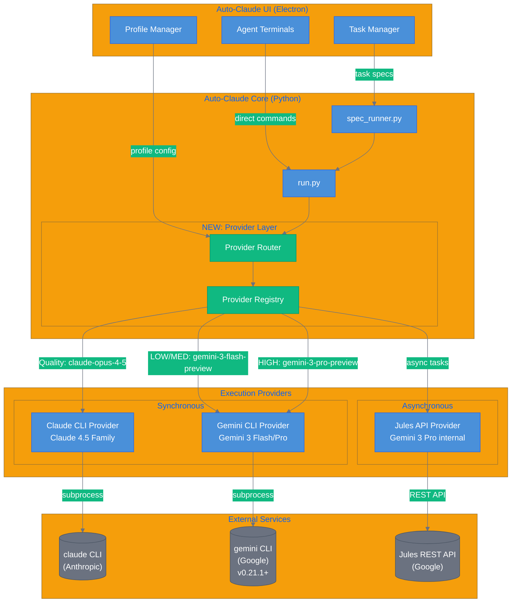
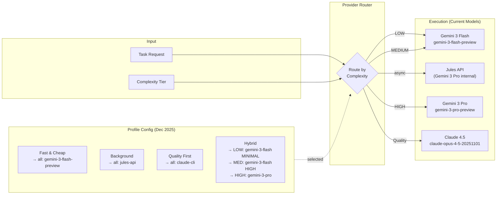
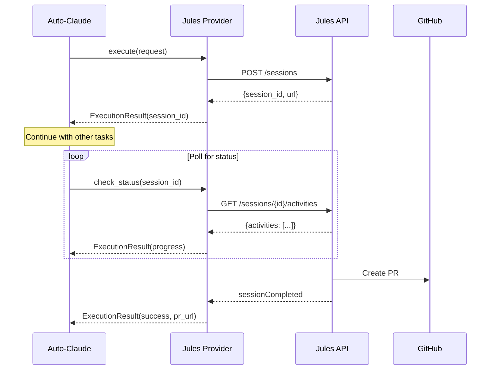
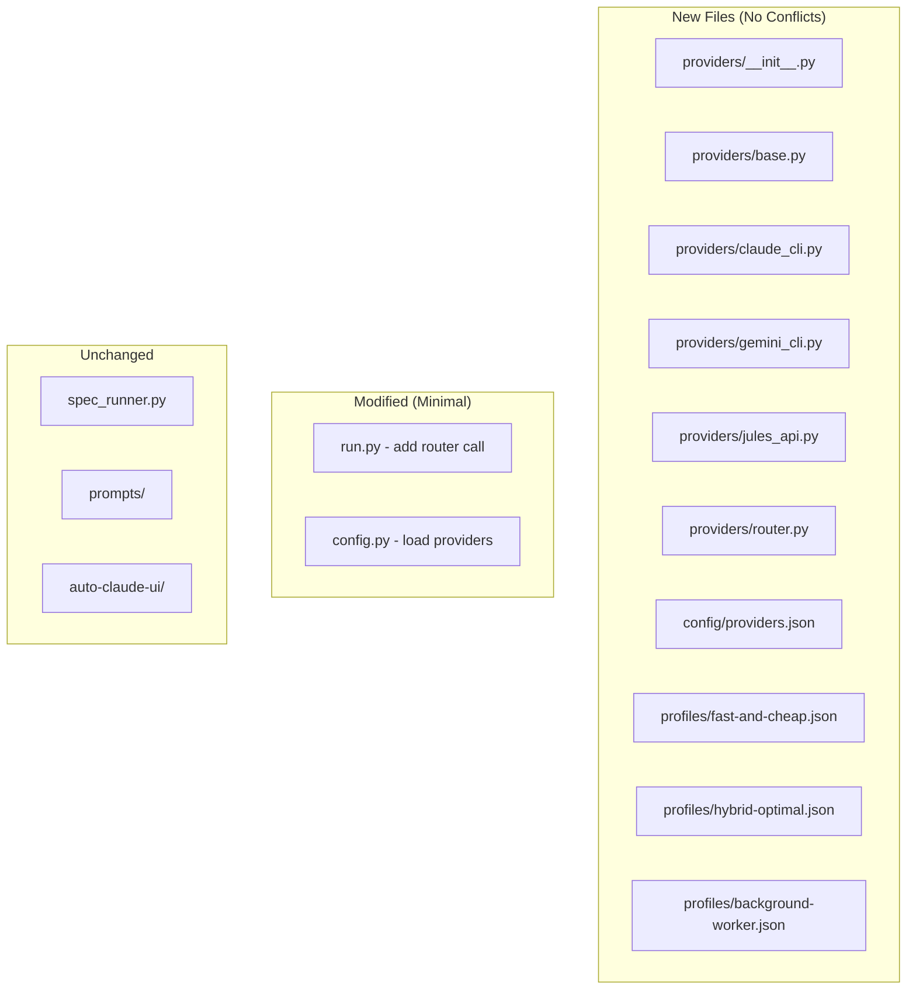
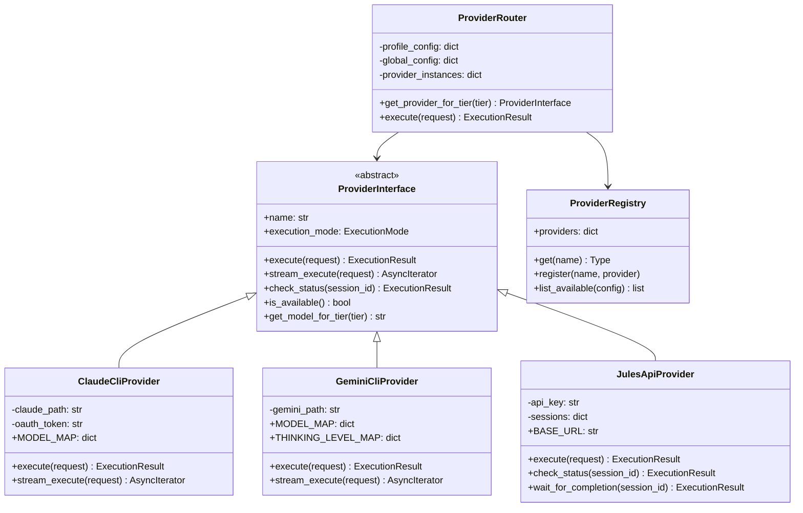
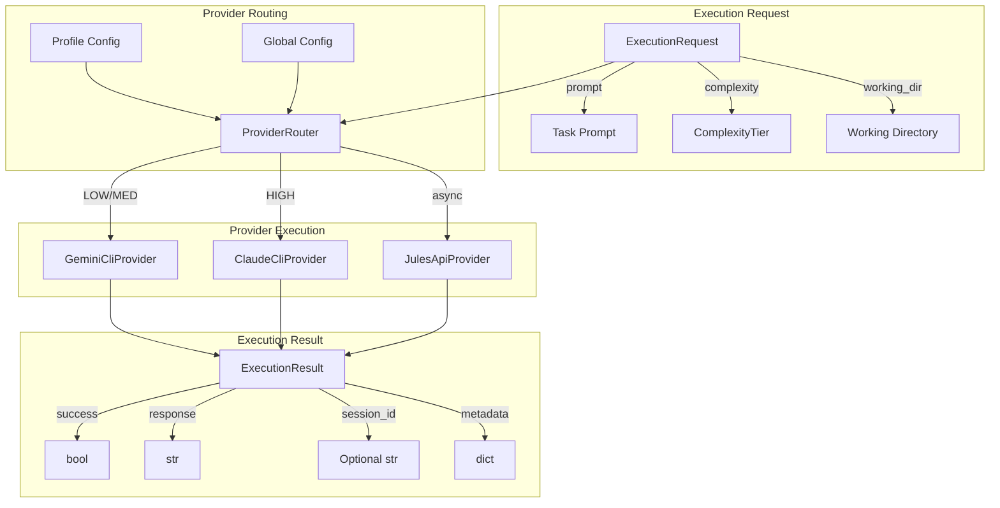
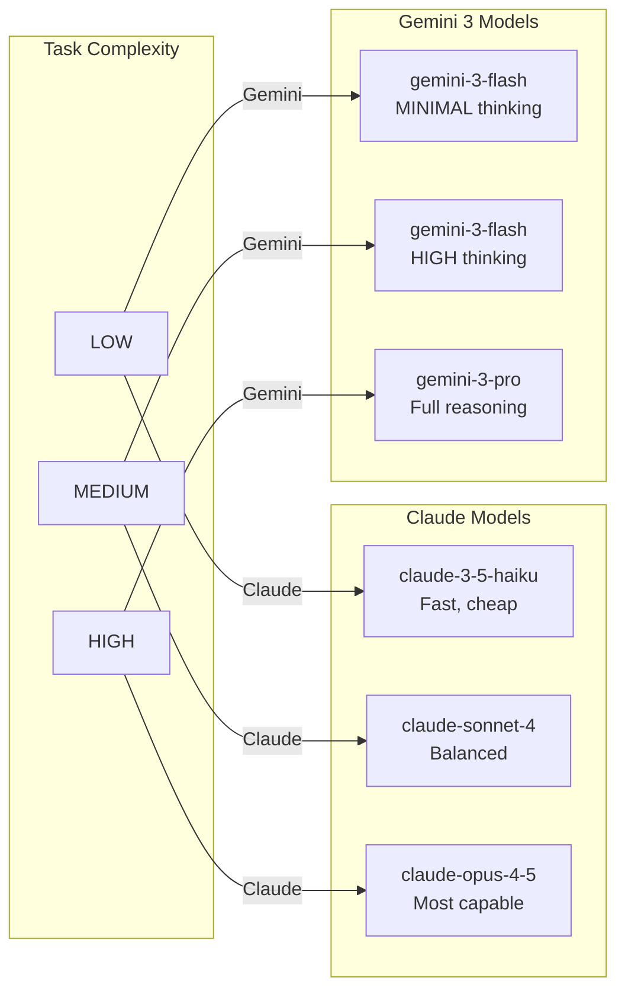
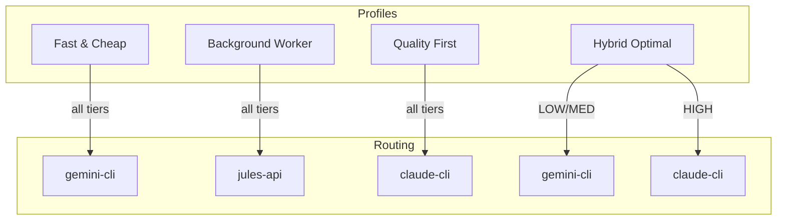

# Architecture Diagrams

This document contains all the visual diagrams for the Auto-Claude-Gemini fork architecture.

---

## System Overview

---

## Profile-Based Routing Flow

---

## Jules API Session Lifecycle

---

## File Structure

---

## Provider Class Hierarchy

---

## Data Flow

---

## Model Selection Matrix

---

## Profile Examples

